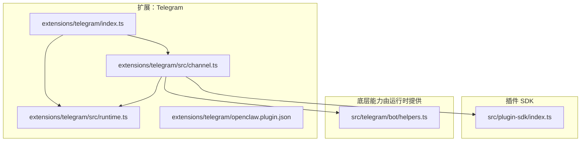
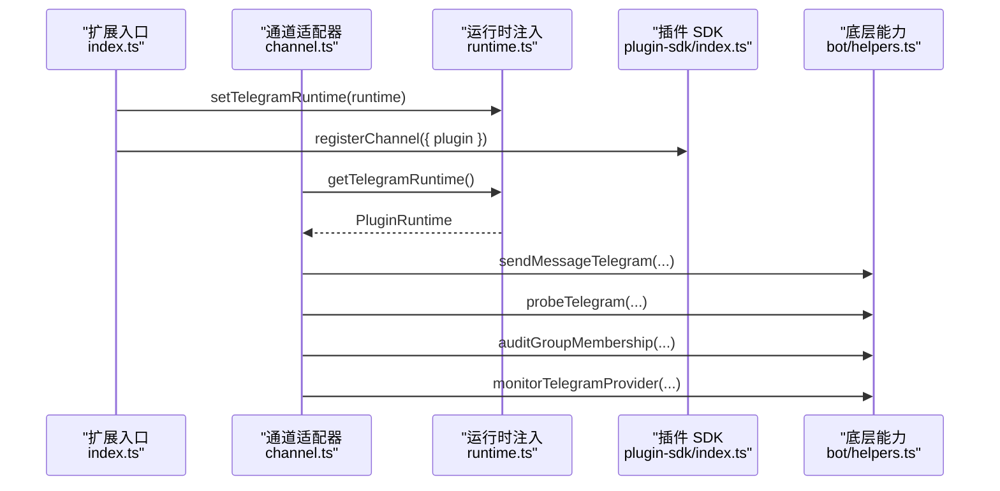
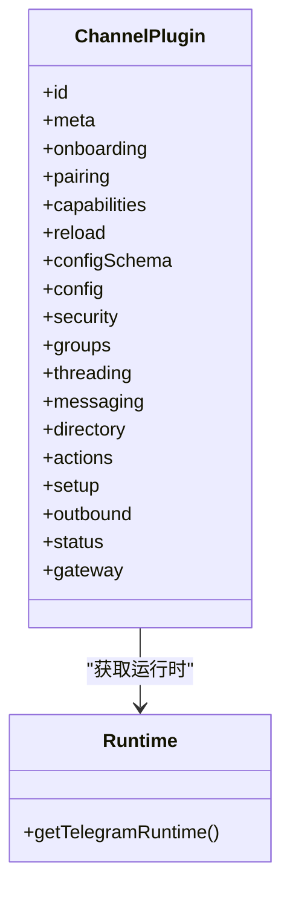
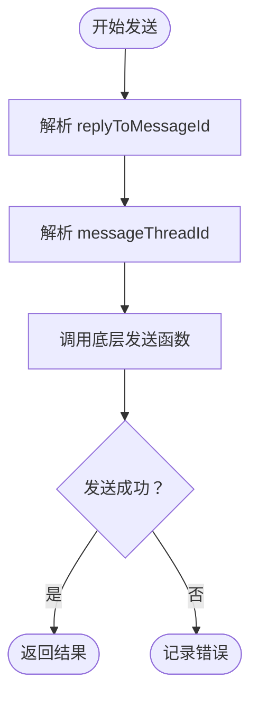
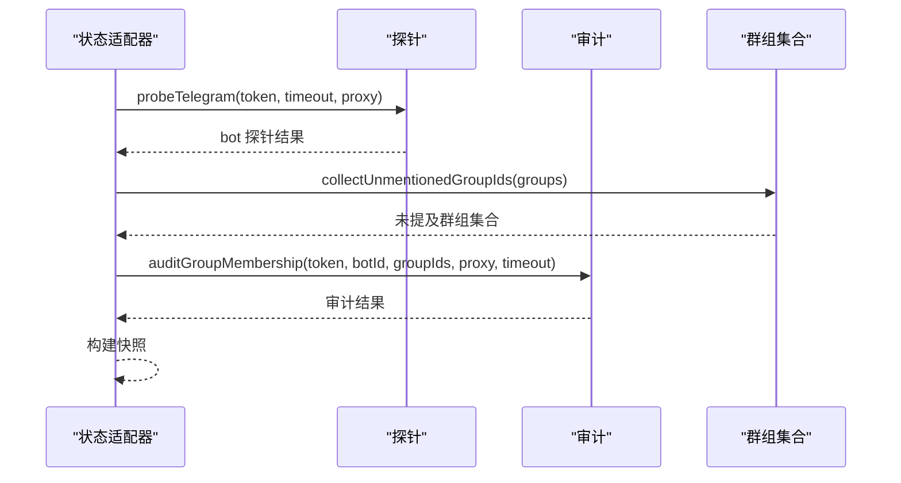
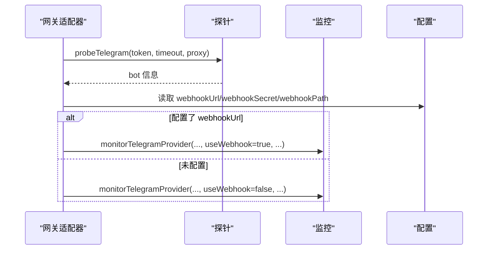
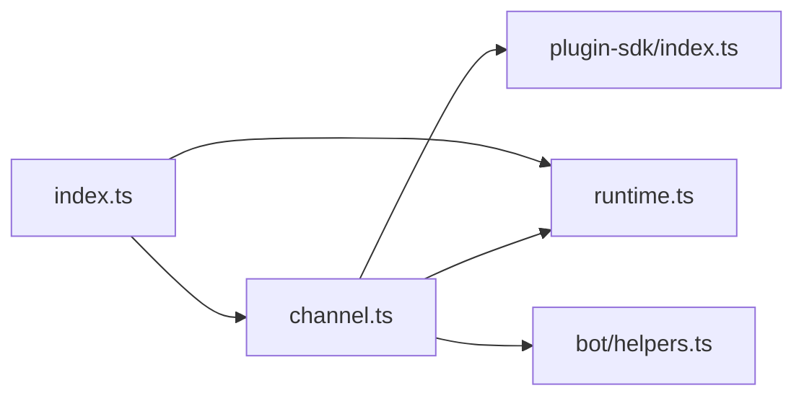

# Telegram 渠道

## 目录
1. [简介](#简介)
2. [项目结构](#项目结构)
3. [核心组件](#核心组件)
4. [架构总览](#架构总览)
5. [详细组件分析](#详细组件分析)
6. [依赖关系分析](#依赖关系分析)
7. [性能考虑](#性能考虑)
8. [故障排除指南](#故障排除指南)
9. [结论](#结论)
10. [附录](#附录)

## 简介
本文件面向使用 OpenClaw 的开发者与运维人员，系统性介绍 Telegram 渠道插件的技术实现与使用方法。内容涵盖：
- 基于 Grammy 框架的集成方式（机器人创建、Webhook 配置、消息路由）
- Telegram Bot API 使用要点（令牌管理、权限配置、速率限制处理）
- 消息格式转换、Inline Keyboard 与富文本支持
- 配置示例（群组管理、管理员权限、消息转发）
- Telegram 特有功能（频道订阅、游戏集成、支付处理）
- 故障排除与性能优化建议

## 项目结构
Telegram 渠道插件位于扩展目录中，采用“插件入口 + 运行时注入 + 通道适配器”的分层设计：
- 扩展入口负责注册插件并注入运行时
- 通道适配器定义 Telegram 的能力、配置、安全策略、消息发送等行为
- 运行时通过 SDK 注入底层能力（如发送、探测、审计、Webhook/Polling）

## 核心组件
- 插件元数据：声明插件 ID、渠道类型与空配置模式
- 插件入口：注册通道、注入运行时
- 通道适配器：定义 Telegram 的能力、配置、安全策略、消息发送、状态检查、网关启动等
- 运行时注入：在插件加载时注入底层能力（如发送、探测、审计、Webhook/Polling）

关键职责映射：
- 能力与目标解析：支持直接对话、群组、频道、线程；支持媒体、反应、原生命令
- 配置与账户管理：支持默认账户与多账户、环境变量令牌、令牌文件、账户启用/删除
- 安全策略：DM 策略、允许来源、群组策略警告
- 发送与路由：文本/媒体发送、线程与回复参数保留、Markdown 分块
- 状态与审计：探针、群组未提及检查、成员审计
- 网关启动：根据配置选择 Webhook 或 Polling 模式

## 架构总览
下图展示从插件入口到底层能力的调用链路，以及通道适配器如何与运行时协作完成消息发送、状态检查与网关启动。

## 详细组件分析

### 插件入口与注册
- 插件 ID 与名称：用于在系统中识别与加载
- 注册流程：注入运行时后，将通道适配器注册到系统
- 配置模式：使用空配置模式，表示 Telegram 渠道的配置由通道适配器自行构建

### 通道适配器（ChannelPlugin）
通道适配器集中定义了 Telegram 的所有行为，包括：
- 元信息与快速开始：继承聊天类渠道元信息，并允许从外部来源快速开始
- 配对流程：支持用户 ID 归一化、批准通知（向用户发送批准提示）
- 能力声明：支持聊天类型、反应、线程、媒体、原生命令、阻断流式输出
- 配置与账户：列出账户、解析账户、默认账户、启用/删除账户、描述账户、允许来源归一化
- 安全策略：DM 策略、群组策略警告、允许来源校验
- 群组策略：是否要求提及、工具策略
- 线程：回复模式解析
- 消息目标：目标归一化、目标解析器
- 目录：列出群组与联系人
- 动作：消息动作列表、提取工具发送、处理动作
- 设置：账户名应用、输入校验、应用配置（支持环境变量令牌）
- 出站：直连投递、Markdown 文本分块、文本/媒体发送（保留线程与回复参数）
- 状态：默认快照、问题收集、探针、审计、快照构建
- 网关：启动账户（探测、选择 Webhook/Polling）、登出账户（清理令牌）

### 运行时注入
- 单例存储：在插件加载时设置运行时，在后续调用中获取
- 初始化校验：若未初始化则抛出错误，避免空运行时导致的异常

### 消息发送与线程/回复参数
- 文本/媒体发送：统一通过底层发送函数执行
- 参数保留：线程 ID 与回复消息 ID 在发送前进行解析与校验，确保有效数值或空值
- Markdown 分块：按 4000 字符限制进行分块，保证长文本可靠传输

### 状态检查与审计
- 探针：验证令牌有效性与基础信息
- 审计：收集未提及群组、检查成员身份，支持代理与超时控制
- 快照：汇总配置、运行态、模式、最后事件时间等

### 网关启动与 Webhook/Polling 选择
- 启动前探测：尝试获取机器人用户名以增强日志可读性
- 模式选择：若配置了 `webhookUrl` 则使用 Webhook，否则回退到 Polling
- 监控：启动底层监控函数，传入令牌、账户 ID、配置、运行时与取消信号

### Telegram Bot API 使用要点
- 令牌管理：支持环境变量、令牌文件与直接令牌三种方式；默认账户可使用环境变量
- 权限配置：DM 策略、允许来源、群组策略；当群组策略为开放时会给出安全警告
- 速率限制：通过探针与审计接口控制请求频率与超时；支持代理访问以规避网络限制
- 消息格式：文本按 Markdown 分块发送；媒体发送支持 URL；反应支持移除
- 线程与回复：发送时保留 `messageThreadId` 与 `replyToMessageId`，确保上下文连续

### 消息格式转换、Inline Keyboard 与富文本
- Markdown 分块：文本发送前按 4000 字符限制进行分块，保证长文本可靠传输
- 富文本：通过 Markdown 支持标题、列表、链接、加粗等常见格式
- Inline Keyboard：通道适配器声明支持原生命令，可结合命令处理器实现交互式键盘

### 配置示例与最佳实践
- 多账户与默认账户：默认账户可使用环境变量令牌；命名账户通过令牌文件或令牌字段配置
- 环境变量：仅默认账户支持 `TELEGRAM_BOT_TOKEN`
- Webhook 配置：设置 `webhookUrl`、`webhookSecret`、`webhookPath`；未设置则回退 Polling
- 群组管理：配置 `groupPolicy` 与 `groupAllowFrom`；开放策略需配合 allowlist 降低风险
- DM 策略：默认 pairing，可调整为 allowlist/denylist 并配置 `allowFrom`
- 消息转发：通过目标归一化与线程参数保留，确保转发消息保持上下文

### Telegram 特有功能
- 频道订阅：通过群组策略与允许来源控制订阅范围
- 游戏集成：通道声明支持原生命令，可结合命令处理器实现游戏入口
- 支付处理：通道声明支持原生命令，可结合命令处理器实现支付入口

## 依赖关系分析
- 插件入口依赖运行时注入与通道适配器
- 通道适配器依赖插件 SDK 提供的能力与类型定义
- 底层能力由运行时提供，通道适配器通过运行时获取

## 性能考虑
- 文本分块：按 4000 字符限制分块，减少单次发送失败概率
- 线程与回复：保留线程 ID 与回复消息 ID，避免额外查询
- 探针与审计：合理设置超时与代理，避免阻塞启动流程
- 模式选择：优先使用 Webhook 以降低轮询开销；无公网地址时回退 Polling

## 故障排除指南
- 运行时未初始化：检查插件入口是否正确注入运行时
- 令牌未配置：确认默认账户使用环境变量或命名账户使用令牌文件/令牌字段
- Webhook 无法访问：检查 `webhookUrl`、`webhookSecret`、`webhookPath` 是否正确；必要时回退 Polling
- 群组策略警告：当 `groupPolicy` 为开放且未配置 allowlist 时会提示风险
- 反应发送：空表情或移除标志会清空反应；确认参数传递

## 结论
Telegram 渠道插件通过清晰的分层设计与丰富的通道适配器能力，实现了对 Grammy 框架的无缝集成。其特性覆盖了令牌管理、权限控制、消息路由、状态审计与网关启动等关键环节，既满足日常消息收发需求，也为高级功能（如 Webhook、线程、反应、原生命令）提供了稳定支撑。

## 附录

### 配置项速查
- 默认账户令牌来源：环境变量（仅默认账户）
- 命名账户令牌来源：令牌文件或令牌字段
- Webhook 配置：`webhookUrl`、`webhookSecret`、`webhookPath`
- 群组策略：`groupPolicy`、`groupAllowFrom`、`groups`
- DM 策略：`dmPolicy`、`allowFrom`
- 线程与回复：`messageThreadId`、`replyToMessageId`