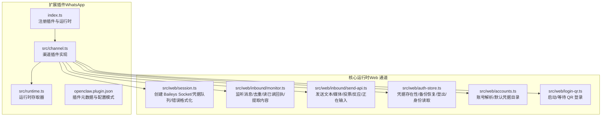
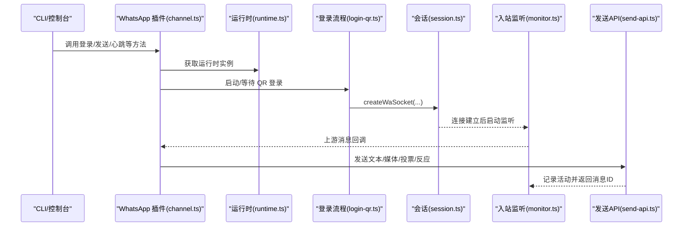
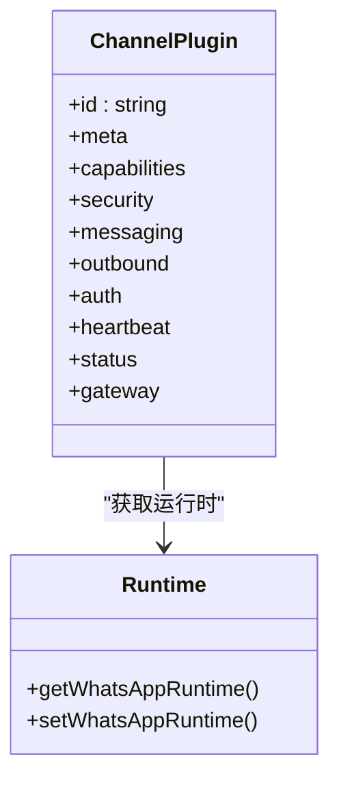
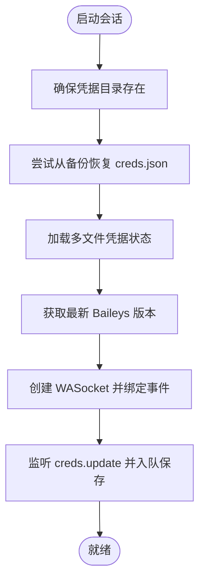
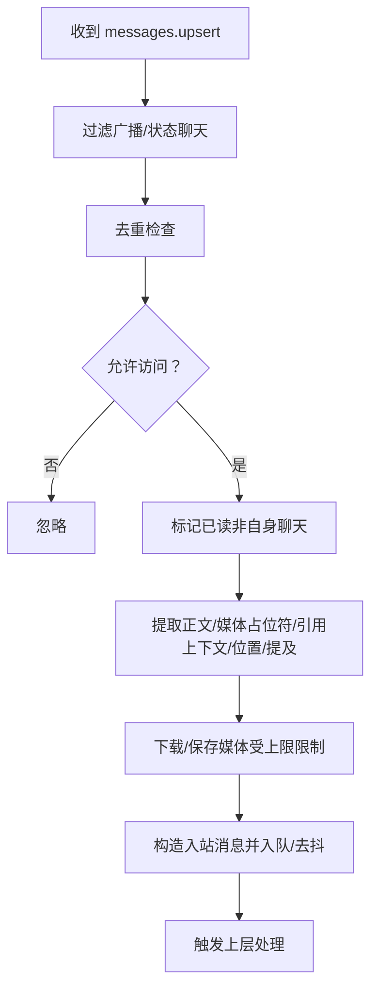
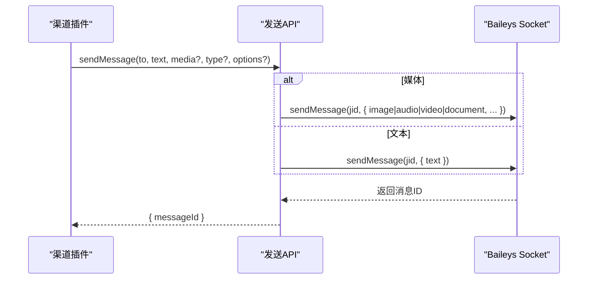
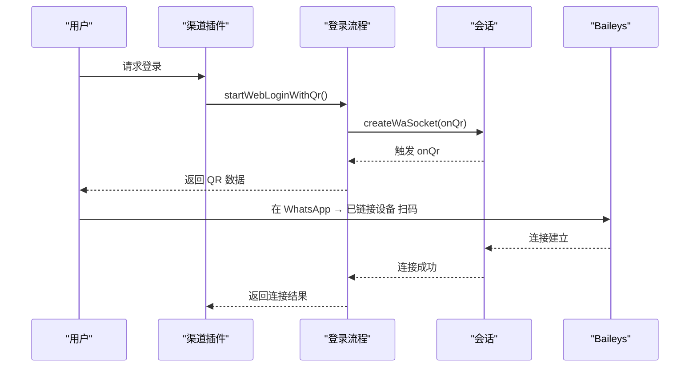
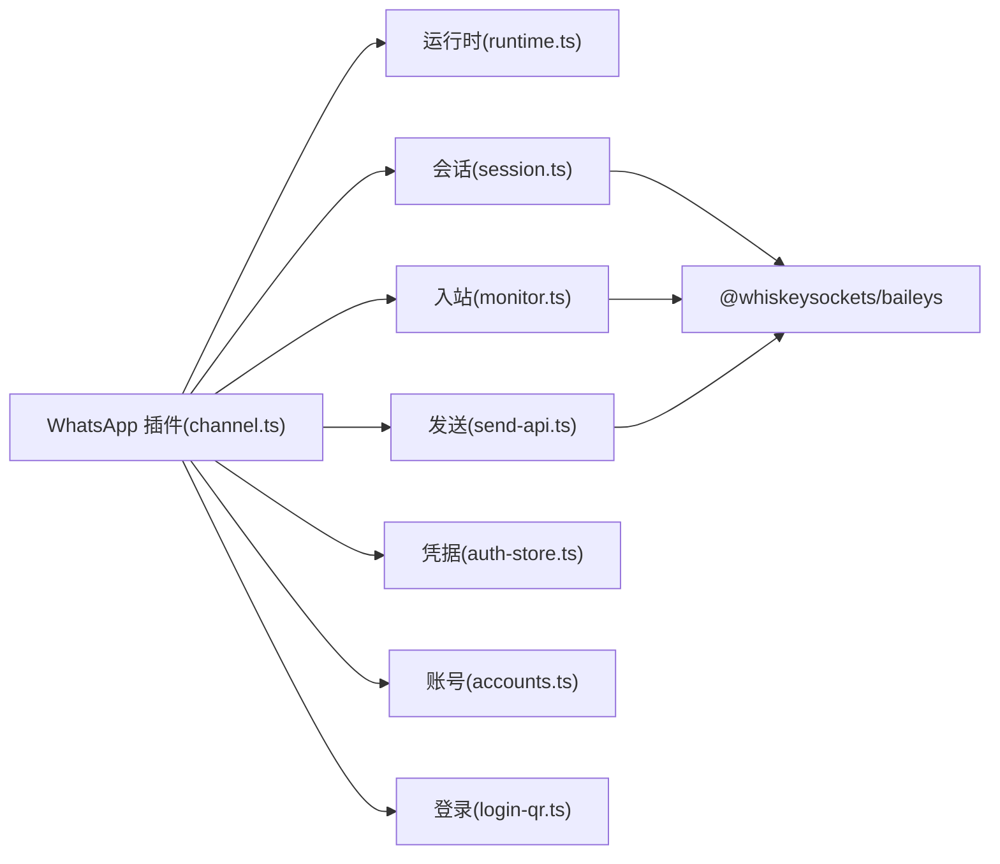

# WhatsApp 渠道

## 目录
1. [简介](#简介)
2. [项目结构](#项目结构)
3. [核心组件](#核心组件)
4. [架构总览](#架构总览)
5. [详细组件分析](#详细组件分析)
6. [依赖关系分析](#依赖关系分析)
7. [性能考量](#性能考量)
8. [故障排查指南](#故障排查指南)
9. [结论](#结论)
10. [附录：配置参数速查](#附录配置参数速查)

## 简介
本文件面向 WhatsApp 渠道插件的技术文档，聚焦于 Baileys 集成与运行时实现，涵盖客户端初始化、会话管理、消息处理、登录流程（QR 认证）、会话持久化、消息格式转换、媒体文件处理与富文本支持、配置参数与常见问题排查。文档以仓库现有实现为依据，结合扩展插件与核心运行时模块，给出可操作的架构图与流程图。

## 项目结构
WhatsApp 渠道由“扩展插件层 + 核心运行时层”构成：
- 扩展插件层：定义渠道能力、安全策略、消息发送/接收、登录工具等
- 运行时层：基于 Baileys 的会话创建、事件监听、媒体下载、发送 API 封装、凭据存储与恢复

## 核心组件
- 插件注册与运行时注入：通过扩展入口将运行时注入插件，注册渠道并暴露登录工具
- 渠道插件实现：定义能力、安全策略、消息目标解析、账户配置、心跳检查、状态汇总、网关方法（QR 登录）
- 会话与登录：使用 Baileys 创建 Socket，多文件凭据存储，备份恢复，QR 登录与等待
- 入站消息处理：监听 messages.upsert，去重、读已读回执、位置/媒体/引用上下文提取、分组元数据缓存
- 出站发送：封装文本/媒体/投票/反应/正在输入，记录通道活动
- 凭据与账号：凭据存在性检测、备份恢复、登出清理、账号解析与默认凭据目录

## 架构总览
下图展示从插件到 Baileys 的端到端调用链路，以及登录、入站、出站的关键节点。

## 详细组件分析

### 组件一：渠道插件（ChannelPlugin）
- 能力与策略
  - 支持直聊/群聊、投票、反应、媒体
  - 安全策略：直聊策略（允许名单/开放/配对/禁用），群组策略（开放/禁用/允许名单）
  - 允许列表条目标准化为 E.164 或群 JID
- 消息目标解析
  - 支持隐式/显式目标解析，允许从 allowFrom 中选择首个目标
  - 群 JID 识别与校验
- 出站发送
  - 文本分块（默认 4000 字符），媒体类型映射（图片/音频/视频/文档），PTT 音频自动修正 MIME
  - 投票发送、反应发送、正在输入
- 登录与心跳
  - 提供 `web.login.start`/`wait` 网关方法
  - 心跳检查：是否启用、是否已链接、是否有活跃监听
- 状态与汇总
  - 链接状态、自 ID、连接时间、断开次数、最后事件/消息时间、错误信息
  - 收集状态问题（未链接、已链接但断开）

### 组件二：会话与凭据管理（Baileys 集成）
- 会话创建
  - 多文件凭据状态（`useMultiFileAuthState`），缓存信号密钥（`makeCacheableSignalKeyStore`）
  - 版本协商（`fetchLatestBaileysVersion`），浏览器标识设置，关闭历史同步
  - 监听 `creds.update`，入队保存凭据，避免并发写入导致损坏
- 凭据备份与恢复
  - 启动前尝试从 `creds.json.bak` 恢复 `creds.json`，确保可解析再覆盖
  - 凭据存在性检测（文件存在且非空、JSON 可解析）
- 错误格式化与连接状态码
  - 统一提取状态码与错误信息，兼容 Baileys 包裹的 Boom 形态
- 登出清理
  - 旧版凭据目录仅删除相关 JSON 文件；新版凭据目录整体删除

### 组件三：入站消息处理（监听与提取）
- 事件监听
  - 监听 `messages.upsert`，忽略广播/状态聊天
  - 去重：按账号、聊天与消息 ID 缓存近期入站消息
  - 自身聊天模式：不自动发送已读回执
- 访问控制
  - 基于直聊策略与允许列表判断是否放行
- 内容提取
  - 文本正文、媒体占位符、引用上下文描述、提及 JID、位置信息
- 分组元数据
  - 缓存群主题与参与者（5 分钟 TTL），参与方 JID 解析为 E.164
- 历史补注
  - 离线追加消息（append）阶段跳过自动回复

### 组件四：出站发送与富文本支持
- 发送 API
  - 文本：直接发送
  - 图片：带标题（caption）
  - 音频：PTT（ptt=true），自动修正 MIME
  - 视频：可选 gif 回放（gifPlayback）
  - 文档：带文件名与标题
  - 投票：question/options/maxSelections
  - 反应：react 表情，支持指定 fromMe/participant
  - 正在输入：sendPresenceUpdate("composing")
- 活动记录
  - 每次发送记录通道活动，便于统计与审计

### 组件五：登录流程（QR 认证与会话持久化）
- 登录启动
  - 若已链接且非强制，则提示已链接或要求重新链接
  - 复用活跃登录（若未过期），否则创建新登录并等待 QR
  - 监听 onQr 回调，生成 base64 PNG 数据用于前端显示
- 登录等待
  - 设置超时计时器，轮询等待连接完成
  - 支持状态码 515 的一次性重启
- 会话持久化
  - 凭据保存入队，崩溃后从备份恢复
  - 登出时清理凭据目录或旧版凭据文件

### 组件六：消息格式转换与富文本
- 引用回复上下文
  - 总是附加“回复 + 引用正文或媒体占位符”的上下文块
  - 设置 ReplyToId/Body/Sender 等元数据
- 媒体占位符
  - 图像/音频/视频/文档/贴纸等媒体消息使用统一占位符
- 位置消息
  - 提取经纬度、精度、名称、地址、说明、是否实时等字段，并格式化为文本
- 文本分块
  - 默认 4000 字符，支持按换行分段后再长度切分

## 依赖关系分析
- 插件层依赖运行时层提供的会话、发送、登录、状态等能力
- 运行时层依赖 Baileys（@whiskeysockets/baileys）创建 Socket、事件与媒体下载
- 凭据存储采用多文件目录结构，具备备份恢复与登出清理逻辑
- 登录流程与会话创建解耦，便于在网关/CLI/桌面应用中复用

## 性能考量
- 去抖与批处理：对同一发送者快速连续消息进行去抖合并，降低上游处理压力
- 分组元数据缓存：群主题与参与者缓存 5 分钟，减少频繁查询
- 媒体保存上限：入站媒体最大 50MB，出站媒体默认 5MB，超限报错并回退为文本提示
- 文本分块：默认 4000 字符，支持换行优先切分，避免截断语义
- 连接稳定性：WebSocket 错误捕获与日志记录，防止进程异常退出

## 故障排查指南
- 未链接/需扫码
  - 症状：状态显示未链接
  - 处理：在网关主机执行登录命令，扫描“已链接设备”中的二维码
- 已链接但断开/重连循环
  - 症状：状态显示已运行但断开
  - 处理：执行诊断命令或重启网关；若持续，重新登录并查看日志
- Bun 运行时不推荐
  - WhatsApp（Baileys）与 Telegram 在 Bun 下不稳定，建议使用 Node
- 登录失败/超时
  - 检查 QR 是否过期，必要时重新启动登录流程；关注状态码 515 的一次性重启
- 媒体传输问题
  - 检查媒体大小是否超过限额；音频自动修正 MIME；视频可开启 gif 回放
- 会话凭据损坏
  - 启动时自动从备份恢复 `creds.json`；如仍失败，执行登出清理后重新登录

## 结论
WhatsApp 渠道插件通过扩展插件层与核心运行时层的清晰分工，实现了稳定可靠的 Baileys 集成：从 QR 登录、会话持久化、入站消息提取与富文本增强，到出站发送与媒体优化，形成完整闭环。配合完善的配置项与状态监控，能够满足多账号、群组与直聊场景下的消息路由与交互需求。

## 附录：配置参数速查
- 渠道级
  - `channels.whatsapp.dmPolicy`：直聊策略（pairing/allowlist/open/disabled）
  - `channels.whatsapp.selfChatMode`：自身聊天模式（启用时跳过读回执）
  - `channels.whatsapp.allowFrom`：直聊允许列表（E.164 或通配符）
  - `channels.whatsapp.groupPolicy`：群组策略（open/disabled/allowlist）
  - `channels.whatsapp.groupAllowFrom`：群组发送者允许列表
  - `channels.whatsapp.groups`：群组允许列表与默认提及开关
  - `channels.whatsapp.mediaMaxMb`：入站媒体最大尺寸（MB）
  - `channels.whatsapp.ackReaction`：自动反应（emoji/direct/group）
  - `channels.whatsapp.messagePrefix`：入站前缀（可按账号覆盖）
  - `channels.whatsapp.historyLimit` / `accounts..historyLimit`：群组/直聊历史上下文条数
  - `channels.whatsapp.dmHistoryLimit`：直聊用户回合历史限制
  - `channels.whatsapp.actions.reactions`：是否允许反应工具
  - `channels.whatsapp.textChunkLimit` / `chunkMode`：文本分块限制与模式
- 代理/全局
  - `agents.defaults.mediaMaxMb`：出站媒体最大尺寸（MB）
  - `agents.defaults.heartbeat.*`：心跳配置（间隔/模型/目标/会话）
  - `web.enabled`：禁用渠道启动
  - `web.heartbeatSeconds`：心跳周期
  - `web.reconnect.*`：重连策略（初始/最大/倍率/抖动/最大尝试）
- 日志与可观测性
  - 子系统：whatsapp/inbound、whatsapp/outbound、web-heartbeat、web-reconnect
  - 日志路径：`/tmp/openclaw/openclaw-YYYY-MM-DD.log`