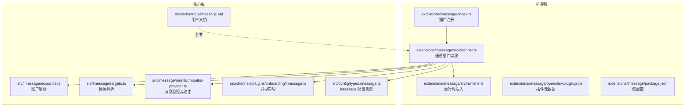
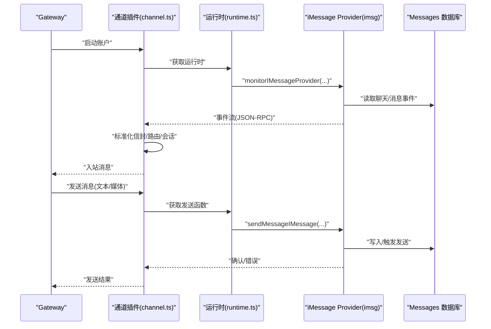
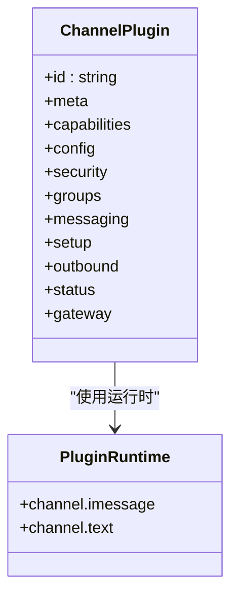
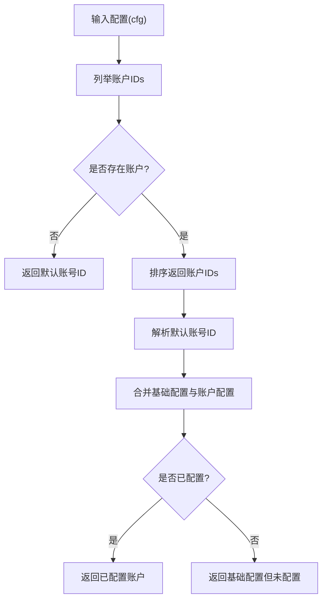
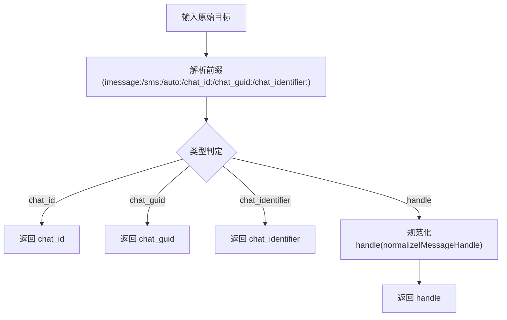
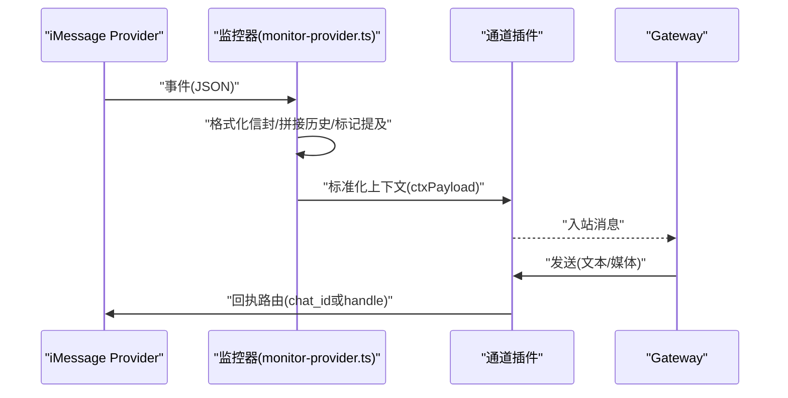
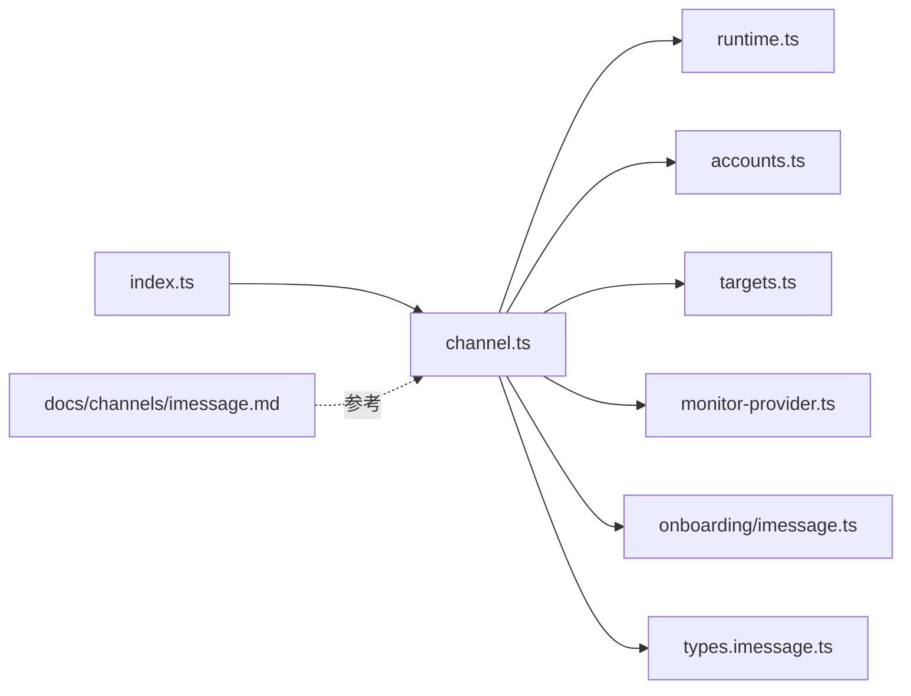

# iMessage 渠道

## 目录
1. [简介](#简介)
2. [项目结构](#项目结构)
3. [核心组件](#核心组件)
4. [架构总览](#架构总览)
5. [详细组件分析](#详细组件分析)
6. [依赖关系分析](#依赖关系分析)
7. [性能考量](#性能考量)
8. [故障排查指南](#故障排查指南)
9. [结论](#结论)
10. [附录](#附录)

## 简介
本文件为 iMessage 渠道插件的技术文档，面向 macOS 平台，围绕 OpenClaw 的 iMessage 集成进行系统化说明。内容涵盖：
- 基于外部 CLI 的集成方式（imsg JSON-RPC over stdio）与消息路由机制
- 联系人/目标地址解析与消息格式处理
- 附件传输与媒体上限控制
- 访问控制（DM 与群组）、提及策略与多账号支持
- macOS 权限配置、沙盒与后台运行的挑战
- 配置示例与开发调试建议
- 常见问题排查（权限不足、发送失败、系统兼容）

## 项目结构
iMessage 渠道由“扩展层”和“核心库”两部分组成：
- 扩展层（extensions/imessage）：定义插件入口、通道能力、配置模式、运行时注入与状态采集
- 核心库（src/imessage、src/config、docs）：提供账户解析、目标解析、监控器、配置类型与用户指南

## 核心组件
- 插件注册与运行时注入
  - 插件通过入口文件注册到 OpenClaw，并注入运行时以调用底层 iMessage 能力
  - 运行时通过单例持有，避免重复初始化
- 通道插件实现
  - 定义通道元信息、配对流程、能力声明（直聊/群聊、媒体）、配置模式与安全策略
  - 提供账户管理、消息发送（文本/媒体）、状态采集与探针
- 账户与目标解析
  - 解析多账号配置、默认账号、允许来源与群组策略
  - 规范化 iMessage 目标（`chat_id`/`chat_guid`/`chat_identifier`/`handle`），支持多种前缀
- 监控与路由
  - 通过 imsg 流式事件，标准化为统一信封，按 `chat_id` 或 `handle` 路由回执
  - 支持群组隔离会话、历史上下文拼接与提及检测

## 架构总览
下图展示 iMessage 渠道在 OpenClaw 中的端到端交互：Gateway 通过通道插件启动 iMessage Provider（imsg），监听事件并转换为统一消息；发送时按配置进行分片与媒体上限控制。

## 详细组件分析

### 通道插件与运行时
- 插件注册
  - 入口文件负责设置运行时并注册通道插件
- 运行时注入
  - 单例保存运行时，未初始化时报错，保证调用安全
- 通道能力与配置
  - 支持直聊/群聊、媒体；配置模式基于共享 Schema
  - 提供账户列表、默认账号、启用/删除账户、描述账户等操作
- 安全与访问控制
  - DM 策略（配对/白名单/开放/禁用）与群组策略（开放/禁用/白名单）
  - 收集警告：当群组策略为开放时提示风险
- 消息发送
  - 文本分片（默认 4000 字符）与媒体上限（默认 16MB）
  - 支持按账号选择 CLI 路径与数据库路径
- 状态与探针
  - 默认运行态快照、错误收集、探针执行与账户快照构建

### 账户解析与多账号
- 列举已配置账号、默认账号解析
- 合并基础配置与账户级配置，判断是否已配置
- 支持多账号启用/禁用、删除账户与名称应用

### 目标解析与消息路由
- 目标解析
  - 支持 `chat_id`/`chat_guid`/`chat_identifier`/`handle` 多种形式
  - 自动规范化 `handle`（邮箱、E.164、去空白）
- 允许来源校验
  - 支持通配符、`chat_id`/`chat_guid`/`chat_identifier`/`handle` 组合
- 路由回执
  - 群聊使用 `chat_id`；直聊使用 `handle`
  - 通过统一信封携带会话键、来源渠道与回复上下文

### 消息监控与路由机制
- 事件标准化
  - 从 imsg 事件构建统一信封，包含发送者、时间戳、正文、媒体、提及标记等
- 历史上下文拼接
  - 群组可配置历史窗口，按顺序拼接上下文
- 回复上下文
  - 自动附加“回复”前缀与被回复内容，便于上下文连贯
- 路由回执
  - 根据 `chat_id` 或 sender 决定回执目标

### 引导与配置
- 引导向导
  - 检测 imsg 可执行文件、提示 DM 策略与允许来源
  - 支持多账号选择与覆盖
- 配置项
  - 基础：启用、CLI 路径、数据库路径、远程主机、服务/区域
  - 安全：DM 策略、允许来源、群组策略、群组允许来源
  - 上下文：历史窗口、分片模式与大小、媒体上限
  - 工具策略：群组工具策略与按发送者策略

## 依赖关系分析
- 插件与运行时
  - 通道插件依赖运行时提供的 iMessage 能力与文本分片能力
- 核心库依赖
  - 通道插件依赖账户解析、目标解析、监控器与配置类型
- 用户文档
  - 用户文档提供最小配置、权限要求、远程/SSH 场景与多账号示例

## 性能考量
- 文本分片
  - 默认 4000 字符，支持按换行分段后再长度分片，提升可读性
- 媒体上限
  - 默认 16MB，可通过配置调整
- 历史上下文
  - 群组历史窗口可配置，过大将增加上下文体积与处理开销
- 远程附件
  - SSH 远端场景需考虑网络延迟与 SCP 拉取成本

## 故障排查指南
- 权限不足
  - 需要 Full Disk Access 与 Automation 权限；若提示消失，按文档重置 TCC 并在同一路径重新授权
- 消息发送失败
  - 检查 imsg CLI 是否存在、Messages 是否登录、数据库路径是否正确
  - 若为远程场景，确认 SSH 可达与 `remoteHost` 配置
- 系统兼容性
  - 不同 macOS 版本的权限行为可能差异，建议在目标版本上进行验证
- 状态与诊断
  - 通过通道状态快照查看 CLI/DB 路径、探针结果与最后错误信息

## 结论
iMessage 渠道通过外部 CLI 与统一通道插件实现，具备完善的账户/目标解析、安全策略、消息路由与状态监控能力。结合用户文档与 macOS 权限指南，可在 macOS 上稳定地完成 iMessage 的收发与管理。建议优先配置本地或受控的远程环境，明确权限与网络路径，并按需调整分片与媒体上限。

## 附录

### 配置示例与最佳实践
- 最小配置
  - 启用通道、指定 imsg CLI 路径与 Messages 数据库路径
- 多账号
  - 使用 accounts 区块为不同身份或远端 Mac 配置独立 CLI/DB 路径
- 远程/SSH
  - 通过 wrapper 脚本 SSH 到远端执行 imsg，并设置 `remoteHost` 以便拉取附件
- 访问控制
  - DM 默认配对策略，群组默认白名单；必要时开启提及检测或按 `chat_id` 归属隔离

### macOS 开发与调试要点
- 权限稳定性
  - 固定路径、一致 Bundle ID 与签名，避免权限丢失
- 授权弹窗
  - 若弹窗消失，按文档重置并重新授权
- UI 辅助
  - macOS 端提供权限监控与弹窗引导，便于快速修复