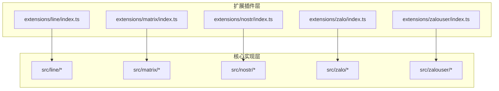
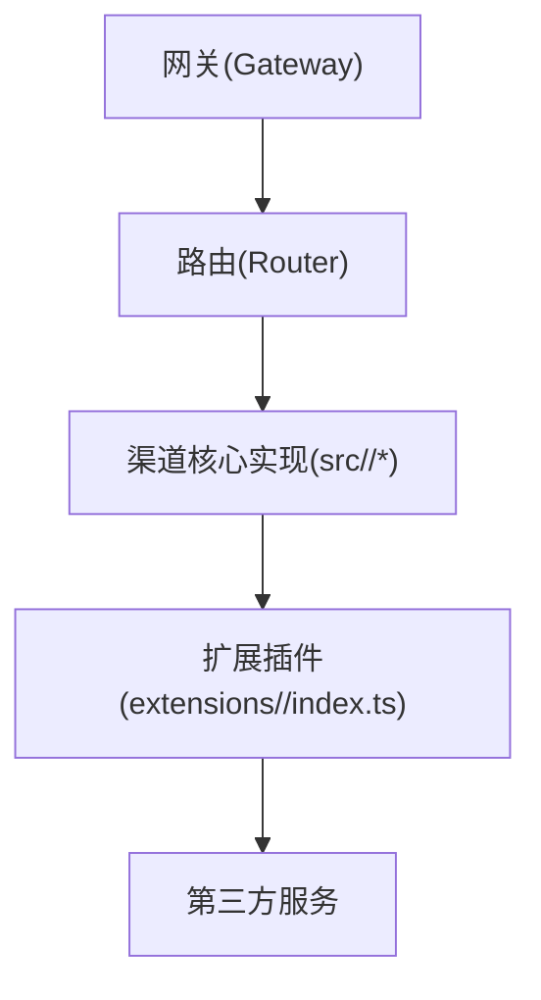
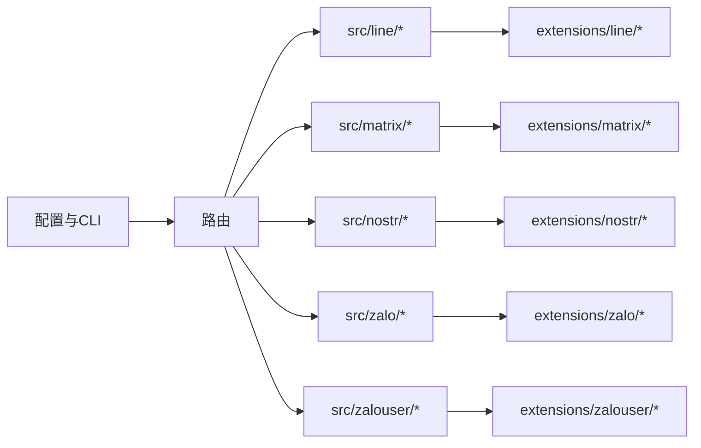

# 其他消息渠道

## 目录
1. [简介](#简介)
2. [项目结构](#项目结构)
3. [核心组件](#核心组件)
4. [架构总览](#架构总览)
5. [详细组件分析](#详细组件分析)
6. [依赖关系分析](#依赖关系分析)
7. [性能考量](#性能考量)
8. [故障排除指南](#故障排除指南)
9. [结论](#结论)
10. [附录](#附录)

## 简介
本文件面向需要在 OpenClaw 中集成或迁移至其他消息渠道（LINE、Matrix、Nostr、Zalo、ZaloUser）的工程师与运维人员，系统性梳理各渠道的技术实现、认证机制、消息格式与功能限制，并提供配置示例、最佳实践、跨平台共性与差异、渠道选择与迁移建议，以及故障排除与性能优化策略。内容基于仓库中的扩展插件与核心实现源码进行归纳总结。

## 项目结构
OpenClaw 将“渠道”抽象为两类实现：
- 扩展插件层：位于 `extensions/<channel>/`，负责与第三方服务对接、事件捕获与消息转发。
- 核心实现层：位于 `src/<channel>/`，提供统一的类型定义、Webhook 处理、消息编解码与认证逻辑，供网关路由与调用。

## 核心组件
- 统一入口与路由
  - 渠道注册与路由：通过核心层的入口模块将各渠道暴露给网关，实现按渠道分发与调用。
- 认证与安全
  - 各渠道均提供认证模块，用于处理令牌、签名、回调校验等安全流程。
- Webhook 与事件处理
  - 提供 Webhook 模块以接收第三方推送事件，解析并转换为内部消息模型。
- 消息编解码与发送
  - 提供消息模块以封装消息格式、媒体附件、富文本等，并执行发送。
- 类型与配置
  - 统一的类型定义与配置接口，确保跨渠道一致性。

## 架构总览
下图展示 OpenClaw 在不同消息渠道上的通用架构：扩展插件负责与第三方服务交互，核心实现层提供统一的认证、Webhook、消息编解码与类型定义，网关通过路由将请求分发到对应渠道。

## 详细组件分析

### LINE 渠道
- 认证机制
  - 基于官方 LINE Messaging API 的认证流程，通常涉及 Access Token 与 Webhook 验证。
- 消息格式与功能
  - 支持文本、图片、视频、音频、位置、模板消息等；具备快速回复、按钮等交互能力。
- Webhook 事件处理
  - 解析来自 LINE 的事件推送，转换为内部消息模型并触发后续处理。
- 扩展插件
  - 插件入口负责初始化与生命周期管理。

### Matrix 渠道
- 认证机制
  - 使用 Matrix Homeserver 的访问令牌与同步 API 进行鉴权。
- 消息格式与功能
  - 支持富文本、HTML、附件、表情包等；可与 Matrix 客户端生态良好兼容。
- Webhook 事件处理
  - 通过同步流或事件订阅接收房间消息并转换为内部模型。
- 扩展插件
  - 插件入口负责与 Matrix homeserver 的连接与事件监听。

### Nostr 渠道
- 认证机制
  - 基于 Nostr 私钥签名与公钥标识，采用事件签名验证。
- 消息格式与功能
  - 以事件形式承载消息，支持标签、内容、引用等；适合去中心化场景。
- Webhook 事件处理
  - 接收并解析来自中继的事件，过滤与转换为内部消息。
- 扩展插件
  - 插件入口负责与中继建立连接、订阅事件与发布消息。

### Zalo 渠道
- 认证机制
  - 使用 Zalo OAuth 与应用密钥进行鉴权，支持回调验证。
- 消息格式与功能
  - 支持文本、图片、视频、语音、文件、地理位置等；具备群组与好友会话能力。
- Webhook 事件处理
  - 接收来自 Zalo 的事件推送，解析并转换为内部模型。
- 扩展插件
  - 插件入口负责初始化与事件监听。

### ZaloUser 渠道
- 认证机制
  - 面向个人用户的认证流程，结合用户授权与令牌管理。
- 消息格式与功能
  - 面向一对一聊天场景，支持文本、多媒体与快捷操作。
- Webhook 事件处理
  - 处理来自 Zalo 的用户级事件并转换为内部消息。
- 扩展插件
  - 插件入口负责用户态事件监听与消息转发。

## 依赖关系分析
- 渠道间耦合度
  - 扩展插件与核心实现通过统一接口耦合，降低对第三方服务的直接依赖，提升可替换性。
- 外部依赖
  - 各渠道依赖其官方 SDK 或 HTTP API；需关注版本兼容与变更风险。
- 路由与配置
  - 通过网关配置与 CLI 工具进行渠道启用、参数注入与运行时切换。

## 性能考量
- 连接池与并发
  - 对长连接渠道（如 Matrix、Nostr）建议使用连接池与背压控制，避免阻塞。
- 缓存与批处理
  - 对频繁事件（如 Zalo）可采用事件合并与批量发送，减少 API 调用次数。
- 超时与重试
  - 为第三方 API 设置合理的超时与指数退避重试，避免雪崩效应。
- 日志与监控
  - 为各渠道接入统一日志与指标采集，便于定位性能瓶颈。

## 故障排除指南
- 常见问题定位
  - 认证失败：检查令牌有效期、签名算法与回调 URL 配置。
  - Webhook 不达：确认第三方回调地址可达、防火墙放行与证书有效性。
  - 消息乱序/丢失：核查事件 ID 去重与持久化队列。
- 诊断工具
  - 使用 CLI 与网关诊断命令检查渠道状态与配置。

## 结论
通过统一的核心实现与插件化扩展，OpenClaw 能够以较低成本适配多种消息渠道。在实际部署中，应优先考虑认证安全性、消息格式一致性与事件处理的可靠性，并结合业务场景选择合适的渠道组合与迁移路径。

## 附录

### 配置示例与最佳实践
- 通用配置要点
  - 明确区分生产与开发环境的回调地址与密钥。
  - 为每个渠道设置独立的配置命名空间，避免冲突。
  - 使用严格配置模式，确保关键字段必填且类型正确。
- 开发与调试
  - 使用开发通道文档进行本地联调与回放测试。

### 跨平台共性与差异
- 共性
  - 统一的认证接口、Webhook 解析与消息编解码框架。
  - 一致的类型定义与错误处理规范。
- 差异
  - 第三方 API 的速率限制、事件模型与消息能力存在显著差异。
  - 认证方式（令牌、签名、OAuth）与回调校验细节不同。

### 渠道选择与迁移建议
- 选择依据
  - 用户覆盖与生态：如 Zalo 在东南亚地区广泛使用。
  - 功能需求：如 LINE 的模板消息、Matrix 的去中心化特性、Nostr 的抗审查属性。
- 迁移步骤
  - 评估现有消息格式与第三方能力映射。
  - 逐步切换路由规则，保留回滚方案。
  - 对比指标（吞吐、延迟、错误率），持续优化。