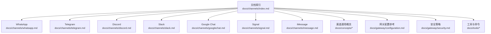
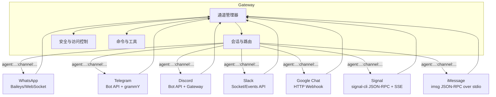
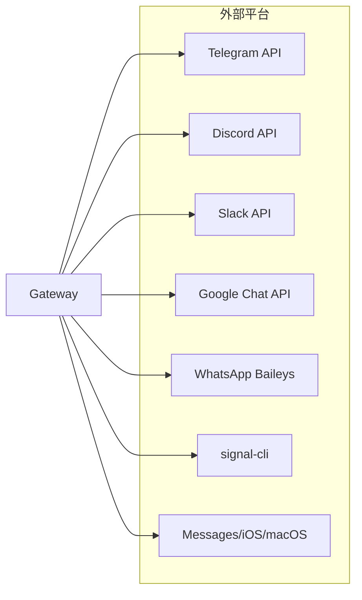
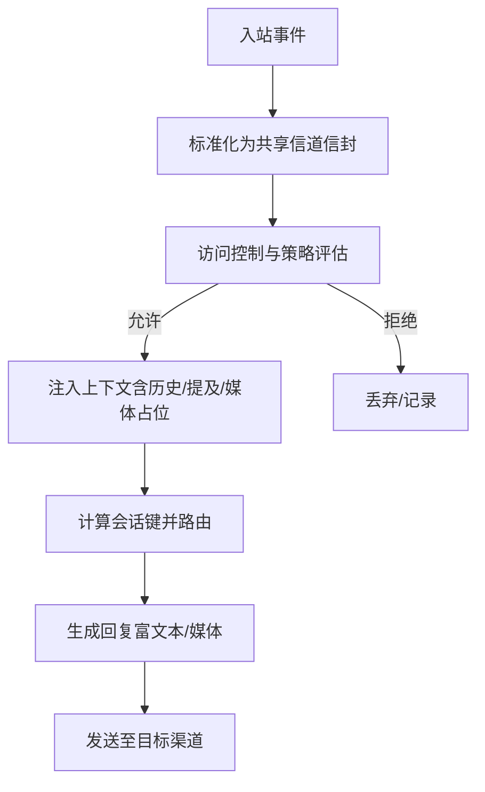
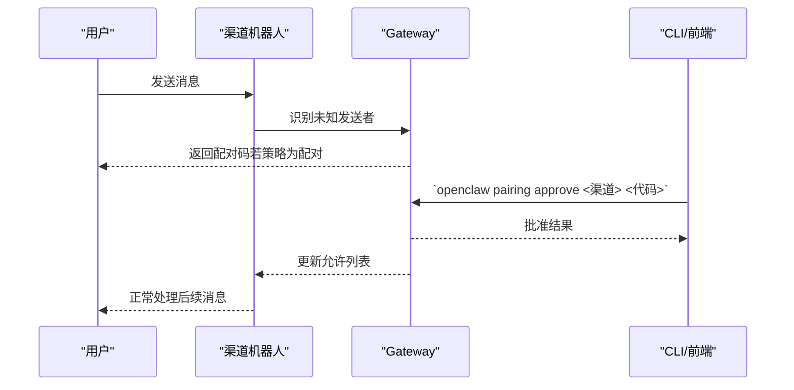

# 支持的消息渠道

## 目录
1. [简介](#简介)
2. [项目结构](#项目结构)
3. [核心组件](#核心组件)
4. [架构总览](#架构总览)
5. [详细组件分析](#详细组件分析)
6. [依赖关系分析](#依赖关系分析)
7. [性能考量](#性能考量)
8. [故障排查指南](#故障排查指南)
9. [结论](#结论)
10. [附录](#附录)

## 简介
本文件系统性梳理 OpenClaw 支持的各类消息渠道，覆盖 WhatsApp、Telegram、Discord、Slack、Google Chat、Signal、iMessage 等主流平台。内容包括：
- 各渠道的接入方式与认证机制（如 OAuth、API 密钥、二维码登录等）
- 消息格式转换、媒体处理与富文本支持
- 配置要点、最佳实践与常见问题
- 渠道能力对比与选型建议

## 项目结构
OpenClaw 的渠道文档集中在 `docs/channels` 目录下，辅以概念、网关配置、安全与工具等子文档，形成“渠道使用 + 架构约束 + 运维保障”的完整知识体系。

## 核心组件
- 渠道插件层：各平台通过独立插件或扩展实现，统一由 Gateway 管理生命周期与会话路由。
- 会话与路由：每条渠道在 Gateway 内部映射到稳定的会话键空间，确保回复定向回源渠道。
- 安全与访问控制：默认采用“配对码/白名单/开放”三类 DM 策略；群组支持允许列表与提及门控。
- 命令与工具：各渠道注册原生命令或交互按钮，同时暴露消息发送、反应、贴纸、线程等工具动作。

## 架构总览
下图展示 Gateway 如何统一接入多渠道，并通过会话键实现确定性路由：

## 详细组件分析

### WhatsApp（网页通道）
- 认证与登录
  - 使用 Baileys 与“链接设备”二维码登录，支持多账号。
  - 凭据存储于用户目录，支持备份恢复。
- 访问控制
  - DM 策略：配对、允许列表、开放、禁用；默认配对。
  - 自聊模式：允许使用个人号，避免自对话题。
- 消息与媒体
  - 文本分片与换行分片；音频按语音消息发送。
  - 媒体保存上限与出站媒体上限可配置。
- 群组与上下文
  - 群组会话隔离；提及门控与历史注入。
- 反应与确认
  - 入站即时反应（ack）可在 DM 与群组中按策略启用。
- 配置要点
  - 渠道级与账户级配置项丰富，涵盖策略、历史、媒体、限流等。
- 最佳实践
  - 推荐专用号码；使用允许列表；合理设置历史注入与分片策略。
- 故障排查
  - 未链接/断连/重连循环；Bun 运行时兼容性提示。

### Telegram（Bot API）
- 认证与部署
  - BotFather 创建机器人令牌；支持长轮询与可选 Webhook。
- 行为与路由
  - DM 共享主会话；群组隔离；默认仅 @ 提及触发。
- 富文本与格式化
  - 出站使用 HTML 解析模式；Markdown 转换为 Telegram 安全 HTML。
- 流式与草稿
  - 私人聊天线程支持草稿气泡流式输出。
- 命令与内联按钮
  - 注册原生命令菜单；内联按钮支持范围控制。
- 贴纸与缓存
  - 静态贴纸处理与缓存；支持搜索与发送。
- 配置要点
  - 令牌、隐私模式、权限、流式、按钮、贴纸、反应通知等。
- 最佳实践
  - 禁用隐私模式以接收全部群消息；为持久行为使用配置而非会话命令。
- 故障排查
  - DNS/IPv6 问题导致连接失败；命令注册失败等。

### Discord（Bot API）
- 认证与权限
  - 机器人令牌；启用“消息内容意图”和“服务器成员意图”。
- 行为与路由
  - DM 共享主会话；公会频道隔离；默认提及门控。
- 工具与动作
  - 反应、贴纸、表情上传、投票、线程、置顶、搜索、成员/角色/频道信息、事件等。
- PluralKit 支持
  - 解析代理消息身份，用于允许列表与标签。
- 配置要点
  - 允许列表、提及门控、历史上下文、分片与行数限制、重试策略、执行审批等。
- 最佳实践
  - 明确最小权限；使用线程保持可见性与隔离平衡。
- 故障排查
  - 未启用意图、权限不足、默认策略与审计差异等。

### Slack（Socket/Events API）
- 认证与模式
  - Socket Mode（推荐）或 HTTP Events API（Webhook）；支持 App Token 与 Bot/User Token。
- 行为与路由
  - DM 共享主会话；频道/群组/私有组隔离；支持 Slash 命令。
- 多账号与令牌策略
  - 用户令牌读优先、写默认走机器人令牌；可放宽为用户令牌写。
- 配置要点
  - 允许列表、提及门控、历史上下文、回复线程策略、动作开关、Slash 命令等。
- 最佳实践
  - 明确读写令牌职责；严格动作与允许列表；必要时启用用户令牌写。
- 故障排查
  - 事件订阅缺失、签名密钥错误、权限不足等。

### Google Chat（Chat API）
- 认证与部署
  - 服务账号 + Webhook；需公网 HTTPS；可结合 Tailscale Funnel 暴露特定路径。
- 行为与路由
  - DM 与空间（群组）隔离；默认 DM 配对；群组 @ 提及门控。
- 配置要点
  - 服务账号文件、受众类型/值、Webhook 路径、DM/群组策略、动作开关、打字指示器、媒体上限等。
- 最佳实践
  - 仅暴露 `/googlechat`；严格受众校验；合理配置提及检测。
- 故障排查
  - 405 方法不允许、插件未启用、网关未重启、日志验证等。

### Signal（signal-cli）
- 认证与模型
  - 外部 CLI 集成；通过 signal-cli 守护进程通信；建议使用独立号码。
- 行为与路由
  - DM 共享主会话；群组隔离；支持配对码与允许列表。
- 媒体与限流
  - 文本分片；附件下载；媒体上限；打字指示与已读回执。
- 配置要点
  - 账号、CLI 路径、自动启动、接收模式、忽略附件/故事、DM/群组策略、历史上下文、动作开关等。
- 最佳实践
  - 单独号码避免自对话；合理设置历史与分片；谨慎开启读回执。
- 故障排查
  - 守护进程冷启动慢、网络/权限问题等。

### iMessage（imsg）
- 认证与环境
  - macOS 上 Messages 登录；需要 Full Disk Access 与自动化权限；可通过 SSH 远程运行。
- 行为与路由
  - DM 共享主会话；群组隔离；支持“类群组”线程（is_group=false）按 `chat_id` 隔离。
- 媒体与远程附件
  - 可选附件摄入；SCP 远程主机附件；媒体上限。
- 配置要点
  - CLI 路径、数据库路径、远程主机、服务类型（iMessage/SMS/Auto）、区域、DM/群组策略、历史上下文、动作开关等。
- 最佳实践
  - 专用 macOS 用户与 Apple ID；SSH 无密码；明确附件传输策略。
- 故障排查
  - GUI 权限弹窗、SSH/SCP 不通、数据库路径变更等。

## 依赖关系分析
- 渠道与网关
  - 各渠道均通过 Gateway 统一接入，遵循相同的会话键命名规范与路由策略。
- 渠道间耦合
  - 低耦合：每渠道独立插件；高内聚：统一的会话、安全、命令与工具抽象。
- 外部依赖
  - 平台 API/SDK（Telegram Bot API、Discord Bot API、Slack Web API、Google Chat API、signal-cli、imsg、Baileys）。
- 循环依赖
  - 无直接循环；通过 Gateway 中央协调避免。
- 接口契约
  - 入站事件标准化为共享信道信封；出站工具统一封装。

## 性能考量
- 连接稳定性
  - Telegram/Slack/Discord 支持重试策略与指数退避；Google Chat 依赖公网可达与健康检查。
- 媒体与带宽
  - 各渠道均有媒体上限；建议在出站前压缩与裁剪图片，避免超限。
- 并发与限速
  - Telegram 长轮询并发受全局并发限制；Discord/Slack/GC 依据平台速率限制调整重试。
- 会话与上下文
  - 合理设置历史注入上限，避免上下文膨胀导致延迟与成本上升。

## 故障排查指南
- 通用诊断
  - 使用 `channels status` 与 `channels status --probe` 快速定位未链接、权限、受众配置等问题。
  - 查看对应子系统日志（如 whatsapp/inbound、telegram/outbound、web-heartbeat 等）。
- 平台特定
  - Telegram：DNS/IPv6、命令注册失败、隐私模式影响。
  - Discord：意图未启用、权限不足、默认策略与审计差异。
  - Slack：事件订阅缺失、签名密钥错误、用户令牌写权限。
  - Google Chat：405 方法不允许、插件未启用、网关未重启。
  - WhatsApp：未链接/断连、Bun 运行时不推荐。
  - Signal/iMessage：守护进程/权限/SSH/附件传输。

## 结论
OpenClaw 通过统一的 Gateway 抽象，将多渠道消息能力整合为一致的会话、安全与工具体验。不同渠道在认证、富文本、媒体与交互方面各有侧重，但都遵循“确定性路由 + 可配置策略 + 可观测运维”的设计原则。根据团队需求（易用性、企业合规、隐私保护、跨平台一致性）选择合适渠道，并结合本文配置清单与最佳实践落地。

## 附录

### 渠道能力对比与选型建议
- 易用性：Telegram（最简配置）、WhatsApp（QR 登录）、Discord（意图配置）。
- 企业/合规：Slack（事件/权限精细）、Google Chat（服务账号+受众校验）。
- 隐私优先：Signal（独立号码）、iMessage（macOS 生态）。
- 跨平台一致性：Gateway 统一路由，但富文本/媒体/交互能力以平台为准。

### 关键流程示意

#### 入站消息标准化与路由

#### 配对与允许列表工作流
