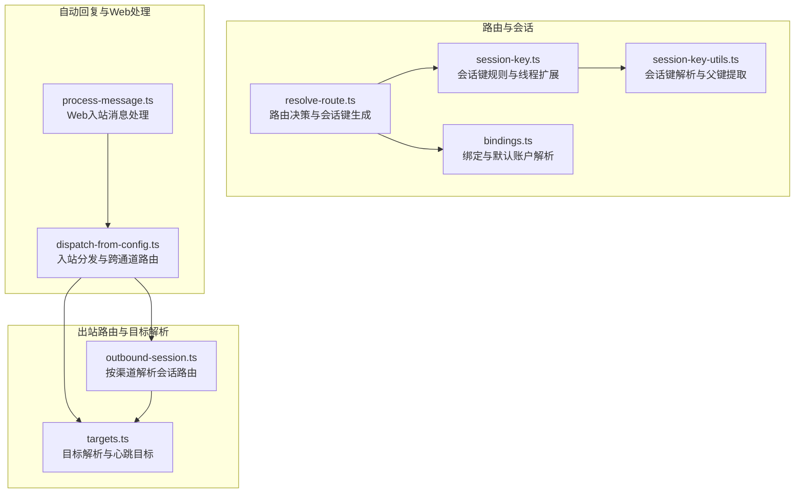
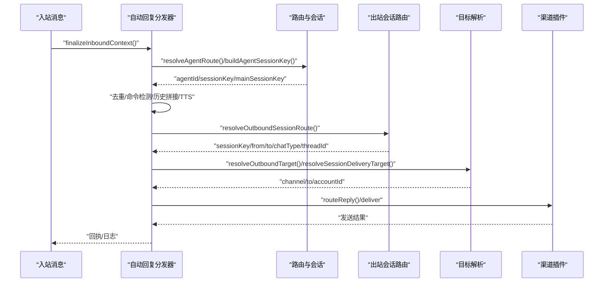
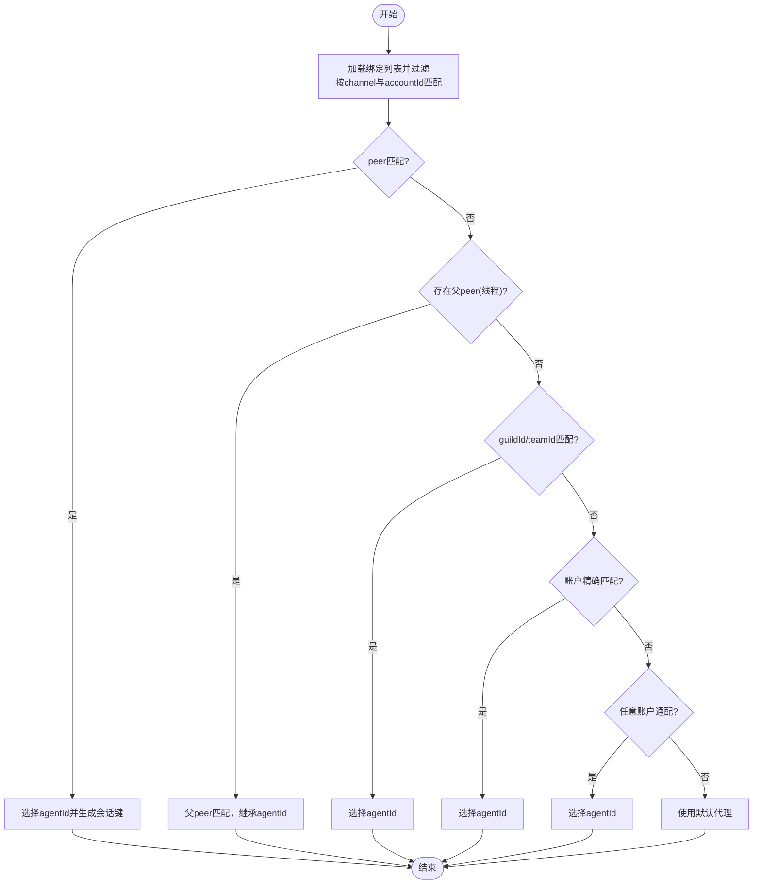
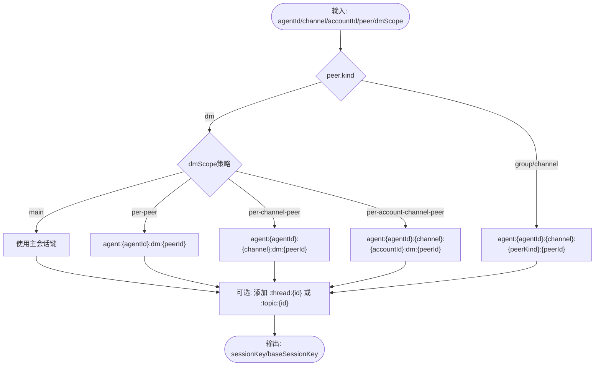
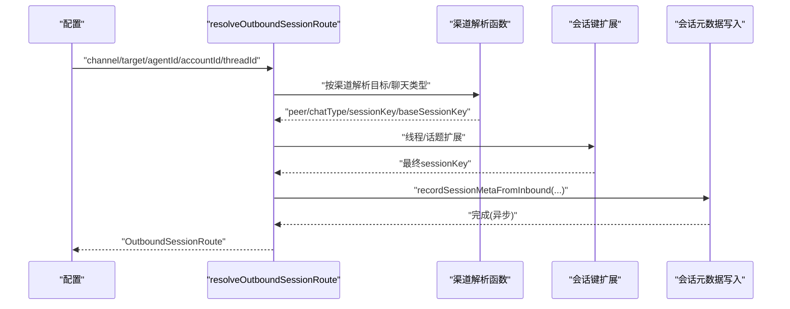
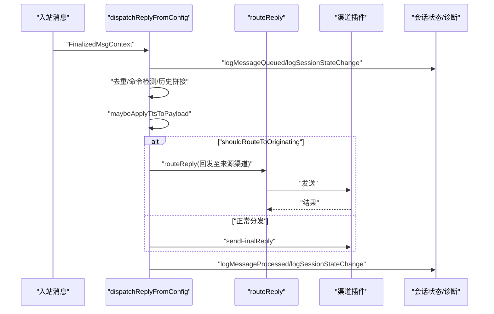
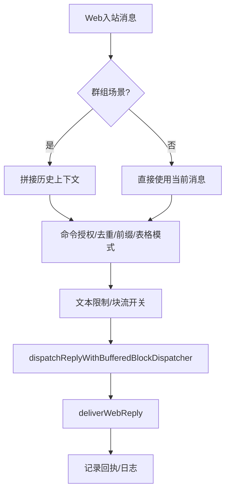
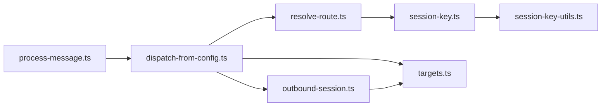

# 消息路由与处理

## 目录
1. [引言](#引言)
2. [项目结构](#项目结构)
3. [核心组件](#核心组件)
4. [架构总览](#架构总览)
5. [详细组件分析](#详细组件分析)
6. [依赖关系分析](#依赖关系分析)
7. [性能考量](#性能考量)
8. [故障排查指南](#故障排查指南)
9. [结论](#结论)
10. [附录](#附录)

## 引言
本文件面向 OpenClaw 的消息路由与处理系统，系统性梳理从“入站”到“出站”的完整链路：消息进入后如何识别渠道与聊天类型、如何生成会话键、如何进行路由决策、如何解析目标地址、如何在会话中组织上下文、如何进行消息转换与格式化、如何并发处理与队列管理、以及如何在多渠道间进行跨通道转发与回发。同时给出复杂路由场景的处理思路、性能优化建议与监控指标，并提供调试方法与排障指引。

## 项目结构
OpenClaw 将路由与处理拆分为多个层次：
- 路由层：负责根据配置与上下文选择合适的代理（Agent）与会话键，确定聊天类型与会话范围。
- 会话层：负责会话键构建、线程/话题键扩展、主会话键与直接对话折叠等。
- 出站路由层：负责将出站消息映射到具体渠道与目标，解析目标类型（DM/群组/频道），并确保会话元数据写入。
- 自动回复层：负责入站消息的去重、命令检测、历史上下文拼接、块流式回复、TTS 应用与最终回复的路由。
- Web 入站处理层：负责 Web 渠道的消息预处理、分组历史聚合、前缀与表格模式、交付与回执。

## 核心组件
- 路由决策与会话键生成：依据配置绑定、账户 ID、渠道与对端标识，选择代理并生成会话键；支持主会话键折叠与直接对话范围控制。
- 会话键规则与线程扩展：支持 `per-peer`/`per-channel-peer`/`per-account-channel-peer` 等 DM 范围策略，支持 `group`/`channel` 会话键，支持线程/话题键扩展。
- 出站会话路由：针对各渠道（Slack/Discord/Telegram/WhatsApp/Signal/iMessage/Mattermost/Matrix/MSTeams/BlueBubbles/Nextcloud Talk/Zalo/Zalouser/Nostr/Tlon）解析目标、推断聊天类型、生成会话键与 `from`/`to` 映射。
- 目标解析与心跳：从会话上下文或显式参数解析目标，结合 `allowFrom` 与插件能力进行规范化，支持心跳目标的 `last`/`none`/指定渠道。
- 自动回复分发：入站消息去重、命令授权、历史上下文拼接、块流式回复、TTS 应用、跨通道路由回发。
- Web 入站处理：Web 渠道消息的前缀、表格模式、文本限制、块流开关、回执与日志记录。

## 架构总览
下图展示从入站到出站的关键交互：入站消息经自动回复分发器进入，根据会话键与聊天类型决定是否跨通道路由；出站时通过渠道插件解析目标，生成会话路由并写入会话元数据。

## 详细组件分析

### 路由决策与会话键生成
- 绑定匹配优先级：`peer` 匹配 → 父 `peer`（线程）继承 → `guild`/`team` → 账户精确匹配 → 任意账户通配 → 默认代理。
- 会话键生成：支持主会话键折叠（`main`）、按 `peer`、按渠道+`peer`、按账户+渠道+`peer` 等多种范围策略；支持 `identityLinks` 将不同 ID 归一到同一 `peer`。
- 主会话键与直接对话折叠：用于将多源消息归并到单一主会话，便于统一管理与并发控制。

### 会话键规则与线程扩展
- DM 范围策略：`main`（主会话）、`per-peer`、`per-channel-peer`、`per-account-channel-peer`；支持 `identityLinks` 将别名映射为主 `peer`。
- 群组/频道会话键：统一采用 `channel:group`/`channel:dm` 结构，保证跨入出一致。
- 线程/话题扩展：支持 `thread`/`topic` 后缀，或特定渠道（如 Discord）不加后缀的线程键。

### 出站会话路由与目标解析
- 渠道适配：针对各渠道解析目标字符串，推断聊天类型（`direct`/`group`/`channel`），生成 `from`/`to` 映射与会话键；部分渠道（如 Slack）需要额外 API 查询以区分 `group DM` 与普通 `channel`。
- 会话元数据写入：在确保消息发送前，异步记录会话元数据，避免阻塞出站发送。
- 目标解析：从会话上下文或显式参数解析目标，结合 `allowFrom` 与插件能力规范化；支持心跳目标 `last`/`none`/指定渠道。

### 自动回复分发与跨通道路由
- 去重与状态跟踪：入站消息去重、会话状态变更（`processing`/`idle`）与诊断事件记录。
- 命令检测与授权：根据配置与会话状态判断是否允许命令执行。
- 历史上下文拼接：在群组场景下，将最近历史条目拼接到当前消息上下文中。
- 块流式回复与 TTS：支持块流式更新与最终回复，按需应用 TTS 并在跨通道场景下路由回发。
- 跨通道路由：当入站消息来自 Telegram 但当前会话在 Slack 上时，将最终回复路由回 Telegram。

### Web 入站处理与消息转换
- 历史聚合：在群组场景下，将近期消息历史拼接为上下文，增强回复质量。
- 前缀与表格模式：根据配置与身份前缀生成响应前缀，表格渲染模式可选。
- 文本限制与块流：根据渠道与账户配置设置文本块大小与块流开关。
- 回执与日志：发送成功后记录回执与日志，支持静默令牌与无文本返回的跳过逻辑。

## 依赖关系分析
- 路由与会话依赖：`resolve-route` 依赖 `session-key` 生成会话键；`session-key` 依赖 `session-key-utils` 进行解析与父键提取。
- 出站路由依赖：`outbound-session` 依赖各渠道解析器与插件能力；`targets` 依赖插件与会话上下文解析目标。
- 自动回复依赖：`dispatch-from-config` 依赖路由与会话、插件与 TTS；`process-message` 依赖自动回复分发器与 Web 渠道能力。

## 性能考量
- 会话键缓存：Slack 频道类型查询结果缓存，避免重复 API 调用。
- 异步元数据写入：出站会话元数据写入采用异步方式，不阻塞发送路径。
- 去重与心跳抑制：入站消息去重与心跳令牌剥离减少无效处理。
- 块流式回复：在支持的渠道启用块流，降低首字节延迟并提升用户体验。
- 线程键复用：线程/话题键复用 `baseSessionKey`，减少键长度与存储开销。

## 故障排查指南
- 入站合同验证：测试用例确保入站上下文字段齐全且格式正确，便于定位上游数据问题。
- 出站路由断言：测试用例覆盖典型渠道的会话键与聊天类型断言，便于定位路由解析问题。
- Web 处理入站合同：测试用例确保 `processMessage` 接收已“finalize”的 `MsgContext`，便于定位上游处理问题。
- 常见问题定位：
  - 会话键不一致：检查 `dmScope` 与 `identityLinks` 是否符合预期。
  - Slack 类型误判：确认 `groupChannels` 配置与 API 查询缓存。
  - 跨通道路由失败：检查 `OriginatingChannel`/`OriginatingTo` 与 `routeReply` 返回值。
  - 目标解析失败：检查插件 `outbound.resolveTarget` 与 `allowFrom` 配置。

## 结论
OpenClaw 的消息路由与处理系统通过“路由决策 + 会话键规则 + 出站路由 + 目标解析 + 自动回复分发”的分层设计，实现了跨渠道的一致性与高扩展性。系统在会话键生成、聊天类型识别、跨通道路由与目标解析方面具备完善的策略与容错机制；在并发处理与性能优化方面提供了异步元数据写入、块流式回复与缓存等手段。配合严格的入出站合同与测试用例，系统具备良好的可维护性与可观测性。

## 附录

### 路由配置示例（要点）
- 绑定与默认账户：通过 `bindings` 定义 `channel`/`accountId`/`peer`/`guild`/`team` 的匹配规则，支持任意账户通配与默认代理。
- DM 范围策略：根据业务需求选择 `main`/`per-peer`/`per-channel-peer`/`per-account-channel-peer`。
- Slack MPIM 分组：通过 `groupChannels` 配置与 API 查询区分 `group DM` 与普通 `channel`。
- 心跳目标：支持 `last`/`none`/指定渠道与 `allowFrom` 规范化。

### 复杂路由场景处理方案
- 线程/话题路由：使用 `resolveThreadSessionKeys` 生成带线程序列的会话键，确保线程内消息隔离。
- 父 `peer` 继承：当 `peer` 不匹配但父 `peer` 存在时，继承父 `peer` 的绑定，保障线程场景下的路由一致性。
- 聊天类型推断：在无法明确区分 `group`/`channel` 时，依据插件能力与配置进行推断，必要时调用平台 API。

### 监控指标与诊断
- 会话状态：`processing`/`idle` 变更事件，记录原因与耗时。
- 消息处理：`message_queued`/`message_processed` 事件，记录渠道、会话键、消息 ID、耗时与结果。
- 出站会话元数据：记录 `from`/`to`/`sessionKey`/`accountId`/`chatType`/`threadId`，便于审计与回溯。