# 渠道开发指南

## 目录
1. [简介](#简介)
2. [项目结构](#项目结构)
3. [核心组件](#核心组件)
4. [架构概览](#架构概览)
5. [详细组件分析](#详细组件分析)
6. [依赖分析](#依赖分析)
7. [性能考虑](#性能考虑)
8. [故障排除指南](#故障排除指南)
9. [结论](#结论)
10. [附录](#附录)

## 简介

OpenClaw 是一个可在用户设备上运行的个人AI助手，支持多种消息渠道（WhatsApp、Telegram、Slack、Discord、Google Chat、Signal、iMessage、Microsoft Teams、WebChat等），并通过扩展渠道（如BlueBubbles、Matrix、Zalo等）进行功能扩展。

本指南专注于渠道插件开发，涵盖从环境搭建到插件发布的完整流程，帮助开发者快速构建稳定、安全、高性能的消息渠道插件。

## 项目结构

OpenClaw 采用模块化架构，核心功能通过插件系统扩展：

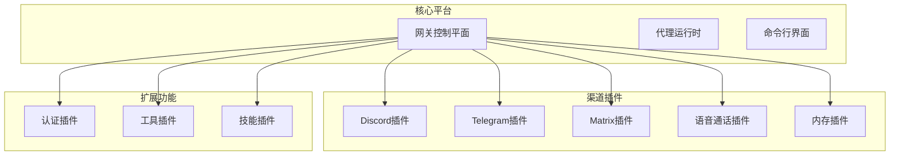

## 核心组件

### 插件SDK架构

OpenClaw 提供了统一的插件SDK，确保所有渠道插件使用一致的API接口：

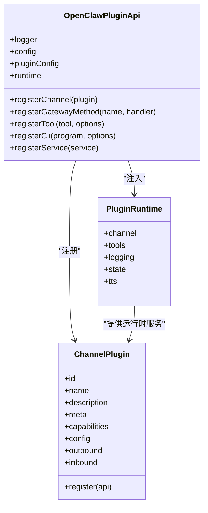

### 插件生命周期

插件在OpenClaw中的生命周期包括加载、初始化、运行和服务管理：

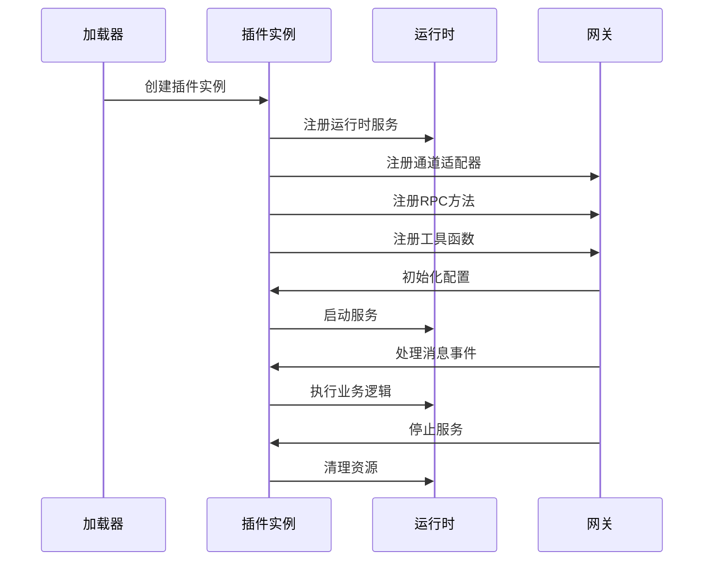

## 架构概览

### 插件发现与加载机制

OpenClaw 采用多级插件发现机制，确保插件的优先级和隔离性：

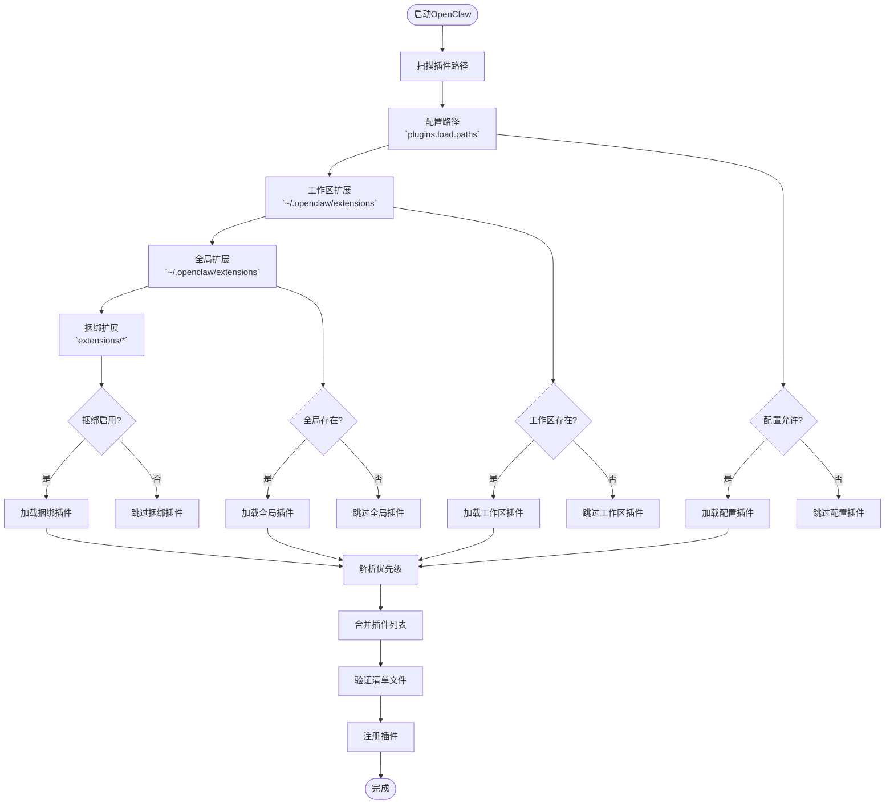

### 配置管理系统

插件配置采用严格的验证机制，确保系统的稳定性和安全性：

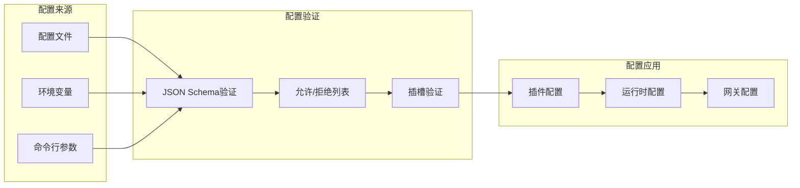

## 详细组件分析

### Discord插件分析

Discord插件展示了标准的渠道插件实现模式：

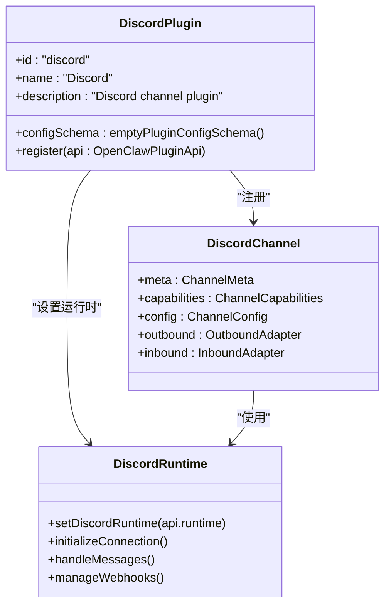

### Telegram插件分析

Telegram插件提供了更复杂的配置和功能实现：

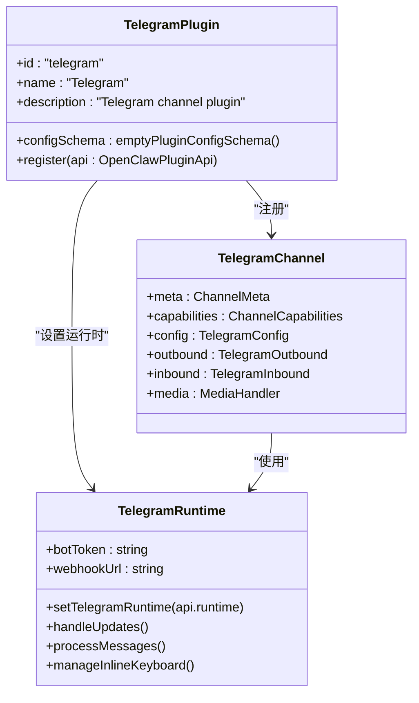

### Matrix插件分析

Matrix插件展示了第三方SDK集成的最佳实践：

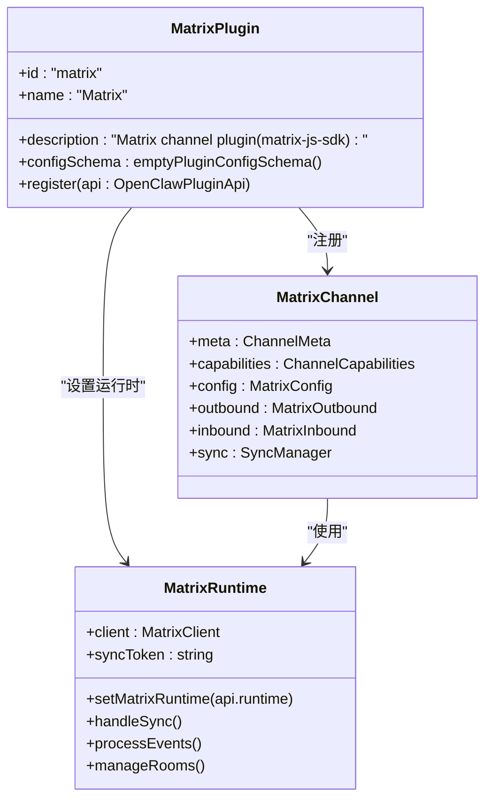

### 语音通话插件深度分析

语音通话插件是最复杂的插件之一，展示了完整的端到端实现：

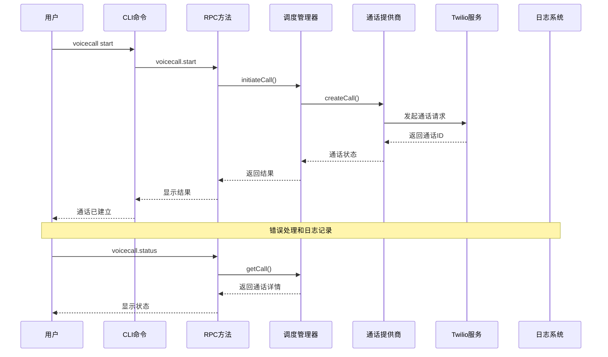

### 内存插件分析

内存插件展示了工具注册和服务管理的实现模式：

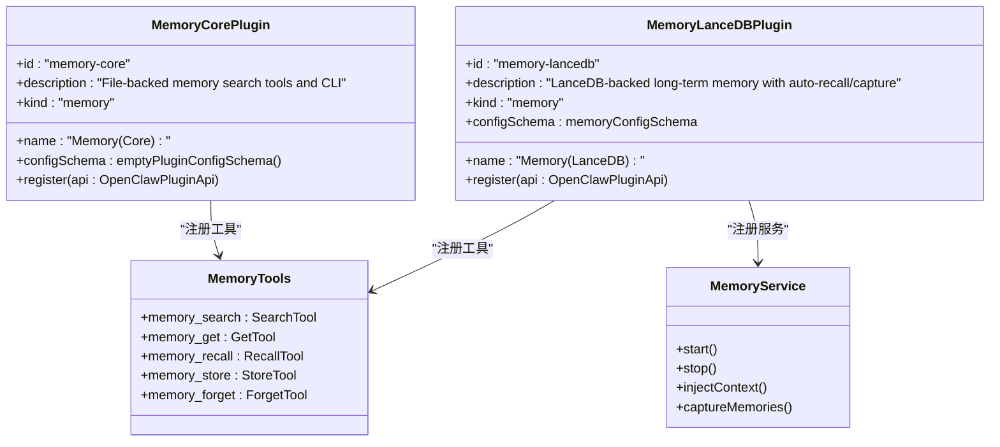

## 依赖分析

### 核心依赖关系

OpenClaw 的插件系统依赖于以下核心组件：

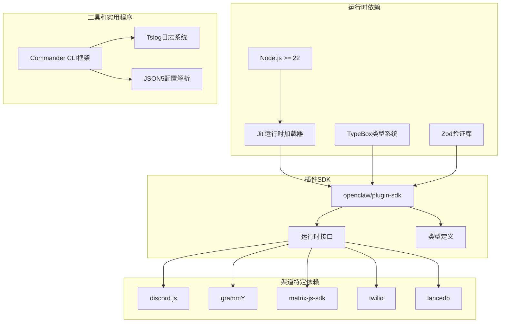

### 插件间依赖关系

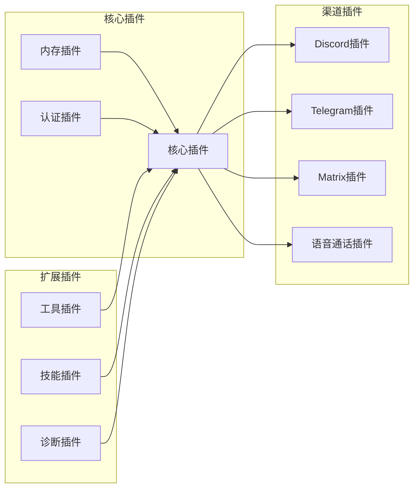

## 性能考虑

### 插件性能优化策略

1. **懒加载机制**：插件应实现延迟初始化，只在需要时才创建昂贵的对象
2. **连接池管理**：对第三方API使用连接池，避免频繁创建和销毁连接
3. **缓存策略**：合理使用内存缓存和磁盘缓存，减少重复计算
4. **异步处理**：使用异步操作避免阻塞主线程
5. **资源清理**：确保插件停止时正确释放所有资源

### 内存管理最佳实践

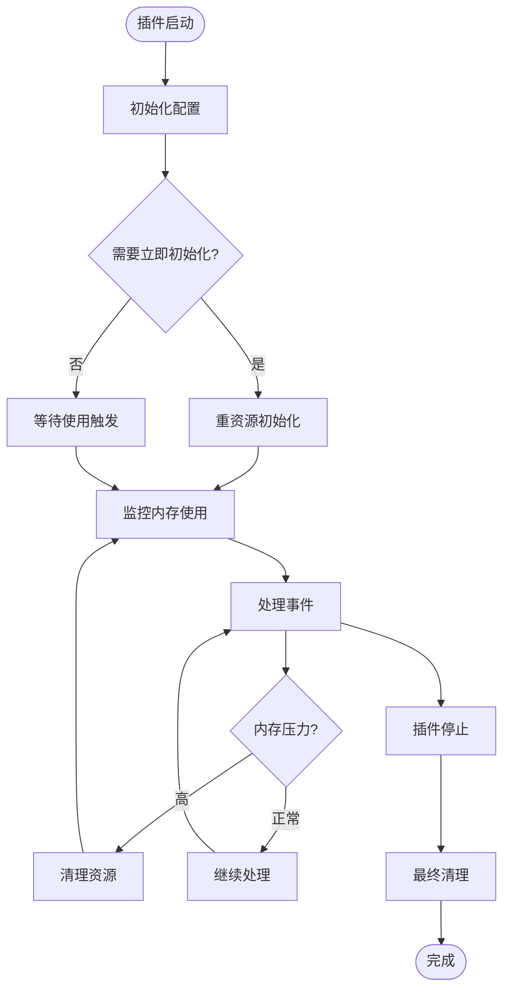

## 故障排除指南

### 常见问题及解决方案

#### 插件加载失败

**问题症状**：
- 插件无法被识别
- 启动时报错"Unknown plugin id"

**解决方案**：
1. 检查插件清单文件格式
2. 验证插件ID与配置中的ID匹配
3. 确认插件文件路径正确

#### 配置验证错误

**问题症状**：
- 插件启动时配置验证失败
- 报告未知字段或类型不匹配

**解决方案**：
1. 检查JSON Schema定义
2. 验证配置值的数据类型
3. 确认必填字段已提供

#### 运行时错误

**问题症状**：
- 插件运行中抛出异常
- 服务意外停止

**解决方案**：
1. 添加适当的错误处理和重试机制
2. 实现优雅降级策略
3. 记录详细的错误日志

## 结论

OpenClaw的渠道插件开发体系为开发者提供了强大而灵活的扩展能力。通过统一的SDK接口、严格的配置管理和完善的生命周期支持，开发者可以快速构建高质量的消息渠道插件。

关键成功因素包括：
- 遵循统一的插件架构模式
- 实施健壮的错误处理机制
- 优化性能和资源使用
- 提供清晰的文档和测试

## 附录

### 开发环境搭建

1. **系统要求**：Node.js >= 22
2. **包管理器**：推荐使用pnpm
3. **开发工具**：TypeScript编译器、Vitest测试框架
4. **IDE建议**：VS Code + TypeScript插件

### 插件开发检查清单

- [ ] 实现标准插件接口
- [ ] 编写完整的配置Schema
- [ ] 添加单元测试和集成测试
- [ ] 编写使用文档
- [ ] 实现错误处理和日志记录
- [ ] 测试插件在不同环境下的兼容性
- [ ] 验证插件的安全性考虑

### 发布和维护

- 使用语义化版本控制
- 维护变更日志
- 定期更新依赖项
- 监控插件性能指标
- 收集用户反馈并持续改进