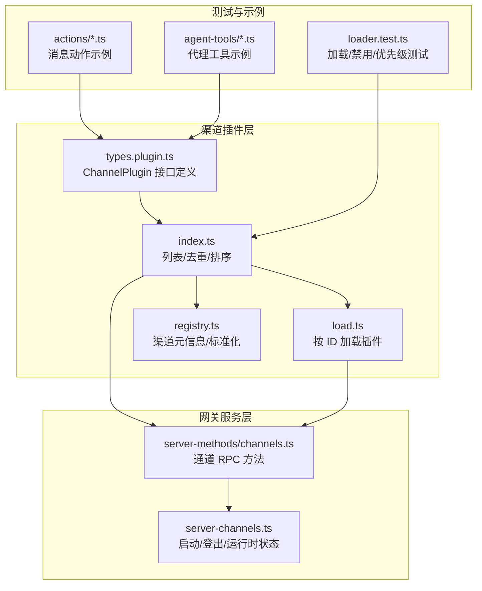
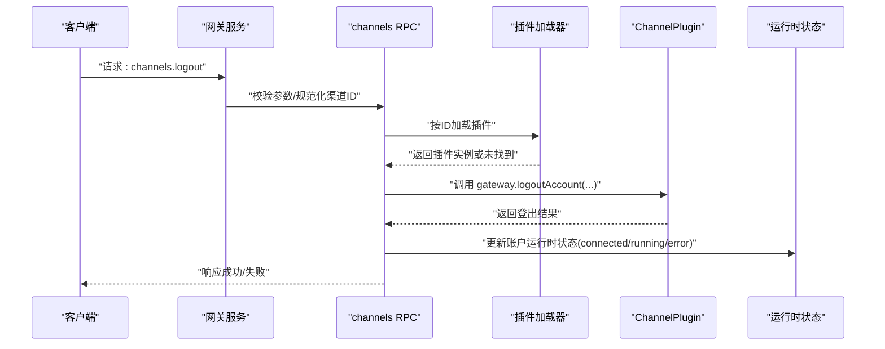
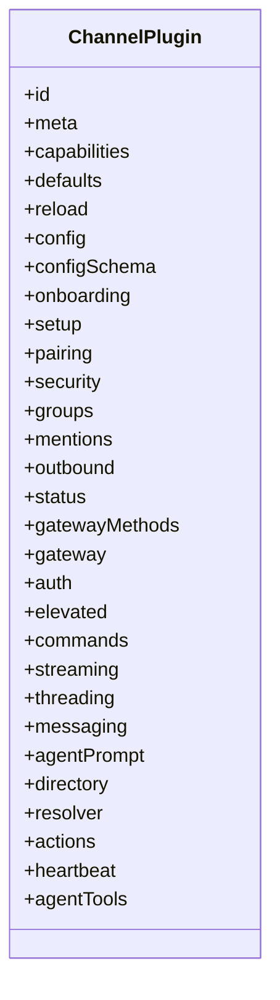
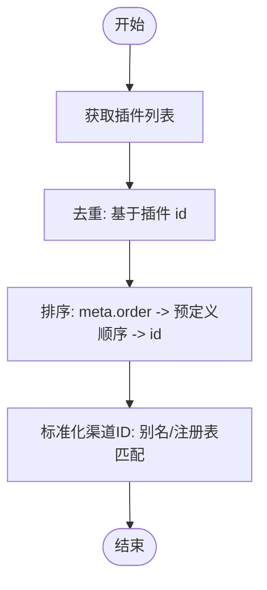
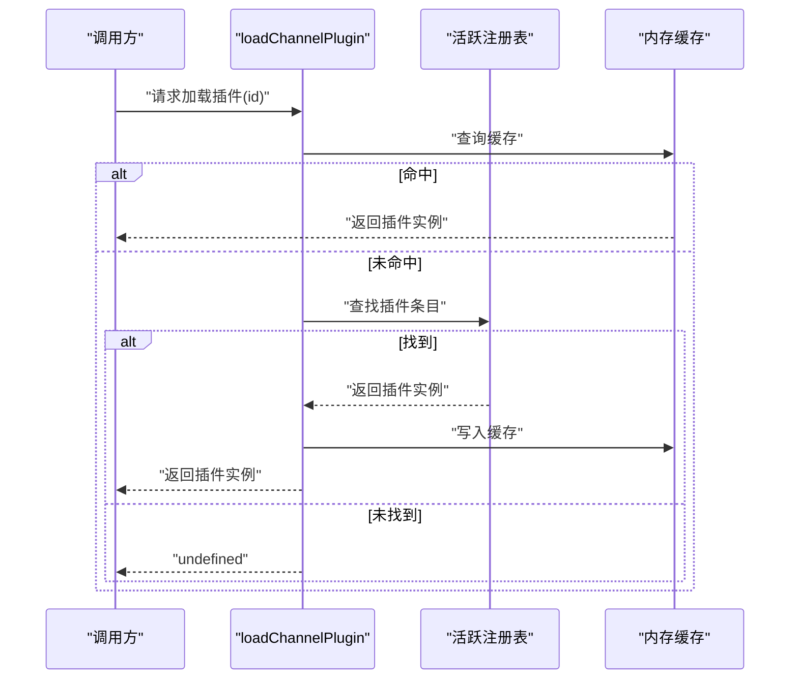
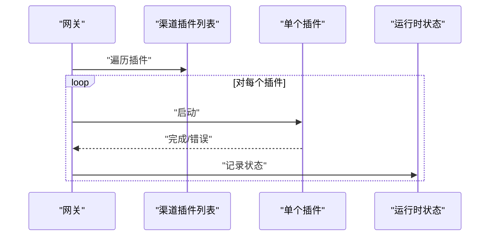
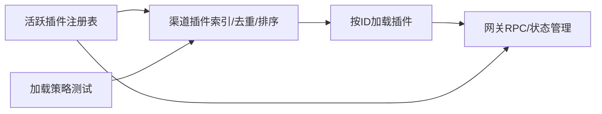

# 渠道插件架构

## 目录
1. [引言](#引言)
2. [项目结构](#项目结构)
3. [核心组件](#核心组件)
4. [架构总览](#架构总览)
5. [详细组件分析](#详细组件分析)
6. [依赖关系分析](#依赖关系分析)
7. [性能考虑](#性能考虑)
8. [故障排查指南](#故障排查指南)
9. [结论](#结论)
10. [附录](#附录)

## 引言
本文件系统性阐述 OpenClaw 的“渠道插件”（Channel Plugin）架构：设计原理、接口规范、生命周期管理、注册与去重、排序规则、与主系统的交互（事件分发、状态同步、错误处理）、以及开发最佳实践（性能优化、内存管理、并发安全）。目标是帮助开发者快速理解并正确实现新的渠道插件，同时为维护者提供清晰的参考。

## 项目结构
渠道插件相关代码主要位于以下位置：
- 核心类型与接口定义：`src/channels/plugins/types.plugin.ts`
- 运行时注册表与查询：`src/channels/plugins/index.ts`、`src/channels/plugins/load.ts`
- 渠道元数据与标准化：`src/channels/registry.ts`
- 网关侧调用与状态管理：`src/gateway/server-methods/channels.ts`、`src/gateway/server-channels.ts`
- 插件加载与配置验证：`src/plugins/loader.test.ts`
- 典型适配器与功能模块：`actions`、`agent-tools`、`catalog`、`channel-config`、`directory-config`、`allowlist-match` 等

## 核心组件
- ChannelPlugin 接口：定义渠道插件的统一契约，包含标识、元信息、能力、配置、适配器集合（认证、消息、群组、命令、心跳等）以及可选的代理工具与网关方法声明。
- 注册表与查询：通过运行时插件注册表获取已加载的渠道插件列表，并提供去重与排序逻辑；支持按 ID 查询与标准化渠道 ID。
- 加载器：基于当前活跃注册表缓存查找渠道插件，避免重复解析与导入。
- 渠道元数据：集中维护渠道顺序、别名、文档链接、图标等元信息，用于 UI 展示与选择。
- 网关集成：网关侧提供通道相关 RPC 方法（如登出），并在启动时遍历并启动所有可用渠道插件，维护每个账户的运行时状态。

## 架构总览
下图展示从“网关 RPC 调用”到“渠道插件执行”的端到端流程，以及状态同步与错误处理的关键节点。

## 详细组件分析

### ChannelPlugin 接口与适配器族
ChannelPlugin 是渠道插件的核心契约，包含以下关键字段与适配器族：
- 基础信息：`id`、`meta`、`capabilities`、`defaults`、`reload`、`config`、`configSchema`
- 生命周期与配置：`onboarding`、`setup`、`pairing`、`security`、`status`、`heartbeat`
- 消息与交互：`groups`、`mentions`、`outbound`、`streaming`、`threading`、`messaging`、`agentPrompt`、`resolver`、`actions`
- 权限与工具：`auth`、`elevated`、`commands`、`directory`、`agentTools`、`gatewayMethods`、`gateway`
- 典型适配器职责（以路径代替代码片段）
  - 认证与安全：`src/channels/plugins/types.adapters.ts`
  - 消息发送/接收：`src/channels/plugins/types.adapters.ts`
  - 群组/成员目录：`src/channels/plugins/types.adapters.ts`
  - 心跳与状态：`src/channels/plugins/types.adapters.ts`
  - 代理提示词与工具：`src/channels/plugins/types.adapters.ts`

### 插件注册机制、去重与排序
- 注册表来源：运行时插件注册表提供 channels 列表，其中每项包含一个 ChannelPlugin 实例。
- 去重策略：按插件 `id` 去重，忽略空 `id` 或重复 `id`。
- 排序规则：优先使用 `meta.order`，其次使用预定义聊天渠道顺序，最后按 `id` 字典序。
- 标准化渠道 ID：支持别名映射与已注册插件 `id` 匹配，确保输入规范化。

### 插件加载与缓存
- 缓存策略：以 `ChannelId` 为键缓存插件实例，当活跃注册表变化时清空缓存。
- 加载流程：从当前注册表中查找匹配的插件条目，命中后写入缓存并返回。

### 与主系统的交互：事件分发、状态同步与错误处理
- 启动流程：网关在启动时遍历所有渠道插件并逐一启动。
- 登出流程：网关提供 `channels.logout` RPC，校验参数并调用插件的 `gateway.logoutAccount`，随后更新运行时状态（`connected`/`running`/`error`）。
- 错误处理：对无效参数、不支持的操作、配置快照异常等情况返回明确错误码与消息。

### 生命周期管理
- 初始化：插件通过 `setup`/`pairing`/`security` 等适配器完成初始配置与认证准备。
- 运行期：`messaging`/`streaming`/`threading`/`groups` 等适配器负责消息收发、流式输出、话题线程、群组管理等。
- 清理：`gatewayMethods`/`gateway.logoutAccount` 提供登出与资源释放入口；运行时状态被标记为未连接且停止运行。
- 心跳：`heartbeat` 适配器用于维持连接健康与周期性任务。

### 插件注册与配置验证（加载策略）
- 显式禁用：可通过配置 entries 中设置 `enabled=false` 禁用特定插件。
- 内存插件槽位：`slots.memory` 可指定唯一启用的内存插件，其他同类型插件将被禁用。
- 槽位 none：禁用该类插件。
- 优先级覆盖：相同 `id` 的高优先级插件会覆盖低优先级版本。

### 典型适配器与功能模块
- 消息动作（actions）：不同渠道的消息操作（如 Discord 群管理员操作、Telegram/Signal 动作）。
- 代理工具（agent-tools）：例如 WhatsApp 登录流程工具。
- 目录与白名单：目录配置、允许列表匹配与嵌套决策。
- 插件目录与技能：插件目录、频道匹配与配置解析。

## 依赖关系分析
- 低耦合：渠道插件通过适配器族解耦具体实现，核心只依赖契约。
- 运行时依赖：插件列表、去重与排序依赖活跃插件注册表；标准化渠道 ID 依赖注册表中的插件元信息。
- 网关依赖：网关通过 RPC 方法与插件交互，状态同步由网关统一维护。
- 测试依赖：`loader.test.ts` 验证加载、禁用、优先级等行为，确保注册机制稳定。

## 性能考虑
- 按需加载与缓存：插件实例按 ID 缓存，避免重复解析与导入，降低冷启动成本。
- 去重与排序：在运行时一次性完成，减少后续查询开销。
- 轻量标准化：`normalizeAnyChannelId` 仅依赖注册表匹配，不引入重型依赖。
- 并发安全：插件加载器内部使用 Map 缓存，建议在多线程场景下配合外部锁或串行化访问，避免竞态。
- 内存管理：插件生命周期内应主动释放网络连接、定时器与监听器；登出时确保资源回收。

## 故障排查指南
- 插件未加载
  - 检查是否在配置中显式禁用（`entries.enabled=false`）。
  - 检查槽位设置是否导致同类型插件被禁用。
  - 确认插件 `id` 与别名是否正确，是否存在于注册表。
- 登出失败
  - 确认插件是否实现 `gatewayMethods`/`logoutAccount`。
  - 检查配置快照有效性与参数规范化。
- 行为验证
  - 使用 `loader.test.ts` 中的断言模式作为参考，编写类似单元测试验证加载与优先级行为。

## 结论
OpenClaw 的渠道插件架构以 ChannelPlugin 为核心契约，结合运行时注册表、去重与排序、按需加载与缓存、以及网关侧统一的状态管理，实现了高扩展、低耦合的渠道接入体系。遵循本文档的接口规范、生命周期管理与最佳实践，可高效实现新渠道插件并确保稳定性与可维护性。

## 附录
- 开发清单
  - 实现必需适配器（`config`、`messaging` 等）与可选适配器（`auth`、`commands`、`heartbeat` 等）。
  - 在插件中声明 `meta`、`capabilities`、`defaults`、`reload` 等字段。
  - 在 `openclaw.plugin.json` 中声明插件 `id` 与入口。
  - 编写单元测试与集成测试，覆盖加载、禁用、优先级、登出等场景。
- 调试技巧
  - 使用日志定位插件加载与初始化阶段的问题。
  - 通过网关 RPC 观察 `channels.logout` 等方法的返回值与错误码。
  - 在本地配置中临时调整 `entries.enabled` 与 `slots.memory` 快速验证行为。