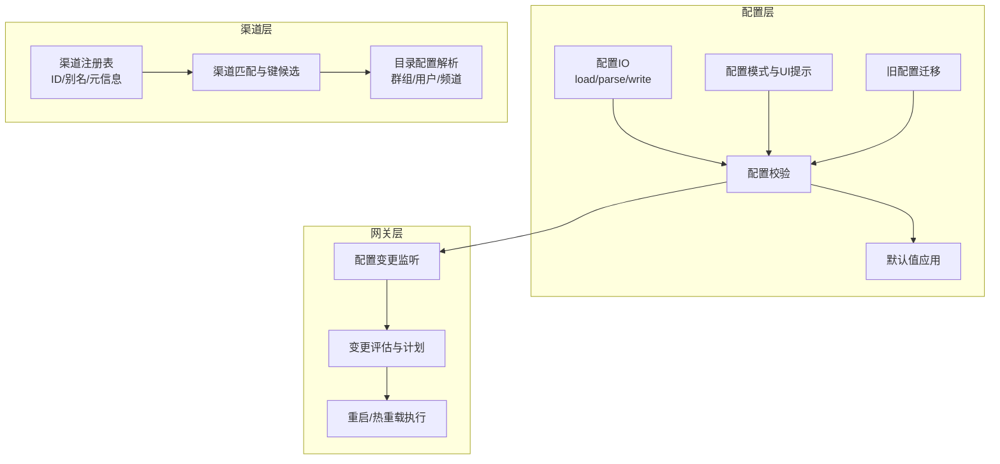
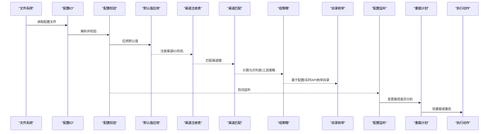
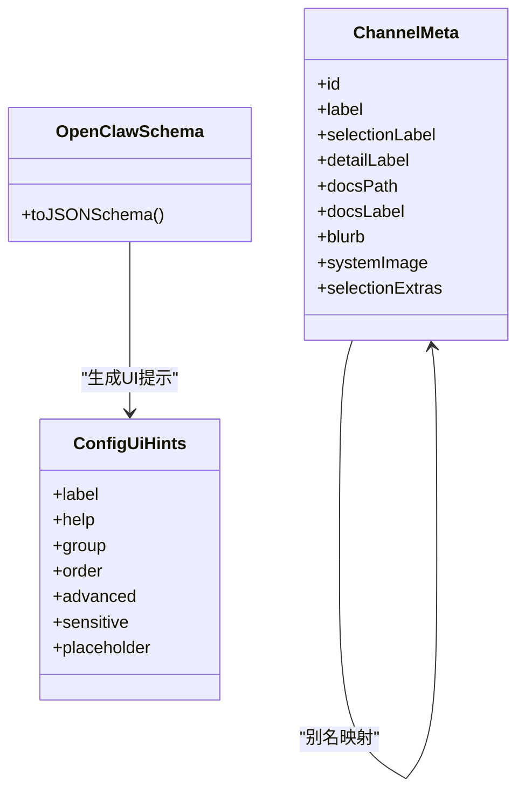
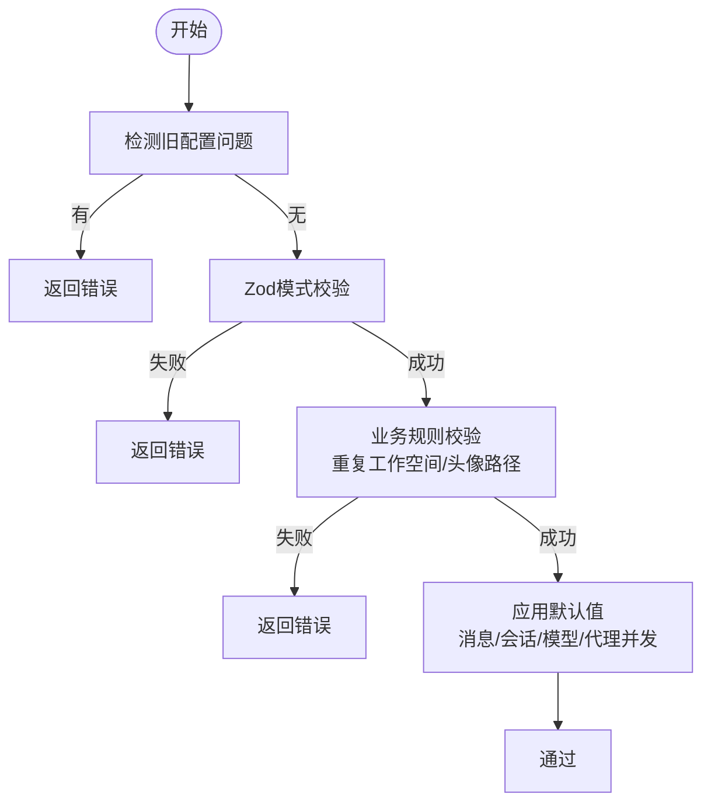
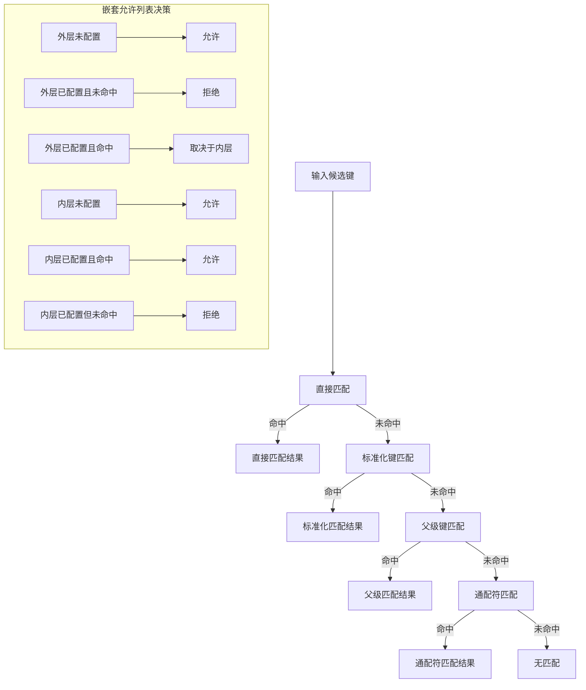
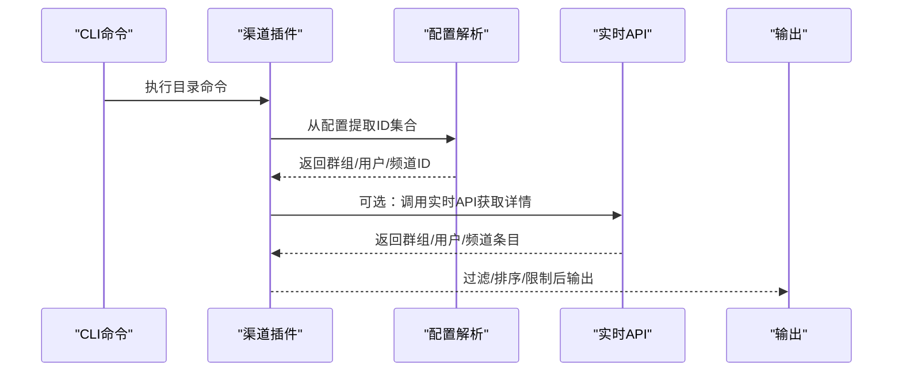
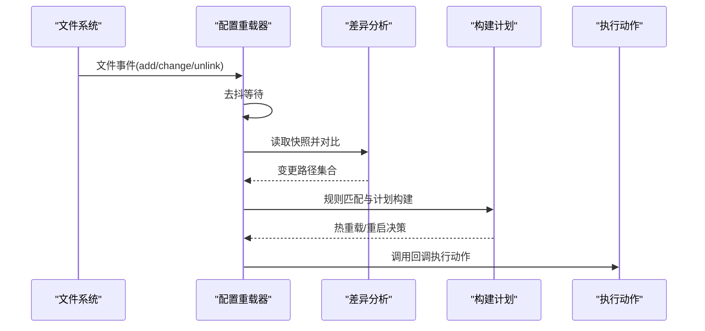
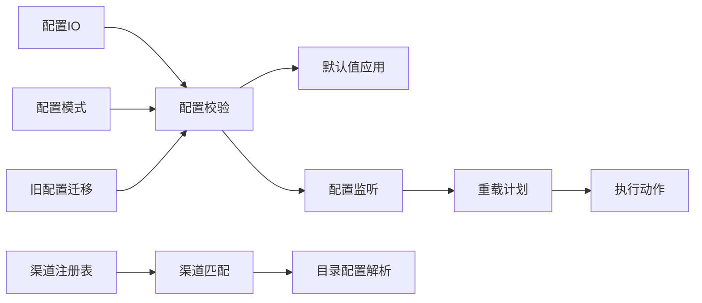

# 渠道配置管理

## 目录
1. [简介](#简介)
2. [项目结构](#项目结构)
3. [核心组件](#核心组件)
4. [架构总览](#架构总览)
5. [详细组件分析](#详细组件分析)
6. [依赖关系分析](#依赖关系分析)
7. [性能考虑](#性能考虑)
8. [故障排除指南](#故障排除指南)
9. [结论](#结论)
10. [附录](#附录)

## 简介
本文件系统性阐述 OpenClaw 的渠道配置管理技术方案，覆盖数据结构、验证规则、默认值处理、允许列表与路由匹配、目录管理（群组/用户/频道）、热重载与版本兼容性、迁移策略，以及典型配置场景与优化建议。目标是帮助开发者与运维人员在不深入源码的情况下，也能高效理解并正确使用渠道配置。

## 项目结构
OpenClaw 将“配置”与“渠道”两大领域分层组织：
- 配置层：负责配置读写、校验、默认值应用、模式生成、版本解析与迁移等
- 渠道层：负责渠道识别、匹配、目录枚举、路由决策与策略执行
- 网关层：负责配置热重载监听、变更评估与动作调度

## 核心组件
- 配置 IO 与模式：提供配置读取、解析、写入、模式导出与 UI 提示
- 配置校验：基于 Zod 模式进行强类型校验，并补充插件、通道、心跳目标等业务规则
- 默认值应用：自动填充消息/会话/模型/代理并发等默认值，确保最小可用配置
- 渠道匹配与键候选：标准化键、构建候选集、支持直接/父级/通配符匹配
- 允许列表与组策略：按群组/账号维度控制工具策略、提及要求等
- 目录管理：从配置与实时 API 枚举用户/群组/频道，支持搜索与限制
- 热重载：监听配置文件变化，评估变更路径，决定热重载或重启

## 架构总览
下图展示从配置文件到渠道运行的关键流转：配置加载与校验 → 默认值应用 → 渠道匹配与策略 → 目录枚举 → 热重载评估与执行。

## 详细组件分析

### 数据结构与模式
- 配置模式与 UI 提示：通过统一的模式生成器输出 JSON Schema 与 UI 提示，覆盖所有配置键的标签、帮助、占位符与敏感标记
- 渠道 ID 与别名：内置核心渠道顺序与别名映射，同时支持插件注册的扩展渠道
- 版本解析：支持语义化版本字符串解析与比较，用于兼容性判断与迁移

### 验证规则与默认值处理
- 强类型校验：基于 Zod 模式对配置进行结构与类型校验；同时检查代理工作空间重复、头像路径合法性等业务规则
- 插件与通道校验：校验插件存在性、启用状态、内存槽位选择、未知通道 ID、心跳目标合法性
- 默认值应用：自动填充消息确认范围、会话主键、模型成本/输入/上下文窗口/最大令牌等字段，保证最小可用配置

### 允许列表与路由规则
- 键候选与匹配：支持多候选键、标准化键、父级键回退、通配符键匹配，优先级为直接匹配 > 标准化匹配 > 父级匹配 > 通配符匹配
- 嵌套允许列表决策：外层未配置则允许，外层已配置但未命中则拒绝；内层未配置则允许，内层已配置且命中才允许
- 组策略：按账号/群组维度提供 `requireMention` 与工具策略，支持按发送者细化策略

### 目录配置管理（群组/用户/频道）
- 配置驱动的目录枚举：从各渠道配置中提取允许列表、DM 列表、群组/频道映射，支持模糊查询与数量限制
- 实时目录枚举：部分渠道支持通过令牌调用官方 API 实时获取群组/用户列表，提升准确性与覆盖面
- CLI 支持：提供目录命令，支持列出群组/用户并以表格形式输出

### 配置热重载与版本兼容性
- 变更监听：基于 chokidar 监听配置文件增删改事件，去抖后触发重载流程
- 变更评估：计算变更路径集合，匹配预定义规则，决定是否需要重启网关或仅热重载
- 动作执行：根据计划执行钩子重载、心跳重启、浏览器控制重启、定时任务重启、特定渠道重启等
- 版本兼容：提供版本解析与比较函数，便于在升级时进行兼容性判断与迁移

### 迁移策略
- 旧配置迁移：对历史配置进行迁移，再进行新校验；若迁移后仍无效，记录变更并提示手动修复
- 迁移与校验：迁移步骤与校验步骤分离，确保迁移后的配置符合当前模式

## 依赖关系分析
- 配置层依赖：配置 IO 依赖文件系统；模式生成依赖 Zod；校验依赖插件清单与通道注册表；默认值依赖代理与模型定义
- 渠道层依赖：匹配与目录依赖注册表与账户解析；目录还依赖各渠道的账户配置与实时 API
- 网关层依赖：重载器依赖插件注册表与通道插件提供的重载前缀

## 性能考虑
- 去抖与批处理：配置重载采用去抖策略，避免频繁小变更导致的多次重启
- 差异分析：仅对变更路径进行评估，减少全量校验开销
- 目录枚举：优先使用配置驱动的枚举，必要时再调用实时 API，降低外部依赖延迟
- 默认值应用：在一次遍历中完成多项默认值填充，减少重复计算

## 故障排除指南
- 配置校验失败：检查错误路径与消息，修正字段类型、必填项与业务规则（如未知通道 ID、心跳目标非法）
- 插件问题：确认插件存在、启用状态与配置模式匹配；内存槽位冲突需调整
- 目录为空：确认配置中的允许列表、DM/群组映射是否正确；实时 API 需要有效令牌
- 热重载无效：检查重载模式与规则匹配，确认变更路径是否被识别为“热重载”或“重启”
- 旧配置迁移：迁移后仍报错时，逐条修正剩余问题或回滚到迁移前备份

## 结论
OpenClaw 的渠道配置管理以“强类型模式 + 业务规则校验 + 默认值应用 + 热重载”为核心，结合“渠道匹配与组策略 + 目录枚举”的能力，提供了可维护、可观测、可演进的配置体系。通过清晰的变更评估与动作执行，既能快速响应配置变化，又能保证系统稳定性。

## 附录

### 典型配置场景示例（描述性）
- 多账户支持：在渠道配置中为不同账号分别设置 groups 与 allowFrom，实现账号隔离与差异化策略
- 群组路由：利用通配符键与父级键回退，将通用策略应用于多个群组，同时为个别群组提供覆盖
- 个性化设置：按发送者细化工具策略，结合 `requireMention` 控制是否必须提及机器人