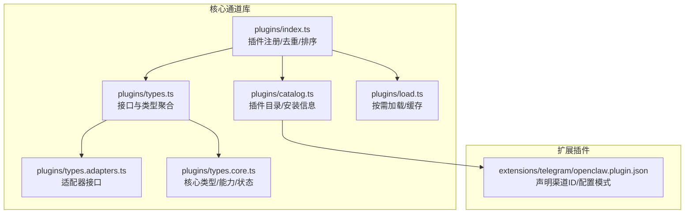
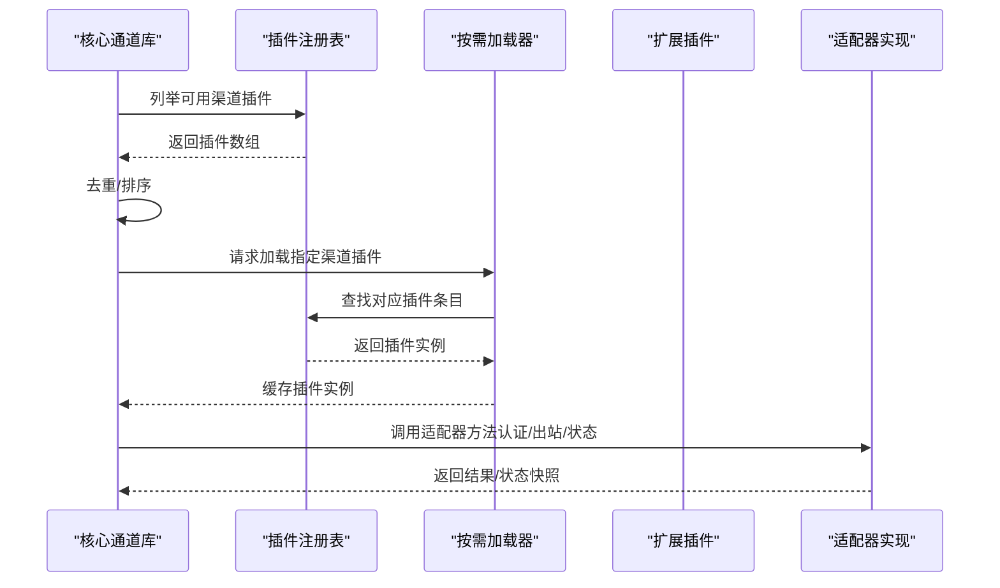
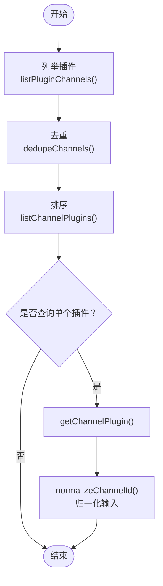
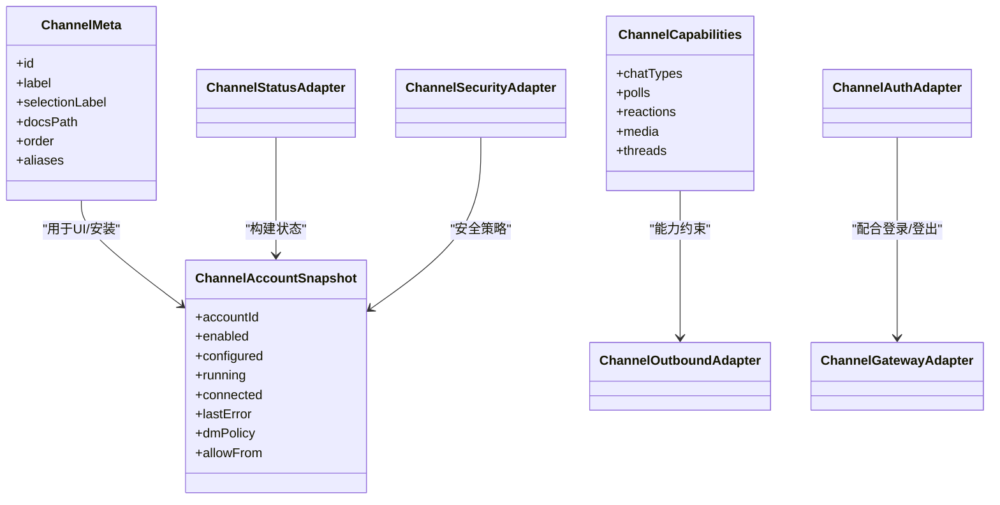
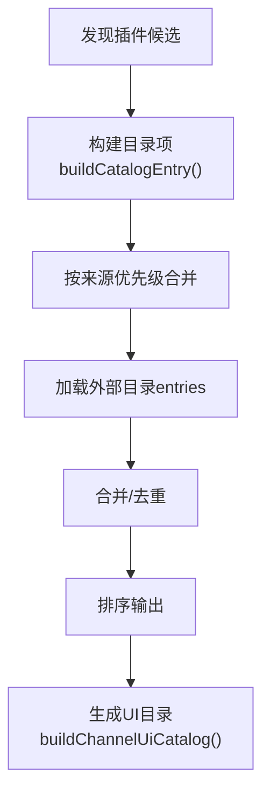
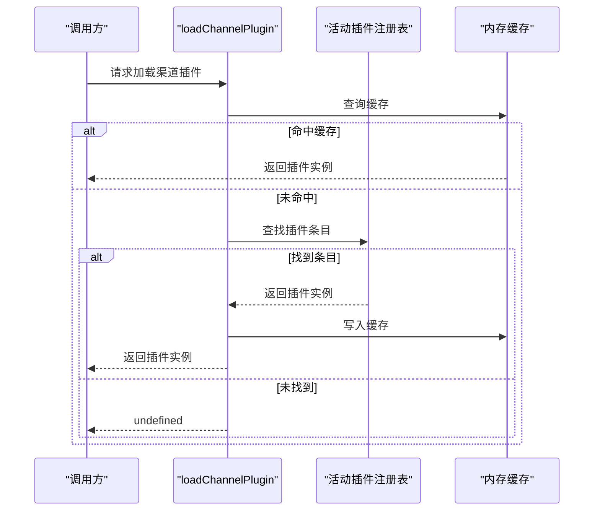
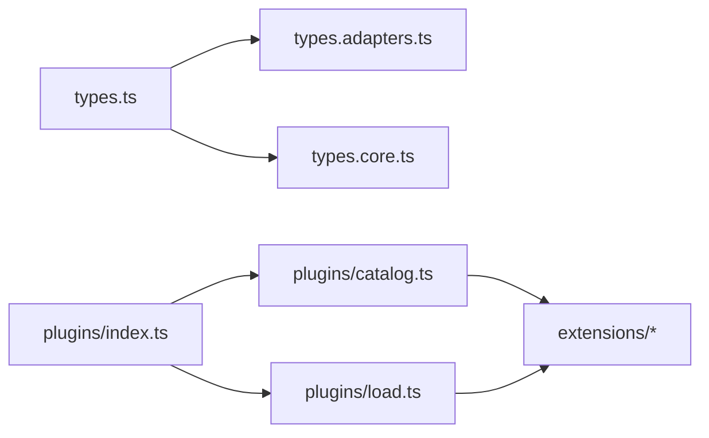

# 渠道集成

## 目录
1. [简介](#简介)
2. [项目结构](#项目结构)
3. [核心组件](#核心组件)
4. [架构总览](#架构总览)
5. [详细组件分析](#详细组件分析)
6. [依赖关系分析](#依赖关系分析)
7. [性能考量](#性能考量)
8. [故障排除指南](#故障排除指南)
9. [结论](#结论)
10. [附录](#附录)

## 简介
本文件面向 OpenClaw 的“渠道集成”子系统，系统性阐述其插件化架构、扩展机制与运行时管理方式，并结合官方文档对主流消息渠道（如 WhatsApp、Telegram、Slack、Discord、Google Chat、Signal、iMessage 等）的接入要点进行说明。内容覆盖：
- 插件注册与发现、加载与去重排序
- 渠道插件接口规范与适配器模型
- 配置与安装目录、UI 元数据与安装信息
- 身份认证、入站允许列表与 DM 安全策略
- 出站发送、分片与目标解析
- 生命周期管理与状态快照
- 故障排除与安全注意事项

## 项目结构
OpenClaw 的渠道集成采用“核心通道库 + 扩展插件”的分层设计：
- 核心通道库位于 `src/channels/plugins`，定义了统一的插件接口、适配器与类型体系
- 扩展插件位于 `extensions` 下，每个渠道以独立包形式提供，通过 `openclaw.plugin.json` 声明元数据
- 文档在 `docs/channels` 提供各渠道的快速概览与配置指引

## 核心组件
- 插件注册与发现：通过运行时插件注册表收集已安装渠道插件，支持去重与排序
- 类型与适配器：统一定义渠道插件的配置、认证、出站发送、网关生命周期、目录查询等适配器接口
- 目录与安装：从工作区与外部目录读取插件清单，生成 UI 元数据与安装信息
- 按需加载：基于注册表按需加载指定渠道插件并缓存，避免重复初始化

## 架构总览
下图展示渠道插件在运行时的整体交互：核心通道库负责统一调度，扩展插件提供具体适配器实现，配置与状态通过适配器注入。

## 详细组件分析

### 组件A：插件注册与排序
- 功能要点
  - 从活动插件注册表中提取所有渠道插件
  - 去重：按插件 `id` 去重，空 `id` 忽略
  - 排序：优先使用插件元数据中的 `order`，其次使用内置顺序，最后按 `id` 字典序
- 关键路径
  - 列举插件：`listPluginChannels` → `requireActivePluginRegistry`
  - 去重与排序：`dedupeChannels` → `listChannelPlugins`
  - 查询单个插件：`getChannelPlugin`
  - 归一化渠道 ID：`normalizeChannelId` → `normalizeAnyChannelId`

### 组件B：插件类型与适配器接口
- 类型体系
  - 适配器接口：认证、命令、配置、目录、解析、心跳、网关、安全、出站、流式、线程、消息动作等
  - 核心类型：渠道元数据、账户快照、能力集、安全策略上下文、线程上下文、消息动作上下文等
- 设计原则
  - 将渠道差异抽象为可插拔的适配器
  - 通过统一的上下文与结果类型保证调用一致性

### 组件C：插件目录与安装信息
- 目录来源
  - 工作区插件发现：`discoverOpenClawPlugins`
  - 外部目录：支持环境变量或默认路径，解析 `entries/plugins/packages`
- 安装信息
  - npm 规范、本地路径、默认选择（npm/local）
- UI 元数据
  - 标签、详情标签、系统图标、文档链接等

### 组件D：按需加载与缓存
- 缓存策略
  - 基于活动插件注册表的变更进行失效与重建
  - 同一注册表内按渠道 `id` 缓存插件实例
- 加载流程
  - 在注册表中查找匹配条目，命中则缓存并返回

### 组件E：渠道插件清单与配置模式
- 清单文件
  - `openclaw.plugin.json` 声明渠道 `id` 与配置模式
  - 示例：Telegram 插件声明 `channels` 为 `["telegram"]`

## 依赖关系分析
- 低耦合：核心通道库仅依赖插件注册表与通用类型，不直接依赖具体渠道实现
- 可扩展：新增渠道只需提供符合接口规范的插件与清单文件
- 运行时绑定：通过适配器在启动阶段注入能力，避免编译期强绑定

## 性能考量
- 插件加载缓存：按注册表粒度缓存插件实例，减少重复初始化开销
- 去重与排序：在运行前完成，避免每次调用重复计算
- 分片与限流：出站适配器支持文本分片与轮询上限，降低单次负载
- 状态快照：定期构建账户快照，便于诊断与降级

## 故障排除指南
- 渠道不可用或无法连接
  - 使用状态适配器构建快照，检查 `lastError`、`lastStartAt`、`lastStopAt` 等字段
  - 通过心跳适配器检查就绪状态与原因
- 认证失败
  - 检查凭证来源与令牌有效性；必要时触发重新认证流程
- 入站/出站策略问题
  - 校验 DM 安全策略与 `allowFrom` 列表；确认 `normalizeEntry` 是否正确
- 目标解析异常
  - 使用解析适配器验证输入格式与解析结果

## 结论
OpenClaw 的渠道集成以“统一适配器 + 插件化扩展”为核心设计，既保证了多渠道的一致体验，又保留了高度可扩展性。通过清晰的类型体系、严格的生命周期管理与完善的诊断接口，开发者可以快速实现新渠道对接并稳定运行。

## 附录

### 渠道支持与配置要点（基于官方文档）
- WhatsApp：需要 QR 登录与凭据存储；支持群组与 DM；允许设置 `allowFrom` 与 `groups`
- Telegram：支持 `botToken`；可配置 `groups`、`allowFrom`、`webhookUrl` 与 `webhookSecret`
- Slack：需要 `botToken` 与 `appToken`；支持命令与访问组
- Discord：需要 `bot token`；支持 DM `allowFrom`、`guilds`、`mediaMaxMb`
- Signal：需要 `signal-cli` 与配置段
- iMessage：macOS 原生；支持群组 `allowlist`
- Google Chat：HTTP webhook 方式
- Microsoft Teams：Bot Framework；支持 `allowFrom` 与 `groupAllowFrom`
- WebChat：通过 WebSocket 连接