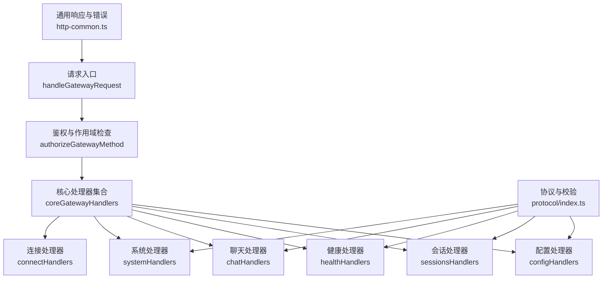
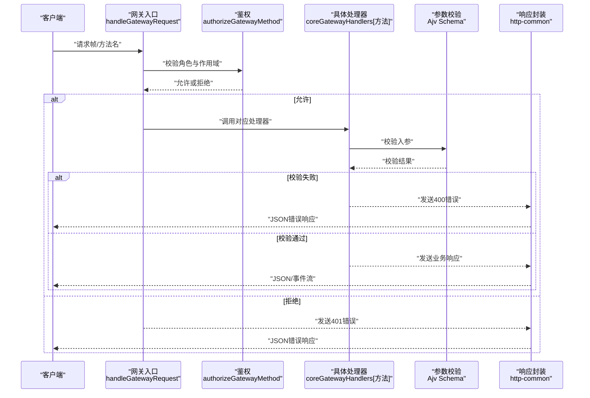
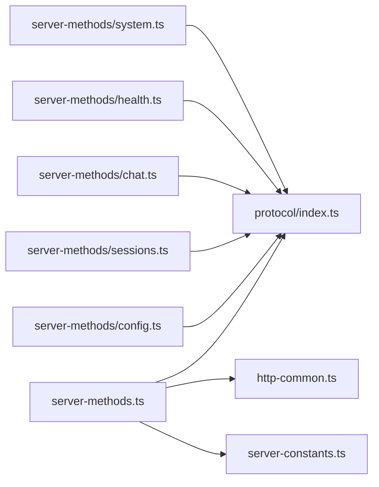

# HTTP API

## 目录
1. [简介](#简介)
2. [项目结构](#项目结构)
3. [核心组件](#核心组件)
4. [架构总览](#架构总览)
5. [详细组件分析](#详细组件分析)
6. [依赖关系分析](#依赖关系分析)
7. [性能考量](#性能考量)
8. [故障排查指南](#故障排查指南)
9. [结论](#结论)
10. [附录](#附录)

## 简介
本文件为 OpenClaw 网关 HTTP API 的权威文档，覆盖 RESTful 风格的请求/响应模型、认证与授权、核心功能端点（会话管理、工具调用、配置更新、状态查询）、错误处理策略、速率限制与版本控制等。文档以“方法名即端点”的方式组织，所有接口均通过统一的请求处理器分发与参数校验，并在必要处提供序列图与流程图帮助理解。

## 项目结构
OpenClaw 的 HTTP API 主要由以下模块构成：
- 请求分发与鉴权：统一入口负责方法名解析、权限校验与处理器路由
- 协议与校验：基于 Ajv 的参数 Schema 校验与错误格式化
- 功能处理器：按领域拆分（配置、会话、健康、聊天、系统等）
- 通用工具：JSON/SSE 响应、错误封装、负载读取等

## 核心组件
- 统一入口与分发
  - 入口函数负责鉴权、方法名匹配与调用对应处理器
  - 未知方法返回统一错误
- 鉴权与作用域
  - 基于客户端角色与作用域集合进行细粒度授权
  - 特定方法对节点角色有特殊限制
- 参数校验与错误格式化
  - 所有处理器均使用 Ajv Schema 校验入参
  - 错误信息统一为标准化结构
- 响应与错误
  - JSON 响应头 Content-Type: application/json; charset=utf-8
  - SSE 流式响应头 Content-Type: text/event-stream; charset=utf-8
  - 统一错误体包含 message 与 type 字段

## 架构总览
下图展示一次典型请求从接入到处理的全链路：

## 详细组件分析

### 认证与授权
- 支持的鉴权模式
  - Token 模式：通过 Authorization 头或自定义头携带令牌
  - 可选 Tailscale 身份放行（当允许时）
- 授权规则
  - 角色限定：仅 `operator` 可调用管理类方法
  - 作用域细分：admin、read、write、approvals、pairing
  - 特殊方法白名单与前缀限制
- 连接阶段
  - `connect` 方法仅作为握手首包有效；后续需按方法名调用

### 配置管理（`config.*`）
- 方法族
  - `config.get`：获取当前配置快照与哈希
  - `config.schema`：生成含插件与通道的配置 Schema
  - `config.set`：设置完整配置（需 baseHash）
  - `config.patch`：合并补丁（需 baseHash，支持重启调度）
  - `config.apply`：应用配置并触发重启调度
- 关键约束
  - 所有写操作必须携带正确的 baseHash，否则提示重新拉取
  - 写入前进行插件与 Schema 校验
  - 成功后可返回重启计划与哨兵信息

### 会话管理（`sessions.*`）
- 方法族
  - `sessions.list`：列出会话
  - `sessions.preview`：预览若干会话片段
  - `sessions.resolve`：解析会话键
  - `sessions.patch`：对会话条目打补丁
  - `sessions.reset`：重置会话计数与元数据
  - `sessions.delete`：删除会话与可选转录归档
  - `sessions.compact`：压缩会话转录行数
- 关键行为
  - 删除主会话受保护
  - `compact` 会清理 token 统计字段并保留最近 N 行
  - 删除时尝试停止子代理与嵌入式运行

### 健康与状态（health/status）
- `health`：获取健康快照，支持探测刷新与缓存
- `status`：获取系统状态摘要

### 聊天（`chat.*`）
- 方法族
  - `chat.history`：读取会话历史消息（带字节上限裁剪）
  - `chat.abort`：中止会话或指定 `runId` 的聊天运行
  - `chat.send`：发送消息（支持附件解析、幂等键、超时控制）
  - `chat.inject`：向转录注入一条助手消息
- 关键特性
  - 幂等去重与运行状态广播
  - 附件解析与图片内容处理
  - 超时与中止控制

### 系统与心跳（`system.*`）
- `last-heartbeat`：获取最近心跳事件
- `set-heartbeats`：启用/禁用心跳
- `system-presence`：列出系统存在性
- `system-event`：上报系统事件并广播变更

### 连接（`connect`）
- `connect`：仅作为握手首包有效，后续请按方法名调用

## 依赖关系分析
- 组件耦合
  - 请求入口与鉴权强耦合，确保方法级访问控制
  - 处理器依赖协议层的参数 Schema 与错误格式化
  - 通用响应工具被广泛复用
- 外部依赖
  - Ajv 用于参数校验
  - Node.js HTTP/WebSocket 服务栈

## 性能考量
- 连接与帧大小限制
  - 最大帧大小与每连接发送缓冲上限，避免内存压力
- 历史消息裁剪
  - 聊天历史消息按字节上限裁剪，防止过载
- 去重与幂等
  - 基于 `idempotencyKey` 的去重窗口与 TTL，减少重复计算
- 心跳与健康刷新
  - 健康快照刷新间隔与心跳周期可控

## 故障排查指南
- 401 未授权
  - 检查鉴权模式与令牌是否正确配置
  - 若使用 Tailscale，确认允许放行且身份匹配
- 400 参数无效
  - 校验错误信息中的定位与原因，修正入参
- 405 方法不允许
  - 确认使用了正确的 HTTP 方法与方法名
- SSE/流式响应
  - 确保客户端正确处理 text/event-stream 响应头与 keep-alive

## 结论
OpenClaw 的 HTTP API 采用统一入口、严格鉴权与 Schema 校验的设计，围绕配置、会话、健康、聊天与系统等核心领域提供清晰的方法族。通过标准化的错误与响应格式、合理的性能边界与幂等机制，满足生产环境下的稳定性与可维护性要求。

## 附录

### API 使用示例（概念性）
- 获取健康状态
  - 方法：GET 或 WebSocket 方法名 `health`
  - 请求体：无
  - 响应：健康快照对象
- 发送聊天消息
  - 方法：WebSocket 方法名 `chat.send`
  - 请求体：包含 `sessionKey`、`message`、`idempotencyKey` 等
  - 响应：运行状态与最终消息广播
- 应用配置补丁
  - 方法：WebSocket 方法名 `config.patch`
  - 请求体：包含 `baseHash`、`raw`（JSON5 字符串）等
  - 响应：新配置、重启计划与哨兵信息

### 错误响应结构
- 字段
  - `message`：错误描述
  - `type`：错误类型（如 `unauthorized`、`invalid_request_error`）