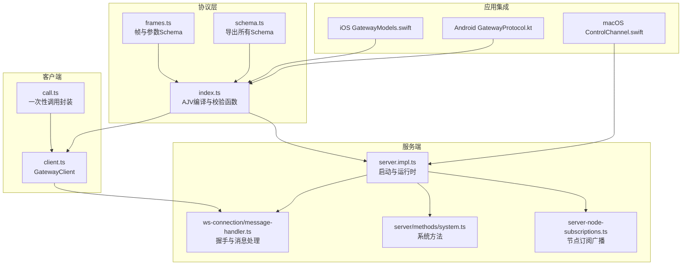
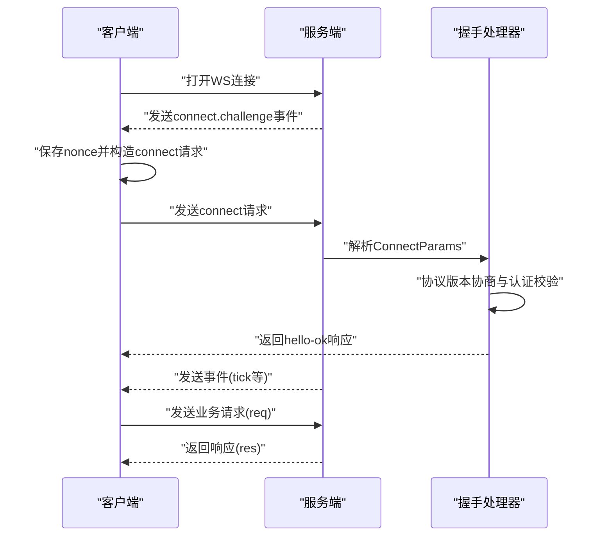
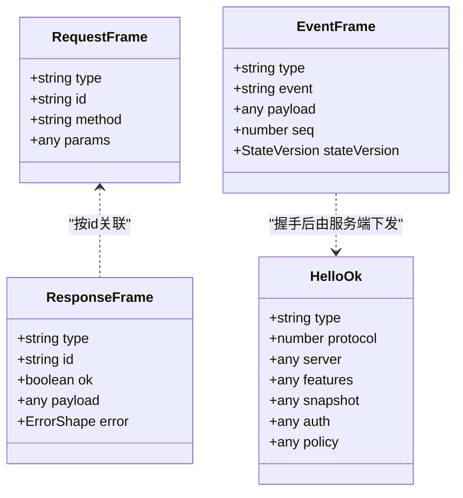
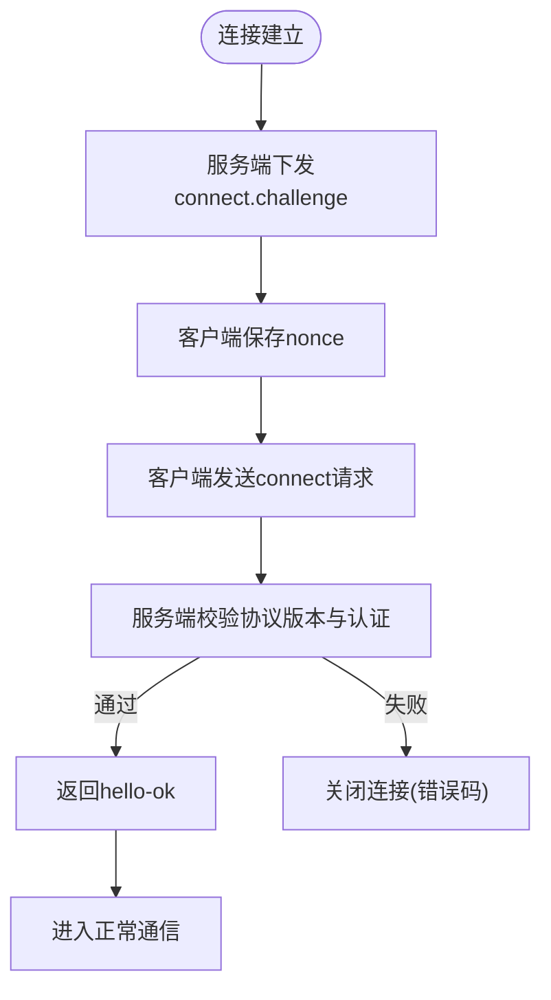
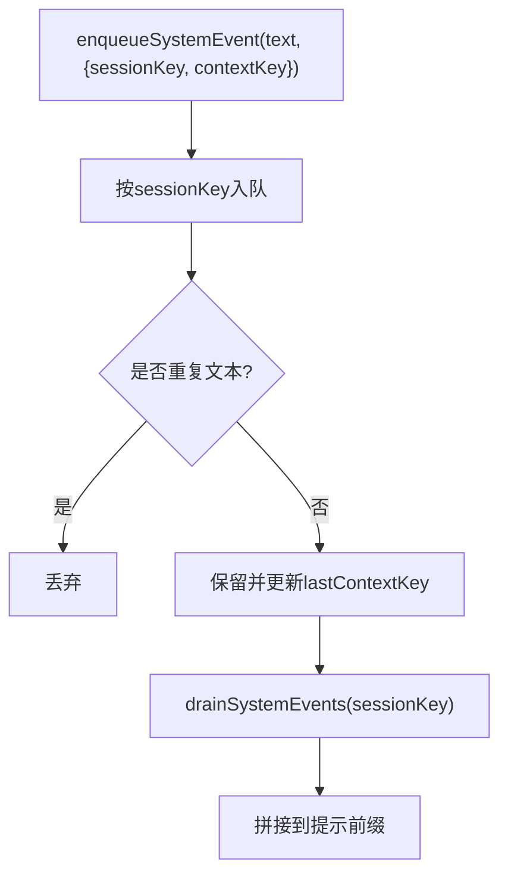
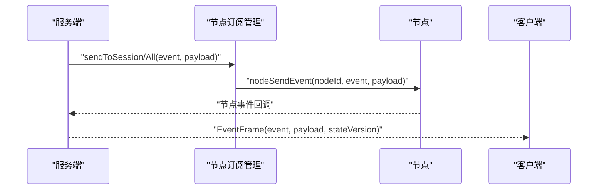
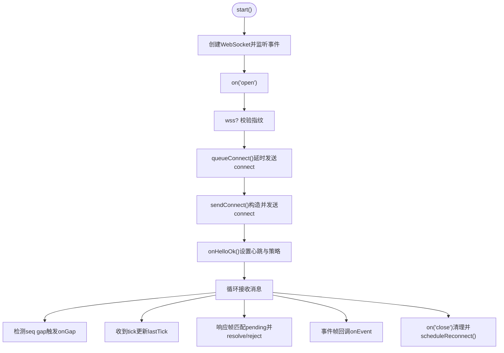
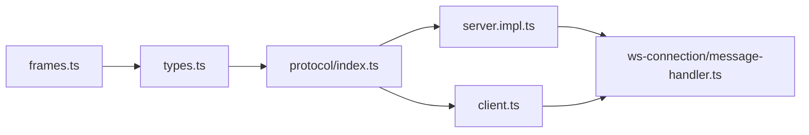

# WebSocket API

## 目录
1. [简介](#简介)
2. [项目结构](#项目结构)
3. [核心组件](#核心组件)
4. [架构总览](#架构总览)
5. [详细组件分析](#详细组件分析)
6. [依赖关系分析](#依赖关系分析)
7. [性能考量](#性能考量)
8. [故障排查指南](#故障排查指南)
9. [结论](#结论)
10. [附录](#附录)

## 简介
本文件为 OpenClaw WebSocket API 的权威技术文档，面向开发者与集成者，系统性阐述基于 JSON 的 WebSocket 协议设计与实现细节。内容涵盖：
- 连接建立流程：握手协议、认证机制、TLS 指纹校验与重连策略
- 消息格式规范：帧类型、负载结构、序列化与校验
- 事件类型体系：会话事件、工具事件、代理事件、系统事件
- 实时交互模式：双向通信、事件订阅、消息路由与状态同步
- 客户端实现要点：连接管理、错误处理、重连与性能优化
- 协议版本与兼容性：版本协商、向后兼容策略
- 调试与排障：常见错误码、日志与诊断建议

## 项目结构
OpenClaw 的 WebSocket API 位于 gateway 子系统，核心文件组织如下：
- 协议定义：在 `protocol` 目录下通过 TypeBox Schema 定义帧与参数类型，并导出校验函数
- 服务器端：启动与运行时状态管理、WS 连接接入、方法与事件分发
- 客户端：通用 JS 客户端实现，支持自动重连、心跳检测、TLS 指纹校验
- 事件与系统：系统事件队列、节点订阅与广播、控制通道集成

## 核心组件
- 协议与校验
  - 帧与参数通过 TypeBox Schema 定义，运行时使用 AJV 编译并校验
  - 导出 `validateXxx` 函数用于入站/出站数据校验
- 服务器端
  - 启动时构建运行时状态、注册插件与方法、挂载 WS 处理器
  - 握手阶段进行协议版本协商与设备/令牌认证
  - 广播事件、维护心跳与健康快照
- 客户端
  - 自动重连、指数退避、心跳超时检测
  - TLS 指纹校验（wss 场景）、连接挑战响应
  - 请求/响应与事件帧解析与回调

## 架构总览
WebSocket API 采用“请求-响应-事件”三类帧统一建模，客户端与服务端均通过 Schema 校验确保消息一致性。

## 详细组件分析

### 协议与消息格式
- 帧类型
  - `req`：请求帧，包含 `id`、`method`、`params`
  - `res`：响应帧，包含 `id`、`ok`、`payload` 或 `error`
  - `event`：事件帧，包含 `event`、`payload`、`seq`、`stateVersion`
- 关键字段
  - `id`：请求唯一标识，用于响应匹配
  - `seq`：事件序号，用于顺序性与断点检测
  - `stateVersion`：状态版本映射，用于增量同步
- 序列化与校验
  - 使用 JSON 字符串传输
  - 两端均通过 AJV Schema 校验，确保字段完整性与类型正确

### 连接建立与握手
- 握手流程
  - 服务端在连接建立后立即下发 `connect.challenge` 事件，携带 `nonce`
  - 客户端收到后回传 `connect` 请求，包含 `min`/`maxProtocol`、`client` 信息、可选 `auth`/`device`
- 协议版本协商
  - 服务端检查 `min`/`maxProtocol` 与当前 `PROTOCOL_VERSION` 是否有交集
  - 不兼容则返回 `INVALID_REQUEST` 并关闭连接
- 认证与设备签名
  - 支持 `token`/`password` 与设备签名（`device` 字段）
  - 设备签名包含 `id`/`publicKey`/`signature`/`signedAt`/`nonce`
  - 非本地客户端要求提供 `nonce`，过期或不匹配将拒绝

### 认证与安全
- 设备认证
  - 客户端生成设备载荷并签名，服务端验证签名时间戳与指纹
  - 支持设备令牌下发（`hello-ok.auth.deviceToken`），客户端可缓存
- TLS 指纹校验
  - wss 场景下可配置 `tlsFingerprint`，客户端在握手后再次校验证书指纹
- 会话与权限
  - 可指定 `role`/`scopes`/`permissions`，用于细粒度授权

### 事件类型系统
- 事件分类
  - 会话事件：与会话生命周期、消息流转相关的事件
  - 工具事件：节点/工具执行状态变化
  - 代理事件：智能体运行、等待、事件推送
  - 系统事件：心跳、关机、系统提示等
- 系统事件队列
  - 内存队列，按会话键隔离，避免泄漏
  - 支持去重、上下文键变更检测、批量取出

### 实时交互与消息路由
- 双向通信
  - 客户端通过 `request` 发起请求，服务端返回响应
  - 服务端通过事件帧推送状态与通知
- 事件订阅
  - 节点订阅管理器支持按会话/节点维度订阅与广播
  - 支持对所有订阅者广播与按会话定向推送
- 状态同步
  - 事件帧包含 `stateVersion`，客户端可据此增量更新本地状态

### 客户端实现要点
- 连接管理
  - 自动重连：指数退避，最大延迟限制
  - 心跳检测：定期检查 `lastTick`，超时主动关闭
  - TLS 指纹校验：仅在 wss 且提供指纹时启用
- 错误处理
  - 统一错误描述与关闭码提示
  - 连接失败回调与关闭回调区分处理
- 性能优化
  - 允许较大消息体（如屏幕快照）
  - 事件序号 `gap` 回调，便于诊断丢包

### 协议版本与兼容性
- 版本协商
  - 客户端在 `connect` 中声明 `min`/`maxProtocol`
  - 服务端要求两者与当前 `PROTOCOL_VERSION` 有交集
- 兼容性策略
  - 服务端通过错误码与关闭原因明确“协议不匹配”
  - 客户端在 `PROBE` 模式下记录调试信息

### 应用集成示例与模型
- iOS/macOS
  - 通过 Swift 结构体映射事件帧与 `PresenceEntry`
  - 控制通道通过 `subscribe` 流式接收事件
- Android
  - 定义常量 `GATEWAY_PROTOCOL_VERSION` 用于版本对齐
- 通用模型
  - `EventFrame`、`HelloOk`、`ErrorShape` 等在多语言中复用

## 依赖关系分析
- 协议层
  - `schema/frames.ts` 定义帧与参数
  - `schema/types.ts` 汇总类型别名
  - `protocol/index.ts` 导出 AJV 校验函数
- 服务器端
  - `server.impl.ts` 负责启动、注册方法与事件、挂载 WS 处理器
  - `ws-connection/message-handler.ts` 实现握手与消息处理
- 客户端
  - `client.ts` 提供 `GatewayClient`，封装连接、重连、心跳、校验
  - `call.ts` 提供一次性请求封装（CLI/工具场景）

## 性能考量
- 大消息支持
  - 客户端允许最大 25MB 的消息体，适合屏幕快照等场景
- 心跳与保活
  - 服务端周期性发送 `tick`，客户端检测超时并主动关闭
  - 可根据 `hello-ok.policy.tickIntervalMs` 动态调整
- 广播与节流
  - 广播接口支持 `dropIfSlow` 参数，避免慢消费者拖垮整体
- 订阅与路由
  - 节点订阅按会话/节点维度管理，减少无谓广播

## 故障排查指南
- 常见错误码与含义
  - 1000：正常关闭
  - 1006：异常关闭（无关闭帧）
  - 1008：策略违规（如认证失败、协议不匹配）
  - 1012：服务重启
- 排查步骤
  - 检查协议版本范围是否与服务端一致
  - 确认 `connect.challenge` 是否成功收到并回传
  - 若使用 wss，确认 `tlsFingerprint` 与服务端证书一致
  - 观察心跳是否持续，超时将导致连接被关闭
  - 使用 `onGap` 回调定位丢包区间

## 结论
OpenClaw WebSocket API 以清晰的帧模型与严格的 Schema 校验为基础，提供了稳定可靠的实时通信能力。通过完善的握手与认证流程、事件订阅与状态同步机制，以及跨平台的客户端实现，能够满足多场景下的集成需求。遵循本文档的协议规范与最佳实践，可获得更稳健的连接质量与更高的开发效率。

## 附录
- 示例帧参考
  - `Connect` 请求与 `Hello-ok` 响应、`Request`/`Response`、`Event` 帧均有示例
- 输出格式与负载结构
  - 事件帧 `payload` 与 `stateVersion` 用于增量同步
  - 系统事件通过内存队列按会话键管理，避免泄漏