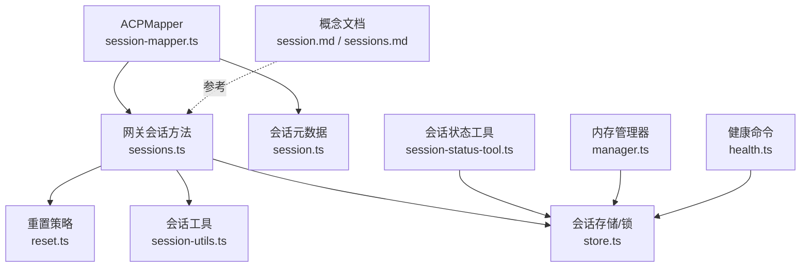
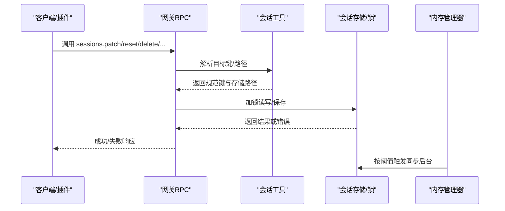
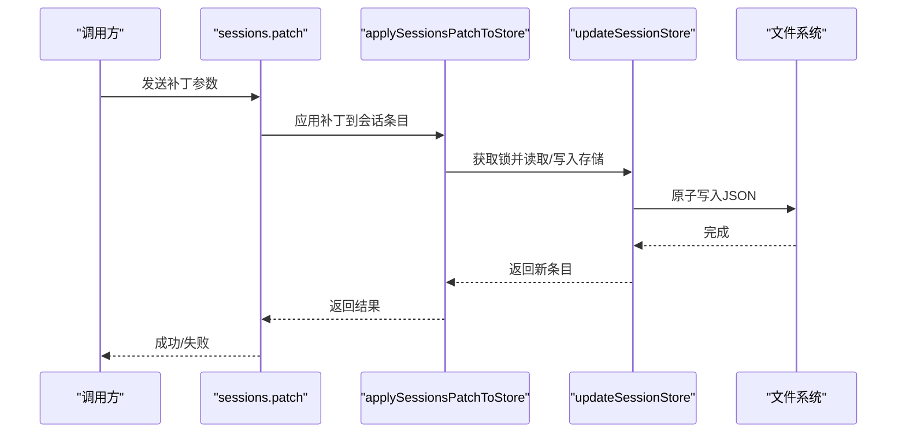
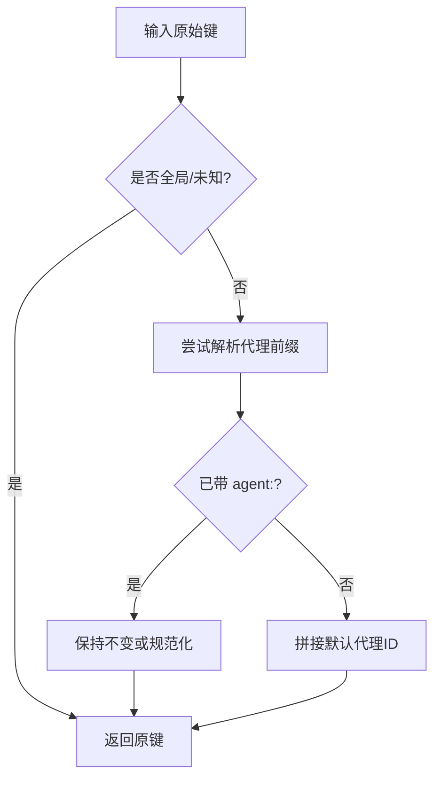
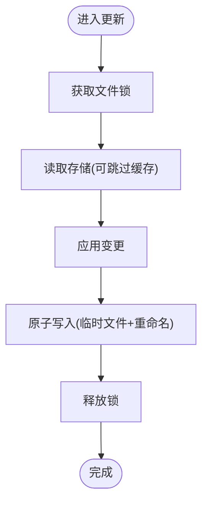
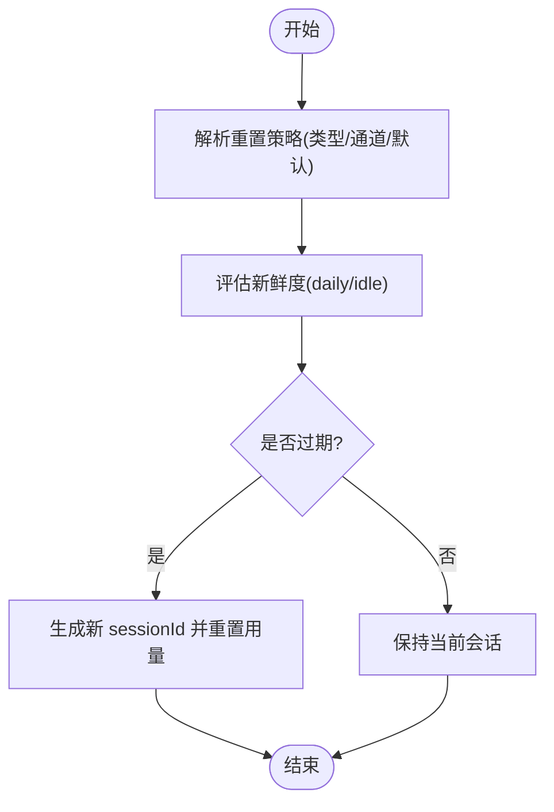
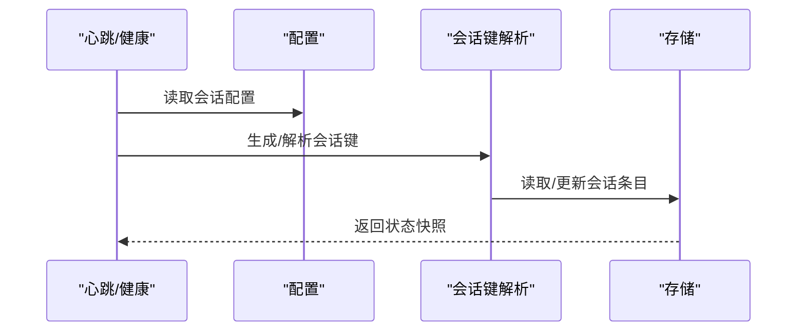
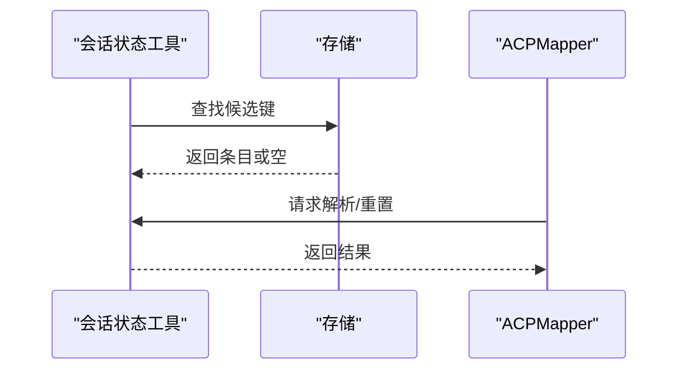
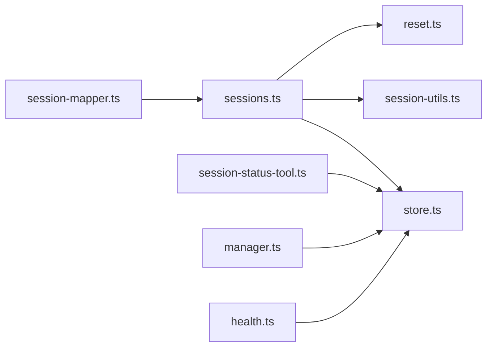

# 会话管理 API

## 目录
1. [简介](#简介)
2. [项目结构](#项目结构)
3. [核心组件](#核心组件)
4. [架构总览](#架构总览)
5. [详细组件分析](#详细组件分析)
6. [依赖关系分析](#依赖关系分析)
7. [性能考量](#性能考量)
8. [故障排查指南](#故障排查指南)
9. [结论](#结论)
10. [附录：完整使用示例与最佳实践](#附录完整使用示例与最佳实践)

## 简介
本文件系统性梳理 OpenClaw 的会话管理 API，覆盖会话生命周期（创建、状态转换、重置与销毁）、会话键生成与路由、状态同步与一致性、隔离与安全、以及可观测性与运维实践。内容以代码为依据，辅以图示帮助不同背景读者理解。

## 项目结构
围绕“会话”的关键模块分布如下：
- 网关侧会话 API：提供统一的 RPC 方法，负责会话列表、预览、解析、补丁更新、重置、删除、压缩等能力
- 会话存储与锁：提供本地 JSON 存储、缓存、原子写入与并发锁
- 会话重置策略：按类型/通道/每日/空闲策略评估新鲜度
- 会话工具与映射：支持通过标签/键解析、重置触发、状态查询
- 运行期同步与健康：内存管理器按阈值触发同步；健康命令汇总会话统计
- 文档与 CLI：概念文档、CLI 列表会话

## 核心组件
- 网关会话 RPC 方法：提供 `sessions.list`、`sessions.preview`、`sessions.resolve`、`sessions.patch`、`sessions.reset`、`sessions.delete`、`sessions.compact`
- 会话存储与锁：`load`/`update`/`save`、带 TTL 缓存、文件锁保证并发安全
- 会话重置策略：按类型/通道/每日/空闲策略计算新鲜度
- 会话键解析与路由：跨通道/主键别名/默认代理 ID 规范化
- 会话工具与映射：标签/键解析、重置触发、状态查询
- 内存同步与健康：阈值驱动同步、会话统计

## 架构总览
下图展示从客户端/插件到网关，再到会话存储与锁的端到端调用链路。

## 详细组件分析

### 1) 会话生命周期 API
- `sessions.list`：列出会话，支持过滤与排序
- `sessions.preview`：按键批量预览最近摘要
- `sessions.resolve`：解析标签/键到规范键
- `sessions.patch`：对指定键应用补丁（含模型目录加载）
- `sessions.reset`：重置会话（生成新 `sessionId`，清零用量）
- `sessions.delete`：删除会话条目，必要时归档转录文件，停止子代理与嵌入式运行
- `sessions.compact`：按最大行数压缩转录文件，保留最新若干行

### 2) 会话键生成与路由
- 键规范化：支持全局/未知键、代理前缀、主键别名（`main`/`mainKey`）等
- 默认代理 ID：根据配置解析默认代理
- 主键别名解析：将 `"main"`/`"mainKey"` 规范化为 `agent:<agentId>:<mainKey>`
- 通道/账号/线程标识：在组聊/论坛主题/频道中区分隔离键

### 3) 会话状态同步与一致性
- 存储缓存：TTL 控制，`mtime` 校验，避免脏读
- 并发写入：基于文件锁的互斥访问，超时与过期清理
- 原子写入：临时文件 + 重命名，Windows 下回退直写
- 内存阈值驱动同步：按字节/消息数量阈值触发同步

### 4) 会话重置策略与超时处理
- 重置模式：`daily`（每日）或 `idle`（空闲）
- 重置时间：默认凌晨 4 点，可按通道/类型覆盖
- 新鲜度评估：比较 `updatedAt` 与 `daily`/`idle` 截止时间
- 兼容行为：未显式配置时沿用 `legacy idleMinutes`

### 5) 会话路由与负载均衡/故障转移
- 路由规则：基于消息上下文（通道、账号、线程、群组）生成会话键
- 负载均衡：通过多通道/多账号映射同一主键实现跨通道连续性
- 故障转移：心跳与健康命令监控会话活跃度，异常时可触发重置/重建

### 6) 会话状态查询与工具调用
- 标签/键解析：支持多候选键匹配，包含默认代理前缀与 `main` 别名
- 状态查询：通过工具函数在存储中查找对应条目
- 重置触发：ACPMapper 支持按元数据触发 `sessions.reset`

### 7) 会话隔离策略（多租户/资源/安全/审计）
- 多租户隔离：按 `agentId`/通道/账号/线程维度隔离键空间
- 资源限制：通过重置策略（空闲/每日）与压缩（`sessions.compact`）控制存储增长
- 安全边界：文件权限设置（仅所有者可读写），锁文件防止并发破坏
- 审计日志：删除会话时归档转录文件，便于审计追踪

## 依赖关系分析
- 网关方法依赖会话工具进行键解析与存储路径定位
- 存储层依赖锁与缓存策略保障一致性与性能
- 重置策略贯穿会话创建/更新/重置流程
- 工具与映射模块为上层（如 ACP）提供解析与重置能力
- 内存管理器与健康命令提供可观测性与维护支撑

## 性能考量
- 存储缓存：启用 TTL 缓存减少磁盘 IO；`mtime` 校验避免陈旧缓存
- 文件锁：序列化并发写入，避免竞争与损坏
- 原子写入：临时文件 + 重命名，降低部分写风险
- 同步阈值：按字节/消息阈值触发同步，平衡实时性与开销
- 会话压缩：定期压缩转录文件，控制存储膨胀

## 故障排查指南
- 无法获取会话锁：检查锁文件是否存在且过期，确认进程是否异常退出
- 会话为空或缺失：确认键解析是否正确，检查存储路径与文件权限
- 删除失败：若会话仍处于活动状态（子代理/嵌入式运行），需等待其结束或强制终止
- 重置无效：核对重置策略（类型/通道/每日/空闲），确认 `atHour` 与 `idleMinutes` 配置
- 健康异常：通过健康命令查看最近会话统计，定位存储路径与缓存问题

## 结论
OpenClaw 的会话管理 API 以“键规范化 + 存储锁 + 策略评估 + 工具链”为核心，实现了跨通道、多代理、可扩展的会话生命周期管理。通过 TTL 缓存、原子写入与阈值同步，兼顾性能与一致性；通过重置策略与压缩，控制资源占用；通过解析/重置/预览/删除等 RPC，提供完善的可观测与运维能力。

## 附录：完整使用示例与最佳实践

### 示例一：创建/查询/重置/删除会话
- 创建/更新：调用 `sessions.patch`，传入目标键与补丁字段
- 查询：`sessions.preview` 批量预览摘要；或 `sessions.resolve` 解析键
- 重置：`sessions.reset` 清空用量并生成新 `sessionId`
- 删除：`sessions.delete` 删除条目并可选归档转录

### 示例二：按通道/类型重置策略
- 配置 `resetByType` 或 `resetByChannel`，针对 DM/群组/话题设定不同策略
- 使用 `evaluateSessionFreshness` 判断是否需要重置

### 示例三：会话键解析与路由
- 使用 `resolveSessionStoreKey` 将 `"main"`/`"mainKey"` 规范化为 `agent:<agentId>:<mainKey>`
- 心跳与健康命令结合上下文生成/解析会话键

### 示例四：状态查询与工具调用
- 通过 `session-status-tool` 在存储中查找候选键
- ACP 映射器支持按标签/键解析并触发重置

### 示例五：监控与 CLI
- CLI `openclaw sessions` 列出会话与最近活动
- 健康命令汇总各代理会话统计

### 最佳实践
- 合理设置重置策略：高频 DM 用 `idle`，长对话用 `daily`
- 开启 TTL 缓存：提升读性能，注意 `mtime` 变更
- 使用文件锁与原子写入：避免并发写入冲突
- 定期压缩转录：控制存储占用
- 严格权限：确保会话存储文件仅所有者可读写