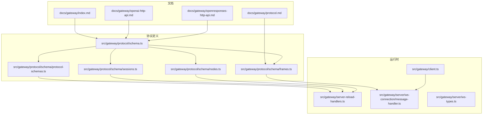
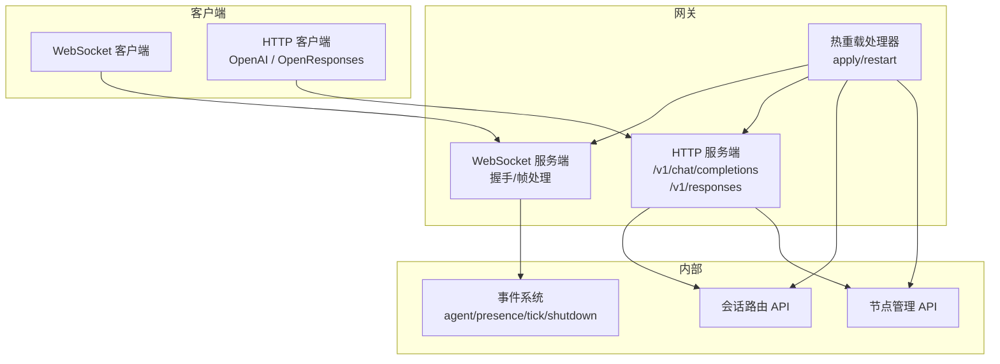
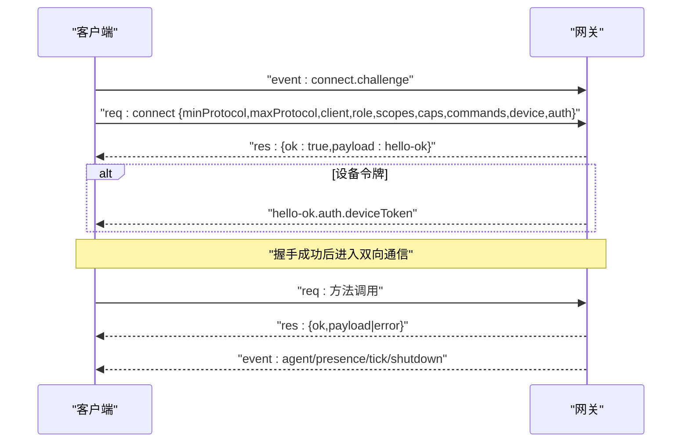
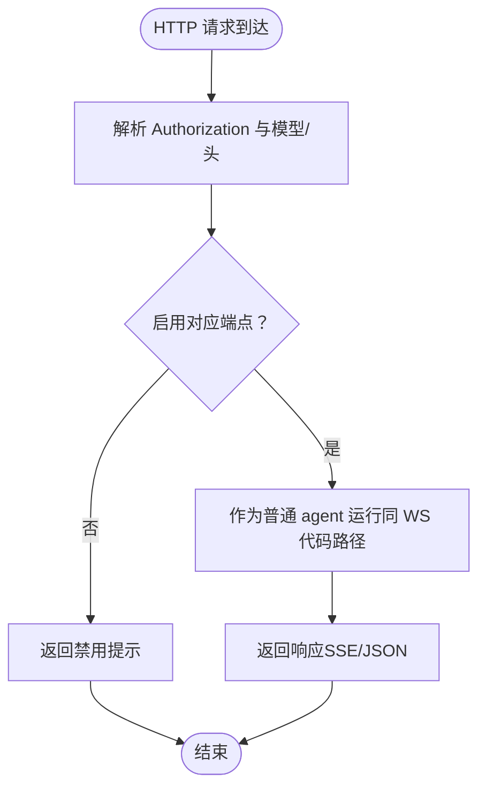
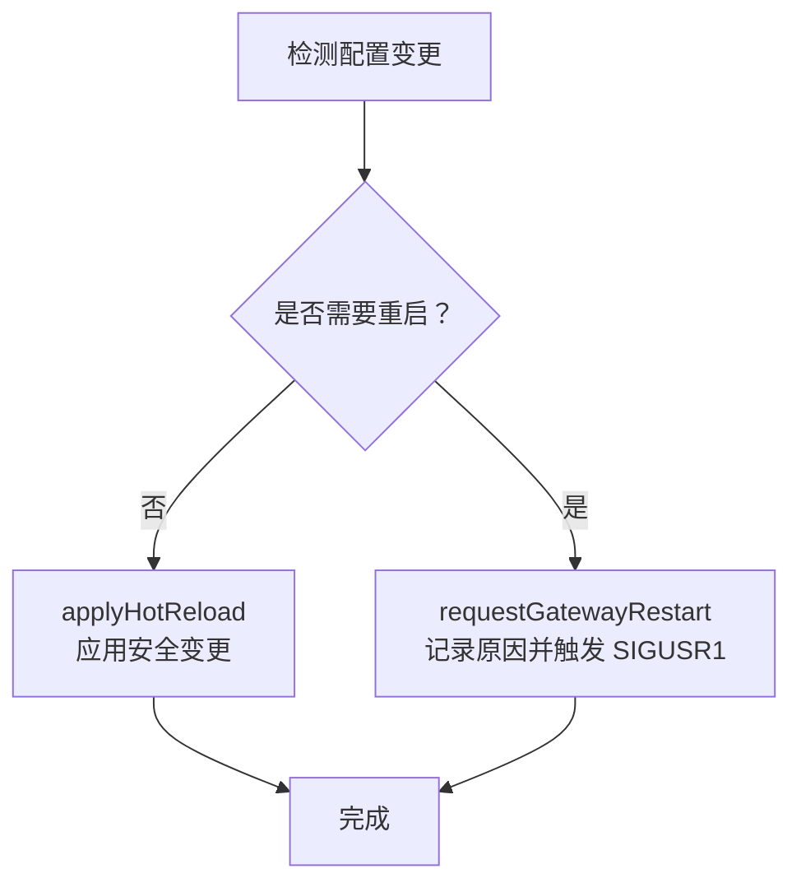
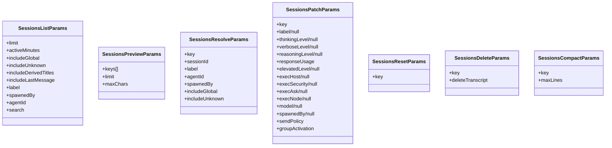
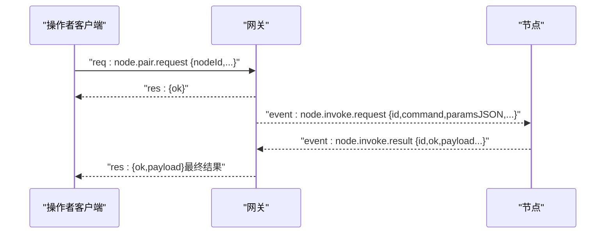
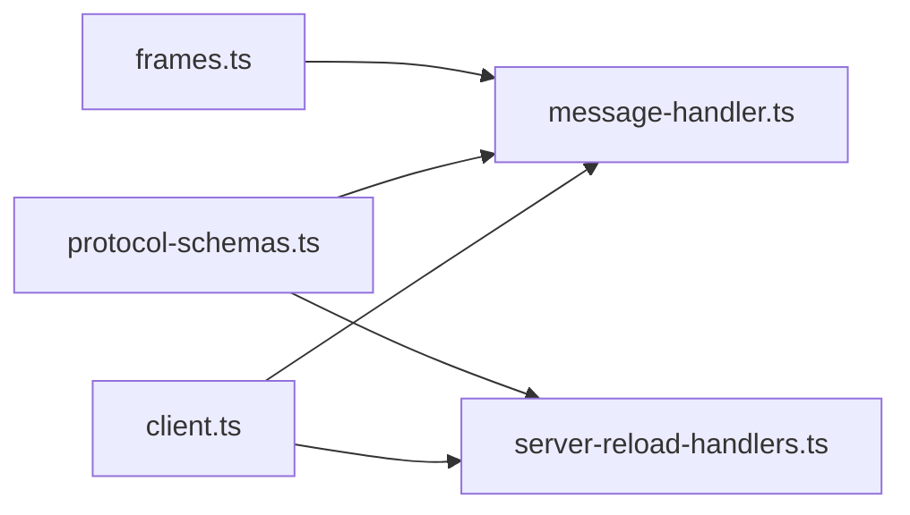

# 网关控制平面

## 目录
1. [简介](#简介)
2. [项目结构](#项目结构)
3. [核心组件](#核心组件)
4. [架构总览](#架构总览)
5. [详细组件分析](#详细组件分析)
6. [依赖关系分析](#依赖关系分析)
7. [性能考量](#性能考量)
8. [故障排查指南](#故障排查指南)
9. [结论](#结论)
10. [附录](#附录)

## 简介
本文件为 OpenClaw 网关控制平面的权威 API 文档，覆盖 WebSocket 协议规范（连接建立、消息格式、事件类型与实时交互）、HTTP API（OpenAI 兼容接口与 OpenResponses 兼容接口）、配置管理 API（热重载机制、配置验证与变更传播）、会话路由 API（会话创建、状态管理与生命周期控制），并提供协议版本信息、迁移指南、向后兼容性说明、客户端实现要点、性能优化建议与调试工具。

## 项目结构
- 文档层：位于 docs/gateway 下，包含协议、HTTP API、运行手册等文档。
- 协议定义层：位于 src/gateway/protocol/schema 下，以 TypeBox 定义协议帧、方法参数、事件与错误码，并导出协议版本常量。
- 运行时实现层：位于 src/gateway 下，包含 WebSocket 服务端、客户端、热重载处理器等。
- 客户端测试与示例：位于 apps/macos/Tests/OpenClawIPCTests 中，演示事件序列、gap 检测与订阅行为。

## 核心组件
- WebSocket 控制平面协议：定义帧类型、握手流程、角色与作用域、设备身份与配对、认证与 TLS 固定、版本协商与错误码。
- HTTP API：OpenAI Chat Completions 兼容端点与 OpenResponses 兼容端点，支持通过 Authorization Bearer Token 认证。
- 配置管理 API：热重载处理器负责应用安全变更、重启心跳、重置目录缓存、更新钩子配置与通道启停，并在必要时触发进程内重启。
- 会话路由 API：提供会话列表、预览、解析、补丁更新、重置、删除与压缩等能力，支持标签、代理、权限与策略字段。
- 节点管理 API：节点配对生命周期（请求、列表、批准、拒绝、校验）、节点描述、命令调用与事件上报。
- 客户端与服务端：客户端选项与关闭码提示、服务端握手与协议版本校验、事件序列号与 gap 检测。

## 架构总览
下图展示控制平面的端到端交互：客户端通过 WebSocket 连接网关，经由协议帧完成握手与认证；HTTP 客户端通过同端口的多路复用暴露 OpenAI/OpenResponses 端点；配置变更通过热重载处理器应用或触发重启；会话与节点 API 由协议帧承载。

## 详细组件分析

### WebSocket 协议规范
- 传输与帧格式
  - 文本帧，JSON 结构化。
  - 首帧必须为 `connect` 请求。
  - 帧类型：`req`（请求）、`res`（响应）、`event`（事件）。
- 握手与认证
  - 预握手事件 `connect.challenge` 后，客户端发送 `connect.params`，包含 `minProtocol`/`maxProtocol`、`client` 信息、`role`/`scopes`、`caps`/`commands`/`permissions`、`device` 身份与 `auth` 凭据。
  - 服务器返回 `res.ok=true` 与 `hello-ok`，其中包含协议版本、`features`、`snapshot`、`policy` 与可选 `auth.deviceToken`。
  - 设备身份要求：所有 WS 客户端在 `connect` 时必须携带 `device`；控制 UI 可在特定配置下豁免。
  - TLS 支持，客户端可选择证书指纹固定。
- 角色与作用域
  - `operator`：控制平面客户端（CLI/UI/自动化）。
  - `node`：能力宿主（摄像头/屏幕/画布/`system.run`）。
  - `operator` 的常见作用域：`operator.read`、`operator.write`、`operator.admin`、`operator.approvals`、`operator.pairing`。
- 事件与实时交互
  - 事件类型：`agent`、`presence`、`tick`、`shutdown`。
  - `presence` 事件携带 `stateVersion`，用于增量更新；事件含 `seq` 序列号，客户端检测 gap 并自动刷新。
- 错误与关闭
  - `res.error` 形态包含 `code`、`message`、`details`、`retryable`、`retryAfterMs`。
  - 关闭码提示：1000 正常关闭、1006 异常关闭、1008 策略违规、1012 服务重启。
- 版本与兼容
  - `PROTOCOL_VERSION` 由协议定义导出，客户端 `min`/`max` 必须与服务器匹配，否则拒绝并关闭连接。

### HTTP API（OpenAI 兼容与 OpenResponses 兼容）
- 端点与端口
  - `/v1/chat/completions`（OpenAI 兼容）
  - `/v1/responses`（OpenResponses 兼容）
  - 与 WebSocket 同端口多路复用。
- 认证
  - 使用 Bearer Token，来源于网关认证配置（`token` 或 `password`）。
- 代理与会话控制
  - 通过 `model` 字段或自定义头指定 `agent`；可通过 `x-openclaw-session-key` 精确控制会话路由。
- 启用与禁用
  - 通过配置项 `gateway.http.endpoints.chatCompletions.enabled` 与 `responses.enabled` 开关。

### 配置管理 API（热重载、验证与传播）
- 热重载策略
  - `hybrid` 模式：安全变更就地应用，关键变更触发进程内重启（SIGUSR1）。
  - 支持 `hooks` 配置重载、心跳重启、目录缓存重置、通道启停。
- 变更检测与重启
  - 当检测到需要重启的变更，记录原因并触发 SIGUSR1；若未注册监听则跳过。
- 传播范围
  - 影响：钩子、心跳、目录缓存、通道、日志与定时任务等子系统。

### 会话路由 API
- 方法与参数
  - 列表：`SessionsListParams`（支持 `limit`、`activeMinutes`、`includeGlobal`/`Unknown`、派生标题与预览、标签、`spawnedBy`、`agentId`、`search`）。
  - 预览：`SessionsPreviewParams`（`keys`、`limit`、`maxChars`）。
  - 解析：`SessionsResolveParams`（`key`/`sessionId`/`label`/`agentId`/`spawnedBy`/`include*`）。
  - 补丁更新：`SessionsPatchParams`（标签、思维/推理/verbose 等级别、执行策略、模型、分组激活策略等）。
  - 重置/删除/压缩：`SessionsResetParams`、`SessionsDeleteParams`、`SessionsCompactParams`。
- 生命周期控制
  - 通过补丁更新动态调整会话策略与元数据；删除可选择是否同时删除转录；压缩减少存储占用。
- 与客户端的交互
  - 客户端订阅事件流，基于 `seq` 检测 gap 并在缺失时刷新健康与存在状态。

### 节点管理 API
- 配对生命周期
  - 请求：`NodePairRequestParams`（`nodeId`、`displayName`、`platform`、`version`、`core`/`uiVersion`、`deviceFamily`、`modelIdentifier`、`caps`、`commands`、`remoteIp`、`silent`）。
  - 列表：`NodePairListParams`。
  - 批准/拒绝：`NodePairApproveParams`、`NodePairRejectParams`。
  - 校验：`NodePairVerifyParams`（`nodeId`、`token`）。
  - 重命名：`NodeRenameParams`。
- 能力与命令
  - `NodeDescribeParams`（`nodeId`）。
  - `NodeInvokeParams`（`nodeId`、`command`、`params`、`timeoutMs`、`idempotencyKey`）。
  - `NodeInvokeResultParams`（`id`、`nodeId`、`ok`、`payload`/`payloadJSON`、`error`）。
  - `NodeEventParams`（`event`、`payload`/`payloadJSON`）。
  - `NodeInvokeRequestEvent`（`id`、`nodeId`、`command`、`paramsJSON`、`timeoutMs`、`idempotencyKey`）。

### 客户端实现要点与调试
- 客户端选项
  - 支持 `token`/`password`、实例标识、客户端名称/显示名/版本、平台、模式、角色/作用域、能力/命令/权限、设备身份、协议版本范围、TLS 指纹、事件回调、连接错误回调、关闭回调与 gap 回调。
- 事件与 gap 检测
  - 事件含 `seq`；当出现 `seq` 缺失时，客户端应刷新健康与存在状态。
- 关闭码提示
  - 常见码：1000（正常）、1006（异常）、1008（策略违规）、1012（服务重启）。

## 依赖关系分析
- 协议定义
  - `protocol-schemas.ts` 导出 `PROTOCOL_VERSION` 与所有协议 Schema，供服务端校验与生成类型。
  - `frames.ts` 定义帧结构与错误形态，供消息处理器使用。
- 服务端实现
  - `message-handler.ts` 在握手阶段校验协议版本，不匹配则拒绝并关闭。
  - `server-reload-handlers.ts` 依据变更计划应用或重启。
- 客户端
  - `client.ts` 提供连接选项与关闭码提示，便于上层实现健壮的重连与错误处理。

## 性能考量
- 事件与负载
  - 控制平面适合小消息；媒体密集型场景建议独立流式端点或持久化桥接。
- 背压与缓冲
  - `hello-ok.policy` 提供 `maxPayload`、`maxBufferedBytes`、`tickIntervalMs`，客户端据此渲染与节流。
- 重连与心跳
  - `tick` 事件用于保活；客户端应避免将心跳误用作发送确认。
- 端口与多路复用
  - 同端口提供 WS 与 HTTP，减少网络开销与 NAT/Nginx 配置复杂度。

## 故障排查指南
- 连接失败
  - 协议不匹配：检查 `minProtocol`/`maxProtocol` 是否与服务器 `PROTOCOL_VERSION` 匹配。
  - 设备身份缺失：确保 `connect.params.device` 存在，非本地连接需签名挑战 `nonce`。
  - 认证失败：确认 Authorization Bearer Token 与网关配置一致。
- 事件 gap
  - 检测到 `seq` 缺失时，先刷新 `health` 与 `system-presence`，再继续处理后续事件。
- 重启与热重载
  - 若配置变更导致重启，关注日志中的重启原因；如未触发重启，检查是否存在 SIGUSR1 监听器。
- 关闭码
  - 1012 服务重启属于预期；1006 异常关闭需检查网络与客户端实现。

## 结论
本文档系统梳理了 OpenClaw 网关控制平面的 WebSocket 协议、HTTP 兼容端点、配置热重载、会话与节点管理 API，并提供了版本信息、迁移建议与故障排查要点。遵循本文档的实现与集成方式，可获得稳定、可观测且可扩展的控制平面体验。

## 附录

### 协议版本与迁移
- 协议版本：`PROTOCOL_VERSION` 由协议定义导出，客户端需在 `connect.params` 中声明 `min`/`maxProtocol` 并与服务器匹配。
- 迁移建议：逐步升级客户端至最新协议版本；在混合环境中保留向后兼容的 `minProtocol` 以平滑过渡。

### 向后兼容性说明
- 服务器对每个入站帧使用 AJV 基于协议 Schema 进行严格校验；客户端消费由协议定义生成的类型。
- 旧版客户端可继续工作，但建议尽快升级以获得新特性与修复。