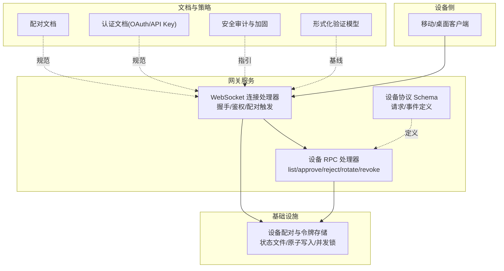
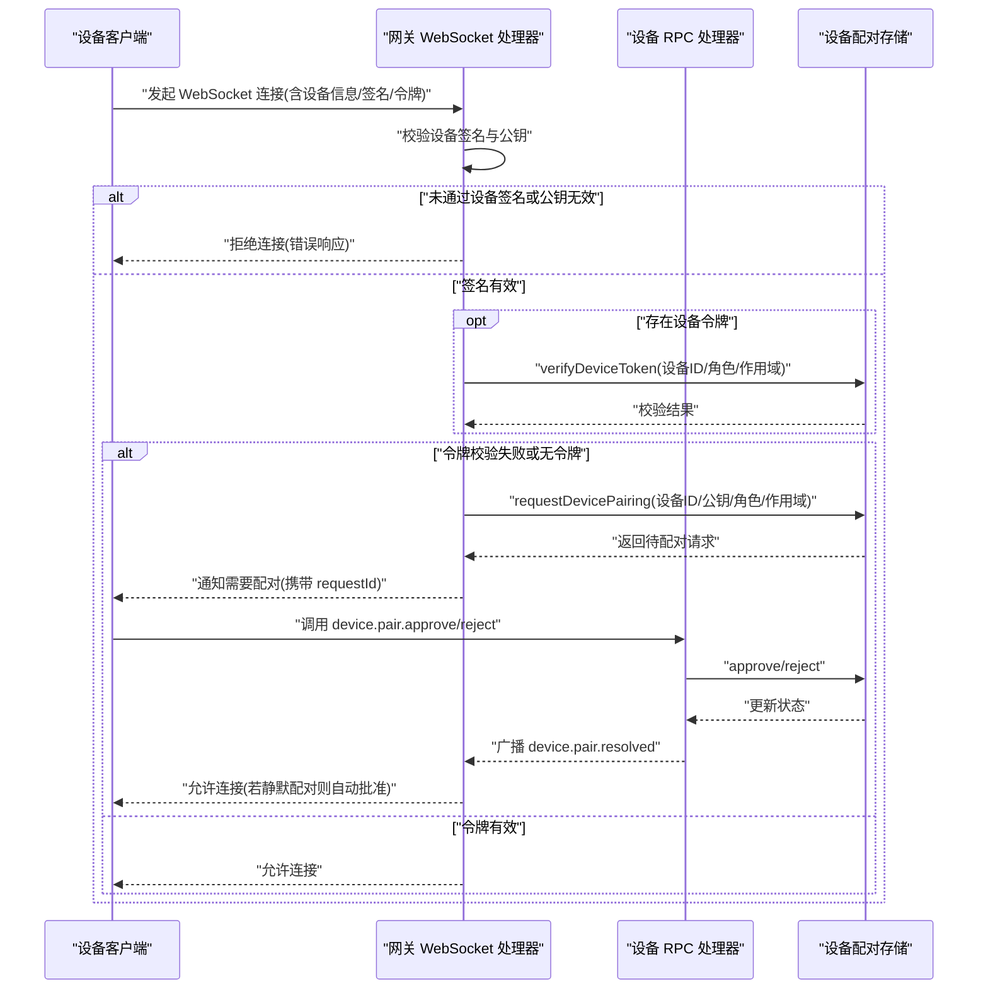
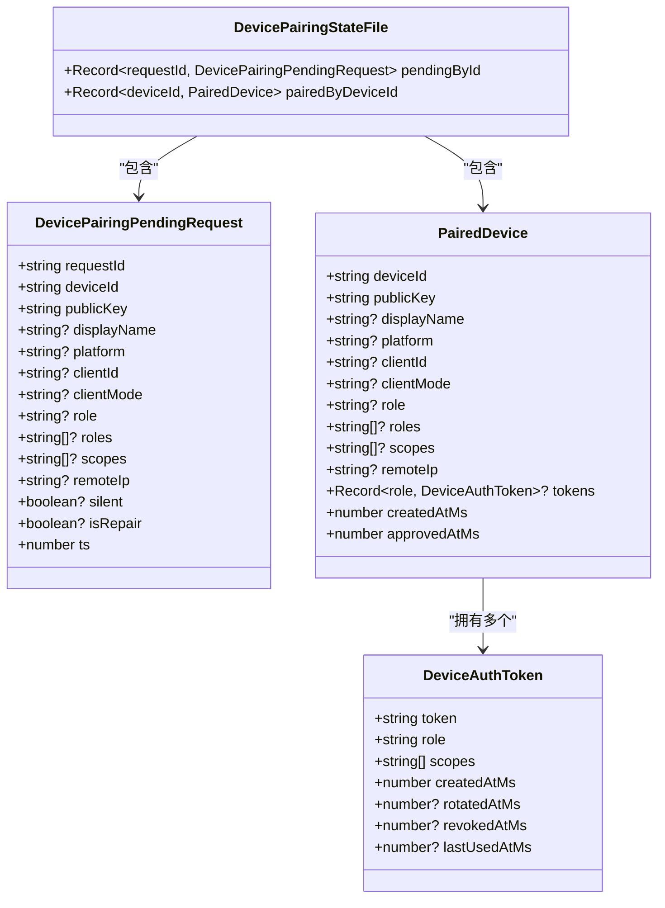
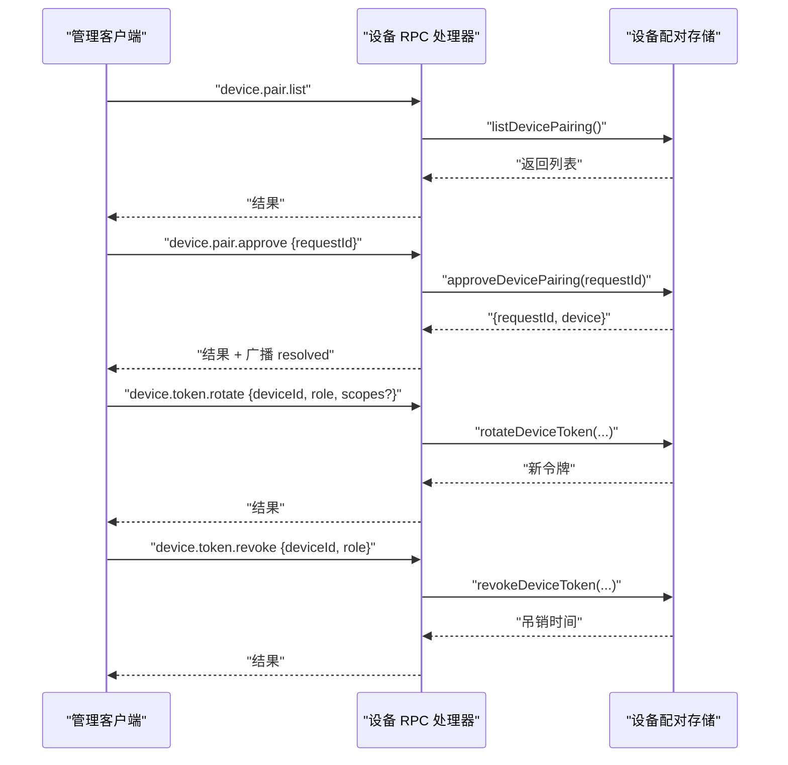
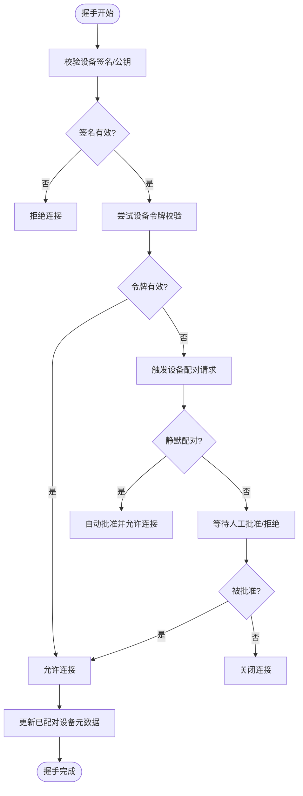
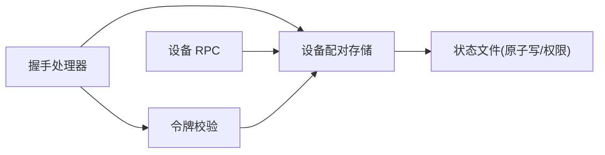

# 认证与授权

## 目录
1. [简介](#简介)
2. [项目结构](#项目结构)
3. [核心组件](#核心组件)
4. [架构总览](#架构总览)
5. [详细组件分析](#详细组件分析)
6. [依赖关系分析](#依赖关系分析)
7. [性能考量](#性能考量)
8. [故障排查指南](#故障排查指南)
9. [结论](#结论)
10. [附录](#附录)

## 简介
本文件面向 OpenClaw 的认证与授权体系，围绕以下目标展开：
- 设备认证与令牌管理：设备配对、令牌签发/轮换/吊销、会话握手与鉴权
- 用户认证与授权：OAuth、API Key、会话隔离与访问控制
- 安全策略：加密传输、数据保护、审计与合规
- 配对流程：配对协议、密钥交换、信任建立与撤销
- 实践与范式：认证集成、权限检查、安全配置与威胁防护

文档以代码为依据，结合仓库中的官方文档与安全策略，提供可操作的 API 说明、流程图与时序图，并给出最佳实践与应急响应建议。

## 项目结构
与认证授权直接相关的核心模块与文档如下：
- 设备配对与令牌管理：`src/infra/device-pairing.ts`（状态、锁、令牌生成与校验）
- 设备配对网关接口：`src/gateway/server-methods/devices.ts`（RPC 方法与参数校验）
- WebSocket 握手与鉴权：`src/gateway/server/ws-connection/message-handler.ts`（握手、配对触发、令牌校验）
- 设备配对协议定义：`src/gateway/protocol/schema/devices.ts`（请求/事件模式）
- 配对与设备管理文档：`docs/start/pairing.md`
- 模型认证（OAuth/API Key）：`docs/gateway/authentication.md`
- 安全审计与加固：`docs/cli/security.md`、`SECURITY.md`、`docs/gateway/security/formal-verification.md`

## 核心组件
- 设备配对与令牌存储：负责待配对请求、已配对设备、令牌生成与持久化；采用原子写与互斥锁保证一致性。
- 设备 RPC 接口：提供列出、批准、拒绝设备配对请求，以及旋转/吊销设备令牌。
- WebSocket 握手与鉴权：在握手阶段进行设备签名与公钥校验，必要时触发配对流程，并基于角色与作用域进行令牌校验。
- 协议 Schema：定义设备配对列表、批准/拒绝参数，以及令牌旋转/吊销参数与事件格式。
- 用户认证：支持 OAuth 与 API Key，提供令牌状态检查与自动化监控脚本。

## 架构总览
下图展示从设备连接到鉴权与配对的整体流程，以及与 RPC 接口的关系。

## 详细组件分析

### 设备配对与令牌管理（基础设施）
- 数据模型
  - 待配对请求：包含设备标识、公钥、显示名、平台、客户端信息、角色/作用域、远端 IP、静默标志等
  - 已配对设备：包含设备标识、公钥、角色/作用域聚合、令牌映射、时间戳等
  - 令牌条目：包含令牌值、角色、作用域、创建/轮换/吊销/最近使用时间戳
- 关键能力
  - 列出配对：返回待配对与已配对列表
  - 请求配对：去重、静默修复、设置 TTL
  - 批准/拒绝：原子更新状态并广播结果事件
  - 令牌管理：ensure/rotate/revoke，支持作用域合并与最小权限
  - 并发与持久化：互斥锁、原子写入、权限修正
- 安全要点
  - 令牌 UUID 生成，避免可预测性
  - 作用域集合化与排序，确保比较确定性
  - 文件权限限制（读写权限仅限运行用户）

### 设备 RPC 接口（API）
- 设备配对列表：返回待配对与已配对设备摘要
- 批准/拒绝配对：校验参数后原子更新状态，广播事件
- 令牌旋转/吊销：按设备与角色维度进行原子更新，支持作用域调整

### WebSocket 握手与鉴权（会话保持）
- 握手阶段
  - 校验设备签名与公钥有效性
  - 若存在设备令牌，优先进行令牌校验
  - 若未配对或角色/作用域不满足，触发设备配对请求（支持静默修复）
  - 更新已配对设备元数据（显示名、平台、客户端信息、IP 等）
  - 为节点角色应用命令白名单过滤
- 鉴权与会话
  - 令牌校验成功后允许连接
  - 记录连接日志与在线状态

### 用户认证与授权（OAuth/API Key）
- 支持模型提供商的 OAuth 与 API Key
- 提供令牌状态检查与自动化监控脚本
- 会话级与代理级凭据选择与覆盖

### 权限模型、角色与作用域
- 角色与作用域
  - 角色归一化与合并，支持单个与数组输入
  - 作用域集合化、去重与排序，严格子集校验
- 节点命令白名单
  - 节点角色连接时，声明命令需在允许清单内并匹配

### 安全策略与合规
- 加密传输与运行时要求
  - 要求特定 Node.js 版本以修补已知漏洞
  - Docker 最小权限运行、只读文件系统与能力降级
- 密码学与数据保护
  - 令牌 UUID 生成，避免可预测性
  - 文件权限限制（读写权限仅限运行用户）
- 审计与合规
  - 安全审计 CLI 工具，支持深度扫描与自动修复建议
  - 形式化验证模型，覆盖网关暴露、节点执行管线、配对存储并发与路由隔离等关键路径

### 设备配对流程（协议与交互）
- 静态协议定义
  - 设备配对列表、批准/拒绝参数
  - 令牌旋转/吊销参数
  - 请求/解决事件格式
- 文档规范
  - DM 入站配对与节点设备配对的策略、有效期与存储位置

## 依赖关系分析
- 组件耦合
  - WebSocket 握手处理器依赖设备配对存储与令牌校验
  - 设备 RPC 处理器依赖设备配对存储与参数校验
  - 设备配对存储独立于上层接口，提供原子性与持久化保障
- 外部依赖
  - Node.js 运行时（版本与安全补丁）
  - Docker 安全运行参数（非 root、只读、能力降级）
- 潜在风险
  - 并发冲突：通过互斥锁与原子写避免竞态
  - 配置不当：审计工具与形式化模型辅助识别高风险场景

## 性能考量
- 并发控制
  - 使用互斥锁串行化状态变更，避免竞态与重复请求
- I/O 优化
  - 原子写入减少部分写风险，降低回滚成本
- 令牌生命周期
  - 令牌轮换与吊销按需触发，避免频繁重建
- 日志与广播
  - 广播事件支持丢弃过慢消息，降低拥塞风险

## 故障排查指南
- 设备未配对/连接被拒
  - 检查握手阶段的设备签名与公钥是否有效
  - 确认是否触发了配对请求并获取 `requestId`
  - 使用设备 RPC 审核待配对与已配对列表
- 令牌校验失败
  - 确认设备已配对且令牌未吊销
  - 校验请求的角色与作用域是否在允许范围内
  - 必要时旋转令牌或调整作用域
- OAuth/API Key 问题
  - 使用模型状态检查与自动化监控脚本定位过期或缺失
  - 在守护进程环境下检查环境变量继承与存储位置
- 安全审计与加固
  - 运行安全审计工具，关注敏感信息脱敏、文件权限与网络暴露
  - 参考形式化验证模型，确认关键路径假设成立

## 结论
OpenClaw 的认证与授权体系以“显式所有者批准 + 令牌驱动”的方式构建：设备配对与令牌管理由基础设施层提供强一致与原子性保障；网关在握手阶段完成设备签名与令牌校验，并在必要时触发配对流程；RPC 接口提供对配对与令牌的精细控制；安全策略涵盖运行时要求、容器加固、审计与形式化验证。该设计在保证易用性的同时，强化了访问控制与会话隔离，适合本地/私有部署的安全基线。

## 附录

### API 参考（RPC 与握手）
- 设备配对
  - `device.pair.list`：列出待配对与已配对设备
  - `device.pair.approve`：批准配对请求
  - `device.pair.reject`：拒绝配对请求
- 令牌管理
  - `device.token.rotate`：旋转指定设备与角色的令牌
  - `device.token.revoke`：吊销指定设备与角色的令牌
- 握手与鉴权
  - 连接参数包含设备信息、客户端信息、可选令牌
  - 握手阶段进行签名/公钥校验与令牌校验，必要时触发配对