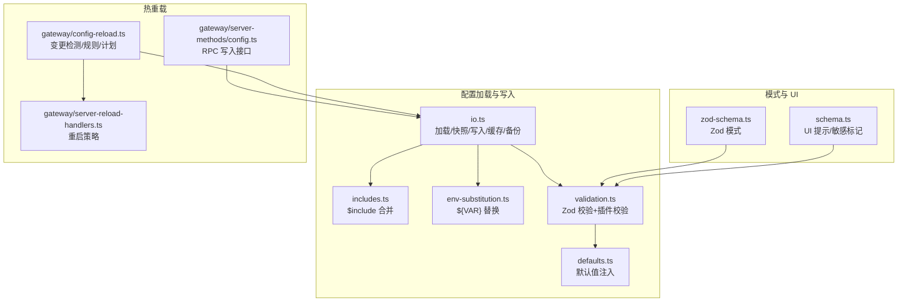
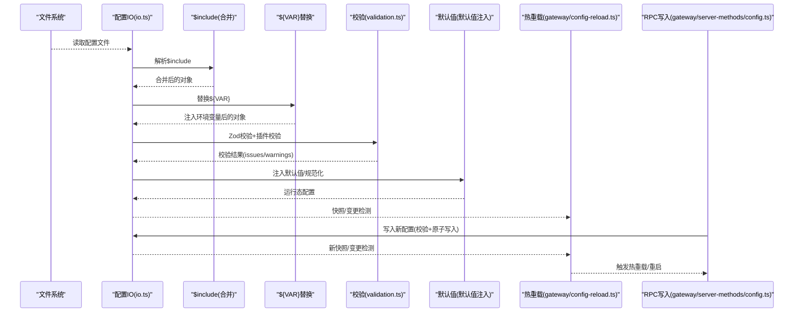
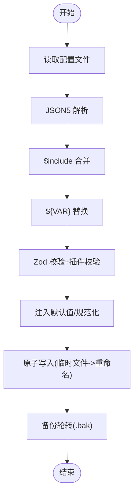
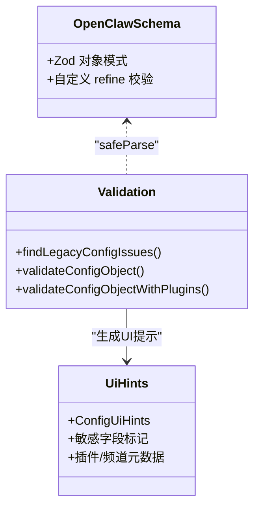
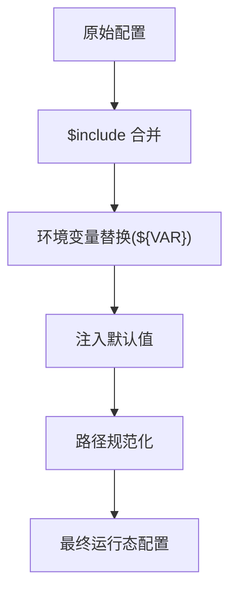
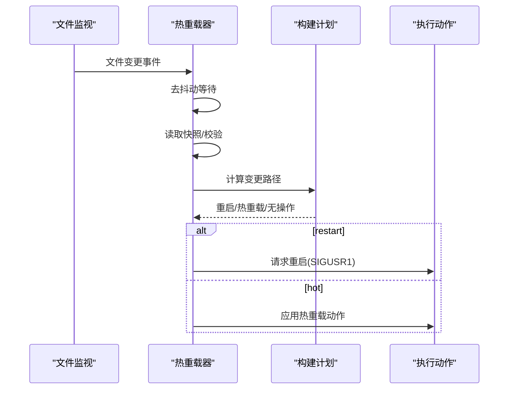
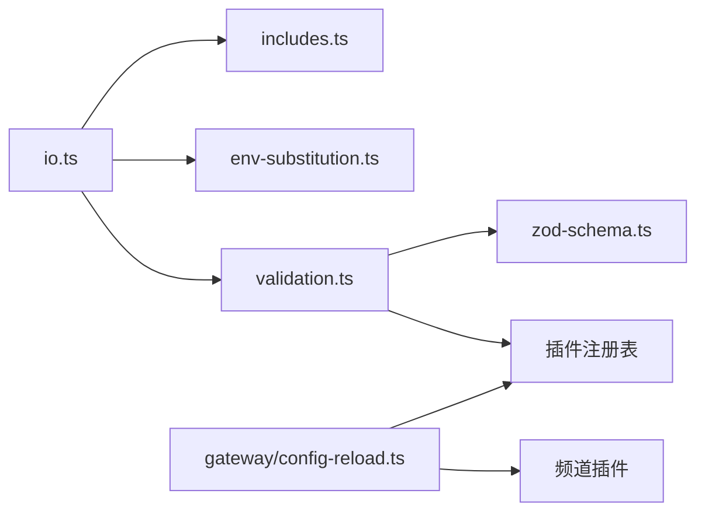
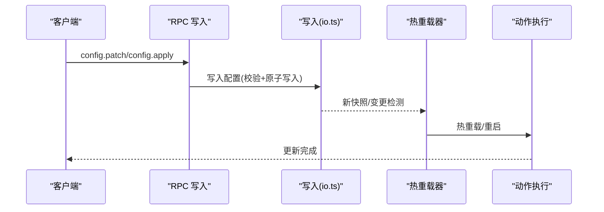

# 配置管理 API

## 目录
1. [简介](#简介)
2. [项目结构](#项目结构)
3. [核心组件](#核心组件)
4. [架构总览](#架构总览)
5. [详细组件分析](#详细组件分析)
6. [依赖分析](#依赖分析)
7. [性能考虑](#性能考虑)
8. [故障排除指南](#故障排除指南)
9. [结论](#结论)
10. [附录](#附录)

## 简介
本文件面向 OpenClaw 的配置管理 API，系统性梳理配置加载、解析、验证、默认值与继承、热重载、变更检测与增量应用、回滚与冲突处理、模式与依赖校验、UI 提示与插件扩展、以及备份与迁移等完整能力。文档同时提供可操作的示例流程与最佳实践，帮助开发者与运维人员在生产环境中安全、高效地管理配置。

## 项目结构
配置管理相关代码集中在 src/config 目录，并与网关热重载模块 src/gateway 协同工作：
- 加载与写入：`io.ts` 负责 JSON5 解析、`$include` 合并、环境变量替换、校验、默认值注入、缓存与原子写入、备份轮转。
- 校验与模式：`validation.ts` 使用 Zod 模式与自定义规则进行强类型校验；`zod-schema.ts` 定义顶层配置结构；`schema.ts` 提供 UI 提示与敏感字段标记。
- 默认值与继承：`defaults.ts` 注入模型、会话、日志、心跳等默认值；`includes.ts` 支持多文件模块化配置；`env-substitution.ts` 支持 `${VAR}` 变量替换。
- 热重载：`gateway/config-reload.ts` 实现变更检测、规则匹配、增量应用与重启决策；`server-methods/config.ts` 提供 RPC 写入接口；`server-reload-handlers.ts` 处理重启策略。

## 核心组件
- 配置 IO 与快照
  - 加载：解析 JSON5 → `$include` 合并 → 环境变量替换 → 校验 → 默认值注入 → 路径规范化 → 缓存 → 运行时覆盖。
  - 快照：读取原始文本与解析结果，返回有效/无效状态、问题列表、警告列表与哈希。
  - 写入：校验通过后原子写入（临时文件 + 原子重命名），并进行备份轮转。
- 验证与模式
  - Zod 模式定义顶层结构与字段约束；自定义校验补充插件、通道、心跳目标等业务规则；UI 提示与敏感字段标记。
- 默认值与继承
  - 模型默认值、会话主键兼容、日志敏感信息脱敏策略、上下文修剪与心跳默认值、压缩策略等。
- 热重载
  - 变更检测（diff）→ 构建重载计划（重启/热重载/无操作）→ 规则匹配（基础规则 + 插件贡献）→ 去抖动执行 → 执行动作或请求重启。

## 架构总览
下图展示从配置文件到运行态配置的全链路，以及热重载的触发与执行路径。

## 详细组件分析

### 组件A：配置加载与写入（io.ts）
- 关键职责
  - 解析 JSON5，支持注释与尾随逗号。
  - 处理 `$include` 指令，递归合并多文件，防止循环与深度超限。
  - 环境变量替换，支持转义与缺失报错。
  - 校验与警告输出，兼容未来版本提示。
  - 注入默认值、路径规范化、缓存与运行时覆盖。
  - 原子写入：临时文件 + rename 或 fallback 到 copy/chmod；失败清理临时文件。
  - 备份轮转：最多保留 N 个 .bak 文件，自动滚动。
- 性能与可靠性
  - 可选缓存：根据环境变量控制缓存时长，避免频繁磁盘 IO。
  - 去抖动：写入后立即触发快照读取，减少竞争条件。
  - 错误隔离：解析失败、包含失败、替换失败均返回结构化错误，便于上层处理。

### 组件B：配置验证与模式（validation.ts, zod-schema.ts, schema.ts）
- Zod 模式
  - 定义顶层结构（agents、tools、channels、gateway、plugins 等）及字段约束。
  - 自定义 refine 补充跨字段一致性校验（如广播目标必须存在于 agents.list）。
- 自定义校验
  - 识别旧版配置问题，阻止不兼容项。
  - 插件注册表校验：未知插件、允许/拒绝列表、心跳目标合法性、插件 schema 缺失等。
  - 代理头像路径合法性与工作区限制。
- UI 提示与敏感字段
  - 字段分组、标签、帮助文案、占位符、敏感标记。
  - 插件与频道的 UI 元数据合并。

### 组件C：默认值与继承（defaults.ts, includes.ts, env-substitution.ts）
- 默认值注入
  - 模型默认值（成本、输入类型、上下文窗口、最大输出令牌）。
  - 会话主键兼容（忽略非 main 的设置）。
  - 日志敏感信息脱敏策略默认开启。
  - 上下文修剪与心跳默认值（按认证模式调整）。
  - 压缩策略默认启用。
- 继承与模块化
  - `$include` 支持单文件与数组合并，递归处理嵌套 include，防止循环与深度超限。
  - 深度合并策略：数组拼接、对象递归合并、原始值以源优先。
- 环境变量替换
  - 仅匹配大写格式的环境变量名，支持转义输出。
  - 缺失变量抛出明确错误，包含变量名与配置路径。

### 组件D：热重载与变更检测（gateway/config-reload.ts, server-methods/config.ts, server-reload-handlers.ts）
- 变更检测
  - 递归比较前后配置对象，生成变更路径集合。
- 重载计划
  - 基于规则集（基础规则 + 插件贡献）将变更分类为 restart/hot/none。
  - 动作映射：重启钩子、Gmail 监视器、浏览器控制、Cron、心跳、各频道。
- 去抖动与并发
  - 去抖动窗口由配置决定；并发运行保护，pending 队列确保顺序执行。
- 重启策略
  - 支持 off/restart/hot/hybrid 四种模式；当 hot 模式无法满足时降级为重启。
  - 通过 SIGUSR1 触发重启，支持外部授权与监听器存在性检查。

### 组件E：配置分层与运行时覆盖（types.openclaw.ts, runtime-overrides.ts）
- 分层结构
  - 全局配置：顶层 OpenClawConfig。
  - 会话配置：agents.defaults/session/logging 等默认层。
  - 代理配置：agents.list[].identity/avatar 等代理级覆盖。
  - 运行时配置：通过运行时覆盖（如命令行参数、环境变量）对加载后的配置进行最终修正。
- 类型与契约
  - OpenClawConfig 定义所有可配置字段与可选性。
  - ConfigFileSnapshot 提供统一的“存在/有效/问题/警告/哈希”视图，便于 UI 与工具使用。

## 依赖分析
- 模块耦合
  - `io.ts` 依赖 `includes.ts`、`env-substitution.ts`、`validation.ts`、`defaults.ts`、`runtime-overrides.ts`。
  - `validation.ts` 依赖 `zod-schema.ts`、插件注册表与通道 ID。
  - 热重载模块依赖插件运行时注册表与频道插件提供的 reload/noop 前缀。
- 外部依赖
  - JSON5 解析、chokidar 文件监视、插件 schema 校验器。
- 循环依赖
  - 未发现直接循环；热重载模块通过运行时注册表获取插件信息，避免编译期循环。

## 性能考虑
- 配置缓存
  - 通过环境变量控制缓存时长，默认短缓存以平衡一致性与性能。
- 原子写入与备份
  - 原子重命名减少锁争用；Windows 下回退到 copy/chmod，保证可用性。
- 去抖动与并发
  - 热重载去抖动窗口可调；并发运行保护避免重复执行。
- 深度合并与包含
  - `$include` 限制最大深度，防止过大配置导致栈溢出；数组拼接与对象递归合并提升模块化效率。

## 故障排除指南
- 常见错误与定位
  - JSON5 解析失败：检查语法与注释，查看快照 issues。
  - 包含失败：检查 `$include` 路径、权限与循环包含。
  - 环境变量缺失：根据 MissingEnvVarError 报错定位变量名与路径。
  - 校验失败：查看 issues/warnings，逐项修复。
  - 代理头像路径越界：确保相对路径位于工作区内。
- 诊断建议
  - 使用 `readConfigFileSnapshot` 获取完整上下文（raw/parsed/config/hash/issues/warnings/legacyIssues）。
  - 开启日志级别与诊断开关，观察热重载计划与动作执行。
  - 在测试环境验证插件 schema 与通道配置。

## 结论
OpenClaw 的配置管理 API 以强类型模式与严格校验为基础，结合模块化包含、环境变量替换、默认值注入与热重载机制，提供了高可靠、可演进的配置体系。通过清晰的分层设计与完善的错误反馈，用户可在复杂场景中安全地进行配置更新与运维操作。

## 附录

### 配置更新流程（示例）
- 通过 RPC 接口提交新配置（支持 patch/apply 两种方式）。
- 服务端解析 JSON5，合并补丁并迁移旧配置。
- 校验通过后写入磁盘，触发原子写入与备份轮转。
- 热重载器检测变更，构建计划并执行热重载或请求重启。

### 版本控制、备份与恢复
- 版本戳记：每次写入自动更新版本与时间戳，用于未来版本提示。
- 备份轮转：最多保留 N 个 .bak 文件，自动滚动。
- 恢复策略：从最近 .bak 恢复，或回滚到上一个稳定版本。

### 迁移策略
- 旧版配置检测：在加载前扫描潜在不兼容项，阻止启动。
- 渐进迁移：先通过补丁/合并方式逐步迁移，再切换到新结构。
- 插件迁移：插件注册表提供 schema 与诊断信息，辅助迁移与回滚。

### 安全与合规
- 敏感字段标记：自动识别 token/password/api_key 等敏感路径并在 UI 中遮蔽。
- 环境变量注入：仅在进程环境不存在时注入，避免覆盖显式设置。
- 重启授权：重启需存在 SIGUSR1 监听器并授权，防止误触。