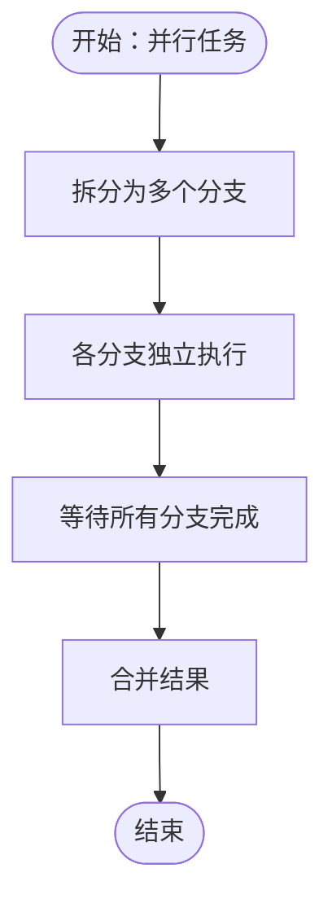

# 性能优化

## 目录
1. [简介](#简介)
2. [项目结构](#项目结构)
3. [核心组件](#核心组件)
4. [架构总览](#架构总览)
5. [详细组件分析](#详细组件分析)
6. [依赖关系分析](#依赖关系分析)
7. [性能考量](#性能考量)
8. [故障排查指南](#故障排查指南)
9. [结论](#结论)
10. [附录](#附录)

## 简介
本技术文档聚焦于 OpenClaw 的性能优化与资源管理，围绕以下主题展开：系统性能瓶颈识别、内存使用优化、CPU 资源管理策略；重试机制、退避算法与并发控制的实现原理；缓存策略、数据库优化与网络请求优化最佳实践；上下文窗口管理、会话压缩与资源清理机制；性能基准测试、负载测试与压力测试方法论；性能监控指标、调优参数配置与容量规划指南；以及 Docker 容器优化、进程池管理与 I/O 优化技巧。文档在深入分析代码与文档的基础上，提供可操作的建议与可视化图示，帮助读者快速定位问题并实施优化。

## 项目结构
OpenClaw 是一个多平台、多通道的个人 AI 助手系统，核心运行时位于 Gateway（WebSocket 控制平面），通过插件与扩展支持多种渠道与技能。性能相关的关键位置包括：
- 配置与运行时：配置校验、沙箱容器参数、会话缓存与压缩保留策略等
- 网络与通道：重试策略、速率限制处理与消息发送
- 数据与状态：会话修剪（Pruning）、上下文窗口估算、数据库执行跟踪
- 基准与测试：模型基准脚本、并发与抗压示例
- 容器与沙箱：Docker 参数化与安全加固

## 核心组件
- 重试与退避：针对出站提供商调用的重试策略与速率限制处理，支持指数/线性退避与抖动
- 会话修剪（Pruning）：在请求前对旧工具结果进行软裁剪或硬清空，减少上下文窗口压力
- 上下文窗口管理：系统提示、对话历史、工具调用/结果与附件共同构成当前窗口
- 缓存与预热：会话管理器缓存与 TTL 控制，避免频繁 IO
- 并发控制：Prose 并行模式与并发反模式指导，批处理与最小化协调开销
- Docker 容器优化：CPU 限额、内存限制、PID 限制、ulimit、非 root 用户运行
- 基准测试：模型吞吐与延迟的基准脚本，支持中位数统计与对比

## 架构总览
下图展示性能相关关键路径：从 Gateway 到通道适配器的重试与退避，到会话修剪与上下文窗口估算，再到 Docker 沙箱资源限制与基准测试验证。

## 详细组件分析

### 组件一：重试机制与退避算法
- 目标：按请求粒度重试，保持顺序，避免非幂等操作重复执行
- 默认行为：尝试次数、最大延迟上限、抖动比例；不同提供商（如 Telegram/Discord）在速率限制场景下的差异化处理
- 配置入口：按通道设置重试参数，覆盖默认值
- 实现要点：仅对当前步骤重试，复合流程不重试已完成步骤；Discord/Telegram 在可用时优先使用提供商返回的 retry-after

### 组件二：会话修剪（Pruning）与上下文窗口管理
- 修剪时机：当会话最后一次 Anthropic 调用超出 TTL，且启用 `cache-ttl` 模式时
- 修剪范围：仅针对工具结果消息，保护最后若干条助手消息；跳过含图像块的结果
- 修剪策略：软裁剪（头尾保留并插入省略标记）与硬清空（替换为占位符）
- 上下文窗口估算：按字符≈令牌×4 估算，优先级：模型覆盖 > 模型定义 > 默认值；可与 `agents.defaults.contextTokens` 作为下限
- 与压缩的区别：压缩持久化摘要，修剪仅影响单次请求的发送内容

### 组件三：缓存策略与会话管理器缓存
- 会话管理器缓存：基于 Map 的内存缓存，带 TTL 控制，避免频繁读取同一会话文件
- 预热机制：在访问前检查缓存，未命中则异步预热，提升后续访问性能
- 可配置项：通过环境变量设置 TTL，默认约 45 秒

### 组件四：并发控制与并行模式
- 并行模式：Prose 支持 `parallel` 块，VM 使用 `metadata` 跟踪分支，子代理向 `bindings` 表写入输出
- 并发反模式：过度并行化、同步 fire-and-forget、无批处理的小任务并行
- 最佳实践：批量处理、限制并发度、合并非关键工作、避免协调开销超过任务收益

### 组件五：数据库执行与并发优势
- PostgreSQL 行级锁：不同子代理写入不同行，避免表级锁导致的串行化
- SQLite 表级锁：分支写入需串行等待，总耗时约为单线程的多倍
- 建议：在高并发写入场景优先考虑行级锁友好的存储方案，并结合连接池与事务边界优化

### 组件六：Docker 容器优化与进程池管理
- 容器参数：`pids-limit`、`memory`、`memory-swap`、`cpus`、`ulimits`、`binds`、`dns`、`extraHosts` 等
- 安全加固：以非 root 用户运行，降低逃逸风险
- 沙箱镜像：精简基础镜像，安装必要工具，CMD 保持容器存活以便复用
- 进程池：通过 `pids-limit` 限制容器内进程数量，避免资源滥用

### 组件七：基准测试与性能监控
- 基准脚本：支持指定运行次数与提示词，记录每次运行耗时与用量，输出中位数、最小/最大值
- 监控指标：延迟（毫秒）、输入/输出/缓存读写/总令牌用量
- 方法论：固定提示词与模型，多次运行取中位数，对比不同提供商或配置组合

## 依赖关系分析
- 配置驱动：Gateway 通过严格 JSON Schema 校验配置，确保运行时一致性与安全性
- 插件槽位：内存插件的排他选择逻辑，避免冲突并提供回退提示
- 运行时参数：沙箱配置合并全局与代理级设置，统一暴露到 Docker 参数映射
- 文档与实现：重试策略、修剪规则、上下文估算均在文档与代码中明确对应

## 性能考量
- 内存优化
  - 会话修剪：启用 `cache-ttl`，合理设置心跳与 TTL，减少首次请求的缓存写入量
  - 上下文估算：根据模型上下文窗口与 `agents.defaults.contextTokens` 设定上限，避免超限
  - 会话缓存：调整会话管理器 TTL，平衡 IO 与内存占用
- CPU 资源管理
  - Docker CPU 限额：通过 `cpus` 限制容器 CPU 使用，防止突发占用
  - 并发控制：遵循“批处理优先、最小化并行”的原则，避免过度并行导致的调度开销
- 网络请求优化
  - 重试与退避：按提供商差异配置最小延迟、最大延迟与抖动，优先使用提供商返回的 retry-after
  - 速率限制：区分幂等与非幂等操作，避免非幂等重复执行
- 数据库优化
  - 行级锁优先：在高并发写入场景采用行级锁友好的存储（如 PostgreSQL）
  - 事务边界：合并小事务，减少提交频率
- I/O 优化
  - 预热与缓存：对热点文件与会话进行预热与缓存，减少磁盘 IO
  - 绑定与挂载：合理使用 `binds`，避免不必要的文件系统扫描

## 故障排查指南
- 重试与退避
  - 现象：频繁速率限制或超时
  - 措施：检查提供商 retry-after，增大最小延迟与抖动，必要时切换指数/线性退避策略
- 会话修剪
  - 现象：模型缓存未命中或成本异常
  - 措施：确认 `cache-ttl` 是否启用，TTL 是否与模型 `cacheControlTtl` 匹配，修剪阈值是否合理
- 上下文窗口
  - 现象：上下文过长导致截断或成本上升
  - 措施：使用 `/context` 与 `/context detail` 分析贡献者，减少工具 schemas 或注入文件大小
- Docker 容器
  - 现象：容器资源不足或不稳定
  - 措施：调整 `pids-limit`、`memory`、`cpus`，检查 `ulimits` 与安全配置
- 基准测试
  - 现象：吞吐波动大
  - 措施：固定提示词与模型，多次运行取中位数，排除冷启动与网络抖动

## 结论
OpenClaw 在性能优化方面提供了从网络层的重试与退避、到运行时的会话修剪与上下文窗口管理，再到容器层的资源限制与安全加固的完整链路。通过严格的配置校验、可调的缓存与预热策略、面向并发的并行模式指导，以及可复现的基准测试方法，系统能够在保证稳定性的同时最大化吞吐与响应速度。建议在生产环境中结合实际业务负载，持续迭代上述参数与策略，形成适合自身场景的性能基线。

## 附录
- 调优参数清单
  - 重试策略：`attempts`、`minDelayMs`、`maxDelayMs`、`jitter`
  - 会话修剪：`mode`（`cache-ttl`）、`ttl`、`keepLastAssistants`、`softTrimRatio`、`hardClearRatio`、`minPrunableToolChars`
  - 上下文窗口：`agents.defaults.contextTokens`、模型 `contextWindow`
  - Docker：`pids-limit`、`memory`、`memory-swap`、`cpus`、`ulimits`、`binds`、`dns`、`extraHosts`
  - 会话缓存：`OPENCLAW_SESSION_MANAGER_CACHE_TTL_MS`
- 容量规划建议
  - 依据峰值并发与平均任务时延，计算所需容器数量与 CPU/内存配额
  - 通过基准脚本对比不同提供商与模型，确定成本与性能的最优组合
  - 对高频会话文件启用缓存与预热，降低磁盘 IO 峰值