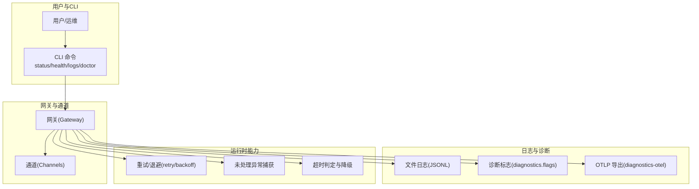
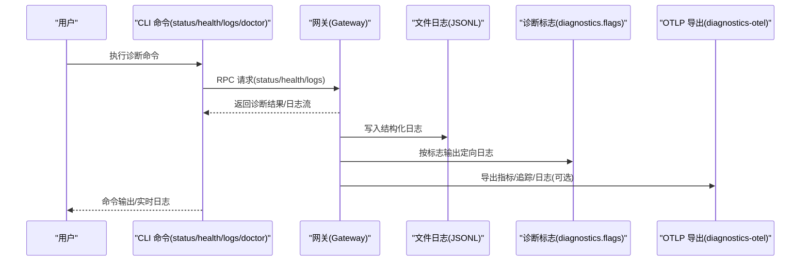
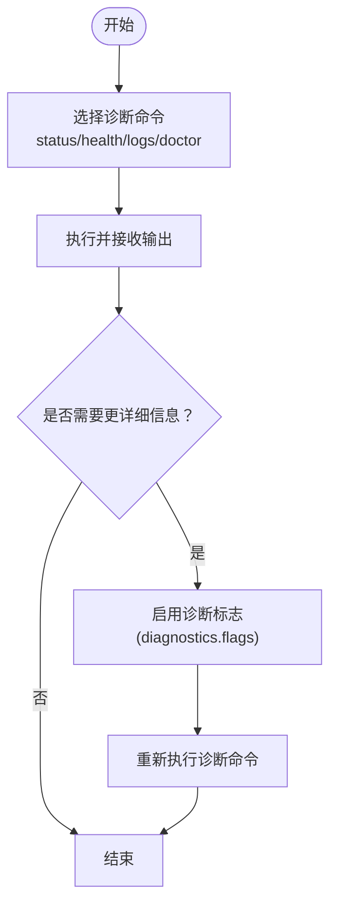
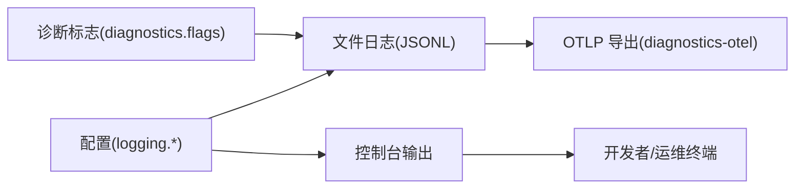
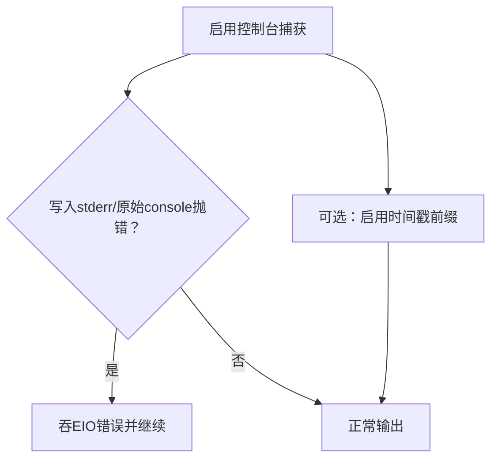
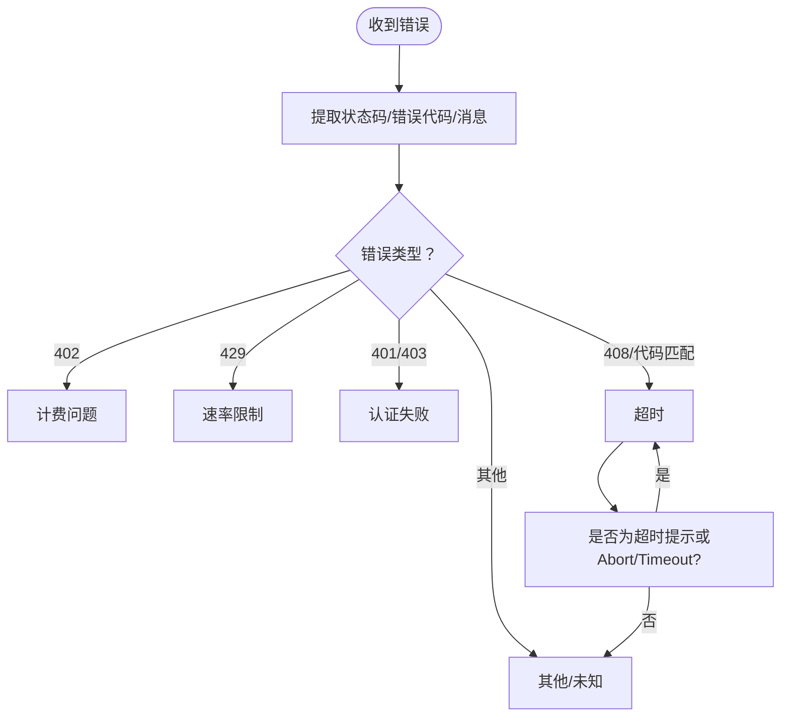
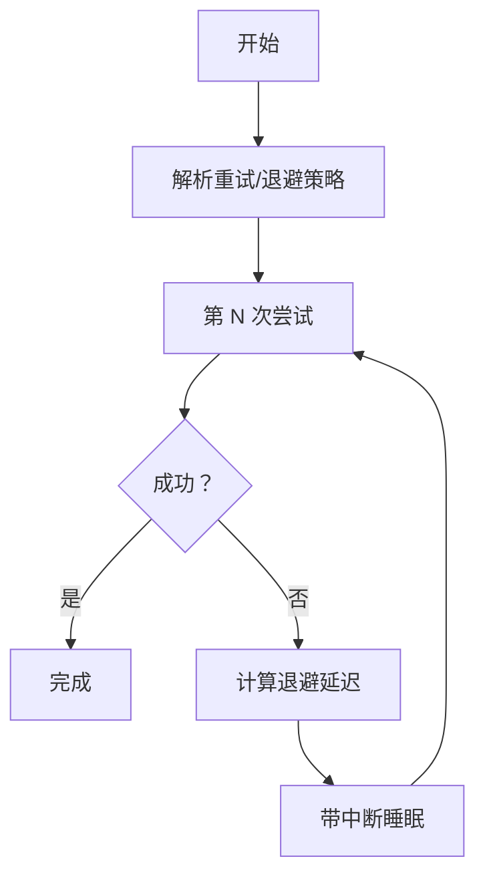
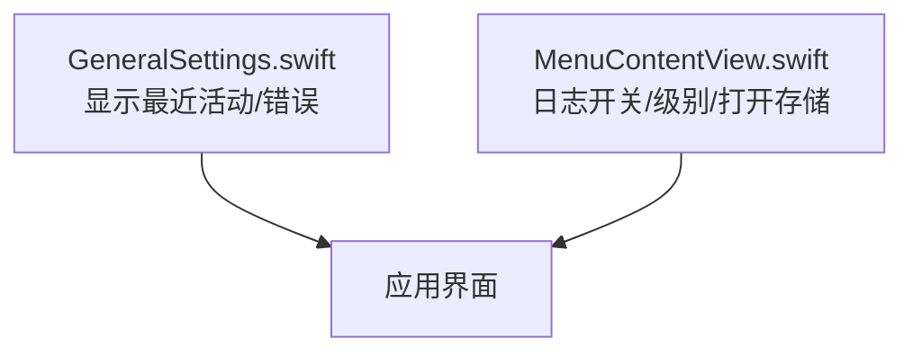
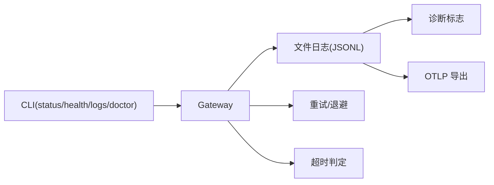

# 故障诊断

## 目录
1. [简介](#简介)
2. [项目结构](#项目结构)
3. [核心组件](#核心组件)
4. [架构总览](#架构总览)
5. [详细组件分析](#详细组件分析)
6. [依赖分析](#依赖分析)
7. [性能考虑](#性能考虑)
8. [故障排查指南](#故障排查指南)
9. [结论](#结论)
10. [附录](#附录)

## 简介
本文件面向 OpenClaw 的使用者与维护者，提供一套系统化的故障诊断与问题排查方法论。内容覆盖：
- 诊断工具与命令的使用路径（状态、健康、日志、医生）
- 错误事件记录与警告系统的机制
- 常见故障场景的识别、根因分析与修复步骤
- 系统状态检查、配置验证与依赖关系诊断
- 调试模式启用、详细日志输出与堆栈跟踪
- 网络连接、权限与配置冲突的排查步骤
- 远程诊断工具、性能分析与系统监控技巧

## 项目结构
OpenClaw 将“诊断能力”贯穿于文档、CLI、运行时日志与可观测性扩展中：
- 文档层：提供快速排障清单、命令参考与配置说明
- CLI 层：status/health/logs/doctor 等命令作为诊断入口
- 运行时层：日志系统、重试/退避策略、未处理异常与超时判定
- 可观测性扩展：Diagnostics OTLP 插件，支持指标、追踪与日志导出

## 核心组件
- 诊断命令集
  - `status`：通道与会话概览、会话存储位置、更新信息等
  - `health`：通过 RPC 获取网关健康状态
  - `logs`：通过 RPC 实时查看文件日志
  - `doctor`：健康检查、配置迁移与修复
- 日志系统
  - 文件日志（JSONL）与控制台输出
  - 诊断标志（`dianostics.flags`）用于定向开启特定子系统日志
  - OTLP 导出（`diagnostics-otel`）将指标、追踪与日志导出到收集器
- 运行时可靠性
  - 重试/退避策略（指数回退、抖动、最大尝试次数）
  - 未处理异常捕获（吞 EIO、时间戳前缀、递归保护）
  - 超时判定与降级（基于状态码/错误代码/消息提示）

## 架构总览
下图展示从用户发起诊断命令到网关执行、日志记录与可观测性导出的关键交互。

## 详细组件分析

### 诊断命令与工作流
- `status`：快速概览通道与会话状态；`--all` 输出可直接粘贴的安全报告；`--deep` 触发对通道的探测
- `health`：获取网关健康状态，支持 `--json` 与 `--verbose`
- `logs`：通过 RPC 实时查看文件日志，支持 `--json`/`--plain`/`--no-color`
- `doctor`：执行健康检查、配置迁移与修复，支持 `--repair`/`--deep`/`--non-interactive`

### 日志系统与诊断标志
- 文件日志：默认滚动文件，按天生成；可通过配置项 `logging.file` 与 `logging.level` 控制
- 控制台输出：TTY 友好格式，支持 pretty/compact/json；`consoleLevel` 与 `consoleStyle` 可独立配置
- 诊断标志：在不提升全局日志级别的情况下，按子系统/通配符开启定向日志
- OTLP 导出：通过 `diagnostics-otel` 插件将指标、追踪与日志导出至 OTLP 收集器

### 未处理异常捕获与控制台安全
- 控制台捕获：在写入 stderr 或原始 console 时吞掉 EIO 错误，避免崩溃
- 时间戳前缀：可为控制台输出添加时间戳，便于定位事件顺序
- 递归保护：在加载配置期间避免递归解析与重复设置

### 超时判定与错误降级
- 超时判定：综合状态码、错误代码与消息提示，识别超时类错误
- 错误降级：根据错误类型（计费、速率限制、认证、超时）进行原因归类
- 未处理网络异常：对网络相关错误（如 ENOTFOUND/ECONNRESET/ETIMEDOUT 等）进行判定

### 重试/退避与连接恢复
- 重试策略：固定/指数回退、抖动、最大延迟与尝试次数
- 退避策略：指数回退、抖动、边界约束
- 连接恢复：心跳周期、重连策略、最大尝试次数、可中断睡眠

### macOS 应用诊断界面
- 通用设置页显示最近活动与健康检查状态
- 菜单提供切换详细日志、调整日志级别与打开会话存储等功能

## 依赖分析
- CLI 与网关：CLI 通过 RPC 与网关通信，doctor/status/health/logs 均依赖网关运行态
- 日志与诊断：文件日志为统一事实源；诊断标志与 OTLP 导出均消费该事实源
- 运行时可靠性：重试/退避与超时判定为跨模块通用能力

## 性能考虑
- 日志级别与体积：高并发场景建议仅启用必要诊断标志，避免 OTLP 日志量过大
- 采样与刷新：OTLP 导出支持采样率与刷新间隔配置，降低带宽与后端压力
- 重试策略：合理设置最大延迟与抖动，避免雪崩效应
- 心跳与重连：根据网络状况调整心跳周期与最大重连次数

## 故障排查指南

### 一、快速三步诊断法
- `openclaw status`：本地概览与会话状态
- `openclaw status --all`：可粘贴的安全报告
- `openclaw gateway probe`：网关发现与可达性
- `openclaw logs --follow`：实时日志（最接近真实失败原因）
- `openclaw doctor`：健康检查与自动修复

### 二、常见问题与根因定位
- 无 API 密钥/认证失败
  - 现象：提供方报错或模型调用失败
  - 排查：确认 agent 的 auth 存储、OAuth 刷新、setup-token
- 控制 UI 在 HTTP 下失败（设备身份要求/连接失败）
  - 现象：浏览器非安全上下文阻止 WebCrypto
  - 排查：改用 HTTPS/Tailscale Serve 或允许不安全认证
- 服务已安装但进程未运行
  - 现象：服务“看起来已加载”但无进程
  - 排查：`openclaw gateway status`、`doctor`；查看 supervisor 日志
- 端口占用/绑定拒绝
  - 现象：服务运行但监听不到端口
  - 排查：`openclaw gateway status` 查看监听者；检查 `gateway.auth` 配置
- 模型不可用/被拒绝
  - 现象：提示“未知模型/不受支持”
  - 排查：使用 `openclaw models list/status`，更新为受支持模型
- 通道不触发/消息未到达
  - 现象：消息未进入处理链
  - 排查：检查 `allowlist`/`mentionPatterns`；使用 `openclaw logs --follow` 定位阻断点
- WhatsApp 断线/登出
  - 现象：连接不稳定或需重新登录
  - 排查：`status --deep`；必要时 `channels login/logout` 后重新扫码
- 媒体发送失败
  - 现象：路径无效/大小超限/下载失败
  - 排查：校验路径与大小；查看媒体相关日志
- 高内存使用
  - 现象：会话历史占用内存过高
  - 排查：设置 `session.historyLimit` 或定期重启

### 三、系统状态检查与配置验证
- `openclaw status`：通道/会话/更新信息/服务状态
- `openclaw status --deep`：对通道进行探测（需要可达网关）
- `openclaw gateway status`：supervisor 状态、进程 PID/退出码、最后错误
- `openclaw doctor`：健康检查、配置迁移、服务与端口诊断、安全警告
- `openclaw health`：RPC 获取网关健康状态（支持 `--json`/`--verbose`）

### 四、日志与诊断工具
- `openclaw logs`：RPC 实时查看文件日志；支持 `--json`/`--plain`/`--no-color`
- 文件日志位置：默认 `/tmp/openclaw/openclaw-YYYY-MM-DD.log`；可通过 `logging.file` 覆盖
- 诊断标志：按子系统/通配符开启定向日志；不影响全局日志级别
- OTLP 导出：启用 `diagnostics-otel` 插件，配置 `endpoint`/`protocol`/`traces`/`metrics`/`logs`/`sampleRate`/`flushIntervalMs`

### 五、调试模式与详细日志
- 调试模式：将 `logging.level` 提升至 debug/trace；`--verbose` 仅影响控制台输出
- 控制台格式：`consoleStyle` 支持 pretty/compact/json；`consoleLevel` 控制可见度
- 时间戳前缀：启用控制台时间戳前缀，便于事件排序
- 递归保护：避免在加载配置时发生递归解析

### 六、网络连接问题
- 症状：连接失败、超时、DNS 解析异常
- 排查：检查网络/DNS 出口；对 Telegram/WhatsApp 等通道，关注 IPv6/HTTPS 可达性
- 工具：`openclaw logs --follow`；`lsof -nP -iTCP:18789 -sTCP:LISTEN`；`openclaw gateway status`

### 七、权限错误与配置冲突
- 权限：确保配置文件权限为 600；检查 state 目录可写性
- 配置冲突：多工作区目录导致状态漂移；清理多余目录，保留单一活跃工作区
- 服务环境：最小化 PATH，避免版本管理器路径；缺失工具时在 `~/.openclaw/.env` 中导出

### 八、远程诊断与可观测性
- 远程诊断：`openclaw logs --follow` 可在远程模式下工作
- 性能分析：结合 OTLP 指标（token 使用、队列深度、会话卡滞）与追踪
- 系统监控：使用 `openclaw health`/`status`/`doctor` 作为自动化巡检入口

### 九、开发与 Node 版本兼容性
- Node + tsx “__name is not a function”：在 Node 25.x 上使用 tsx 启动可能失败
- 临时方案：使用 Bun 或 tsc + node watch；或测试 Node LTS

## 结论
OpenClaw 的故障诊断体系以 CLI 命令为入口，结合文件日志、诊断标志与 OTLP 可观测性，形成“命令—日志—导出”的闭环。配合重试/退避与超时判定，系统在复杂网络与通道环境下具备较强的韧性。建议在日常运维中：
- 将 `status`/`health`/`logs`/`doctor` 作为例行巡检
- 仅在必要时开启诊断标志与 OTLP 日志
- 对网络与权限问题优先使用官方排障清单
- 在开发阶段关注 Node/tsx 兼容性问题

## 附录

### A. 常用命令速查
- `openclaw status` / `--all` / `--deep` / `--usage`
- `openclaw health` [`--json`] [`--verbose`]
- `openclaw logs` [`--follow`] [`--json`] [`--plain`] [`--no-color`]
- `openclaw doctor` [`--repair`] [`--deep`] [`--non-interactive`]

### B. 诊断事件与导出
- 事件类型：模型用量、Webhook、消息队列、会话状态、心跳
- 指标名称：`openclaw.tokens`、`openclaw.webhook.received`、`openclaw.queue.depth` 等
- 追踪名称：`openclaw.model.usage`、`openclaw.message.processed`、`openclaw.session.stuck`
- OTLP 配置：`endpoint`、`protocol`、`traces`/`metrics`/`logs` 开关、采样率、刷新间隔