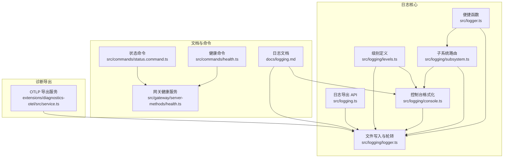
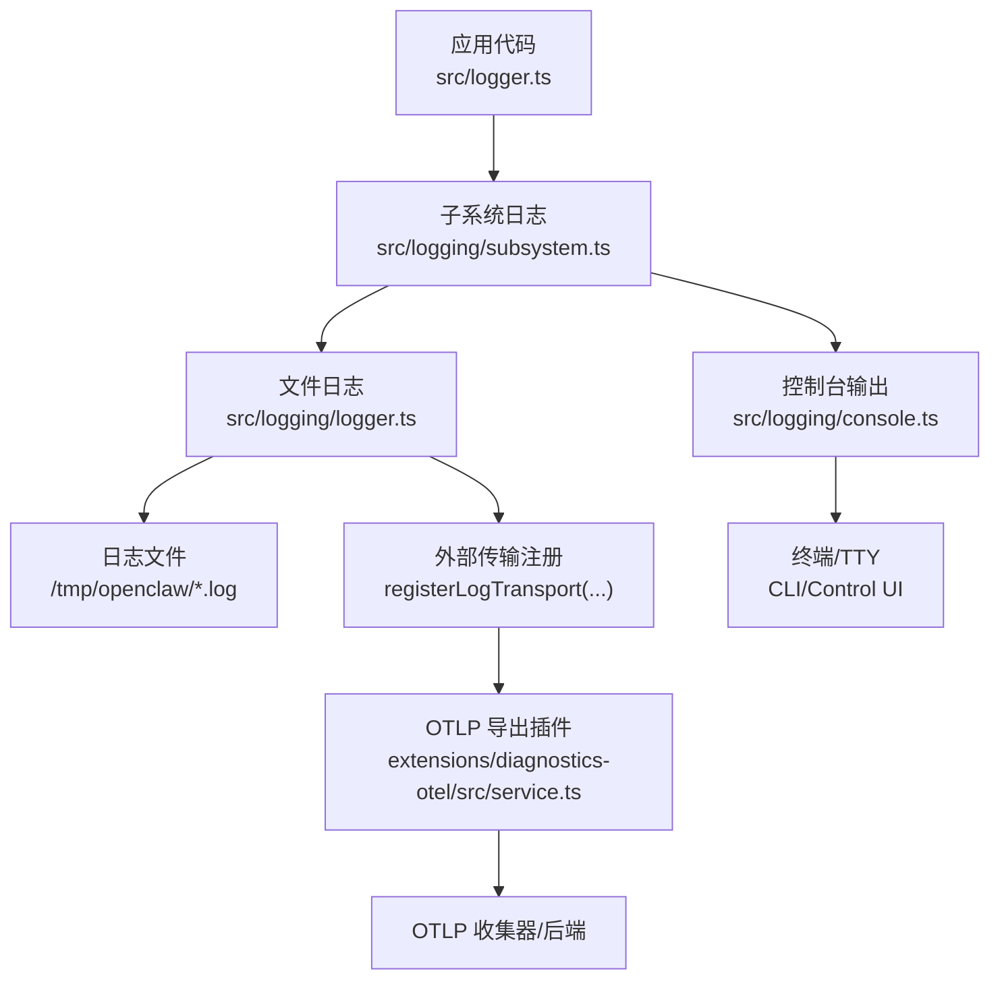
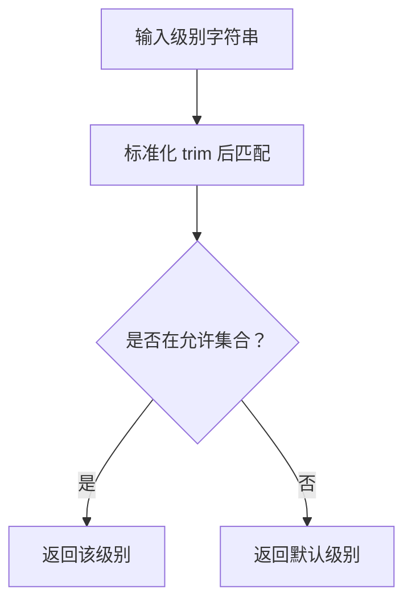
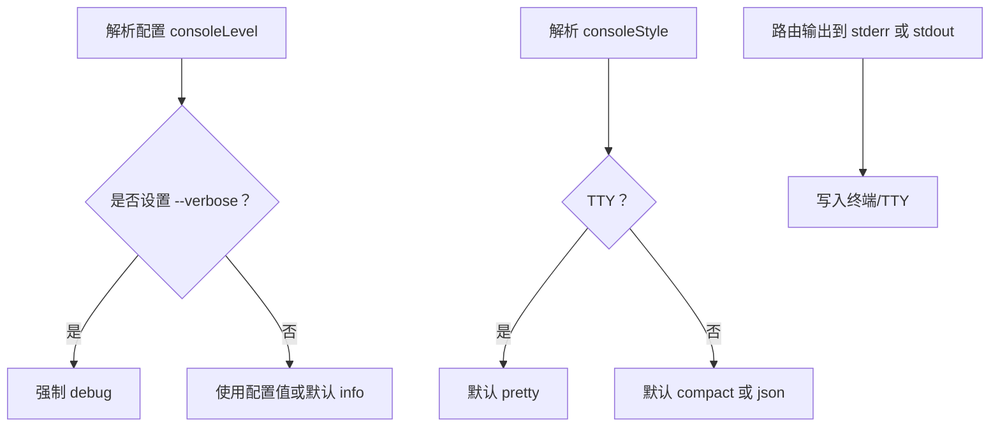
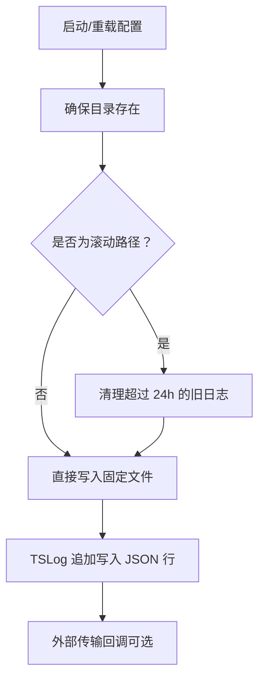
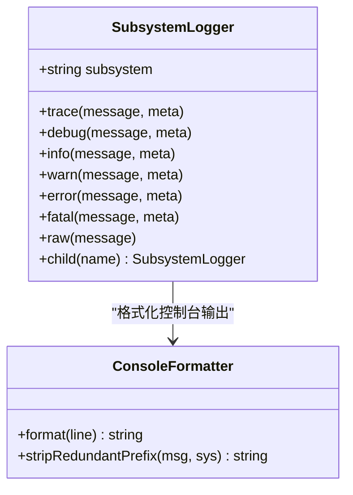
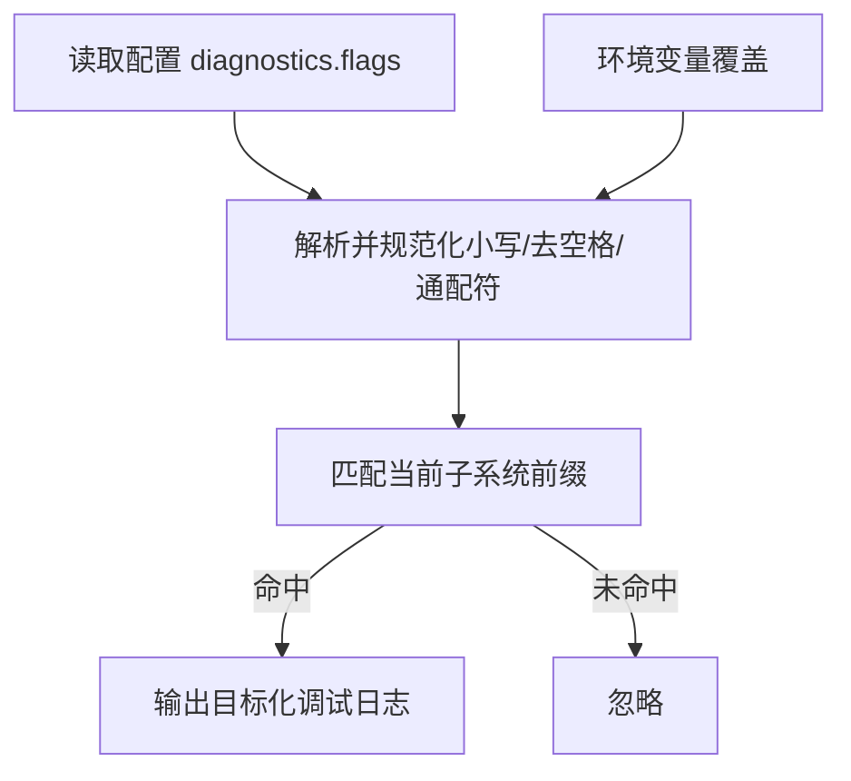
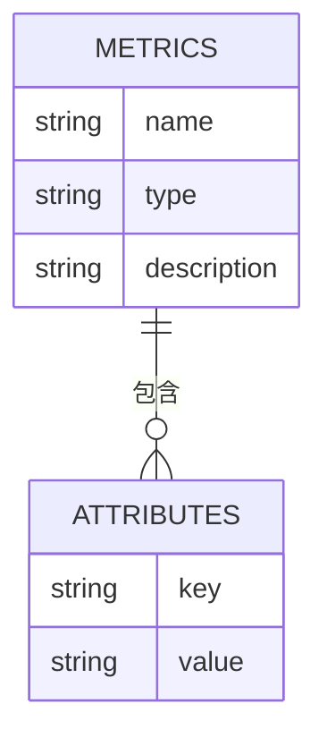
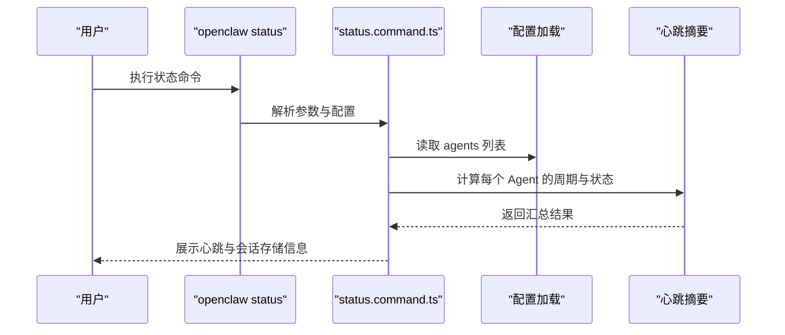
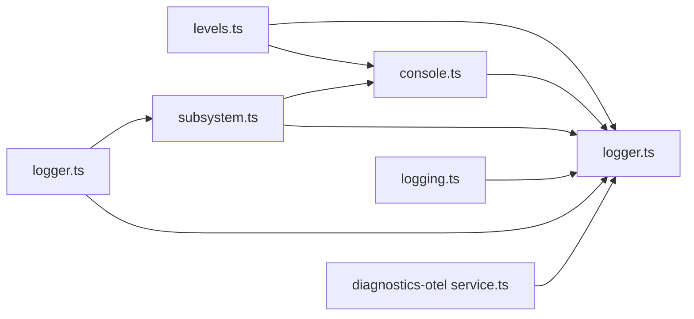

# 日志与监控

## 目录
1. [简介](#简介)
2. [项目结构](#项目结构)
3. [核心组件](#核心组件)
4. [架构总览](#架构总览)
5. [详细组件分析](#详细组件分析)
6. [依赖关系分析](#依赖关系分析)
7. [性能考量](#性能考量)
8. [故障排查指南](#故障排查指南)
9. [结论](#结论)
10. [附录](#附录)

## 简介
本文件面向 OpenClaw 的日志系统与监控机制，覆盖以下主题：
- 日志配置与日志级别管理
- 日志轮转策略与文件位置
- 诊断标志系统与目标化调试
- 监控指标采集与性能数据统计
- 心跳监控机制与系统健康检查
- 异常检测与告警建议
- 日志格式规范、敏感信息脱敏与日志聚合
- 日志分析工具、实时监控界面与告警配置
- 日志存储优化、长期保留策略与合规性
- 监控仪表板、性能基准测试与容量规划

## 项目结构
OpenClaw 的日志与监控能力由“核心日志库 + 控制台格式化 + 子系统路由 + 诊断导出插件 + 健康与状态命令”构成。关键目录与文件如下：
- 核心日志库：src/logging/*.ts（级别、控制台、子系统、文件写入）
- 日志入口与便捷函数：src/logger.ts、src/logging.ts
- 文档：docs/logging.md（CLI、控制 UI、OTLP 导出、诊断标志等）
- 诊断导出插件：extensions/diagnostics-otel/src/service.ts
- 健康与状态命令：src/commands/health.ts、src/commands/status.command.ts、src/gateway/server-methods/health.ts

## 核心组件
- 日志级别与最小级别映射：定义允许级别与数值映射，用于文件与控制台过滤。
- 控制台样式与级别：根据 TTY、环境变量与配置决定输出样式（pretty/compact/json）与级别。
- 文件日志与轮转：默认滚动到按日命名的日志文件，支持清理过期日志。
- 子系统日志：自动为消息添加子系统前缀，控制台彩色显示与冗余前缀去除。
- 诊断导出：通过插件启用 OTLP 导出，支持指标、追踪与日志导出。

## 架构总览
OpenClaw 的日志与监控架构以“核心日志库”为中心，向上提供统一的便捷函数与子系统路由；向下对接文件写入与外部传输；同时通过诊断插件将结构化事件导出至 OTLP 收集器，支撑指标、追踪与日志聚合。

## 详细组件分析

### 日志级别与最小级别映射
- 允许级别：silent/fatal/error/warn/info/debug/trace
- 数值映射：用于 tslog 的最小级别过滤
- 影响范围：文件与控制台均受此映射影响

### 控制台样式与级别
- 自动样式选择：TTY 时默认 pretty，非 TTY 默认 compact；可强制 json
- 级别选择：优先使用配置 consoleLevel，否则根据 `--verbose` 切换 debug
- 输出路由：stdout/stderr 分离，RPC/JSON 模式下强制 stderr
- 子系统过滤：支持通配与前缀过滤，避免噪声输出
- 时间戳前缀：可选，避免重复时间戳

### 文件日志与轮转
- 默认路径：/tmp/openclaw/openclaw-YYYY-MM-DD.log
- 写入方式：JSON Lines，每行一条记录
- 轮转策略：按日滚动，保留最近 24 小时内的日志文件
- 外部传输：支持注册外部传输函数，不阻塞主流程

### 子系统日志与控制台格式化
- 子系统前缀：自动提取并格式化，支持颜色与层级裁剪
- 冗余前缀去除：避免重复显示子系统标签
- 控制台输出：按级别与样式输出，支持 JSON 模式
- 运行时包装：将子系统日志桥接为运行时接口

### 诊断标志系统与目标化调试
- 诊断开关：在配置中启用 diagnostics，并设置 flags 列表
- 规则：大小写不敏感，支持通配符（如 `telegram.*`）
- 生效范围：写入标准日志文件，遵循文件级别与脱敏规则
- 环境覆盖：可通过环境变量临时叠加

### 监控指标采集与性能数据统计
- 指标类型：计数器（token 使用、webhook、消息处理）、直方图（持续时间、等待时间、上下文大小）
- 关键维度：渠道、提供商、模型、会话标识、原因、队列深度等
- 可选导出：通过 diagnostics-otel 插件开启 traces/metrics/logs，并设置采样率与刷新间隔

### 心跳监控机制与系统健康检查
- 命令输出：状态命令展示各 Agent 的心跳周期与启用状态
- 健康命令：格式化耗时单位，支持深度探测
- 网关健康：提供健康检查服务端方法，供命令与 UI 调用

## 依赖关系分析
- 日志核心模块内聚：levels/console/subsystem/logger 协作完成从级别到输出的完整链路
- 外部依赖：tslog 提供结构化日志与最小级别过滤；文件系统实现滚动与清理
- 插件扩展：diagnostics-otel 通过外部传输与配置注入，实现 OTLP 导出
- 命令层：status/health 命令读取配置与健康摘要，驱动 UI 与 CLI 展示

## 性能考量
- 文件写入：JSON Lines 追加写入，异常捕获避免阻塞；建议使用 SSD 与合适的刷新策略
- 控制台输出：TTY 与非 TTY 分支，避免不必要的颜色与多余前缀
- 子系统过滤：合理设置过滤列表，减少噪声输出
- 诊断导出：设置采样率与刷新间隔，避免高流量场景下的带宽压力
- 轮转清理：24 小时阈值适配多数场景，可根据磁盘与合规需求调整

[本节为通用指导，无需列出具体文件来源]

## 故障排查指南
- 网关不可达：先执行诊断命令，确认网关状态与日志路径
- 日志为空：检查日志文件路径与写权限，确认文件级别与轮转策略
- 需要更详细日志：提升文件级别（如 debug/trace），注意对性能的影响
- 控制台输出异常：检查 TTY 环境、颜色支持与时间戳前缀设置
- 诊断导出失败：核对插件启用、协议与端点、采样率与头部配置

## 结论
OpenClaw 的日志与监控体系以清晰的模块划分与可配置的输出策略为核心，结合诊断导出插件与健康命令，形成从本地日志到可观测性的完整闭环。通过合理的级别与样式配置、目标化调试与 OTLP 导出，可在不同规模与合规要求下实现高效运维与问题定位。

[本节为总结性内容，无需列出具体文件来源]

## 附录

### 日志格式规范与敏感信息脱敏
- 文件格式：JSON Lines，字段包含时间、级别、子系统、消息与元数据
- 控制台格式：TTY 下彩色、带时间戳；非 TTY 下紧凑；可切换 JSON 模式
- 脱敏策略：控制台可配置脱敏模式与正则，不影响文件日志

### 日志聚合与分析工具
- CLI 实时查看：支持 JSON/TTY/Plain/无色模式
- 控制 UI：Web 控制台 Logs 标签页
- OTLP 导出：对接任意支持 OTLP/HTTP 的收集器/后端

### 告警配置建议
- 基于诊断指标：webhook 错误率、消息处理时延、队列深度、会话卡住次数
- 采样与阈值：结合采样率与业务 SLA 设定阈值，避免误报
- 通知通道：与现有通知系统集成（邮件、IM、Webhook）

### 日志存储优化与长期保留
- 轮转策略：按日滚动，保留 24 小时；可结合外部归档策略延长保留
- 存储介质：SSD 提升写入性能；冷热分层降低长期成本
- 合规要求：按法规设定保留期限与访问审计

### 监控仪表板与容量规划
- 指标面板：基于导出的 token 使用、webhook/消息处理、队列与会话状态构建
- 基准测试：使用脚本进行模型调用与消息吞吐压测，评估峰值容量
- 容量规划：结合历史峰值与增长趋势，预留 CPU/内存/IO/网络资源