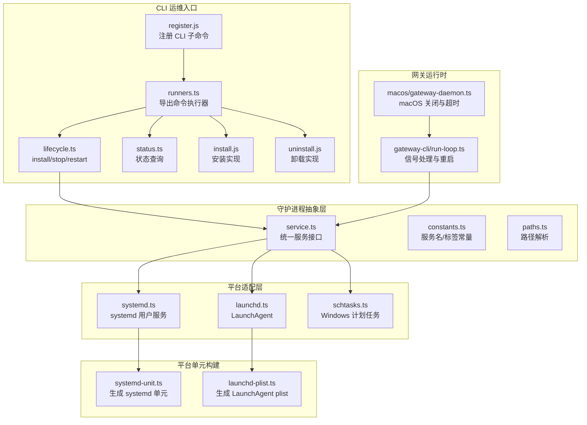
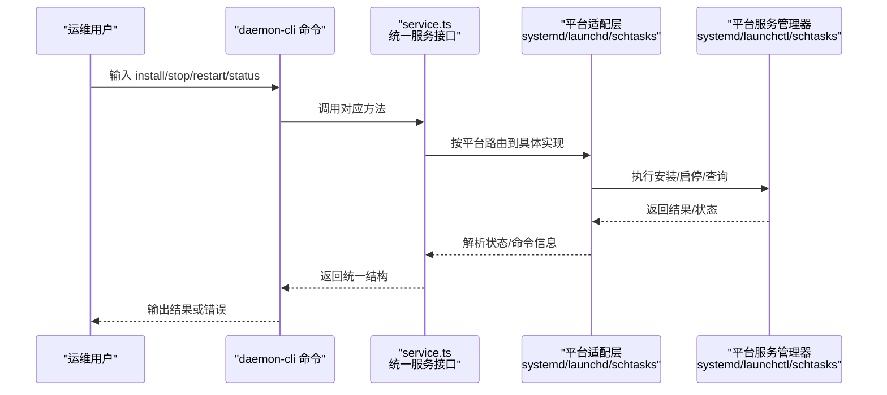
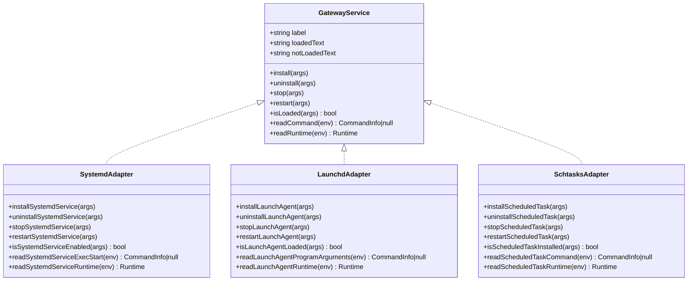
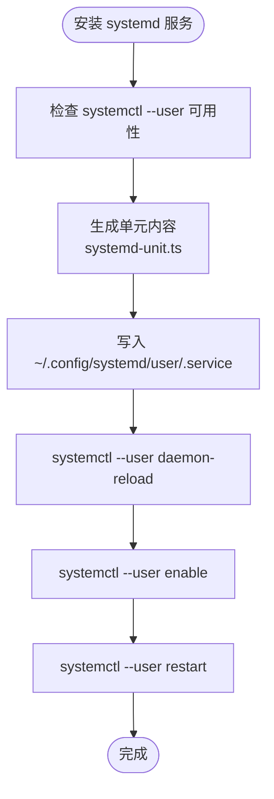
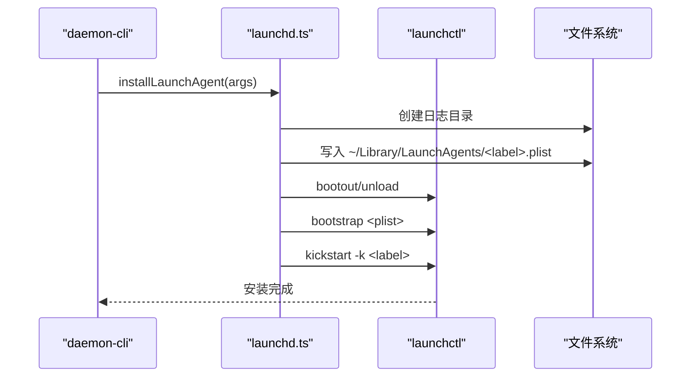
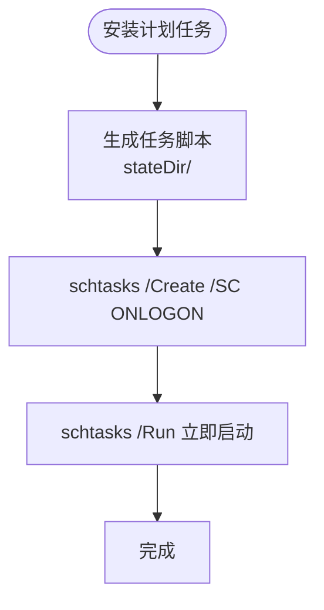
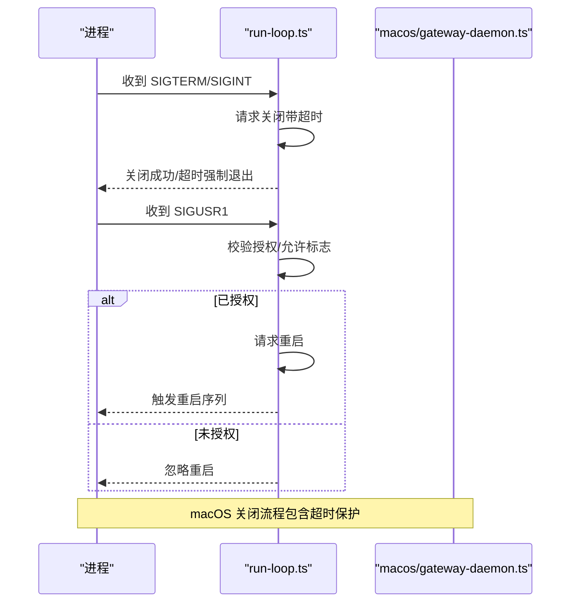
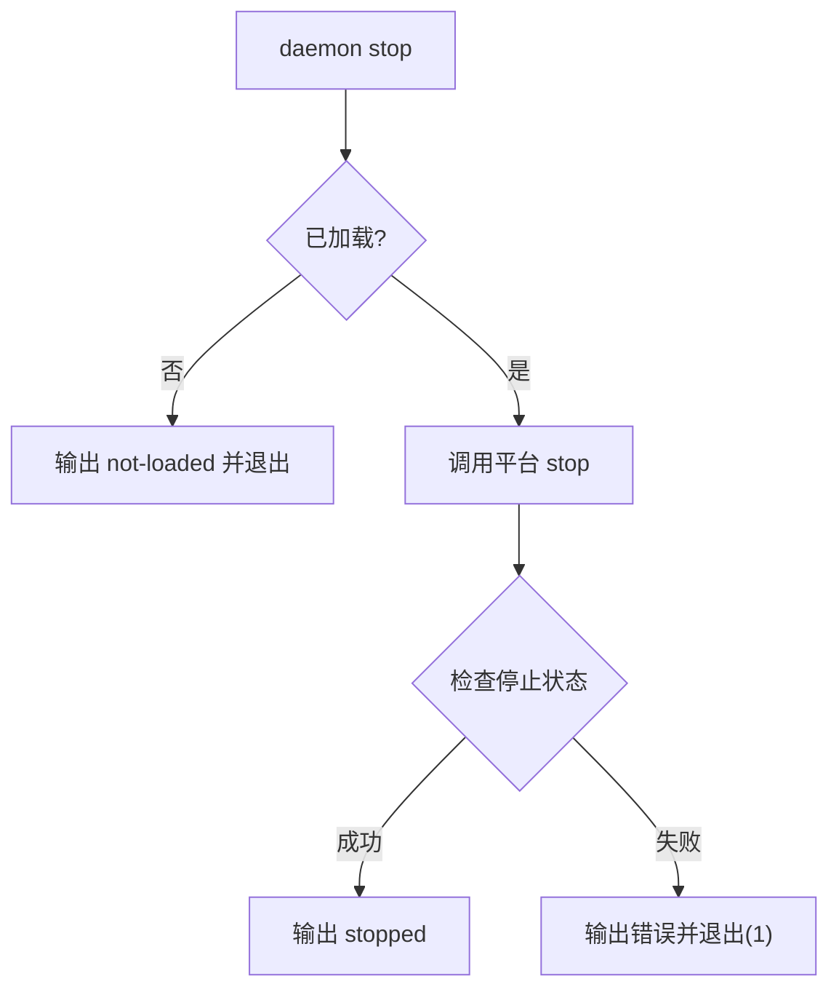
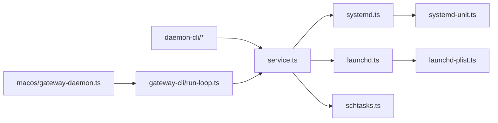
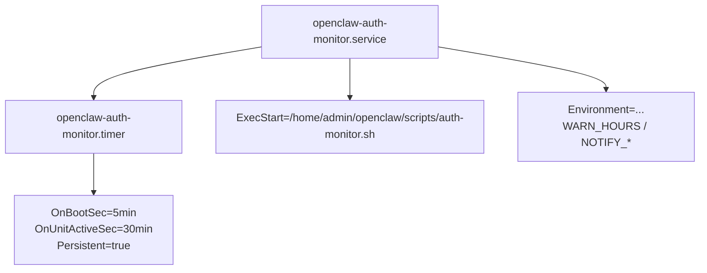

# 网关运维

## 目录
1. [简介](#简介)
2. [项目结构](#项目结构)
3. [核心组件](#核心组件)
4. [架构总览](#架构总览)
5. [详细组件分析](#详细组件分析)
6. [依赖关系分析](#依赖关系分析)
7. [性能考量](#性能考量)
8. [故障排除指南](#故障排除指南)
9. [结论](#结论)
10. [附录](#附录)

## 简介
本技术文档面向 OpenClaw 网关的运维与管理，系统性阐述跨平台守护进程管理机制，覆盖 macOS LaunchAgent、Linux systemd 用户服务与 Windows Scheduled Task 的安装、启动、停止与重启流程；详解网关服务生命周期、自动启动配置与运行状态监控；说明守护进程的配置参数、环境变量管理与工作目录设置；并给出权限要求、依赖检查与错误处理策略。文末提供各平台运维最佳实践与故障排除建议，并总结服务状态查询、日志查看与性能监控的实用技巧。

## 项目结构
围绕“守护进程管理”的核心代码位于 `src/daemon` 目录，按平台抽象出统一的服务接口，分别对接各平台的原生服务管理器。CLI 层通过 `src/cli/daemon-cli` 提供安装、卸载、启停、状态查询等运维命令。

## 核心组件
- 统一服务接口：在 `service.ts` 中定义 `GatewayService` 抽象，按平台返回对应实现（LaunchAgent/systemd/Scheduled Task），屏蔽平台差异。
- 平台适配：`systemd.ts`、`launchd.ts`、`schtasks.ts` 分别封装 `systemctl/launchctl/schtasks` 的调用与状态解析。
- 单元/脚本生成：`systemd-unit.ts` 生成 systemd 单元文件；`launchd-plist.ts` 生成 LaunchAgent plist；`schtasks.ts` 生成 Windows 执行脚本。
- CLI 运维：`daemon-cli` 提供 `install/stop/restart/uninstall/status` 命令，调用统一服务接口完成操作。
- 运行时与信号：`gateway-cli/run-loop.ts` 处理 SIGTERM/SIGINT/SIGUSR1，支持优雅关闭与受控重启；macOS 特定超时保护。

## 架构总览
下图展示从 CLI 到平台服务管理器的调用链路，以及状态查询与日志路径的映射关系。

## 详细组件分析

### 统一服务接口与平台选择
- `resolveGatewayService` 根据 `process.platform` 返回对应 `GatewayService` 实例，包含 `install/uninstall/stop/restart/isLoaded/readCommand/readRuntime`。
- `constants.ts` 定义服务标签、名称与描述格式化规则；`paths.ts` 提供 HOME 与状态目录解析。

### systemd 用户服务管理
- 安装：写入 `~/.config/systemd/user/<unit>.service`，执行 `daemon-reload`、`enable`、`restart`，并输出安装路径。
- 启停：`systemctl --user stop/restart`；查询状态：`systemctl --user show`。
- 命令解析：解析 `ExecStart`、`WorkingDirectory`、`Environment` 行，支持转义。
- 单元生成：`systemd-unit.ts` 渲染 `[Unit]/[Service]/[Install]`，默认 `Restart=always`，`KillMode=process`，保证主进程退出即停。
- 可选 linger：启用用户会话长期运行能力（如需要）。

### LaunchAgent 管理（macOS）
- 安装：生成 `~/Library/LaunchAgents/<label>.plist`，写入 `ProgramArguments`、`WorkingDirectory`、`EnvironmentVariables`、日志路径；通过 `launchctl bootstrap/kickstart` 加载。
- 启停：`launchctl bootout/kickstart`；查询状态：`launchctl print`。
- 日志：`resolveGatewayLogPaths` 生成 `stateDir/logs` 下的标准输出/错误日志路径。
- 兼容性：支持清理旧版 LaunchAgent（`find/uninstall`）。

### Windows 计划任务管理
- 安装：生成 `stateDir/<script>.cmd`，写入 `set` 环境、`cd /d` 工作目录、执行命令；`schtasks /Create /SC ONLOGON` 注册任务。
- 启停：`schtasks /End` 结束，`/Run` 立即运行；查询状态：`/Query`。
- 权限：若无管理员权限会提示“Access is denied”，需以管理员身份运行或降级安装方式。

### 网关服务生命周期与信号处理
- 生命周期：`runGatewayLoop` 在启动后监听 SIGTERM/SIGINT/SIGUSR1，触发优雅关闭；macOS 上带超时强制退出保护。
- 重启授权：SIGUSR1 需经授权或允许外部重启才生效；否则忽略。

### 配置参数、环境变量与工作目录
- 环境变量收集：`collectConfigEnvVars` 从配置中提取非空键值对，支持 `vars` 与直接字段。
- systemd：`Environment=` 行渲染，支持转义；`WorkingDirectory` 指定工作目录。
- LaunchAgent：`EnvironmentVariables` 字典写入 plist；`ProgramArguments/WorkingDirectory`。
- Windows：脚本内 `set` 逐条注入环境变量，`cd /d` 设置工作目录。
- 状态目录：`OPENCLAW_STATE_DIR` 或 `~/.openclaw`，用于日志与脚本存放。

### CLI 运维命令与错误处理
- `install/stop/restart/uninstall/status`：统一 JSON 输出与人类可读输出；失败时抛错并退出码非零。
- `stop`：先检查是否已加载，再执行 stop；随后再次检查状态。
- `restart`：先 stop 再 restart；失败时输出错误与可选 hints。
- `install`：根据平台生成命令与环境，调用对应适配层安装。

## 依赖关系分析
- 平台依赖：systemd 依赖 `systemctl --user`；launchd 依赖 `launchctl`；Windows 依赖 `schtasks`。
- 文件依赖：systemd 单元、LaunchAgent plist、Windows 脚本均写入用户目录；状态目录由 `OPENCLAW_STATE_DIR` 或默认路径决定。
- 运行时依赖：网关运行时通过 `run-loop.ts` 接收信号并控制关闭/重启；macOS 上有超时保护避免卡死。

## 性能考量
- systemd `KillMode=process`：仅等待主进程退出，避免容器监控进程阻塞关闭。
- `RestartSec=5`：异常退出后自动重试，提升可用性。
- Windows 任务类型：使用 `ONLOGON` 与 `LIMITED` 权限运行，减少资源占用。
- 日志分离：LaunchAgent 与 Windows 分离 stdout/stderr，便于定位问题。

## 故障排除指南
- systemd 不可用
  - 现象：提示 `systemctl --user` 不可用或未找到。
  - 处理：确认 systemd 用户服务可用；必要时启用 linger。
  - 参考：`assertSystemdAvailable` 与 `isSystemdUserServiceAvailable`。
- LaunchAgent 无法加载
  - 现象：`launchctl print` 返回缺失或状态异常。
  - 处理：`repairLaunchAgentBootstrap` 重新引导；确保 plist 路径存在且可访问。
- Windows 权限不足
  - 现象：`schtasks create` 失败并提示 Access is denied。
  - 处理：以管理员身份运行 PowerShell；或取消安装守护进程。
- 状态查询异常
  - systemd：`show` 返回 not found 时视为 stopped；未知错误时 `status=unknown`。
  - LaunchAgent：`missingUnit=true` 表示 plist 缺失。
  - Windows：`Query` 返回文件不存在视为 stopped。

## 结论
OpenClaw 通过统一的服务接口与平台适配层，实现了跨平台守护进程的一致化运维体验。借助 systemd 用户服务、LaunchAgent 与 Windows 计划任务，结合 CLI 命令与运行时信号处理，可实现稳定的自动启动、可靠的状态监控与可控的重启/停止。遵循本文的权限要求、依赖检查与错误处理建议，可在不同平台上高效部署与维护网关服务。

## 附录

### 常用运维命令与要点
- 安装
  - Linux：`installSystemdService`；写入 `~/.config/systemd/user/<unit>.service`，`enable` 并 `restart`。
  - macOS：`installLaunchAgent`；写入 `~/Library/LaunchAgents/<label>.plist`，`bootstrap` 并 `kickstart`。
  - Windows：`installScheduledTask`；写入 `stateDir/<script>.cmd`，`schtasks /Create /SC ONLOGON`。
- 启动/停止/重启
  - 使用 `daemon-cli` 的 `start/stop/restart`；内部调用对应平台 `stop/restart`。
- 状态查询
  - systemd：`systemctl --user show`；`parseSystemdShow` 解析 `ActiveState/SubState/MainPID`。
  - LaunchAgent：`launchctl print`；`parseLaunchctlPrint` 解析 `state/pid`。
  - Windows：`schtasks /Query`；`parseSchtasksQuery` 解析 `status/last run time/result`。
- 日志
  - macOS：`stateDir/logs` 下的标准输出/错误日志。
  - Windows：任务脚本所在目录的日志（由脚本生成）。

### systemd 认证监控示例
仓库提供了认证过期监控的 systemd 单元与定时器示例，可用于生产环境的告警与通知配置。

