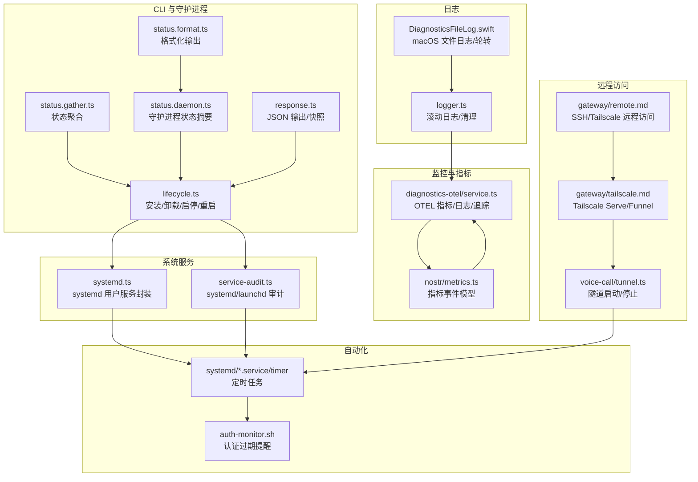
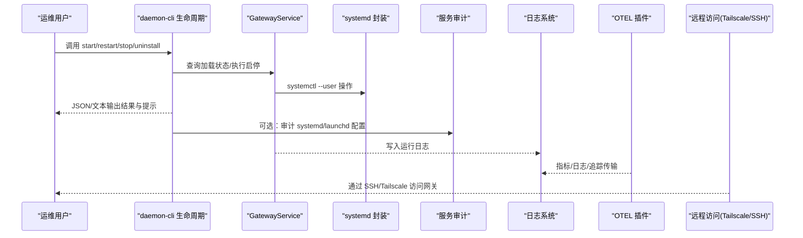
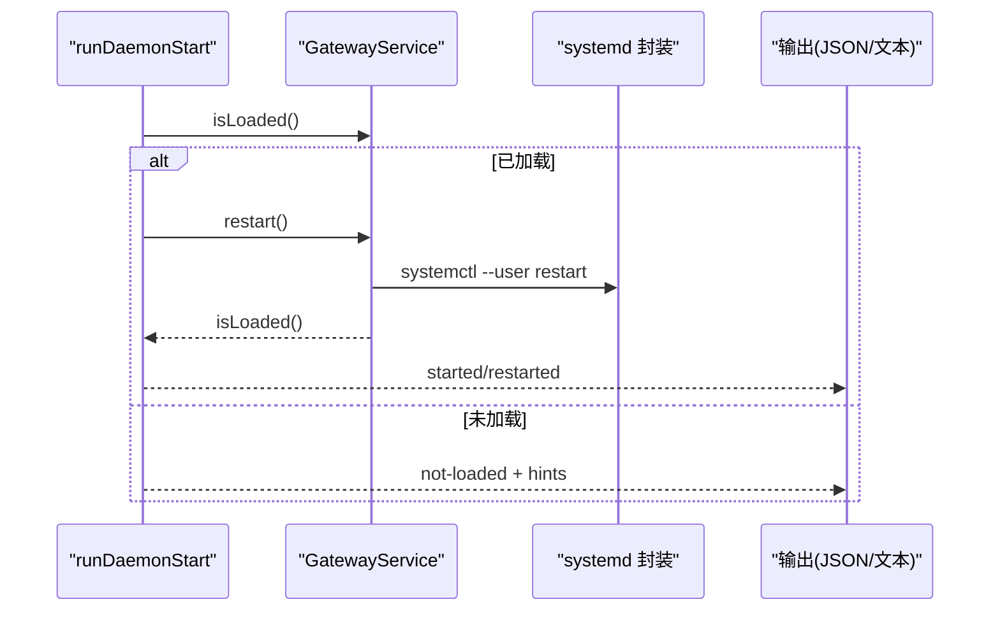
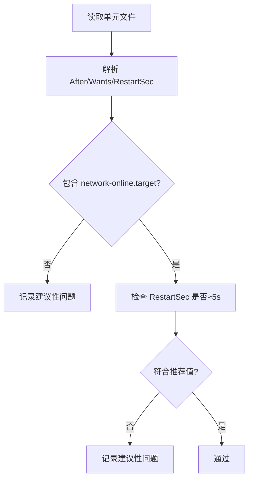
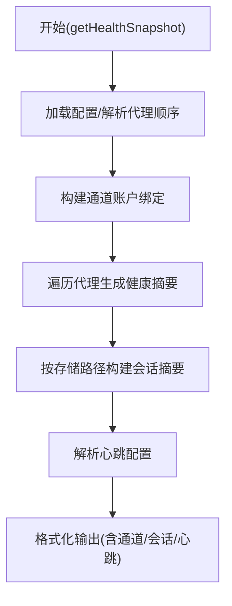
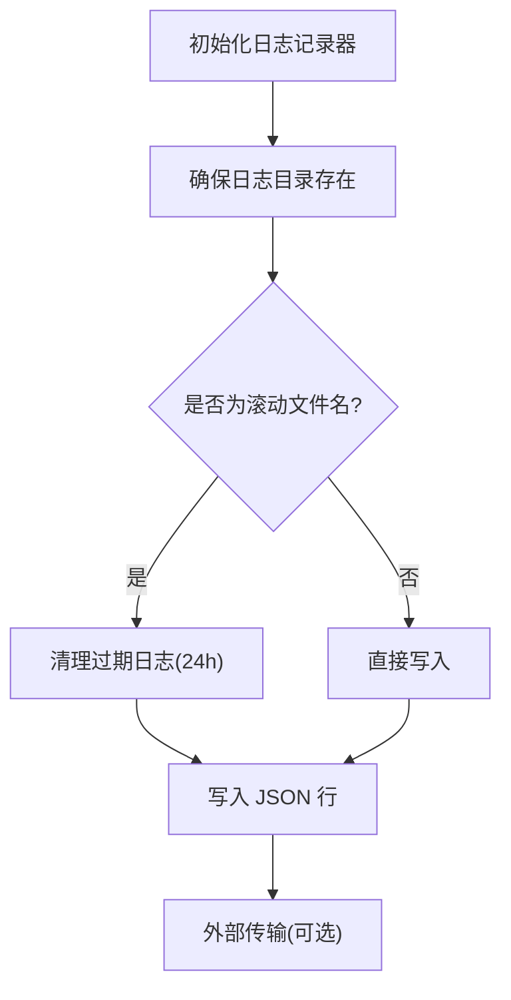
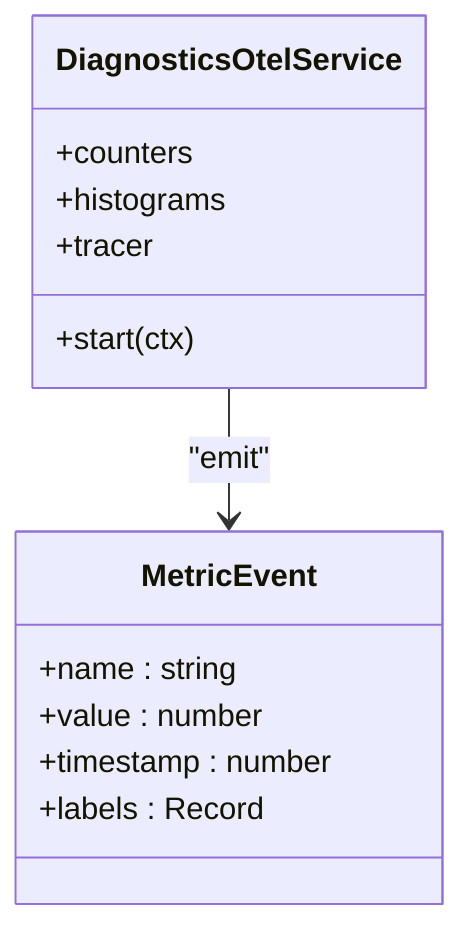
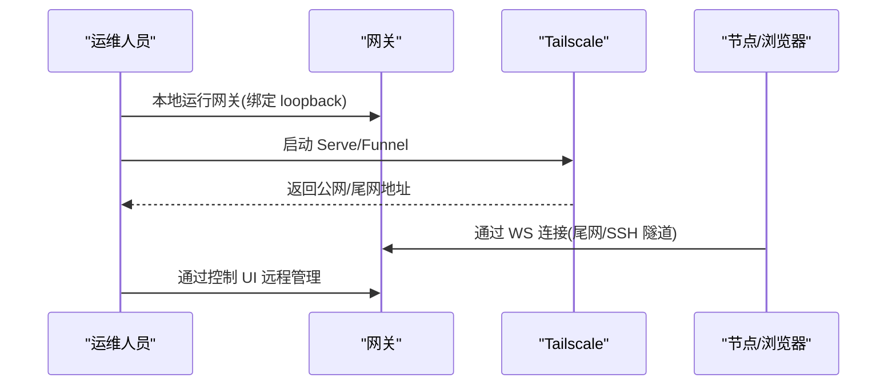
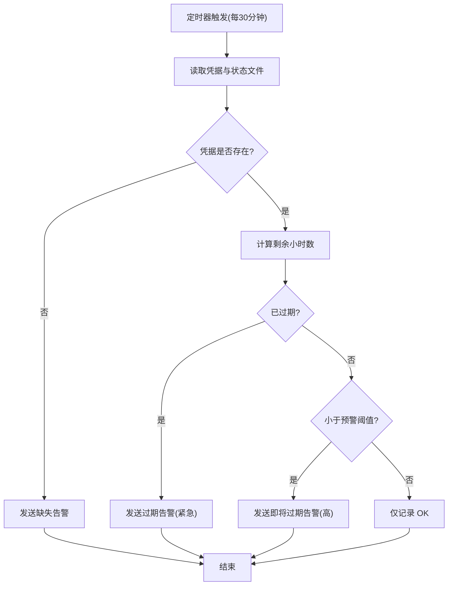
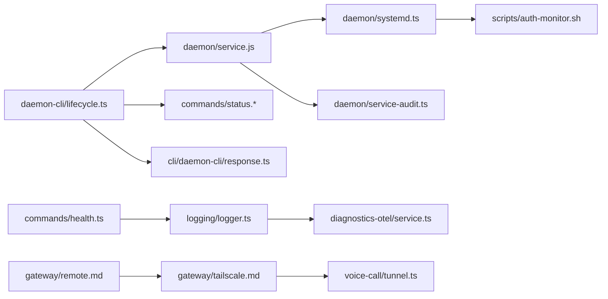

# 运维与监控

## 目录
1. 引言
2. 项目结构
3. 核心组件
4. 架构总览
5. 详细组件分析
6. 依赖关系分析
7. 性能考虑
8. 故障排查指南
9. 结论
10. 附录

## 引言
本文件面向 OpenClaw 的运维与监控体系，覆盖网关服务的安装、启动、停止、重启等生命周期管理；守护进程与系统服务（systemd/launchd）的集成与审计；日志系统与滚动清理；监控指标与健康检查；性能优化与容量规划；故障诊断与应急响应；远程访问（SSH 隧道、Tailscale）配置；以及运维自动化脚本与部署更新策略。内容以仓库中现有实现与文档为依据，结合可视化图示帮助不同技术背景的读者快速上手。

## 项目结构
围绕运维与监控的关键代码分布在以下区域：
- CLI 守护进程生命周期：src/cli/daemon-cli/*
- 系统服务抽象与审计：src/daemon/*
- 健康检查与状态汇总：src/commands/health.ts、src/commands/status.*
- 日志系统：src/logging/logger.ts、apps/macos/Sources/OpenClaw/DiagnosticsFileLog.swift
- 指标与可观测性：extensions/diagnostics-otel/src/service.ts、extensions/nostr/src/metrics.ts
- 远程访问与隧道：docs/gateway/remote.md、docs/gateway/tailscale.md、extensions/voice-call/src/tunnel.ts
- 自动化与定时任务：scripts/systemd/*、scripts/auth-monitor.sh

## 核心组件
- 守护进程生命周期 CLI：提供安装、卸载、启动、停止、重启命令，并在 JSON 模式下输出结构化结果与提示信息。
- 系统服务抽象与审计：封装 systemd 用户服务操作，检测可用性并进行配置审计（如网络在线目标、重启间隔等）。
- 健康检查与状态汇总：聚合代理、会话、心跳、通道等维度的健康信息，支持深度探测与会话路径统计。
- 日志系统：统一的日志记录器，支持滚动日志与按日期命名的文件，自动清理过期日志；macOS 平台有专用文件日志与轮转逻辑。
- 指标与可观测性：通过 OpenTelemetry 插件导出令牌用量、成本、运行时长、上下文大小、Webhook 处理等指标；Nostr 扩展定义指标事件模型与熔断器行为。
- 远程访问与隧道：文档说明 SSH 隧道与 Tailscale Serve/Funnel 的使用方式；插件提供隧道启动/停止能力。
- 自动化与定时任务：systemd 服务与定时器用于认证过期监控脚本的周期执行。

## 架构总览
下图展示从 CLI 到系统服务、日志与监控的整体交互路径，以及远程访问与自动化脚本的集成点。

## 详细组件分析

### 守护进程生命周期与服务控制
- 启动/停止/重启/卸载：CLI 提供统一入口，内部根据平台检测 systemd 可用性，必要时给出提示与建议。
- JSON 输出：在 JSON 模式下输出标准化的响应体，便于自动化集成。
- 状态摘要：对守护进程的加载状态、运行时信息进行格式化输出，辅助排障。

### 系统服务审计与配置校验
- systemd 单元解析与审计：检查 After/Wants 是否包含网络在线目标、RestartSec 是否符合推荐值。
- launchd plist 审计：读取 LaunchAgent 配置并报告缺失项。
- 可用性检测：通过执行 systemctl --user status 判断 systemd 用户服务是否可用。

### 健康检查与状态聚合
- 健康快照：收集代理顺序、心跳配置、会话存储路径、通道绑定等信息，支持超时与探测开关。
- 会话与队列：统计会话数量、上下文令牌、系统事件队列长度等。
- 输出样式：对心跳、会话存储路径等进行友好格式化输出。

### 日志系统与滚动清理
- 统一日志记录器：支持级别、文件路径、控制台样式；默认滚动到按日命名的文件。
- 滚动清理：按最大保留时间删除过期日志文件，避免磁盘膨胀。
- macOS 文件日志：独立的文件日志实现，包含轮转与备份上限控制。

### 监控指标与健康评分
- OTEL 指标：令牌用量、成本、运行时长、上下文大小、Webhook 请求/错误/耗时、消息队列等。
- 指标事件模型：定义指标名称、数值、时间戳与标签，支持扩展。
- Nostr 熔断器：通过指标事件序列模拟开/半开/闭合状态，保障上游可靠性。

### 远程访问与隧道
- SSH 隧道与 Tailscale：文档说明如何通过 SSH 或 Tailscale Serve/Funnel 暴露网关控制界面与 WebSocket。
- 隧道插件：封装 ngrok、Tailscale Serve/Funnel 的启动/停止流程，支持超时与错误处理。
- 身份验证：Tailscale Serve 可通过身份头免密登录，或强制密码模式。

### 自动化与定时任务
- systemd 服务与定时器：定时检查认证过期并发送通知；支持环境变量配置通知渠道与预警阈值。
- Shell 脚本：读取凭据文件，计算剩余有效期，按需发送 OpenClaw 或 ntfy.sh 推送，并限制通知频率。

## 依赖关系分析
- CLI 依赖服务抽象层完成实际系统操作；服务抽象层依赖系统工具（systemctl/launchd）与配置文件。
- 日志系统与 OTEL 插件解耦，前者负责落盘与轮转，后者负责指标/日志/追踪导出。
- 健康检查与状态汇总依赖配置加载与会话存储路径解析。
- 远程访问与隧道插件依赖外部 CLI（如 tailscale/ngrok），并在失败时提供超时与错误处理。

## 性能考虑
- 日志滚动与清理：按天滚动与 24 小时保留窗口平衡磁盘占用与可追溯性。
- 指标采样与导出：OTEL 插件支持采样率配置，避免高吞吐场景下的导出压力。
- 熔断器与重试：Nostr 扩展的熔断器序列可降低上游抖动对系统的影响。
- 网络绑定与隧道：优先 loopback + Tailscale Serve/Funnel，减少公网暴露带来的延迟与安全风险。

## 故障排查指南
- 守护进程状态与提示：使用状态命令查看加载状态、运行时 PID/状态、详细信息与缺失单元提示。
- systemd 可用性与审计：若启动失败，检查 systemd 用户服务可用性与单元配置（网络在线目标、重启间隔）。
- 日志定位：确认日志文件路径与滚动策略，检查最近日志行与错误分类（参考信号客户端日志严重级别判定）。
- 健康检查：启用深度探测，关注心跳配置、会话存储路径、通道绑定与队列长度。
- 认证过期：通过定时任务脚本与 systemd 定时器确认告警是否正常触发与通知渠道是否可达。

## 结论
OpenClaw 的运维与监控体系以 CLI 生命周期为核心，结合系统服务抽象、健康检查、日志与指标导出、远程访问与自动化脚本，形成完整的可观测与可维护闭环。建议在生产环境中启用 systemd 审计、定期检查日志滚动与清理策略、配置合适的健康探测与告警阈值，并通过 Tailscale Serve/Funnel 实现安全可控的远程访问。

## 附录

### 常见运维场景与最佳实践
- 安装/卸载：优先使用 CLI 安装/卸载，确保服务未加载时再执行卸载。
- 启动失败排查：检查 systemd 可用性与单元配置，关注网络在线目标与重启间隔。
- 日志管理：按天滚动并清理过期日志，避免磁盘占满；在 macOS 上使用专用日志文件。
- 指标导出：启用 OTEL 插件并设置合理的采样率；关注令牌用量、成本与运行时长指标。
- 远程访问：优先使用 Tailscale Serve（尾网）或 Funnel（公网），严格控制认证模式与访问范围。
- 自动化告警：配置 systemd 定时器与通知脚本，设置合理的预警阈值与通知渠道。