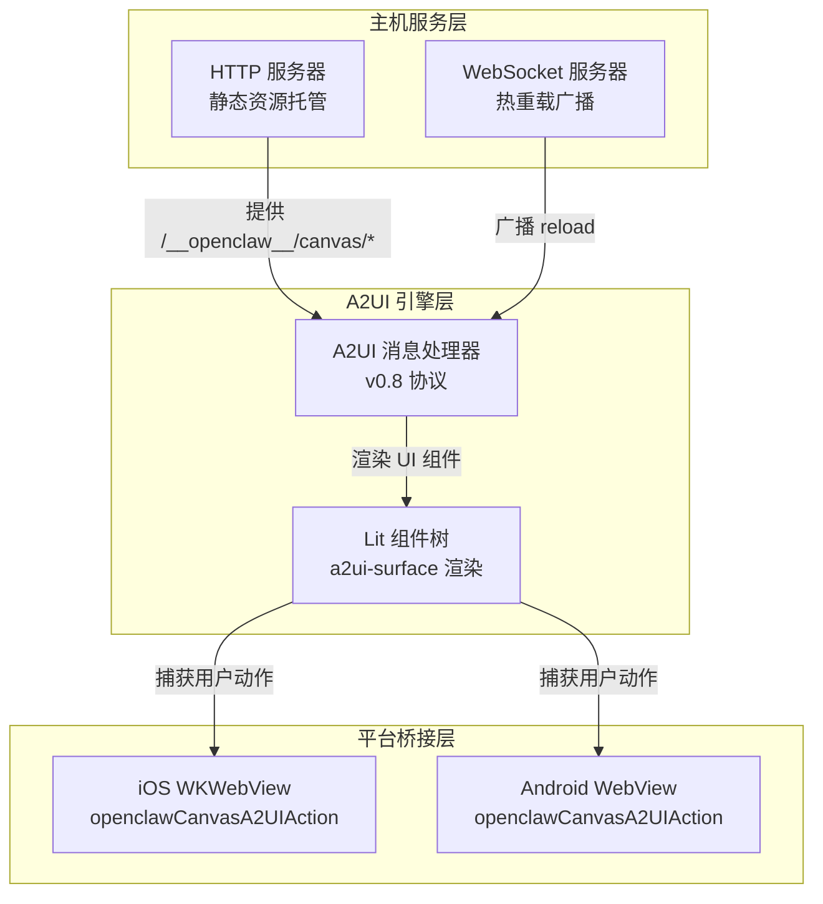
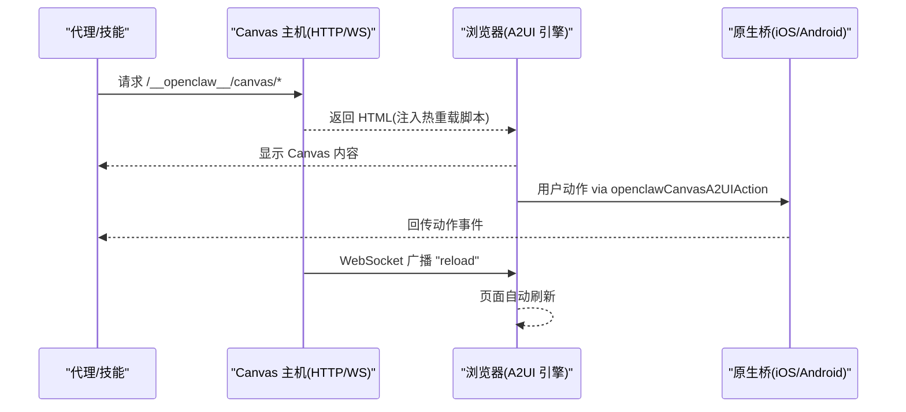
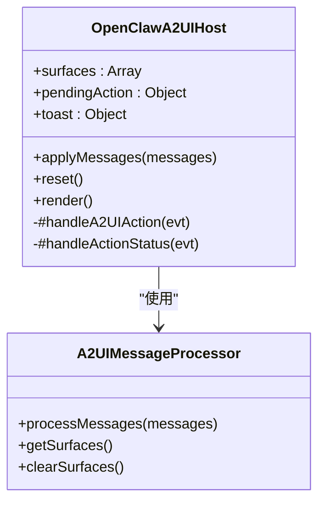
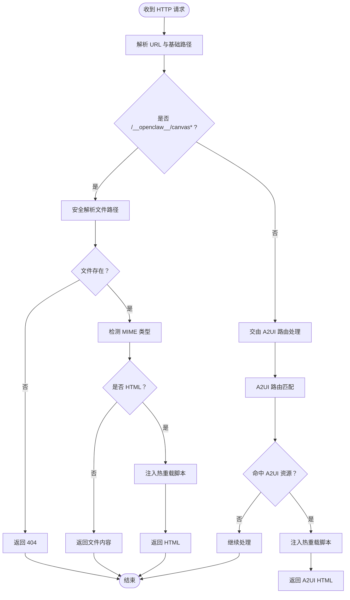
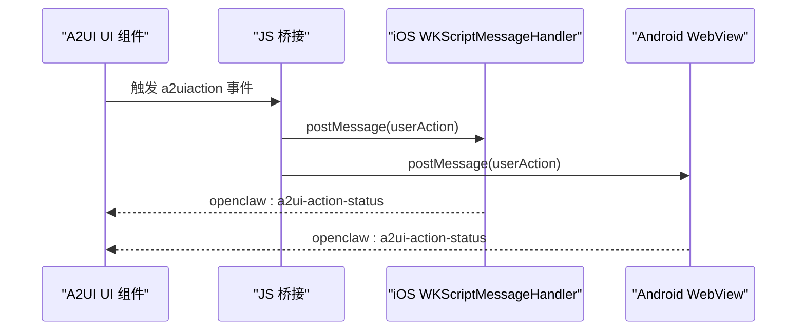
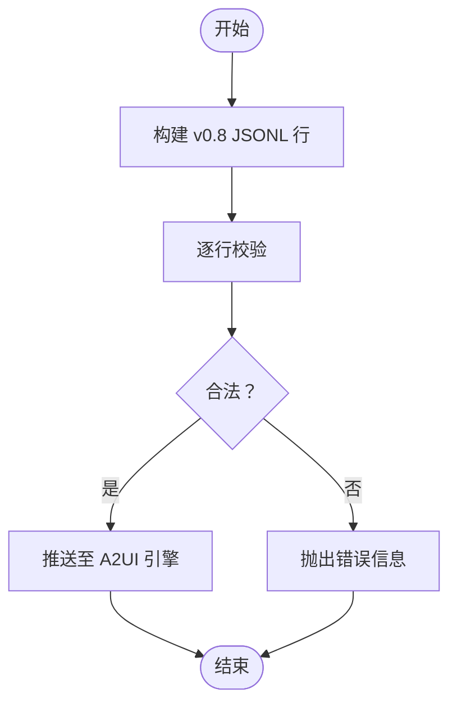
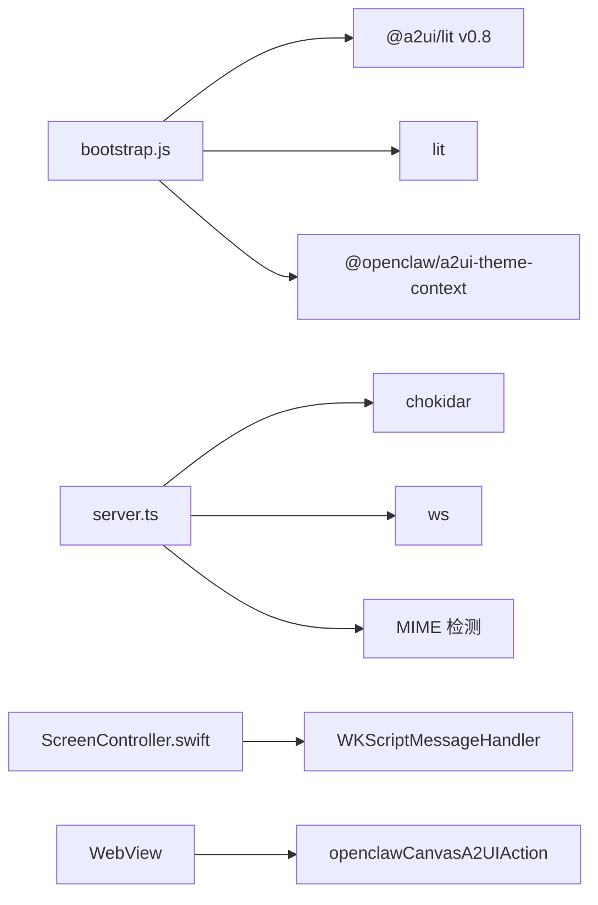

# Canvas 渲染工具

## 目录
1. [简介](#简介)
2. [项目结构](#项目结构)
3. [核心组件](#核心组件)
4. [架构总览](#架构总览)
5. [详细组件分析](#详细组件分析)
6. [依赖关系分析](#依赖关系分析)
7. [性能考虑](#性能考虑)
8. [故障排查指南](#故障排查指南)
9. [结论](#结论)
10. [附录](#附录)

## 简介
本文件系统性阐述 Canvas 渲染工具的架构与实现，重点覆盖：
- A2UI 渲染引擎：基于自研 A2UI v0.8 消息协议的 Web 组件渲染管线
- Canvas 主机服务：静态资源托管、热重载与 WebSocket 升级
- 跨平台集成：iOS/WKWebView 与 Android WebView 的消息桥接
- 实时交互：用户动作捕获、状态反馈与跨端回调
- 配置参数与性能优化：路径前缀、热重载、监听地址与 MIME 类型检测
- 使用示例：HTML 内容展示、A2UI 消息推送、截图与导航控制

## 项目结构
Canvas 渲染工具由“主机服务 + A2UI 引擎 + 平台桥接”三层组成：
- 主机服务层：提供 HTTP/WS 服务，托管 Canvas 资源并注入热重载脚本
- A2UI 引擎层：在浏览器中解析 A2UI v0.8 消息，驱动 UI 组件树与动作分发
- 平台桥接层：iOS（WKWebView）与 Android（WebView）通过消息处理器与 JS 互通

## 核心组件
- Canvas 主机服务
  - 提供 HTTP 服务与 WebSocket 升级，支持热重载
  - 自动注入热重载脚本到 HTML 页面
  - 安全路径解析，防止目录穿越
- A2UI 渲染引擎
  - 解析 A2UI v0.8 消息（beginRendering/surfaceUpdate/dataModelUpdate/deleteSurface）
  - 基于 Lit 的组件树渲染与状态管理
  - 用户动作捕获并通过原生桥转发
- 平台桥接
  - iOS：WKScriptMessageHandler 注入 `openclawCanvasA2UIAction`
  - Android：全局对象 `openclawCanvasA2UIAction.postMessage`
- CLI 与技能
  - A2UI JSONL 构建与校验工具
  - Canvas 技能文档定义了 URL 结构与调试流程

## 架构总览
Canvas 渲染工具采用“服务端静态资源 + 浏览器 A2UI 引擎 + 原生桥”的三段式架构。服务端负责资源分发与热重载，浏览器负责渲染与交互，原生层负责动作回传与页面控制。

## 详细组件分析

### A2UI 渲染引擎（浏览器侧）
- 消息处理
  - 使用 v0.8 数据处理器解析 beginRendering/surfaceUpdate/dataModelUpdate/deleteSurface
  - 支持多表面（surface）管理与组件树更新
- 渲染与状态
  - Lit 组件 a2ui-surface 渲染各表面
  - 状态栏与 Toast 提示当前动作发送/成功/失败
- 动作桥接
  - 捕获 a2uiaction 事件，构造 userAction 并通过原生桥 postMessage
  - 兼容 iOS WebKit 与 Android WebView 的不同桥接方式

### Canvas 主机服务（Node 侧）
- HTTP 处理
  - 解析请求路径，安全定位文件，注入热重载脚本到 HTML
  - MIME 类型检测，禁用缓存
- WebSocket 热重载
  - 监听文件变更，通过 WebSocket 广播 “reload”
  - 升级握手仅允许 /__openclaw__/ws
- 安全与容错
  - 路径规范化与符号链接检查，防止越权访问
  - 错误日志与优雅降级（如 watcher 失败时关闭热重载）

### 平台桥接（iOS 与 Android）
- iOS（WKWebView）
  - 注册 `openclawCanvasA2UIAction` 消息处理器
  - 仅信任本地 Canvas 框架或本地网络 URL 的动作来源
  - 提供等待 A2UI 就绪、执行 JS、截图等能力
- Android（WebView）
  - 通过全局对象 `openclawCanvasA2UIAction.postMessage` 发送动作
  - 严格区分结构化对象与字符串序列化差异

### A2UI 消息协议与 JSONL 工具
- 协议版本
  - 服务端/客户端消息：v0.8（beginRendering/surfaceUpdate/dataModelUpdate/deleteSurface）
  - JSONL 构建与校验工具用于快速生成 v0.8 消息流
- 校验规则
  - 禁止 v0.9 的 createSurface 出现在 v0.8 场景
  - 校验行内对象类型与关键字段

## 依赖关系分析
- 组件耦合
  - A2UI 引擎依赖 v0.8 消息处理器与 Lit 组件生态
  - 主机服务依赖 chokidar（热重载）、ws（WebSocket）、MIME 检测
  - 平台桥接依赖 WKWebView/WebView 的消息接口
- 外部依赖
  - @a2ui/lit、lit、@openclaw/a2ui-theme-context
  - chokidar、ws、mime 检测
- 可能的循环依赖
  - 无直接循环；模块职责清晰：服务层/引擎层/桥接层

## 性能考虑
- 热重载策略
  - 文件变更后进行去抖（约 75ms），批量广播 “reload”，避免频繁刷新
  - 监视器可配置轮询模式以适配测试环境
- 资源加载
  - HTML 注入热重载脚本，WebSocket 连接按需建立
  - 禁用缓存确保开发体验，生产部署建议自行缓存策略
- 渲染优化
  - A2UI 引擎按表面增量更新，Lit 组件复用与重复指令减少重绘
  - iOS/Android 桥接采用 postMessage，避免阻塞主线程
- 路径与安全
  - 路径规范化与符号链接检查降低越权风险与异常开销

## 故障排查指南
- 白屏或内容不加载
  - 检查网关绑定模式与主机 URL 是否一致（Tailscale/LAN/Loopback）
  - 使用 curl 直接访问主机 URL 验证
- “节点未连接/需要节点 ID”
  - 确认目标节点在线且具备 Canvas 能力
- 内容不更新
  - 确认 liveReload 开启、文件位于根目录、监视器无错误
- 动作无法回传
  - 确认原生桥已注册，来源 URL 为受信范围（本地网络或内置 Canvas）
  - 检查 openclaw:a2ui-action-status 事件是否触发

## 结论
Canvas 渲染工具通过清晰的服务层、引擎层与桥接层划分，实现了跨平台的 HTML/JS 内容渲染与实时交互。A2UI v0.8 协议与热重载机制显著提升了开发效率与用户体验。遵循本文档的配置与优化建议，可在多端稳定运行并扩展更多可视化场景。

## 附录

### 配置参数与路径
- Canvas 主机
  - 端口与监听地址：可通过启动参数配置
  - 根目录：默认用户目录下的 .openclaw/canvas，不存在时自动创建并写入默认首页
  - 基础路径：/__openclaw__/canvas（可通过 basePath 参数调整）
  - 热重载：默认开启，可关闭
- A2UI 资产
  - 路径解析优先级：运行目录 → 源码目录 → 仓库根 → 分发目录
  - 注入热重载脚本到 HTML，WebSocket 路径 /__openclaw__/ws

### API 与事件
- A2UI 命令
  - push/pushJSONL：推送 A2UI v0.8 消息数组
  - reset：重置渲染状态
- 事件
  - openclaw:a2ui-action-status：动作状态反馈（ok/error）
  - a2uiaction：捕获用户动作并构造 userAction

### 使用示例（步骤说明）
- 展示 HTML 内容
  - 将页面放入 Canvas 根目录，访问 `http://<host>:/__openclaw__/canvas/.html`
- 推送 A2UI 消息
  - 通过 canvas.a2ui.push 推送 v0.8 消息数组，或使用 JSONL 构建工具生成
- 截图与导航
  - iOS：调用快照接口获取 PNG/JPEG Base64
  - 导航：在 Canvas 中执行 eval 或通过技能命令切换 URL