# 一流工具系统

## 目录
1. [引言](#引言)
2. [项目结构](#项目结构)
3. [核心组件](#核心组件)
4. [架构总览](#架构总览)
5. [详细组件分析](#详细组件分析)
6. [依赖关系分析](#依赖关系分析)
7. [性能考量](#性能考量)
8. [故障排查指南](#故障排查指南)
9. [结论](#结论)
10. [附录](#附录)

## 引言
本文件系统性阐述 OpenClaw 的“一流工具系统”，覆盖工具注册机制、执行引擎、权限与安全控制、工具分类与能力边界、开发框架与 API、参数与结果处理、使用示例与组合调用、以及安全模型与沙箱策略。目标是帮助开发者快速理解并高效扩展工具生态，同时确保在多平台与多运行时环境下的可维护性与安全性。

## 项目结构
OpenClaw 的工具体系由“核心工具集”和“插件工具集”构成，并通过统一的工具注册与策略系统进行编排。核心工具位于 agents/tools 目录，插件工具通过插件加载器动态注入。工具调用通过网关通道与节点宿主交互，部分工具具备跨平台实现（如 macOS Canvas 面板）。

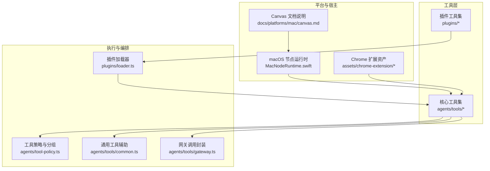

## 核心组件
- 工具注册与发现：插件加载器负责扫描候选插件、校验清单、解析导出、构建 API 并注册工具；支持缓存与诊断输出。
- 工具策略与分组：内置工具分组与预设策略，支持插件工具分组展开与“仅插件允许列表”的清理逻辑，避免误封禁核心工具。
- 通用工具辅助：参数读取、类型转换、结果封装（文本/图片）、动作门控等，统一工具实现风格。
- 网关调用封装：标准化网关连接、鉴权与超时设置，屏蔽底层细节。
- 平台适配：macOS Canvas 面板通过自定义 URL Scheme 暴露，节点侧对 Canvas 命令进行启用状态检查与错误返回。
- 安全与权限：工具策略、沙箱与“提升权限”三重防线；Chrome 扩展与浏览器工具的安全边界由 manifest 与后台脚本管理。

## 架构总览
工具系统以“策略—注册—执行—反馈”为主线，结合网关与节点宿主完成端到端调用。

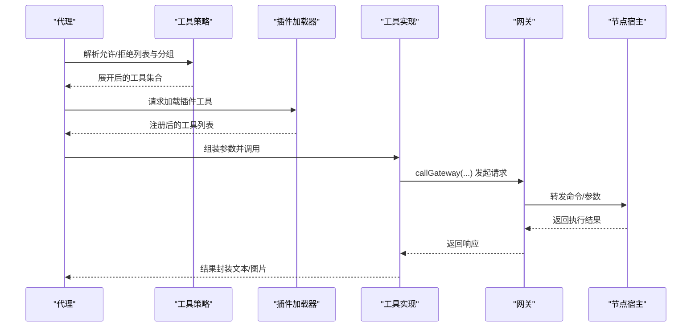

## 详细组件分析

### 工具注册与插件系统
- 插件发现与清单：从工作区与额外路径发现候选插件，加载清单并校验配置模式。
- 导出解析与注册：优先 default 导出或兼容 activate/register，捕获并记录错误。
- 冲突与覆盖：同 ID 插件按来源覆盖，记录状态与诊断信息。
- 记忆槽位决策：根据配置选择记忆类插件，未匹配时发出警告。
- 缓存与全局钩子：注册后写入活跃注册表并初始化全局钩子运行器。

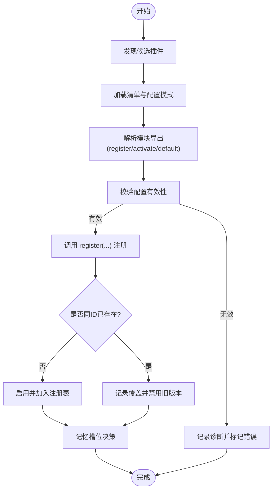

### 工具策略与分组
- 分组定义：内存、Web、文件系统、运行时、会话、UI、自动化、消息、节点等分组。
- 预设策略：minimal、coding、messaging、full 四档默认策略。
- 插件工具分组：按插件 ID 收集工具名，支持 `group:plugins` 与按插件 ID 展开。
- 允许列表清理：当仅包含插件工具时自动剥离 allow 列表，防止误封禁核心工具。

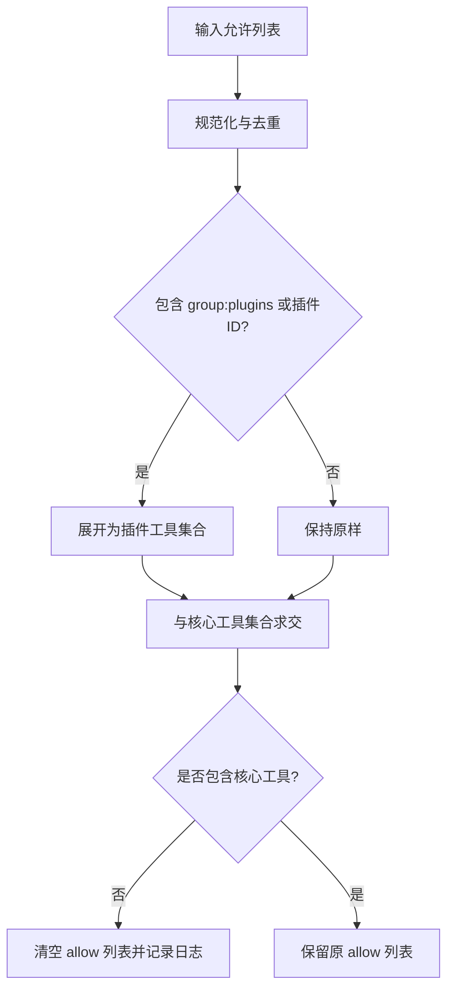

### 通用工具辅助与结果封装
- 参数读取：字符串、数字、数组、反应表情等参数读取与校验。
- 结果封装：统一 JSON 文本与图片结果，支持媒体路径与 MIME 类型。
- 图像结果：从文件读取并检测 MIME，自动清洗工具结果中的图片。

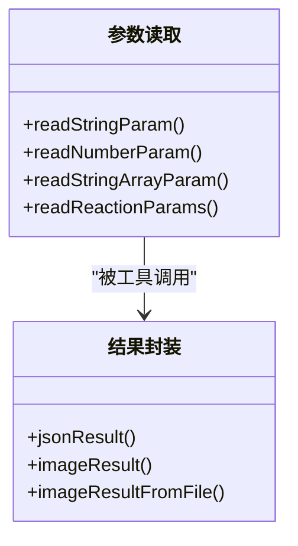

### 网关调用封装
- 默认网关地址与超时设置。
- 统一 callGateway 调用，携带客户端标识与模式，支持期望最终响应。

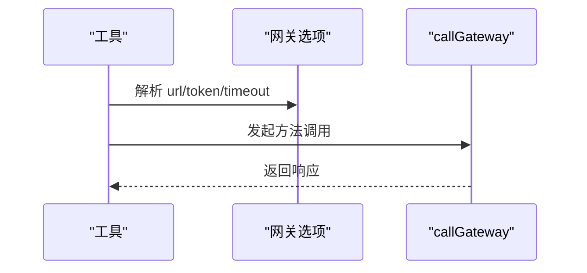

### 浏览器控制工具
- 功能：导航、滚动、截图、等待、注入脚本、关闭标签页等。
- 参数：URL、选择器、延迟、视口、截图格式等。
- 安全：Chrome 扩展 manifest 与后台脚本配合，限制权限范围。

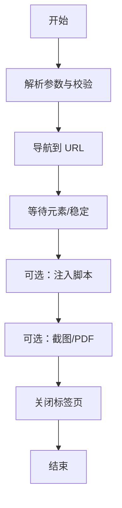

### Canvas 工具（macOS）
- 功能：显示/隐藏面板、导航到路径或 URL、执行 JS、截屏、A2UI 推送/重置。
- 权限：需在设置中启用 Canvas；节点侧对 Canvas 命令进行可用性检查。
- 资源：通过自定义 URL Scheme 提供静态资源与交互入口。

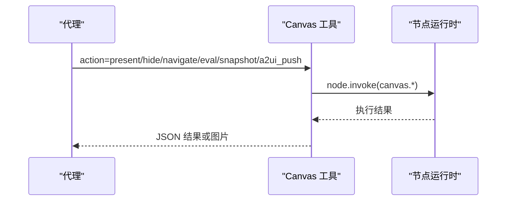

### 节点操作工具
- 功能：查询节点列表、解析节点 ID、转发命令至节点宿主。
- 适用场景：跨节点批量操作、远程设备控制。

### 定时任务工具
- 功能：基于 Cron 表达式调度任务，支持周期性与一次性任务。
- 应用：轮询、心跳、定期清理、数据同步等。

### 插件工具
- 加载：通过插件加载器扫描、校验、注册，生成工具集合。
- 允许：结合策略系统，支持 `group:plugins` 与按插件 ID 展开。
- 开发：遵循插件 SDK 接口，提供通道、路由、媒体、日志、状态等能力。

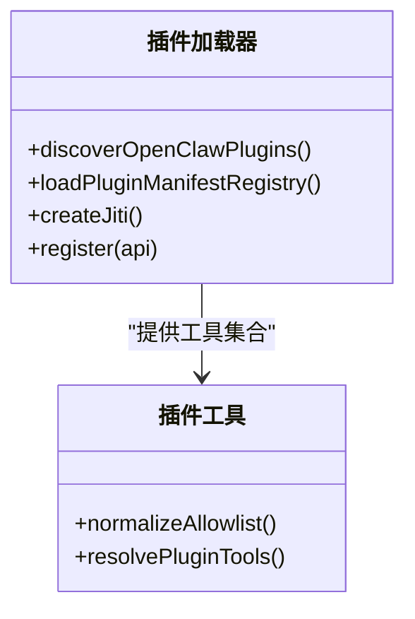

### Web 工具族
- 搜索：聚合多个搜索引擎，返回摘要与链接。
- 抓取：提取正文、标题、元信息，支持可选可读性优化。
- 结果处理：统一文本与图片输出，支持媒体清洗。

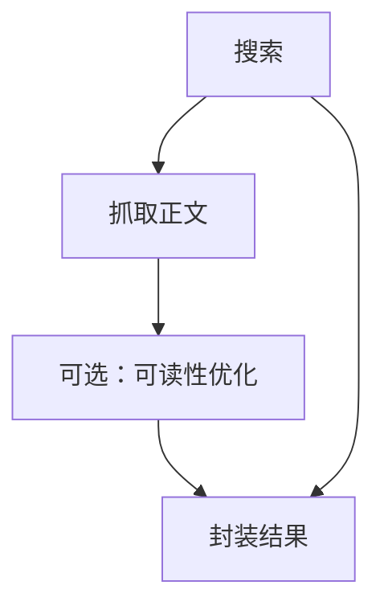

### 图像工具
- 功能：图像识别、OCR、格式转换、压缩与结果封装。
- 场景：文档理解、截图分析、视觉问答。

### 会话与消息工具
- 会话状态：查询当前会话状态。
- 会话列表：列出会话、历史、发送消息、创建子会话。
- 消息发送：支持多通道路由与回复派发。

### 语音合成工具
- 功能：文本转语音，支持不同音色与语速。
- 场景：播报、朗读、无障碍。

### 网关工具
- 功能：直接调用网关方法，透传参数与鉴权。
- 场景：低层调试、自定义扩展。

### 记忆工具
- 功能：检索与获取记忆片段，支持过滤与排序。
- 场景：上下文增强、知识检索。

### 其他工具
- 代理列表：列出可用代理。
- 技能与任务：技能编排、LLM 任务、思考与反应等。

## 依赖关系分析
- 工具与策略：所有工具均受策略约束，插件工具通过分组与展开参与策略计算。
- 工具与网关：多数工具通过网关封装发起请求，确保一致的鉴权与超时控制。
- 插件与加载器：插件工具依赖加载器提供的 API 与运行时环境。
- 平台与宿主：Canvas 工具依赖 macOS 节点运行时与 Canvas 文档说明中的协议。

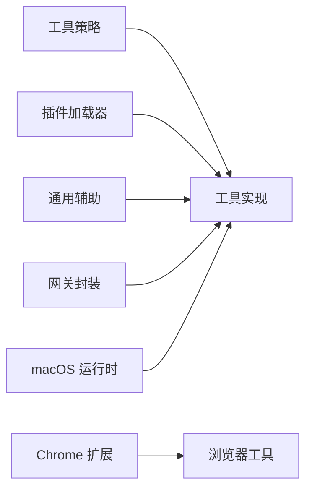

## 性能考量
- 插件缓存：插件加载器支持缓存键构建与命中，减少重复加载成本。
- 参数校验与类型转换：在工具层前置校验，降低无效调用带来的网络与计算浪费。
- 结果封装与媒体处理：统一图片 MIME 检测与清洗，避免重复 I/O。
- 网关超时与重试：合理设置超时，避免阻塞代理执行流。

## 故障排查指南
- 插件加载失败：检查清单配置、导出函数、依赖与权限；查看诊断日志。
- 工具策略误封：确认 allow 列表是否仅包含插件工具；必要时使用 tools.alsoAllow 或明确核心工具。
- 网关连接问题：核对默认地址、鉴权令牌与超时设置；确认客户端名称与模式。
- macOS Canvas 不可用：检查设置中 Canvas 启用状态与节点命令返回码。
- 浏览器工具异常：核对扩展 manifest 权限与后台脚本配置。

## 结论
OpenClaw 的工具系统以“策略—注册—执行—反馈”为核心闭环，通过统一的参数与结果封装、网关抽象与平台适配，实现了跨语言、跨平台、可扩展且安全可控的工具生态。插件机制与策略系统共同保证了灵活性与安全性，适合在复杂业务场景下进行组合与链式调用。

## 附录

### 使用示例与最佳实践
- 浏览器工具：导航到目标页面、注入脚本、截图并返回图片结果。
- Canvas 工具：显示面板、导航到指定路径、执行 JS、截屏并返回图片。
- 会话工具：查询会话状态、列出历史、发送消息、创建子会话。
- Web 工具：先搜索再抓取，统一输出文本与图片。
- 插件工具：通过 `group:plugins` 或按插件 ID 展开，结合 alsoAllow 实现增量授权。

### 安全模型与沙箱
- 策略与分组：限制工具访问面，避免“全量放行”导致的过度授权。
- 沙箱：通过独立进程与资源隔离，限制文件系统与网络访问。
- 提升权限：针对特定场景与提供方进行细粒度授权与门控。
- 浏览器安全：扩展权限最小化、后台脚本严格校验来源与参数。

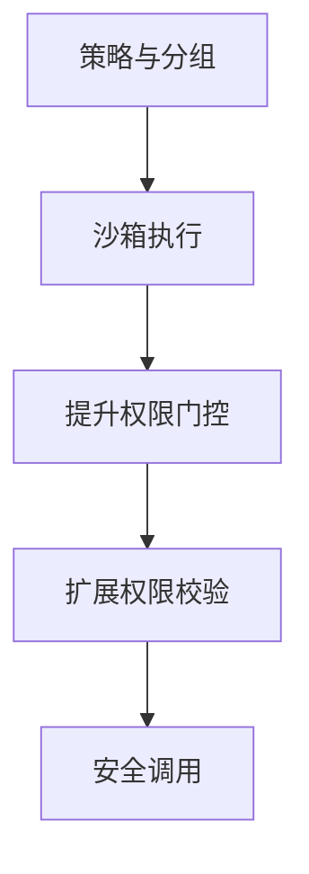