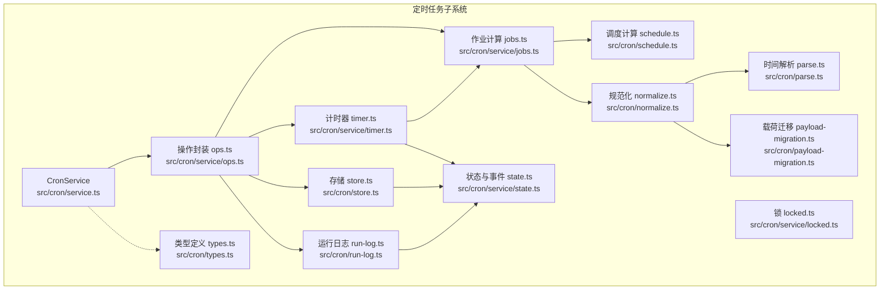
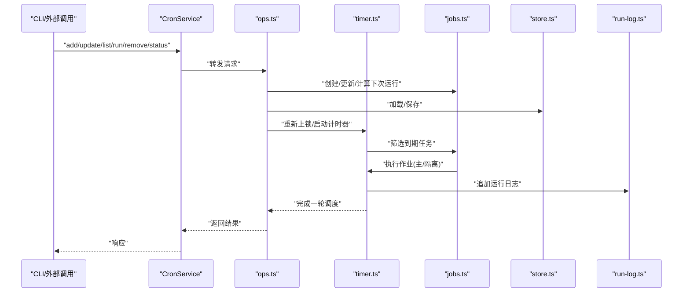
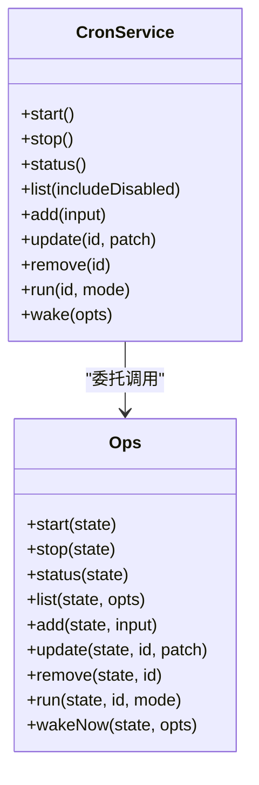
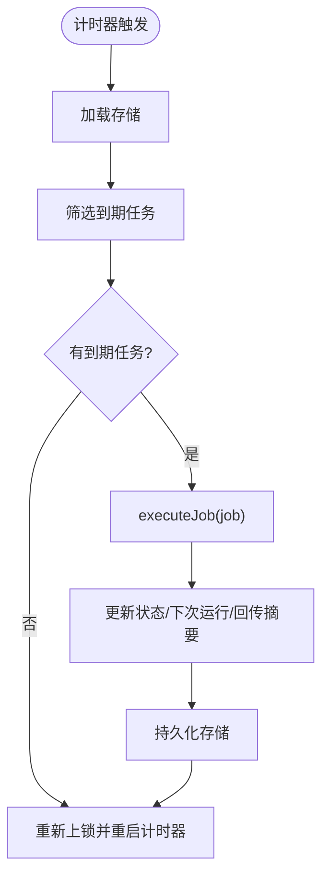
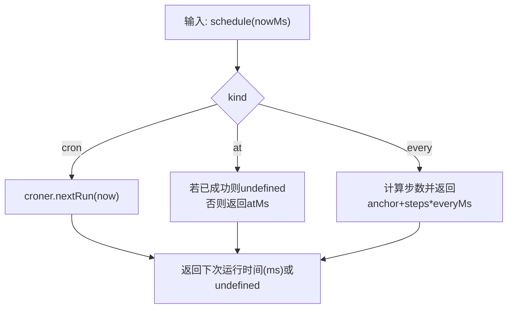
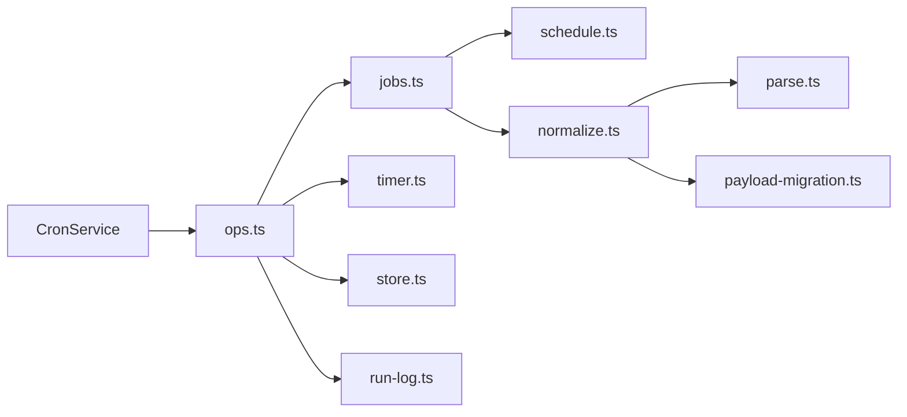

# 定时任务工具

## 目录
1. [简介](#简介)
2. [项目结构](#项目结构)
3. [核心组件](#核心组件)
4. [架构总览](#架构总览)
5. [详细组件分析](#详细组件分析)
6. [依赖关系分析](#依赖关系分析)
7. [性能考量](#性能考量)
8. [故障排查指南](#故障排查指南)
9. [结论](#结论)
10. [附录：使用示例与最佳实践](#附录使用示例与最佳实践)

## 简介
本文件系统化阐述定时任务工具的设计与实现，覆盖调度引擎、任务队列管理、执行监控、并发控制、错误处理、配置与运行日志等。文档同时给出使用示例（周期性任务、一次性任务、条件触发与任务链编排思路）、安全与审计要点，以及面向开发者的框架、调试与性能优化建议。

## 项目结构
定时任务子系统位于 `src/cron` 目录，围绕“服务类 + 状态机 + 操作封装 + 计时器 + 存储 + 日志”的分层组织，配合 CLI 文档与 Swift 平台模型定义，形成从配置到执行再到可观测性的完整闭环。

## 核心组件
- 调度服务 CronService：对外暴露生命周期与 CRUD 接口，内部通过操作封装协调计时器、作业计算、存储与日志。
- 作业计算与调度：根据 `at`/`every`/`cron` 三种计划类型计算下次运行时间；支持一次性任务完成后自动禁用或删除。
- 计时器与并发控制：基于 Node `setTimeout` 的单线程计时器，通过互斥锁确保同一存储路径上的操作串行化，避免竞态。
- 存储与持久化：以 JSON5 文件存储任务清单，写入采用临时文件 + 原子重命名，并保留备份。
- 运行日志：按作业 ID 分割的 JSONL 文件，支持大小裁剪与行数裁剪，便于审计与回溯。
- 规范化与解析：统一输入格式，兼容旧版载荷字段迁移，解析绝对/相对时间，保证调度表达式与时区正确性。
- 执行模式：主会话（`systemEvent`）与隔离会话（`agentTurn`），支持交付输出与回传摘要。

## 架构总览
下图展示从 CLI/外部调用到调度服务、计时器、作业执行与回传的端到端流程。

## 详细组件分析

### 组件A：调度服务 CronService 与操作封装
- 对外接口：`start`/`stop`/`status`/`list`/`add`/`update`/`remove`/`run`/`wake`。
- 内部通过 `ops.ts` 将业务逻辑与状态管理解耦，确保幂等与一致性。
- 并发控制：通过 `locked.ts` 对同一 `storePath` 的操作进行串行化，避免多实例/并发写导致的数据竞争。

### 组件B：计时器与执行流程
- 计时器：`armTimer` 根据最近一次唤醒时间设置 `setTimeout`，最大延迟受系统限制保护；`onTimer` 中串行执行 `due` 任务。
- 执行流程：`executeJob` 标记运行中、回调 `onEvent`、执行主/隔离分支、更新状态、决定是否删除一次性任务、回传摘要到主会话并可立即心跳。
- 错误处理：捕获异常并标记 `error` 状态，记录 `lastError`；对卡住运行进行清理告警。

### 组件C：调度算法与时间解析
- 支持三种计划：
  - `at`：一次性，毫秒时间戳；若已成功则不再重复。
  - `every`：固定间隔毫秒；支持锚点 `anchorMs` 避免瞬时匹配导致无限循环。
  - `cron`：croner 解析表达式，支持 IANA 时区。
- 时间解析：`parse.ts` 支持 ISO 日期/日期时间字符串自动补全时区，绝对与相对时间转换。

### 组件D：存储与运行日志
- 存储：默认路径 `~/.openclaw/cron/jobs.json`，支持自定义路径；写入采用临时文件 + 原子重命名，并生成备份。
- 运行日志：按作业拆分 `runs/<jobId>.jsonl`，支持按字节上限与保留行数裁剪，保障长期运行稳定性。

### 组件E：规范化与载荷迁移
- 输入规范化：`normalize.ts` 将不同来源的配置统一为标准结构，自动推断 `sessionTarget`，迁移旧字段（如 `provider` 到 `channel`）。
- 载荷迁移：`payload-migration.ts` 处理历史遗留字段，避免破坏兼容性。

### 组件F：平台模型（Swift）
- macOS 平台定义了 `CronSchedule`/`CronSessionTarget`/`CronWakeMode` 等枚举与编码模型，用于 UI 层与后端数据一致。

## 依赖关系分析
- 低耦合高内聚：CronService 仅通过 `ops.ts` 暴露接口，内部依赖 `jobs.ts`/`schedule.ts`/`store.ts`/`run-log.ts` 等模块。
- 单一事实源：`store.ts` 提供持久化入口，所有变更均经其落盘。
- 可观测性：`onEvent` 回调与 `run-log` 共同构成事件与审计双通道。

## 性能考量
- 计时器上限：防止超大延迟导致的系统警告，确保长周期任务稳定。
- 串行化写入：通过互斥锁串行化存储操作，避免频繁 IO 抖动。
- 增量裁剪：运行日志按大小与行数裁剪，降低磁盘占用与读放大。
- 一次性任务去重：`at` 成功后自动禁用或删除，减少无效扫描。
- 最佳实践：
  - 合理设置 `wakeMode`，避免高频心跳阻塞主通道。
  - 使用隔离会话承载高频/噪音任务，降低对主会话的影响。
  - 控制日志保留规模，平衡可观测性与性能。

## 故障排查指南
- 无任务运行
  - 检查 cron 是否启用（配置与环境变量）。
  - 确认 Gateway 进程持续运行，且计时器已启动。
  - 核对 cron 表达式与时区，必要时在测试环境中验证 `nextRun`。
- Telegram 目标错配
  - 明确使用 `-100…:topic:` 形式，避免歧义。
- 运行日志缺失
  - 确认 `run-log` 路径存在且可写；检查裁剪策略是否过严。
- 并发冲突
  - 若出现存储写入失败，检查是否存在多个进程同时修改 `jobs.json`；建议通过 CLI 或 API 修改。

## 结论
该定时任务工具以清晰的分层与严格的并发控制实现了高可靠的任务调度：通过 `at`/`every`/`cron` 三类计划满足多样场景，主/隔离两种执行模式兼顾上下文与噪音控制，完善的存储与运行日志提供可观测性与审计能力。结合 CLI 文档与平台模型，既适合开发者集成，也便于终端用户日常运维。

## 附录：使用示例与最佳实践

### 使用示例
- 一次性提醒（主会话，立即唤醒）
- 周期性隔离任务（交付到频道）
- 模型与思考层级覆盖（隔离任务）
- 编辑与手动运行

### 配置与选项
- 开关与并发
- 存储路径与历史
- CLI 快速编辑

### 安全与审计
- 权限与代理
  - 主会话执行受心跳上下文约束；隔离会话独立会话，注意敏感信息与输出交付。
- 审计与回溯
  - 使用 `run-log` 查看每条 `finished` 记录，结合 `onEvent` 事件流定位问题。