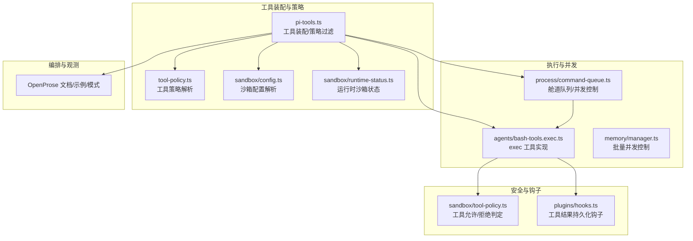
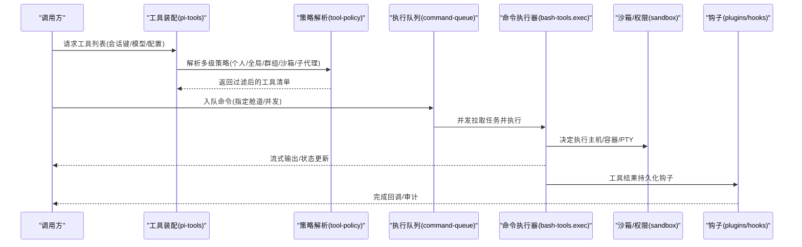
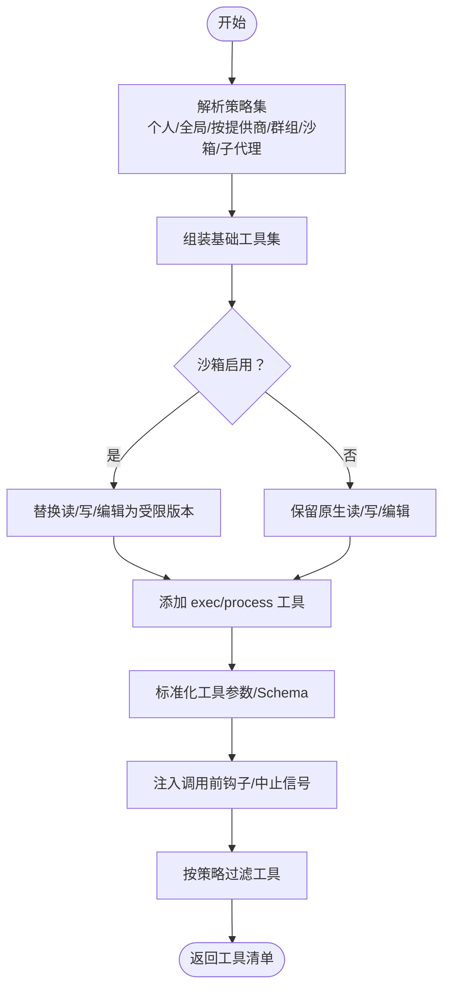
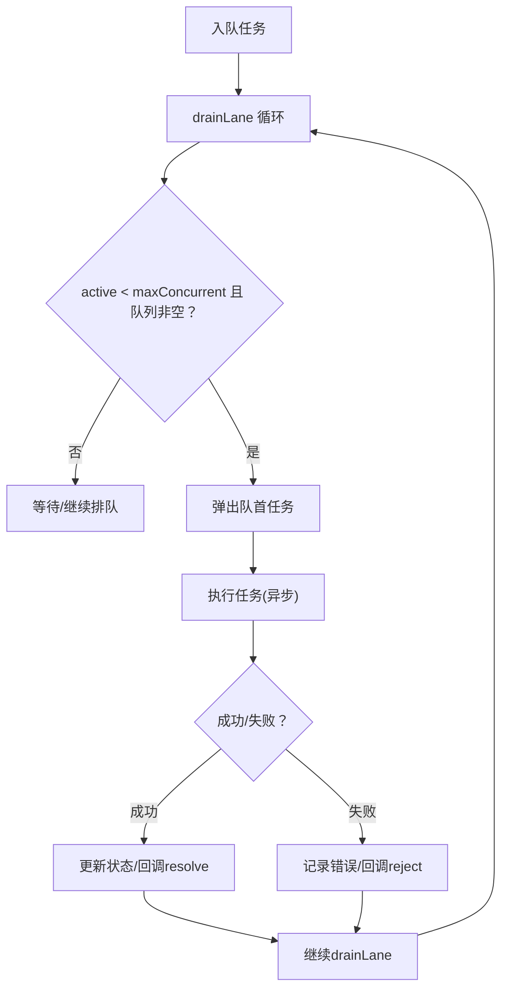
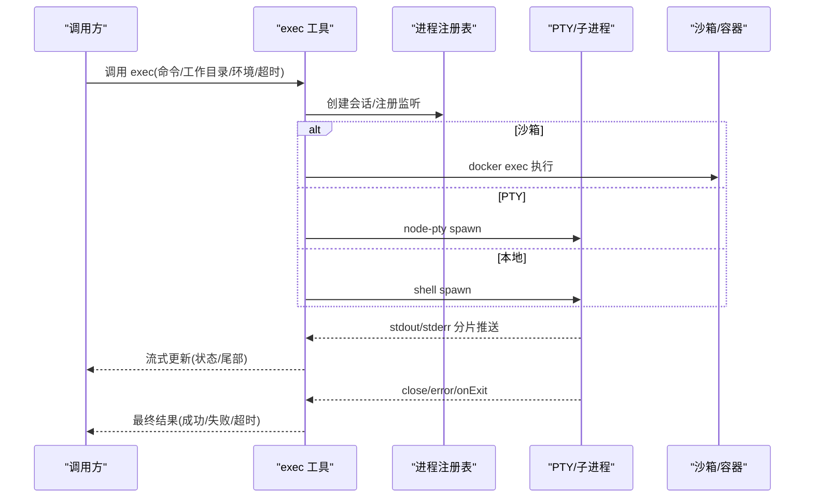
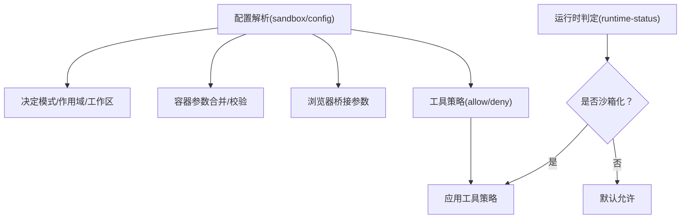
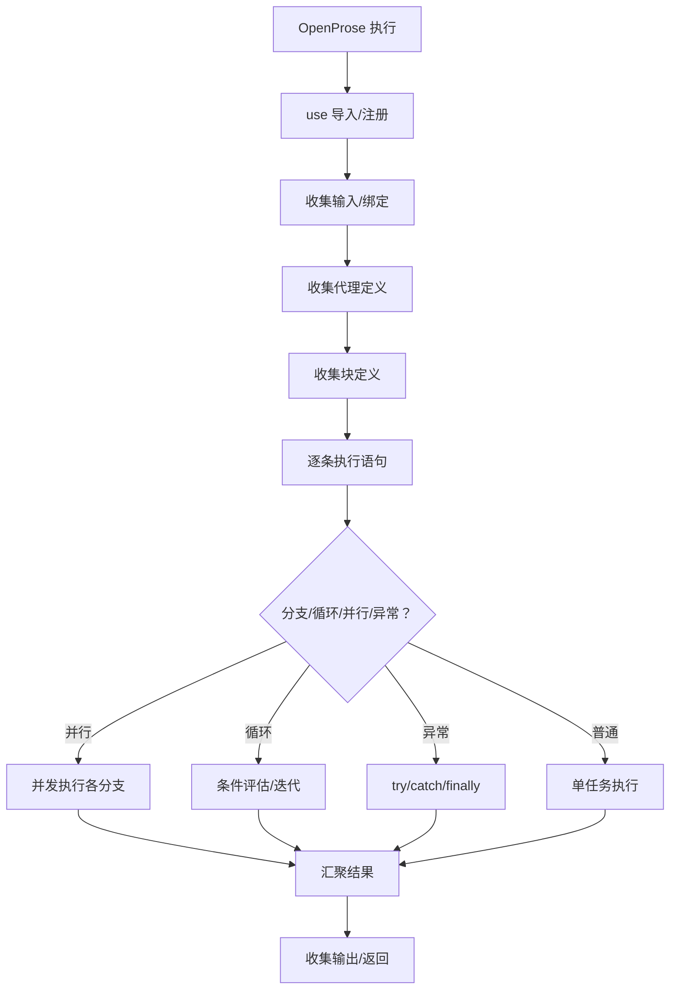
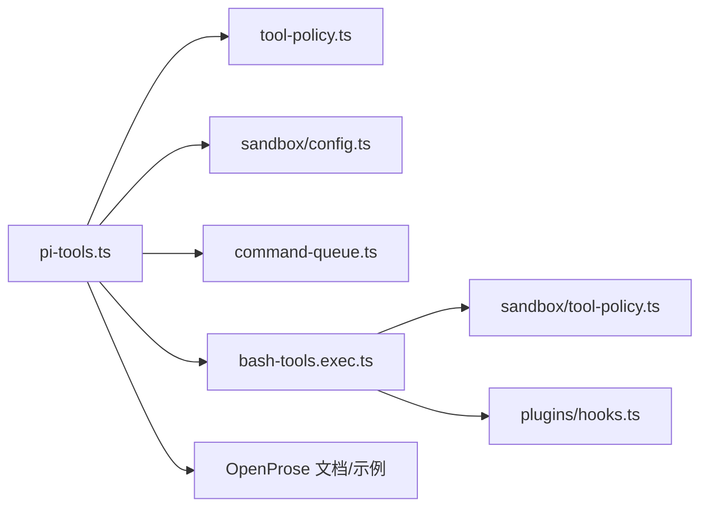

# 工具执行引擎

## 目录
1. [简介](#简介)
2. [项目结构](#项目结构)
3. [核心组件](#核心组件)
4. [架构总览](#架构总览)
5. [详细组件分析](#详细组件分析)
6. [依赖关系分析](#依赖关系分析)
7. [性能考量](#性能考量)
8. [故障排查指南](#故障排查指南)
9. [结论](#结论)
10. [附录](#附录)

## 简介
本文件系统性阐述“工具执行引擎”的架构与实现，覆盖执行调度、资源管理、并发控制、错误处理、安全模型与权限验证、沙箱控制、配置与策略、性能优化与监控等主题，并提供可操作的使用示例与扩展建议。该引擎以“工具”为核心抽象，统一编排系统命令、消息通道、浏览器桥接、节点交互等能力，同时通过多层策略与沙箱机制保障安全性与可控性。

## 项目结构
工具执行引擎由以下关键模块构成：
- 工具装配与策略：负责根据会话上下文、模型提供商、代理配置与插件组态，生成可用工具集并应用多级策略过滤。
- 执行队列与并发：提供基于“舱道（Lane）”的串行化与并发控制，避免主工作流的输出交错与资源争用。
- 命令执行器：封装 `exec` 工具的参数归一化、环境构建、PTY/容器执行、超时与退出通知、审批与降级重试。
- 沙箱与权限：解析沙箱模式、工具白名单、容器运行参数、浏览器桥接与自动启动策略，以及运行时状态判定。
- 观测与钩子：在工具结果持久化等关键路径注入钩子，支持审计与扩展。
- OpenProse 执行语义：提供声明式控制流（并行、循环、条件、异常块）与状态跟踪，便于复杂任务编排。

## 核心组件
- 工具装配与策略
  - 基于会话键、模型提供商、代理配置与插件组态，解析有效工具集合，并按“个人/全局/按提供商/群组/沙箱/子代理”等维度进行策略叠加与过滤。
  - 对工具参数进行标准化（如 Claude Code 兼容），并在调用前注入“调用前钩子”与“中止信号”包装。
- 执行队列与并发
  - 以“舱道（Lane）”隔离不同类型的命令，主舱道默认串行，其他舱道可配置最大并发，避免日志与标准输入交错。
  - 提供入队、并发度调整、队列大小查询与清空等接口。
- 命令执行器（`exec`）
  - 支持在沙箱容器、网关主机或节点上执行；自动选择 PTY 或非 PTY；具备超时、输出截断、尾部通知、审批等待与降级重试。
  - 对宿主环境变量进行严格校验，阻断潜在注入风险。
- 沙箱与权限
  - 解析沙箱模式、作用域、工作区访问级别、容器镜像与网络、工具白名单、浏览器桥接与自动启动策略。
  - 运行时判定是否沙箱化、工具是否被允许，并格式化被阻止工具的提示信息。
- 钩子与可观测性
  - 在工具结果持久化路径注入同步钩子，顺序执行处理器，支持消息替换与链式处理。
  - OpenProse 提供丰富的执行语义与模式，便于可视化状态跟踪与性能剖析。

## 架构总览
下图展示从“工具装配”到“执行与并发控制”，再到“安全与钩子”的整体流程：

## 详细组件分析

### 组件A：工具装配与策略（pi-tools）
- 职责
  - 组装基础编码工具（读/写/编辑），按沙箱启用情况替换为受限版本。
  - 创建 `exec` 与 `process` 工具，注入会话键、工作区、超时、背景运行、审批通知等配置。
  - 合并多源策略（个人/全局/按提供商/群组/沙箱/子代理），标准化工具参数与 JSON Schema。
  - 注入“调用前钩子”与“中止信号”包装，确保可观测与可中断。
- 关键点
  - 工具名规范化与未知条目告警，避免误用插件工具。
  - 插件组态与核心工具集合的去重与匹配。
  - 对特定模型（如 OpenAI）启用补丁应用工具的条件判断。

### 组件B：执行队列与并发（command-queue）
- 职责
  - 以“舱道（Lane）”隔离不同任务类型，主舱道默认串行，其他舱道可配置并发上限。
  - 维护队列长度、活动任务数、等待告警阈值与回调；出错时记录诊断日志。
  - 提供设置并发、入队、查询总量、清空舱道等接口。
- 关键点
  - `drainLane` 循环拉取任务，满足并发限制与队列非空条件才执行。
  - 探针舱道（如认证探测）的错误日志抑制，避免噪音。

### 组件C：命令执行器（`exec` 工具）
- 职责
  - 统一 `exec` 工具的参数归一化、工作目录与环境变量合并、PTY/容器执行、超时与退出通知。
  - 审批等待与运行中提醒、输出截断与尾部通知、失败原因聚合。
  - 对宿主环境变量进行严格校验，阻断危险变量与自定义 `PATH`。
- 关键点
  - `runExecProcess` 中根据沙箱配置选择 `docker exec` 或本地 shell/PTY。
  - 超时后 SIGKILL 并在最终收尾阶段汇总失败原因。
  - `emitExecSystemEvent` 与心跳触发用于系统事件上报。

### 组件D：沙箱与权限
- 配置解析
  - `resolveSandboxConfigForAgent`：综合全局与代理级配置，确定模式、作用域、工作区访问、容器与浏览器参数、工具策略与清理策略。
  - `resolveSandboxDockerConfig`/`resolveSandboxBrowserConfig`：合并环境变量、ulimit、binds、网络、DNS、端口等。
- 运行时判定
  - `resolveSandboxRuntimeStatus`：根据会话键与代理配置，判定是否沙箱化、工具策略与主会话键。
  - `formatSandboxToolPolicyBlockedMessage`：当工具被阻止时生成用户提示。
- 工具策略
  - `isToolAllowed`：基于 allow/deny 模式与正则/精确匹配，判定工具是否允许。

### 组件E：OpenProse 执行语义与状态跟踪
- 执行算法
  - 使用 `Task` 执行会话，支持并行分支、循环、条件、try/catch/finally、块调用与变量绑定。
- 状态与叙事
  - 通过帧标记（Frame+/-）、执行 ID 与父链，清晰追踪嵌套调用与绑定作用域。
- 性能剖析
  - 提供按模型/子代理/绑定粒度的统计字段，包含令牌、耗时、成本与并行因子。

## 依赖关系分析
- 工具装配依赖策略解析与沙箱配置，二者共同决定可用工具集。
- 执行队列为执行器提供并发与舱道隔离，避免主工作流的输出交错。
- 命令执行器依赖沙箱策略与容器参数，同时向钩子模块发出持久化事件。
- OpenProse 提供高层编排与状态跟踪，与底层执行器形成互补。

## 性能考量
- 并发与舱道
  - 主舱道串行保证日志与交互稳定；对低风险任务（如定时任务）使用独立舱道并提升并发上限。
  - 使用 `setCommandLaneConcurrency` 动态调整舱道并发，结合 `getQueueSize` 监控队列长度。
- 批量与并行执行
  - `memory/manager` 的 `runWithConcurrency` 可在批量场景中限制并发度，避免资源争用与级联失败。
- 输出与超时
  - `exec` 工具内置最大输出字符数与超时控制，防止长时间运行任务占用资源。
- 编排模式
  - OpenProse 的并行独立工作、分而治之、渐进披露与工作窃取等模式，有助于缩短端到端时延与降低峰值负载。

## 故障排查指南
- 审批与等待
  - `exec` 工具在需要审批时进入“approval-pending”状态，可通过运行中提醒与到期时间感知等待时长。
- 错误日志与诊断
  - 舱道任务错误会记录诊断日志；探针舱道的错误会被抑制以减少噪音。
- 环境变量与 `PATH`
  - 宿主执行严格禁止危险变量与自定义 `PATH`，若出现“环境变量被禁止”类错误，请检查传入 `env`。
- 工具被阻止
  - 若工具被沙箱策略拒绝，运行时状态判定会给出明确提示；检查工具策略 allow/deny 与插件组态。
- 结果持久化
  - 工具结果持久化钩子按优先级顺序执行，前序处理器可替换消息；确认钩子链路与返回值。

## 结论
工具执行引擎通过“工具装配与策略 + 执行队列与并发 + 命令执行器 + 沙箱与权限 + 钩子与可观测性”的协同，实现了高安全、可扩展、可观测的任务编排与执行。OpenProse 的执行语义进一步提升了复杂流程的表达力与可维护性。配合合理的舱道与并发策略、严格的沙箱与工具策略、完善的监控与钩子，可在生产环境中稳定地支撑多样化工具调用与结果处理。

## 附录

### 使用示例与最佳实践
- 工具调用与参数传递
  - 使用 `createOpenClawCodingTools` 生成工具集，传入会话键、工作区、模型提供商、沙箱配置等，随后在对话中调用工具。
  - `exec` 工具支持命令、工作目录、环境变量、PTY、超时、背景运行、审批等待等参数。
- 结果收集与状态跟踪
  - `exec` 工具提供流式更新（状态/尾部输出），最终返回完成/失败与退出码/信号。
  - OpenProse 的并行、循环、条件与异常块可组合使用，配合帧标记与绑定作用域进行状态跟踪。
- 错误处理与执行日志
  - 舱道队列记录等待与错误日志；`exec` 工具在超时、信号或错误时聚合原因并返回。
  - 工具结果持久化钩子可用于审计与二次处理。
- 安全模型与权限验证
  - 沙箱模式与工具策略决定工具可用性；宿主执行严格校验环境变量与 `PATH`。
  - 消息工具在沙箱根未设置时跳过验证，便于无沙箱会话正常工作。

### 配置与扩展指南
- 沙箱容器配置
  - 支持 binds 数组、环境变量合并、ulimit、网络、DNS、端口映射等；测试用例验证了 binds 的字符串合法性。
- 工具策略
  - 允许/拒绝规则支持精确名与正则匹配；插件组态与核心工具集合的去重与展开。
- 扩展方法
  - 通过插件组态与工具参数标准化扩展新工具；在钩子中注入审计与持久化逻辑；利用 OpenProse 模式组织复杂流程。
- 调试技巧
  - 使用 `getQueueSize` 与 `getTotalQueueSize` 监控队列；在 `exec` 工具中启用审批运行中提醒；在沙箱策略中逐步收紧 allow 列表。

### 性能调优与监控
- 舱道并发与队列长度
  - 为主工作流保留主舱道串行，为后台任务分配独立舱道并提升并发；根据 `getQueueSize` 调整 `maxConcurrent`。
- 批量任务
  - 使用 `runWithConcurrency` 控制批量任务并发度，避免资源争用。
- OpenProse 性能剖析
