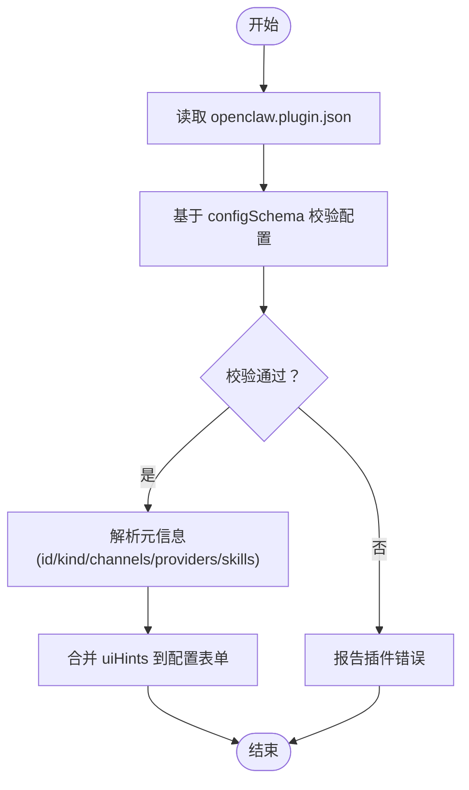

# 插件化工具

## 目录
1. [简介](#简介)
2. [项目结构](#项目结构)
3. [核心组件](#核心组件)
4. [架构总览](#架构总览)
5. [详细组件分析](#详细组件分析)
6. [依赖关系分析](#依赖关系分析)
7. [性能考虑](#性能考虑)
8. [故障排查指南](#故障排查指南)
9. [结论](#结论)
10. [附录](#附录)

## 简介
本文件系统性阐述 OpenClaw 的插件化工具体系，覆盖插件加载器、运行时环境与生命周期管理、动态加载与 API 接口、事件系统与状态管理、开发框架与接口规范、集成方式、安全模型与权限控制、沙箱执行机制，以及面向开发者的插件开发指南、SDK 使用方法与发布流程。目标是帮助不同技术背景的读者快速理解并高效使用与扩展插件生态。

## 项目结构
OpenClaw 将“插件”作为扩展点，围绕以下层次组织：
- 文档层：官方文档对插件系统进行总体说明、清单与工具注册、SDK 规划等
- 扩展层：位于 extensions/ 下的具体插件（如 voice-call）
- 核心层：Gateway 进程内的插件加载器、运行时注入、生命周期管理与安全策略

## 核心组件
- 插件清单与验证：每个插件必须提供 `openclaw.plugin.json`，包含 `id` 与 `configSchema`；用于在不执行代码的前提下完成配置校验与发现
- 插件注册 API：插件通过导出函数或对象，使用 `api.register*` 系列方法注册网关 RPC、HTTP 处理器、Agent 工具、CLI 命令、后台服务等
- 运行时注入：`api.runtime` 提供通道适配、日志、状态目录等能力，避免插件直接导入核心源码
- 生命周期：插件可注册服务，由 Gateway 在启动/停止阶段调用，确保资源正确分配与回收
- 安全与权限：插件以“受信任代码”在进程内运行，需通过 allowlist 控制启用范围；沙箱模式下对工具与系统能力进行白/黑名单限制

## 架构总览
插件系统采用“声明式清单 + 运行时注册”的双轨设计：
- 清单阶段：读取 `openclaw.plugin.json`，基于 JSON Schema 验证配置，解析插件元信息（`id`、`kind`、`channels`、`providers`、`skills` 等）
- 注册阶段：加载插件模块，调用其 `register(api)` 或默认导出函数，按需注册 RPC、工具、命令、服务等
- 运行阶段：Gateway 注入 `api.runtime`，插件通过统一接口访问核心能力；按需启动/停止服务，处理请求与事件

## 详细组件分析

### 组件A：插件清单与配置验证
- 必备字段：`id`（插件标识）、`configSchema`（严格 JSON Schema）
- 可选字段：`kind`、`channels`、`providers`、`skills`、`name`、`description`、`uiHints`、`version`
- 行为规则：未知 `channels.*` 键或 `plugins.entries.` 引用未知 `id` 视为错误；禁用插件保留配置并告警；manifest 缺失或损坏导致验证失败
- UI 帮助：`uiHints` 支持 `label`、`placeholder`、`sensitive` 等，用于控制 UI 表单渲染

### 组件B：插件注册 API 与运行时注入
- 注册类型：Gateway RPC 方法、HTTP 处理器、Agent 工具、CLI 命令、后台服务、自动回复命令、Provider 认证、消息通道适配
- 运行时能力：通过 `api.runtime` 提供通道文本处理、回复派发、路由、配对、媒体下载/保存、提及匹配、群组策略、防抖、命令授权、日志与状态目录等
- 生命周期：插件注册服务后，Gateway 在启动时调用 `start`，在关闭时调用 `stop`，确保资源释放

### 组件C：Agent 工具注册与调用
- 工具定义：名称、描述、参数（TypeBox 或 JSON Schema）、执行函数
- 可选工具：通过 `options.optional: true` 标记，需在 `agents.list[].tools.allow` 中显式允许
- 允许/拒绝策略：支持按插件 `id`、前缀 `group:plugins`、核心工具集合等粒度控制；sandbox 模式下受 `sandbox.tools.*` 限制
- 调用流程：LLM 生成工具调用计划 -> OpenClaw 解析参数 -> 调用 `api.registerTool.execute` -> 返回结构化结果

### 组件D：示例插件（Voice Call）的注册与运行
- 清单：`openclaw.plugin.json` 提供完整 `configSchema` 与 `uiHints`
- 注册：`index.ts` 中导出插件对象，`register(api)` 内部注册多个 Gateway RPC 方法（`initiate`/`continue`/`speak`/`end`/`status`/`start`）、Agent 工具、CLI 命令与后台服务
- 运行时：`ensureRuntime` 确保配置有效且仅在启用时初始化；服务在 `start`/`stop` 时创建/销毁运行时实例
- 安全提示：对旧配置项发出弃用警告，避免在生产环境使用

## 依赖关系分析
- 插件发现顺序：配置路径 -> 工作区扩展 -> 全局扩展 -> 内置扩展；同 `id` 后发现者覆盖先发现者
- 包打包：支持 `package.json` 中 `openclaw.extensions` 指定多个入口，形成多插件包
- 通道目录：支持外部通道目录合并，通过 `OPENCLAW_PLUGIN_CATALOG_PATHS` 等环境变量指定

## 性能考虑
- 插件加载：清单阶段不执行代码，仅基于 JSON Schema 校验，降低加载开销
- 运行时延迟初始化：`ensureRuntime` 按需创建运行时，避免不必要的资源占用
- 防抖与批处理：运行时提供防抖器，减少高频事件对核心的影响
- 日志与可观测：通过 `api.runtime.logging` 获取子日志器，便于定位插件问题

## 故障排查指南
- 清单错误：缺失或损坏的 `openclaw.plugin.json`、未知 `id`/键将导致验证失败；使用 `openclaw plugins doctor` 查看诊断
- 配置错误：`configSchema` 不匹配会阻断配置写入；根据 `uiHints` 字段修正敏感信息与占位符
- 运行时错误：服务 `start`/`stop` 抛错会在日志中记录；检查插件是否正确实现 `start`/`stop` 并处理异常
- 权限与沙箱：若工具不可用，检查 `agents.list[].tools.allow` 与 `sandbox.tools.*` 策略；必要时调整 allowlist 或切换非 main 会话沙箱模式

## 结论
OpenClaw 的插件化工具通过“严格清单 + 运行时注册 + 统一 SDK/运行时”的架构，实现了高扩展性与强约束的安全模型。开发者可通过清晰的接口与规范化的开发流程，快速构建并集成高质量插件；同时，严格的配置校验与沙箱策略保障了系统稳定与安全。

## 附录

### 开发者指南：从零到一
- 创建清单：编写 `openclaw.plugin.json`，至少包含 `id` 与 `configSchema`
- 实现注册：导出函数或对象，在 `register(api)` 中使用 `api.register*` 注册所需能力
- 配置 UI：在 `uiHints` 中完善字段标签、占位符与敏感标记
- 测试与分发：本地测试通过后，按 npm 包规范发布，确保 `openclaw.extensions` 指向正确入口