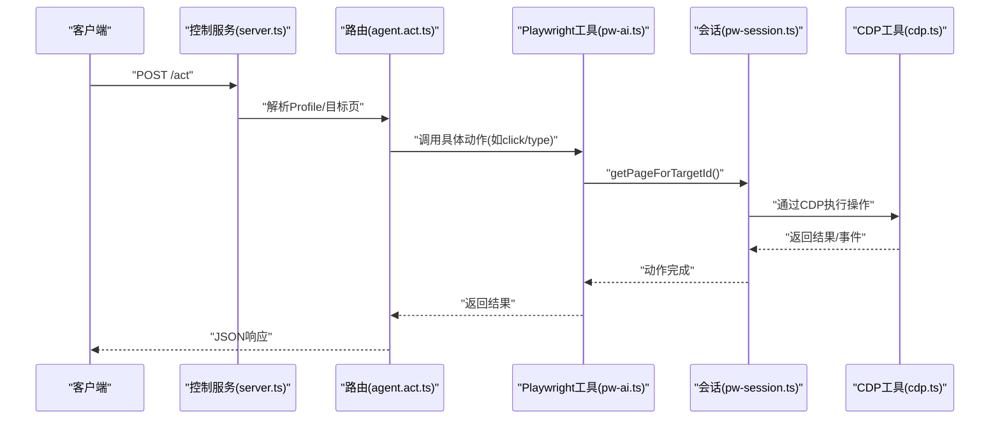
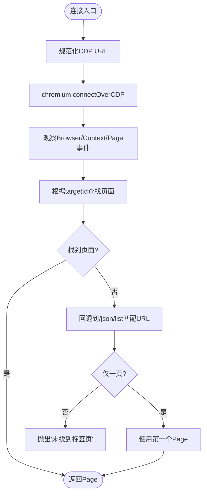
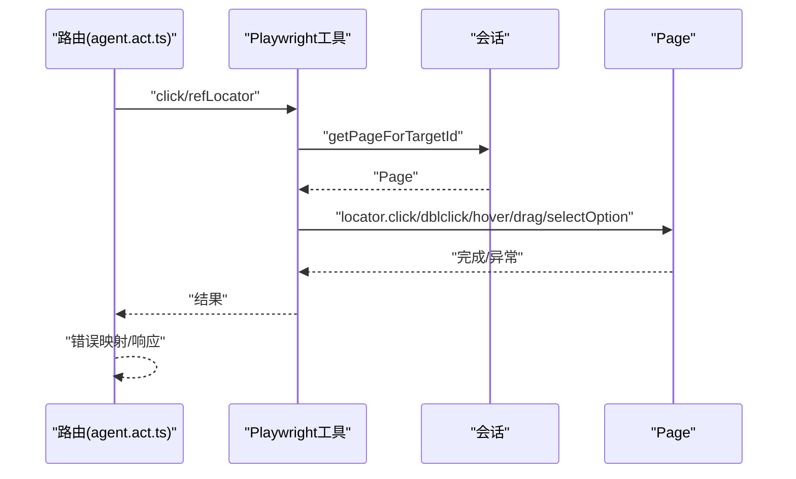
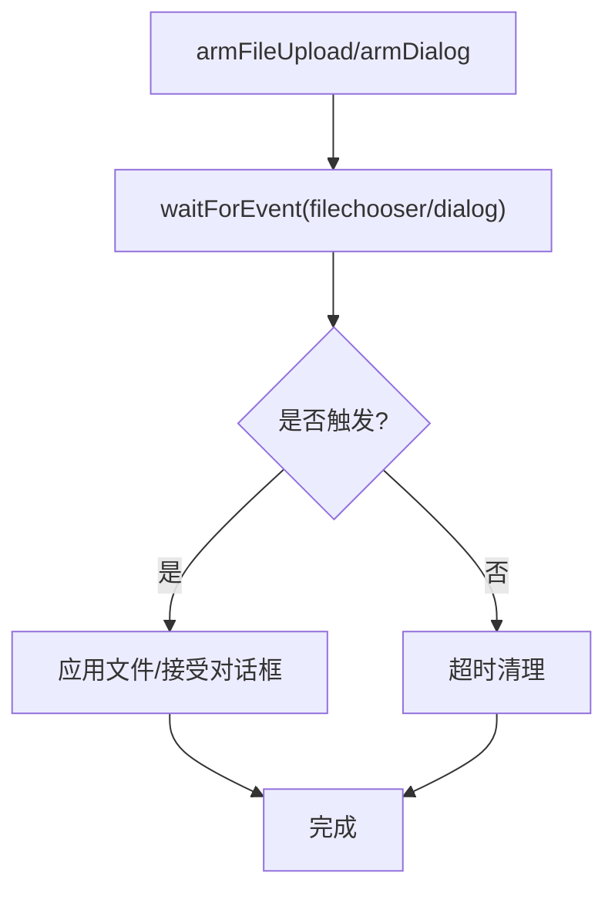
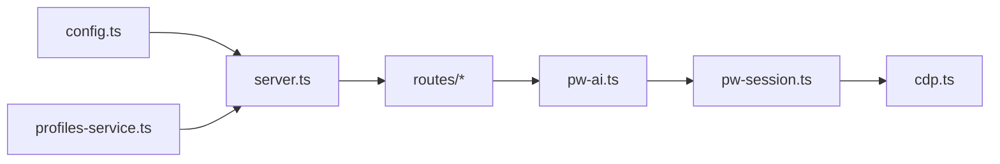

# 浏览器控制工具

## 目录
1. [简介](#简介)
2. [项目结构](#项目结构)
3. [核心组件](#核心组件)
4. [架构总览](#架构总览)
5. [详细组件分析](#详细组件分析)
6. [依赖关系分析](#依赖关系分析)
7. [性能考量](#性能考量)
8. [故障排查指南](#故障排查指南)
9. [结论](#结论)
10. [附录](#附录)

## 简介
本文件系统性阐述浏览器控制工具的设计与实现，覆盖以下方面：
- 架构设计：基于 Express 的本地控制服务、Playwright 会话管理、Chrome DevTools Protocol（CDP）集成与扩展中继。
- 功能特性：页面导航、元素交互、截图捕获、下载管理、Cookie 与存储管理、网络与控制台监控等。
- 配置与会话：多配置文件驱动的浏览器配置、动态配置变更、Profile 管理与并发控制。
- 使用示例：网页截图、表单填写、文件下载、页面状态监控等典型场景。
- 安全模型：沙箱执行、权限控制、认证头注入、端口与协议约束。

## 项目结构
浏览器控制工具由“控制服务 + Playwright 会话 + CDP 工具集 + 路由层 + CLI”构成，采用分层组织：
- 控制服务层：启动/停止本地 HTTP 服务，注册路由，暴露浏览器控制接口。
- 会话管理层：通过 Playwright 连接远程 CDP，维护页面状态、事件监听与目标页解析。
- CDP 工具层：封装截图、DOM/ARIA 快照、运行时求值、网络请求与错误收集。
- 路由层：按功能拆分 `agent.*`、`tabs`、`snapshot`、`storage` 等子路由，统一鉴权与错误处理。
- 配置与 Profile：解析浏览器配置、生成默认 Profile、动态增删改查 Profile。
- CLI：提供命令行对浏览器控制服务进行状态查询、凭据设置、动作调用等。

```mermaid
graph TB
subgraph "控制服务层"
S["Express 控制服务<br/>server.ts"]
R["路由注册<br/>routes/*"]
end
subgraph "会话管理层"
PWS["Playwright 会话<br/>pw-session.ts"]
AI["Playwright 工具导出<br/>pw-ai.ts"]
end
subgraph "CDP 工具层"
CDP["CDP 工具集<br/>cdp.ts"]
SNAP["快照/截图<br/>pw-tools-core.snapshot.ts / screenshot.ts"]
end
subgraph "配置与 Profile"
CFG["浏览器配置解析<br/>config.ts"]
PS["Profile 服务<br/>profiles-service.ts"]
end
subgraph "CLI"
CLI["浏览器 CLI 命令<br/>cli/browser-cli-state.ts"]
end
S --> R
R --> PWS
R --> CDP
PWS --> CDP
PWS --> AI
CFG --> S
PS --> S
CLI --> S
```

## 核心组件
- 控制服务与路由
  - 启动本地 HTTP 服务，绑定控制端口，注册基础与代理路由。
  - 统一鉴权与错误处理，支持 Profile 上下文解析与目标页可用性保障。
- Playwright 会话与 CDP
  - 通过 CDP 连接远程浏览器，持久化连接，自动重连与断开清理。
  - 提供页面查找、目标 ID 解析、页面列表、新建/关闭/聚焦页面等能力。
- CDP 工具集
  - 截图（整页/区域）、DOM/ARIA 快照、运行时求值、网络与控制台事件采集。
- 路由与动作
  - 导航、点击、输入、悬停、拖拽、选择、等待、截图、下载、对话框/文件选择器钩子、Cookie/Storage 管理、调试控制台消息等。
- 配置与 Profile
  - 解析浏览器配置、派生默认 Profile、动态创建/删除 Profile、端口与颜色分配、远程 CDP 协议与超时策略。

## 架构总览
浏览器控制工具以“本地控制服务 + Playwright + CDP”为核心，形成如下闭环：
- 控制服务接收外部请求，解析 Profile 与目标页，调用 Playwright 工具集完成动作。
- Playwright 通过 CDP 连接远程浏览器，监听页面事件，维护状态缓存。
- CDP 工具集提供底层能力，如截图、快照、运行时求值、网络与控制台事件采集。
- 路由层负责鉴权、参数校验、错误映射与响应格式化。



## 详细组件分析

### 控制服务与路由
- 控制服务启动与停止
  - 绑定本地回环地址与控制端口，注册路由，按需预热 Chrome 扩展中继。
  - 停止时关闭所有 Profile 对应浏览器实例与 HTTP 服务器。
- 基础路由
  - 列出 Profiles、健康检查（CDP HTTP 可达性与 CDP 可达性），统一状态输出。
- 代理路由
  - 按功能拆分：`/act`（动作）、`/tabs`（标签页）、`/cookies`（Cookie）、`/console`（调试）、`/snapshot`（快照）等。
  - 统一鉴权：`requirePwAi`，按动作类型注入权限描述；错误处理：`handleRouteError`。

### Playwright 会话与 CDP 连接
- 连接与重连
  - 从 CDP URL 获取 WebSocket 地址，注入认证头，连接 Chromium 并观察断开事件。
  - 支持多次重试与超时控制，断线后清空缓存。
- 页面与目标页解析
  - 优先通过 CDP Target API 获取 `targetId`；若被扩展中继阻断，则回退到 `/json/list` 匹配 URL。
  - 支持单页回退策略，避免在仅一页场景下失败。
- 页面生命周期
  - 订阅 `console`/`pageerror`/`request`/`response`/`close`，维护最大长度队列，避免内存膨胀。
  - 提供 `listPages`/`createPage`/`closePage`/`focusPage` 等能力，用于远程 Profile。



### CDP 工具集
- 截图
  - 支持 PNG/JPEG，可选整页截图；自动获取布局尺寸作为裁剪参数。
- DOM/ARIA 快照
  - ARIA 树格式化，限制节点数量；DOM 快照支持文本截断与属性提取。
- 运行时求值
  - 在页面上下文中执行表达式，支持 `awaitPromise` 与返回值序列化。
- 查询与选择
  - CSS 选择器查询，限制匹配数量与文本/HTML长度。

### 动作与交互
- 点击/悬停/拖拽/选择/按键
  - 统一通过 `ref` 定位元素，支持双击、修饰键、按钮类型、超时控制。
- 输入与表单填充
  - 支持“慢速输入”模拟人类行为；表单批量字段填充。
- 等待与滚动
  - 支持按时间、文本出现/消失、URL 变化、加载状态、自定义函数等待；滚动至可视。
- 截图
  - 支持按 `ref` 或元素选择器截图，结合图像归一化策略控制大小与体积。



### 下载与文件交互
- 文件上传钩子
  - 预置 `armId`，等待 `filechooser`，设置文件路径并触发 `input`/`change` 事件。
- 对话框钩子
  - 预置 `armId`，等待 `dialog`，接受或取消，并可传入提示文本。
- 下载等待
  - 创建下载事件等待器，超时处理，保存到临时目录，返回下载信息。



### Cookie 与存储管理
- Cookie 获取与设置
  - 通过 Playwright 工具读取/写入 Cookie，支持指定目标页。
- Storage 获取与设置
  - LocalStorage/SessionStorage 读写，便于状态持久化与跨会话恢复。
- 清理与认证
  - 提供清理 Cookie 与 Storage 的能力，配合 HTTP 基本认证设置。

### 快照与调试
- ARIA/DOM 快照
  - 生成结构化节点列表，便于 AI 定位与理解页面语义。
- 控制台与网络日志
  - 通过路由获取控制台消息与网络请求，辅助问题诊断。
- 截图归一化
  - 自动压缩尺寸与质量，确保输出满足大小与体积阈值。

### 配置与 Profile 管理
- 配置解析
  - 启用开关、控制端口、CDP 协议与主机、远程 CDP 超时、默认 Profile、驱动模式（`openclaw`/`extension`）。
- Profile 动态管理
  - 创建：分配端口/颜色，写入配置文件，更新内存状态。
  - 删除：停止本地浏览器、移动用户数据目录到回收站，更新配置。
- 默认 Profile
  - 自动派生 `openclaw` 与 `chrome`（扩展中继）Profile，避免端口冲突。

### CLI 与工具集成
- CLI 命令
  - `credentials`：设置/清除 HTTP 基本认证凭据，支持目标页与 Profile。
  - 其他命令通过调用控制服务的 `/set/credentials` 等路由实现。
- 工具客户端
  - 提供 `browserAct`、`browserScreenshotAction`、`browserDownload` 等高层封装，统一超时与查询参数拼装。

## 依赖关系分析
- 组件耦合
  - 控制服务依赖路由层与配置解析；路由层依赖会话与工具集；会话依赖 CDP 工具集。
- 外部依赖
  - Playwright Core、Node 内置模块（`fs`/`path`/`crypto`）、Express。
- 潜在循环
  - 无直接循环导入；通过工具导出与分层调用避免循环。



## 性能考量
- 连接复用与重连
  - 缓存已连接 Browser 实例，减少握手成本；断线清理，避免悬挂连接。
- 事件监听与内存控制
  - 控制台消息、页面错误、网络请求均设置上限，避免无限增长。
- 截图与归一化
  - 截图前先计算尺寸与字节，按网格与质量策略逐步压缩，避免超大体积。
- 超时与并发
  - 动作与等待统一超时范围，避免长时间阻塞；对扩展中继阻断场景提供回退策略。

[本节为通用指导，无需特定文件引用]

## 故障排查指南
- “未找到标签页”
  - 可能原因：扩展中继阻止 CDP Target API；目标页不存在。
  - 处理：启用回退 URL 匹配；确认 `targetId` 正确；必要时使用单页回退。
- “CDP 连接失败”
  - 可能原因：认证头缺失；CDP URL 不可达；协议不一致。
  - 处理：检查 `getHeadersWithAuth` 注入；确认 CDP 协议与主机；规范化 URL。
- “下载/文件选择器未触发”
  - 可能原因：超时过短；页面未触发 `filechooser`/`dialog`。
  - 处理：增大 `armId` 并延长超时；确认页面逻辑；使用 `arm*` 预置后再触发动作。
- “截图过大/超时”
  - 可能原因：整页截图尺寸过大；网络波动。
  - 处理：启用整页裁剪；降低质量；调整最大边长与字节数阈值。

## 结论
该浏览器控制工具通过“本地控制服务 + Playwright + CDP”的组合，提供了稳定、可扩展的浏览器自动化能力。其特性包括：
- 明确的分层架构与清晰的职责划分；
- 健壮的 CDP 连接与会话管理，支持扩展中继与远程 Profile；
- 丰富的动作与工具集，覆盖导航、交互、截图、下载、存储与调试；
- 完备的配置与 Profile 管理，支持动态增删改查与并发控制；
- 严格的错误处理与性能优化策略，适合生产环境使用。

[本节为总结，无需特定文件引用]

## 附录

### 使用示例（基于路由与工具）
- 网页截图
  - 路由：`POST /screenshot`（支持 `targetId`、`fullPage`、`ref`、`element`、`type`）。
  - 工具：`normalizeBrowserScreenshot` 控制输出尺寸与体积。
- 表单填写
  - 路由：`POST /act`（`kind: fill`，`fields` 数组）。
  - 工具：`fillFormViaPlaywright` 批量定位并填充字段。
- 文件下载
  - 路由：`POST /download` 或 `/wait/download`。
  - 工具：`armFileUpload`/`armDialog` 预置上传/对话框；`waitForDownload` 等待并保存。
- 页面状态监控
  - 路由：`GET /console` 获取控制台消息；`GET /cookies` 获取 Cookie。
  - 工具：`getConsoleMessagesViaPlaywright`、`cookiesGetViaPlaywright`。

### 安全模型与权限控制
- 认证与授权
  - 路由层 `requirePwAi` 按动作类型注入权限描述，避免越权调用。
  - CDP 连接注入认证头，确保仅受信环境访问。
- 沙箱与隔离
  - 通过 Profile 隔离不同浏览器实例与用户数据；默认 Profile 与扩展中继分离。
- 配置约束
  - CDP 协议与主机、远程超时、控制端口范围等均在配置中显式约束。