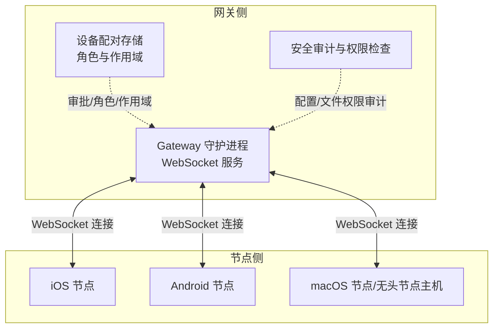
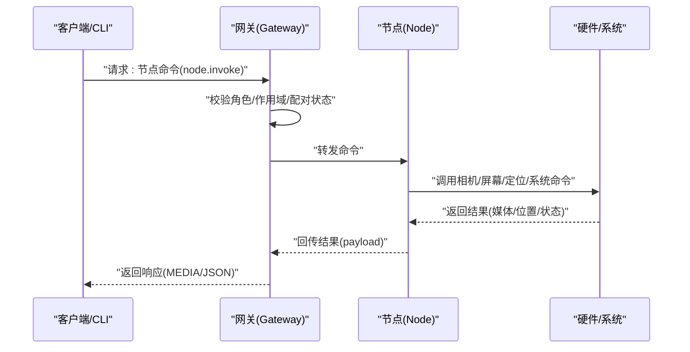
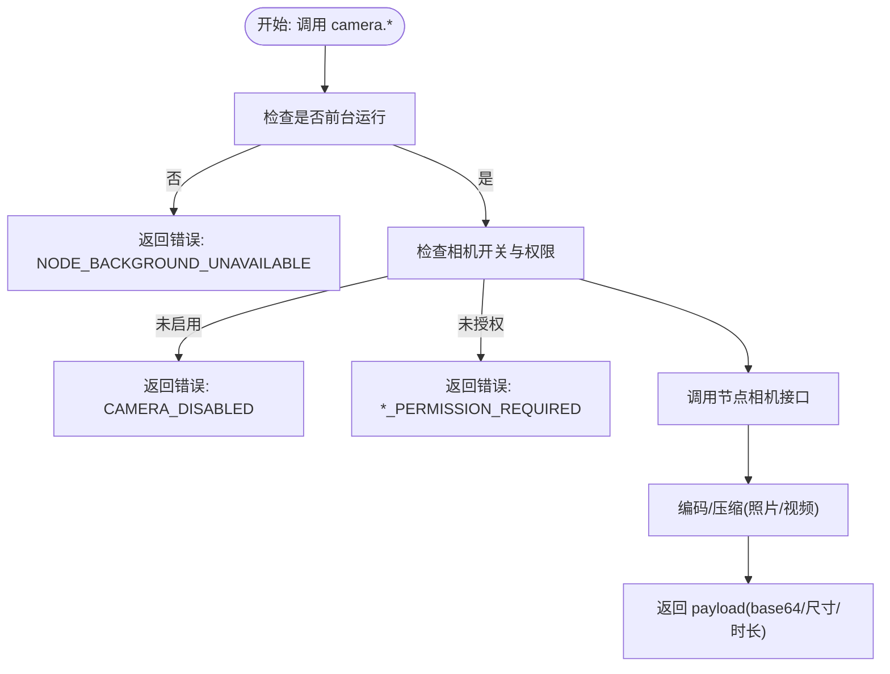
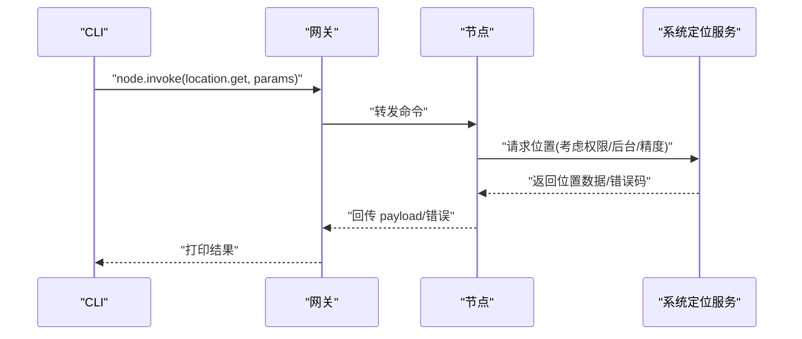
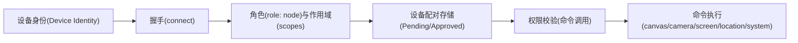

# 节点操作工具

## 目录
1. [简介](#简介)
2. [项目结构](#项目结构)
3. [核心组件](#核心组件)
4. [架构总览](#架构总览)
5. [详细组件分析](#详细组件分析)
6. [依赖关系分析](#依赖关系分析)
7. [性能考量](#性能考量)
8. [故障排除指南](#故障排除指南)
9. [结论](#结论)
10. [附录](#附录)

## 简介
本文件系统化阐述“节点操作工具”的架构设计与功能实现，覆盖设备抽象层、硬件接口管理与跨平台兼容性机制，并深入说明摄像头控制、音频处理、语音合成与位置服务等能力。文档同时提供配置管理、设备发现与连接控制流程、使用示例以及安全模型与权限管理策略，帮助开发者完成硬件集成与问题排查。

## 项目结构
节点工具围绕“网关（Gateway）+ 节点（Node）”双端协作展开，节点通过 WebSocket 连接网关，暴露命令面（如 `canvas.*`、`camera.*`、`screen.record`、`location.get` 等）。网关负责会话、路由与权限校验，节点负责本地硬件与系统能力调用。

## 核心组件
- 设备抽象层
  - 节点以“设备身份”接入，声明 `role: node`，并在 `connect` 时携带平台、版本、显示名等元数据。
  - 网关维护设备配对状态（批准/拒绝）、角色集合与作用域集合，用于后续权限校验。
- 命令面与硬件接口
  - 节点暴露命令面：`canvas.*`（画布/网页）、`camera.*`（拍照/录视频）、`screen.record`（录屏）、`location.get`（定位）、`system.*`（系统执行/通知）。
  - 硬件接口由各平台原生实现：相机、麦克风、屏幕录制、定位、通知与系统命令执行。
- 跨平台兼容性
  - iOS/Android/macOS/无头节点均通过同一 WebSocket 协议与网关交互，命令语义一致但具体实现与权限模型因平台而异。
  - 平台差异体现在权限提示、前台限制、后台行为与输出格式等。

## 架构总览
下图展示节点工具在系统中的位置与交互路径：客户端（CLI/Web/桌面）通过网关发起节点命令调用，节点在本地执行硬件操作并将结果回传。

## 详细组件分析

### 摄像头控制（iOS/Android/macOS）
- 功能特性
  - 列表查询：`camera.list` 返回可用设备列表（含 `id`/`name`/`position`/`deviceType`）。
  - 拍照：`camera.snap` 支持 `front`/`back`/`both`，可指定 `maxWidth`、`quality`、`delayMs`、`deviceId`。
  - 录像：`camera.clip` 支持 `mp4`，可选 `includeAudio`，支持 `durationMs`、`deviceId`。
  - 前台限制：`canvas.*` 与 `camera.*` 仅在前台可用，后台调用返回 `NODE_BACKGROUND_UNAVAILABLE`。
  - 权限要求：iOS/Android 需 `CAMERA`/`RECORD_AUDIO` 权限，未授权返回 `*_PERMISSION_REQUIRED`。
- 使用示例
  - 拍照：`openclaw nodes camera snap --node <id>`
  - 录像：`openclaw nodes camera clip --node <id> --duration 3000 --no-audio`
- 数据与负载
  - 照片与视频以 base64 返回，存在大小限制与压缩策略，避免超大载荷。
- 平台差异
  - iOS/Android 默认开启相机需用户许可；macOS 默认关闭，需在应用设置中启用。

### 音频处理与语音转写
- 能力概述
  - 自动检测：优先本地 CLI（sherpa-onnx/whisper-cli/whisper），其次 Gemini CLI，最后外部提供商（OpenAI/Groq/Deepgram/Google）。
  - 可配置：`tools.media.audio.enabled`/`maxBytes`/`models`/`scope` 等。
  - 输出注入：成功后替换 Body 为 `[Audio]` 块并注入 `{{Transcript}}`。
- 使用示例
  - 配置多模型/回退策略，按需设置 `maxBytes` 与 `scope`。
- 限制与注意
  - 提供商鉴权遵循标准顺序；默认最大 20MB；CLI 输出上限约 5MB；合理设置超时。

### 语音合成与连续对话（Talk Mode）
- 行为与界面
  - 连续语音对话循环：监听 → 转写 → 发送到模型 → 流式播放 → 中断控制。
  - macOS 提供覆盖层 UI 与菜单栏开关。
- 配置要点
  - `voiceId`/`modelId`/`outputFormat`/`apiKey` 等；支持一次性语音指令（`once`）。
- 平台差异
  - 输出格式在不同平台有默认值与可选范围；Android 支持多种 PCM 采样率以降低延迟。

### 位置服务（location.get）
- 能力概述
  - 通过 `node.invoke` 调用 `location.get`，参数包含 `timeoutMs`、`maxAgeMs`、`desiredAccuracy`。
  - 响应包含经纬度、精度、海拔、速度、方向、时间戳、是否精确、来源等。
  - 错误码：`LOCATION_DISABLED`、`LOCATION_PERMISSION_REQUIRED`、`LOCATION_BACKGROUND_UNAVAILABLE`、`LOCATION_TIMEOUT`、`LOCATION_UNAVAILABLE`。
- 设置与权限
  - iOS/macOS：While Using 或 Always；Precise Location 分离授权。
  - Android：后台定位需单独权限与设置流程。
- 使用示例
  - `openclaw nodes location get --node <id> --accuracy precise --max-age 15000`

### 屏幕录制（screen.record）
- 能力概述
  - 节点暴露 `screen.record`，支持 `mp4`，可选 `--no-audio`、`--fps`、`--duration`、`--screen`。
  - 前台限制与权限提示，Android 会弹出系统录屏提示。
- 使用示例
  - `openclaw nodes screen record --node <id> --duration 10s --fps 10 --no-audio`

### 系统命令与通知（system.*）
- 能力概述
  - macOS 节点/无头节点主机暴露 `system.run`/`system.which`/`system.notify` 与 `exec approvals` 管理。
  - 支持 `cwd`/`env`/超时/需要录屏等参数；通知支持优先级与投递方式。
- 使用示例
  - `openclaw nodes run --node <id> -- echo "Hello from mac node"`
  - `openclaw nodes notify --node <id> --title "Ping" --body "Gateway ready"`

## 依赖关系分析
- 角色与权限
  - 网关在连接握手阶段根据设备身份与角色（`role: node`）进行配对与作用域校验，随后对命令调用进行权限控制。
- 设备配对与审批
  - macOS/网关侧提供配对审批 UI 与状态管理；配对状态影响节点命令可用性与作用域扩展。
- 协议与模型
  - 设备配对事件与字段在共享协议中定义，确保跨平台一致性。

## 性能考量
- 负载控制
  - 相机/录屏返回采用 base64 编码，存在大小上限与压缩策略，避免消息过大。
  - 录像时长限制（≤60s）以控制 payload 体积。
- 执行与超时
  - `system.run` 支持命令超时与工作目录/环境变量注入，避免阻塞。
- 后台与前台
  - 多数硬件命令要求前台运行，后台调用直接失败，减少无效开销。

## 故障排除指南
- 常见错误与定位
  - `NODE_BACKGROUND_UNAVAILABLE`：确认节点处于前台。
  - `CAMERA_DISABLED`/`CAMERA_PERMISSION_REQUIRED`：检查平台相机开关与权限。
  - `LOCATION_DISABLED`/`LOCATION_PERMISSION_REQUIRED`：检查位置权限与系统设置。
  - `LOCATION_BACKGROUND_UNAVAILABLE`：确认选择了“始终允许”，并满足后台定位条件。
- 审计与安全
  - 配置文件与 include 文件的权限审计：世界可写/组可读等高危权限将触发严重告警，需修正权限。
  - 配置文件自身权限问题（symlink、世界可读/写）亦会被记录并建议修复。
- 排查步骤
  - 使用 `openclaw devices` 与 `openclaw nodes` 命令查看配对与节点状态。
  - 检查节点日志与网关日志，关注错误码与超时信息。
  - 对于系统命令，核对 `exec approvals` 与 `PATH` 限制。

## 结论
节点操作工具通过统一的网关协议与节点命令面，实现了跨平台的硬件与系统能力调用。其核心在于严格的设备配对与权限控制、清晰的前台限制与负载控制策略，以及完善的错误码与审计机制。开发者可据此快速集成新平台与新硬件能力，并通过 CLI 与自动化工具高效地完成日常任务。

## 附录

### 使用示例索引
- 摄像头拍照
  - `openclaw nodes camera snap --node <id>`
  - `openclaw nodes camera snap --node <id> --facing front --max-width 640 --quality 0.8 --delay-ms 2000 --device-id cam-123`
- 摄像头录像
  - `openclaw nodes camera clip --node <id> --duration 3000`
  - `openclaw nodes camera clip --node <id> --duration 3000 --no-audio`
- 屏幕录制
  - `openclaw nodes screen record --node <id> --duration 10s --fps 10 --no-audio`
- 位置获取
  - `openclaw nodes location get --node <id>`
  - `openclaw nodes location get --node <id> --accuracy precise --max-age 15000 --location-timeout 10000`
- 系统命令
  - `openclaw nodes run --node <id> -- echo "Hello from mac node"`
  - `openclaw nodes notify --node <id> --title "Ping" --body "Gateway ready"`