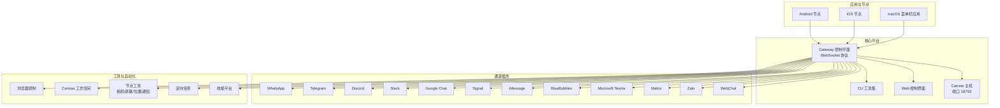
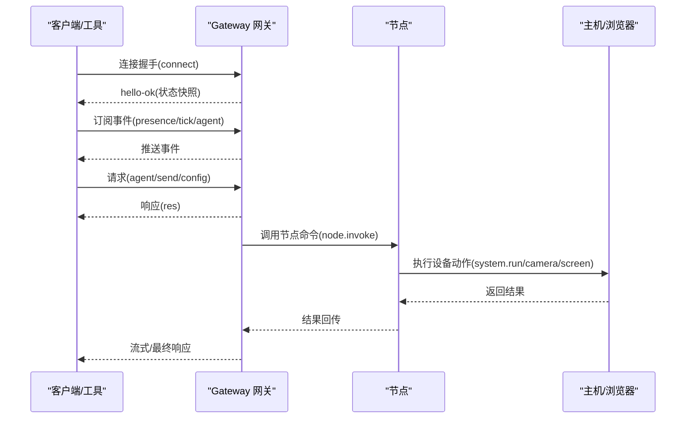
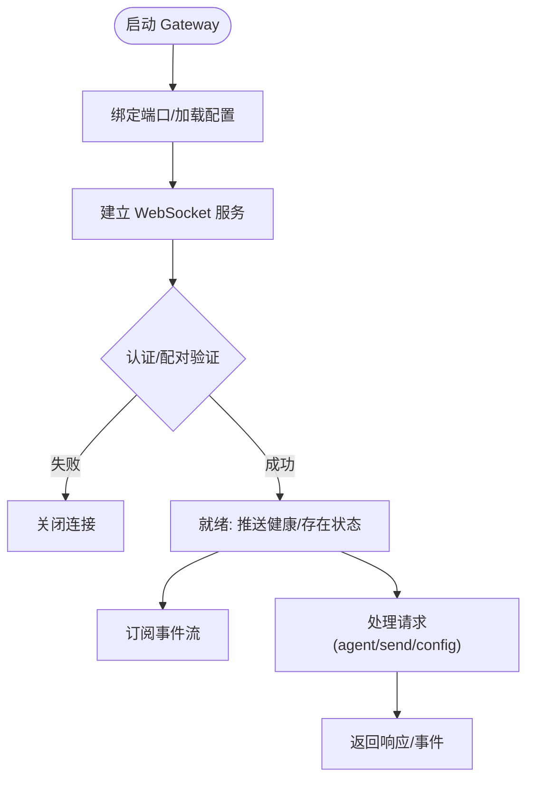
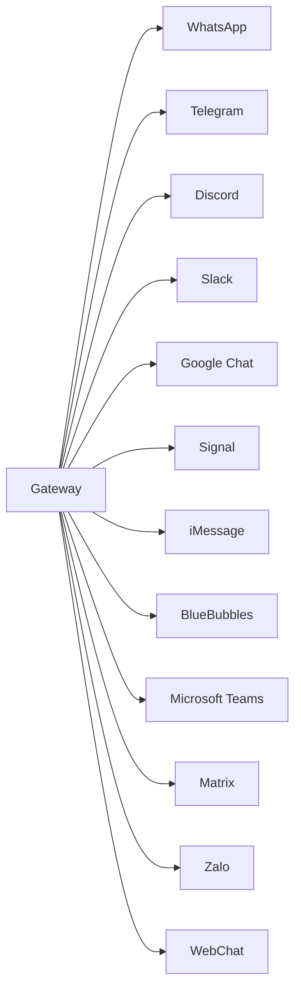
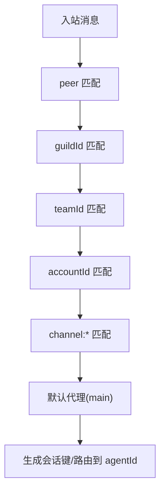
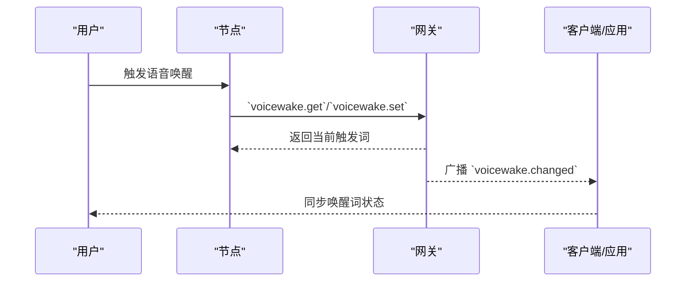
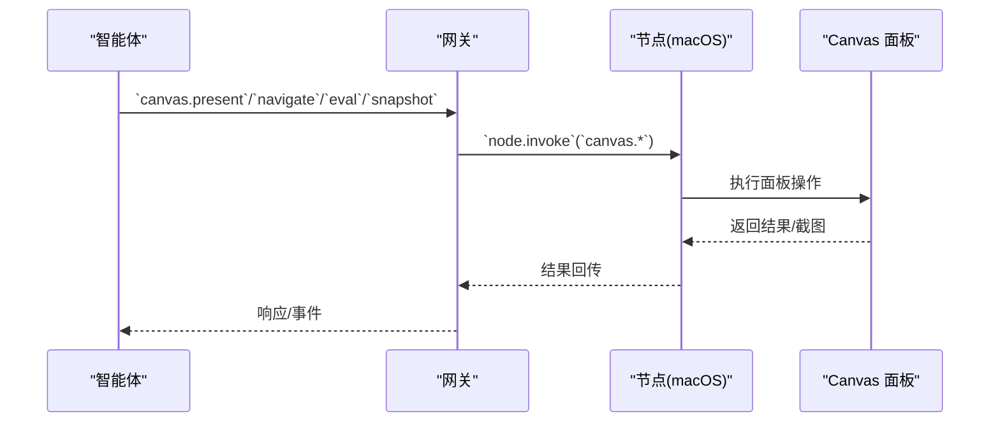
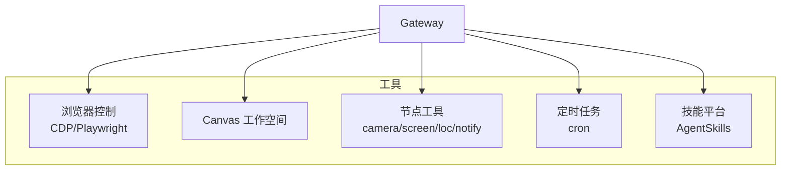
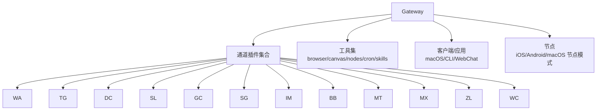

# 主要功能特性

## 目录
1. [简介](#简介)
2. [项目结构](#项目结构)
3. [核心组件](#核心组件)
4. [架构总览](#架构总览)
5. [详细组件分析](#详细组件分析)
6. [依赖关系分析](#依赖关系分析)
7. [性能考虑](#性能考虑)
8. [故障排除指南](#故障排除指南)
9. [结论](#结论)
10. [附录](#附录)

## 简介
OpenClaw 是一个可在您自己的设备上运行的个人 AI 助手，具备本地优先的网关控制平面、多渠道消息集成（支持 20+ 渠道）、多代理路由系统、语音唤醒与对话模式、实时 Canvas 工作空间、一流的工具系统（浏览器控制、Canvas、节点、定时任务等），以及配套应用（macOS 菜单栏应用、iOS/Android 节点）。它以 WebSocket 网关为核心，统一管理会话、通道、工具与事件，同时提供跨平台的设备节点能力，实现“主机侧执行、设备侧动作”的安全分层。

## 项目结构
OpenClaw 采用模块化与平台化的组织方式：
- 核心平台：Gateway 控制平面、CLI、Web 控制界面、Canvas 主机
- 通道插件：WhatsApp、Telegram、Discord、Slack、Google Chat、Signal、iMessage、BlueBubbles、Microsoft Teams、Matrix、Zalo、WebChat 等
- 工具与自动化：浏览器控制、Canvas、节点（相机、屏幕录制、位置、通知）、定时任务、技能平台
- 应用与节点：macOS 菜单栏应用、iOS/Android 节点
- 文档与指南：概念、安装、配置、安全、故障排除等

## 核心组件
- 网关控制平面（Gateway）：单一长连接的 WebSocket 控制平面，负责维护各消息通道、会话、事件与工具调用；支持远程访问（Tailscale/SSH 隧道）与安全认证。
- 多渠道消息集成：通过插件化通道适配器接入 WhatsApp、Telegram、Discord、Slack、Google Chat、Signal、iMessage、BlueBubbles、Microsoft Teams、Matrix、Zalo、WebChat 等，统一路由与安全策略。
- 多代理路由系统：在同一 Gateway 内运行多个隔离代理，按通道账号与会话对入站消息进行确定性路由，支持不同代理的沙箱与工具策略。
- 语音唤醒与对话模式：全局语音唤醒词由网关集中管理，跨节点同步；支持持续对话与 Talk 模式。
- 实时 Canvas 工作空间：基于 WKWebView 的 Canvas 面板，支持 A2UI 推送与交互；Canvas 主机提供 A2UI v0.8 协议支持。
- 一流工具系统：浏览器控制（CDP/Playwright）、Canvas、节点（相机/屏幕录制/位置/通知）、定时任务、技能平台（ClawHub）。
- 配套应用与节点：macOS 菜单栏应用（健康状态、WebChat、远程控制）、iOS/Android 节点（Canvas、语音唤醒、Talk 模式、相机/屏幕录制）。

## 架构总览
OpenClaw 的架构以 WebSocket 网关为中心，所有客户端（macOS 应用、CLI、WebChat、自动化）与节点（macOS/iOS/Android/headless）均通过同一网关进行连接与通信。网关负责：
- 维护通道连接与消息路由
- 管理会话生命周期与上下文
- 提供工具调用与事件推送
- 支持多代理隔离与权限控制
- 提供 Canvas 主机与浏览器控制服务

## 详细组件分析

### 本地优先的网关控制平面
- 单一控制平面：Gateway 作为单一长连接的控制平面，统一承载会话、通道、工具与事件。
- 安全与认证：支持令牌认证、设备配对、本地信任与远程暴露（Tailscale/SSH 隧道）。
- 运维与诊断：健康检查、日志、守护进程（launchd/systemd）、远程控制。

### 多渠道消息集成（支持 20+ 渠道）
- 渠道覆盖：WhatsApp、Telegram、Discord、Slack、Google Chat、Signal、iMessage、BlueBubbles、Microsoft Teams、Matrix、Zalo、WebChat 等。
- 安全策略：DM 配对、允许列表、群组策略、提及门控、历史限制。
- 配置示例：各渠道的 token、允许列表、群组策略、媒体大小限制等。

### 多代理路由系统
- 多代理隔离：每个 `agentId` 对应独立工作区、状态目录与会话存储。
- 路由规则：按 `peer`(`guildId`/`teamId`/`accountId`/`channel`) 最具体匹配优先，支持 per-agent 沙箱与工具策略。
- 典型场景：同一 WhatsApp 号多人 DM 分割、不同渠道路由到不同模型、特定群组绑定专用代理。

### 语音唤醒与对话模式
- 全局唤醒词：网关集中管理唤醒词列表，跨节点同步；节点仅保留本地启用/禁用开关。
- 存储与协议：网关主机存储唤醒词，提供查询/设置方法与变更事件广播。
- 跨平台行为：macOS 应用、iOS/Android 节点均通过网关同步并使用全局列表。

### 实时 Canvas 工作空间
- Canvas 面板：macOS 应用内置 WKWebView 面板，支持自定义 URL Scheme 与本地文件加载。
- A2UI 支持：Canvas 主机提供 A2UI v0.8 协议，支持 surface 更新、数据模型更新、beginRendering 等。
- 代理 API：通过网关 WebSocket 提供 `show`/`hide`、`navigate`、`eval`、`snapshot` 等操作；支持 A2UI JSONL 推送与重置。

### 一流工具系统（浏览器控制、Canvas、节点、定时任务）
- 浏览器控制：独立 openclaw 配置文件驱动的 Chrome/Chromium 实例，支持标签页控制、快照、截图、PDF、动作与调试；可扩展多配置文件与远程 CDP。
- Canvas：与浏览器控制互补，提供可视化工作空间与 A2UI 交互。
- 节点工具：相机抓拍/视频录制、屏幕录制、位置获取、系统通知等，通过 `node.invoke` 在设备侧执行。
- 定时任务：基于 cron 的计划任务与唤醒机制，支持外部触发（webhook、Gmail Pub/Sub）。
- 技能平台：基于 AgentSkills 的技能体系，支持捆绑、托管与工作区技能，按环境/配置/二进制进行加载过滤。

### 配套应用与节点（macOS 菜单栏应用、iOS/Android 节点）
- macOS 菜单栏应用：健康状态、WebChat、远程控制、语音唤醒叠加层、调试工具。
- iOS/Android 节点：Canvas、语音唤醒、Talk 模式、相机/屏幕录制、可选短信；通过 Bridge 与网关配对。
- 设备权限：macOS TCC 权限与网关协议结合，`system.run`/`system.notify` 等命令需按权限与许可执行。

## 依赖关系分析
- 组件耦合：Gateway 与通道插件松耦合，通过统一协议与配置驱动；工具与节点通过网关中转，降低直接依赖。
- 外部依赖：各通道插件依赖对应平台 API/SDK；浏览器控制依赖 CDP/Playwright；Canvas 主机依赖网关 WebSocket 与节点代理。
- 安全边界：工具执行默认在主机侧进行，群组/频道安全可通过沙箱与工具策略隔离；节点权限通过 TCC 与网关授权双重保障。

## 性能考虑
- 会话与上下文：按发送者/群组隔离会话，合理设置历史限制与压缩策略，减少上下文膨胀。
- 工具调用：浏览器控制与 Canvas 操作建议在需要时按需触发，避免频繁快照与截图。
- 多代理：根据负载与安全需求拆分代理，避免单代理过载；为高风险代理启用沙箱与工具限制。
- 远程访问：Tailscale/SSH 隧道增加网络开销，建议按需开启并配置认证策略。

## 故障排除指南
- 网关健康与诊断：使用健康检查、状态查询与日志定位问题；必要时通过 `doctor` 修复配置。
- 渠道连接：检查 token/允许列表/群组策略；参考各渠道故障排除文档。
- 浏览器控制：确认浏览器可执行路径、CDP 端口与 Playwright 安装；远程 CDP 注意鉴权与超时。
- Canvas 与 A2UI：确认 Canvas 主机可用、A2UI 版本兼容与 WebSocket 连接；检查自定义 URL Scheme 与本地文件路径。
- 语音唤醒：核对网关存储的触发词、节点同步状态与权限；确保网关与节点时间一致。

## 结论
OpenClaw 通过本地优先的网关控制平面，实现了多渠道消息集成、多代理路由、语音唤醒与 Canvas 工作空间的一流体验。配合浏览器控制、节点工具与技能平台，OpenClaw 能够在安全可控的前提下，为个人与团队提供高效、灵活且可扩展的 AI 助手解决方案。建议从最小配置开始，逐步引入多代理与安全策略，并结合配套应用与节点提升日常效率。

## 附录
- 快速开始：安装后运行向导，启动网关并配置渠道与工作区。
- 安全默认：DM 配对与允许列表、群组策略与提及门控、沙箱与工具限制。
- 远程访问：Tailscale Serve/Funnel 或 SSH 隧道，配合令牌/密码认证。
- 技能与工具：通过 ClawHub 获取技能，按需启用与配置；浏览器控制与 Canvas 用于可视化与自动化。