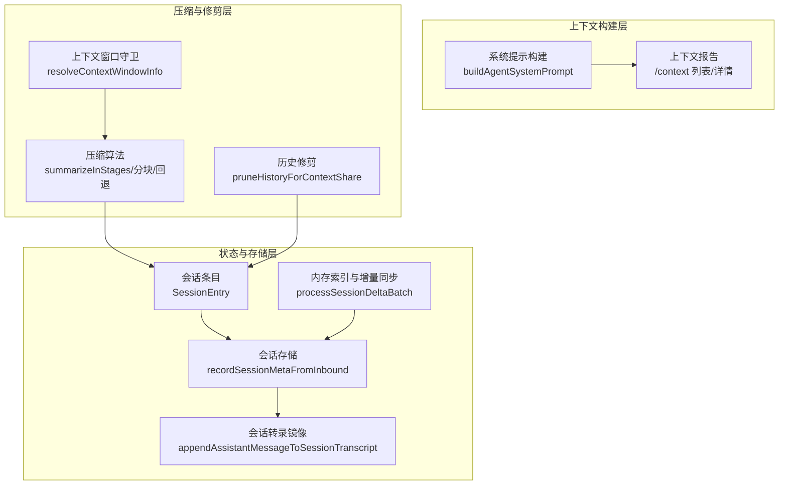
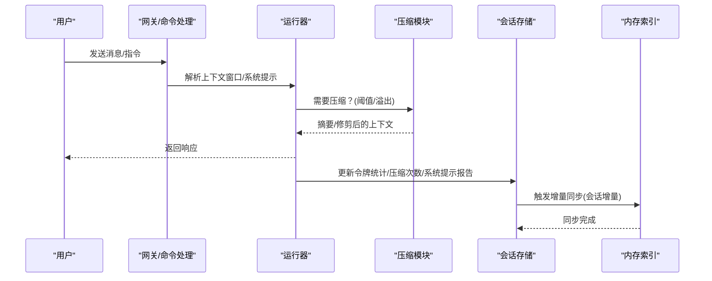
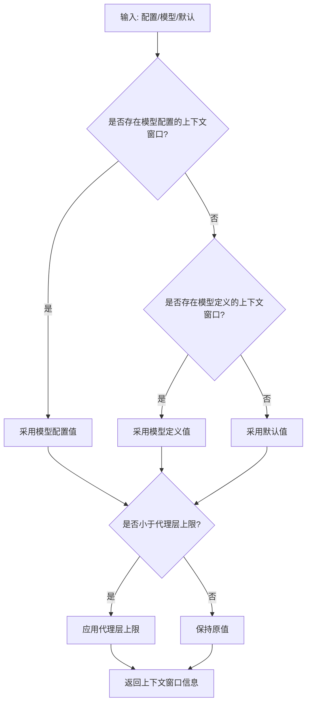
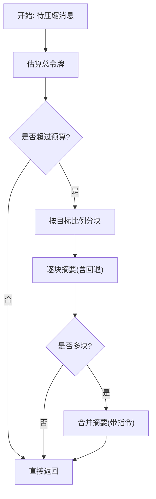
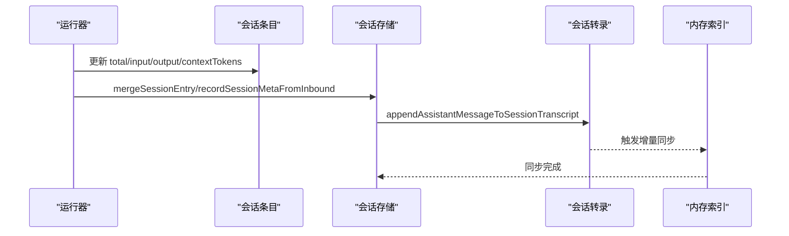

# 上下文传递

## 目录
1. [简介](#简介)
2. [项目结构](#项目结构)
3. [核心组件](#核心组件)
4. [架构总览](#架构总览)
5. [组件详解](#组件详解)
6. [依赖关系分析](#依赖关系分析)
7. [性能考量](#性能考量)
8. [故障排查指南](#故障排查指南)
9. [结论](#结论)
10. [附录](#附录)

## 简介
本篇文档围绕 OpenClaw 的“上下文传递”体系展开，系统阐述上下文的概念与边界、上下文窗口管理、令牌限制与内存优化策略，以及上下文在消息历史、系统提示、工具调用与结果传递中的流转机制。文档还覆盖上下文压缩算法、智能截断与重要信息保留策略，上下文状态管理、增量更新与一致性保障，并提供可操作的配置示例与开发者优化建议。

## 项目结构
OpenClaw 将“上下文”拆分为多个层面协同工作：
- 上下文窗口解析与守卫：决定模型上下文上限与安全阈值
- 上下文构建：系统提示、注入的工作区文件、工具列表与模式
- 历史与工具结果的压缩与修剪：控制历史长度与体积
- 会话状态与增量更新：记录令牌统计、压缩次数、系统提示报告等
- 存储与镜像：会话转录与系统提示报告的持久化与同步

## 核心组件
- 上下文窗口解析与守卫：从配置、模型定义与默认值中解析上下文窗口，并评估是否需要警告或阻断
- 上下文压缩与回退：基于消息分块、阶段合并与回退策略，生成摘要并保留关键信息
- 历史修剪：按预算切分并丢弃较旧片段，确保历史占用不超过配额
- 系统提示报告：在运行后捕获系统提示的组成与大小，支持 `/context` 查看
- 会话状态与增量更新：记录令牌统计、压缩次数、系统提示报告等，并持久化
- 存储与镜像：将助手回复镜像到会话转录，同时触发内存索引增量同步

## 架构总览
OpenClaw 在“运行前”构建上下文，在“运行后”更新状态并持久化。上下文由系统提示、注入的工作区文件、对话历史、工具调用与结果构成；当接近上下文窗口上限时，通过压缩与修剪控制体积，同时记录令牌统计与压缩次数，确保一致性与可观测性。

## 组件详解

### 上下文概念与边界
- 上下文即“模型在一次推理中看到的所有内容”，受模型上下文窗口（令牌上限）约束
- 上下文包含：系统提示、会话历史、工具调用与结果、附件/转录、压缩摘要与修剪产物
- 上下文不同于“记忆”：记忆可落盘与重载，上下文是当前窗口内的视图

### 上下文窗口管理与令牌限制
- 来源优先级：模型配置 > 模型定义 > 默认值；可被代理层配置上限覆盖
- 守卫策略：低于告警阈值给出警告，低于硬性最小值可阻断
- 运行前解析窗口，运行后根据剩余空间与保留量动态调整

### 上下文构建：系统提示、注入文件与工具
- 系统提示由 OpenClaw 自主构建，包含工具清单、技能元数据、工作区路径、时间/运行时信息、沙箱状态、心跳与安全提示等
- 注入的工作区文件（如 `AGENTS.md`、`SOUL.md` 等）按最大字符限制截断，`/context` 可显示原始与注入大小及截断状态
- 工具影响上下文的两个方面：工具列表文本与工具 Schema（JSON），后者同样计入上下文

### 上下文压缩算法与智能截断
- 分块与比例：按平均消息大小动态调整分块比例，避免单条消息过大导致无法安全摘要
- 阶段摘要：先对子块摘要，再合并摘要，最后以指令引导合并，保留决策、待办、问题与约束
- 回退策略：全量摘要失败时尝试仅摘要较小消息并标注超大消息；最终失败则以说明性文字替代
- 历史修剪：按预算切分并丢弃最旧片段，保留最新消息，确保历史占用不超过配额

### 上下文状态管理、增量更新与一致性
- 会话条目包含令牌统计（输入/输出/总计）、上下文令牌、压缩次数、系统提示报告等
- 运行后更新压缩次数与令牌统计，必要时清空细项以避免误导
- 记录系统提示报告，优先使用最近一次运行构建的报告，否则现场估算
- 会话转录镜像与存储更新联动，内存索引按会话增量批量同步，降低写放大

### 上下文传递机制：消息历史、系统提示、工具调用与结果
- 消息历史：按会话转录追加，支持媒体镜像文本；修剪仅影响内存中的提示，不改写转录
- 系统提示：每次运行重建，包含工具、技能、工作区、时间、运行时与沙箱信息
- 工具调用与结果：工具调用与结果计入上下文，大型输出会被截断；`/context` 可查看贡献度
- 结果传递：运行结束后将摘要与修剪产物纳入后续上下文，保持连贯性

### 上下文配置示例
- 基础上下文：通过系统提示与注入文件提供基础身份与工作区信息
- 增强上下文：启用技能按需加载、工具 Schema 注入、时间与运行时信息
- 自定义上下文：通过会话条目字段覆盖 `provider`/`model`、队列策略、发送策略、响应用量显示等

### 开发者优化与调试技巧
- 使用 `/context list/detail` 查看上下文构成与主要贡献者，定位高开销来源
- 合理设置压缩保留量与最近保留令牌，避免频繁溢出与多次压缩
- 通过会话重置/新建切换上下文，清理历史负担
- 关注系统提示报告与令牌统计，结合内存索引增量同步状态判断写放大与延迟

## 依赖关系分析
- 上下文窗口解析依赖配置与模型定义，受代理层上限约束
- 压缩与修剪依赖消息令牌估算与分块策略，回退逻辑保证稳定性
- 会话状态依赖存储与转录镜像，内存索引通过会话增量批量同步
- 系统提示报告贯穿运行前后，作为上下文可观测性的关键指标

## 性能考量
- 令牌估算误差与安全余量：采用安全系数降低估算偏差导致的越界风险
- 分块与比例自适应：根据平均消息大小动态调整，避免单条消息过大引发不可摘要
- 增量同步与阈值：内存索引按字节与消息数量阈值批量同步，减少频繁写入
- 压缩频率与保留量：合理设置保留量与最近保留令牌，平衡上下文新鲜度与稳定性

## 故障排查指南
- 上下文溢出：检查上下文窗口解析来源与守卫结果，确认是否低于告警/阻断阈值
- 压缩失败：关注回退日志，确认是否因单条消息过大或摘要服务异常
- 令牌统计异常：核对运行后更新逻辑，确认是否清除了细项以避免误导
- 存储不同步：检查会话增量批处理与内存索引同步状态，确认写入延迟

## 结论
OpenClaw 的上下文传递体系通过“窗口解析—构建—压缩/修剪—状态更新—存储镜像”的闭环，实现了对上下文体积与质量的可控管理。开发者可通过系统提示报告、令牌统计与内存索引增量同步等手段，持续观测与优化上下文成本与性能，确保在有限窗口内维持高质量交互。

## 附录
- 上下文报告与系统提示：`/context list/detail/json` 提供上下文构成与系统提示报告
- 会话重置与新建：`/new` 或 `/reset` 启动新会话 ID，清空历史负担
- 压缩触发条件：溢出恢复与阈值维护，结合保留量与最近保留令牌