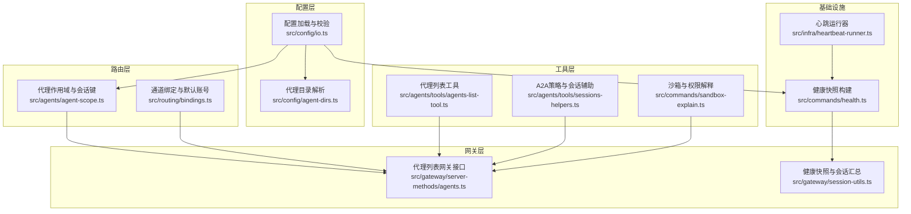
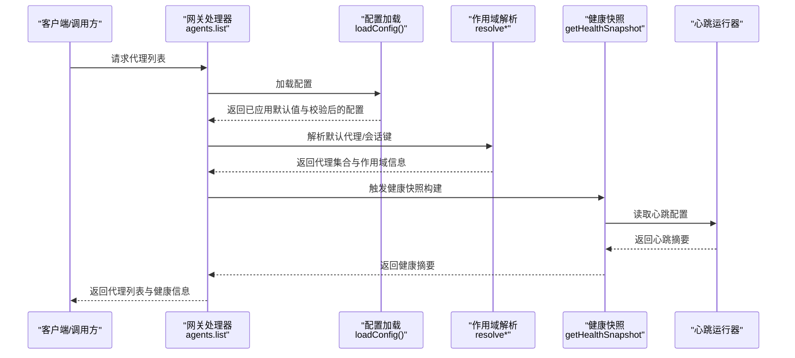
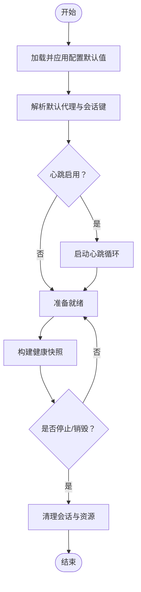
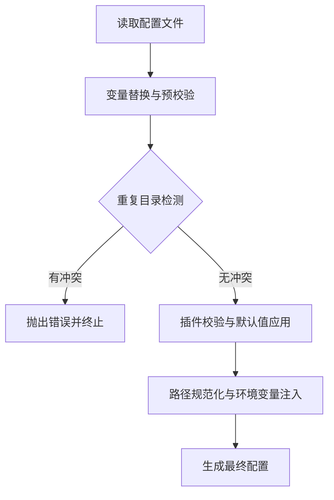
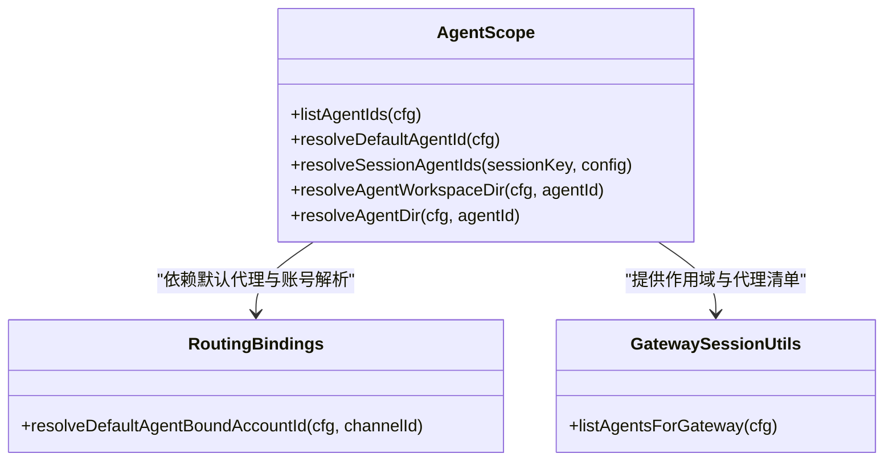
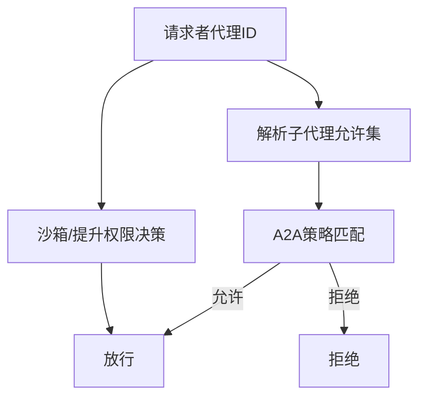
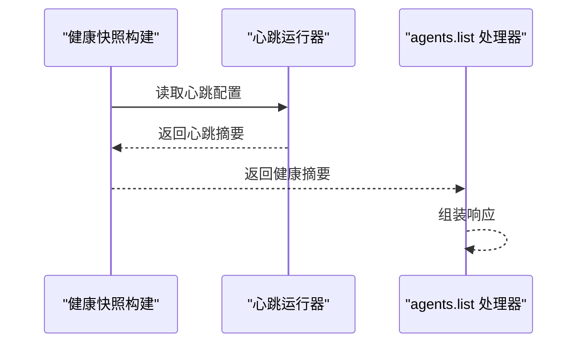
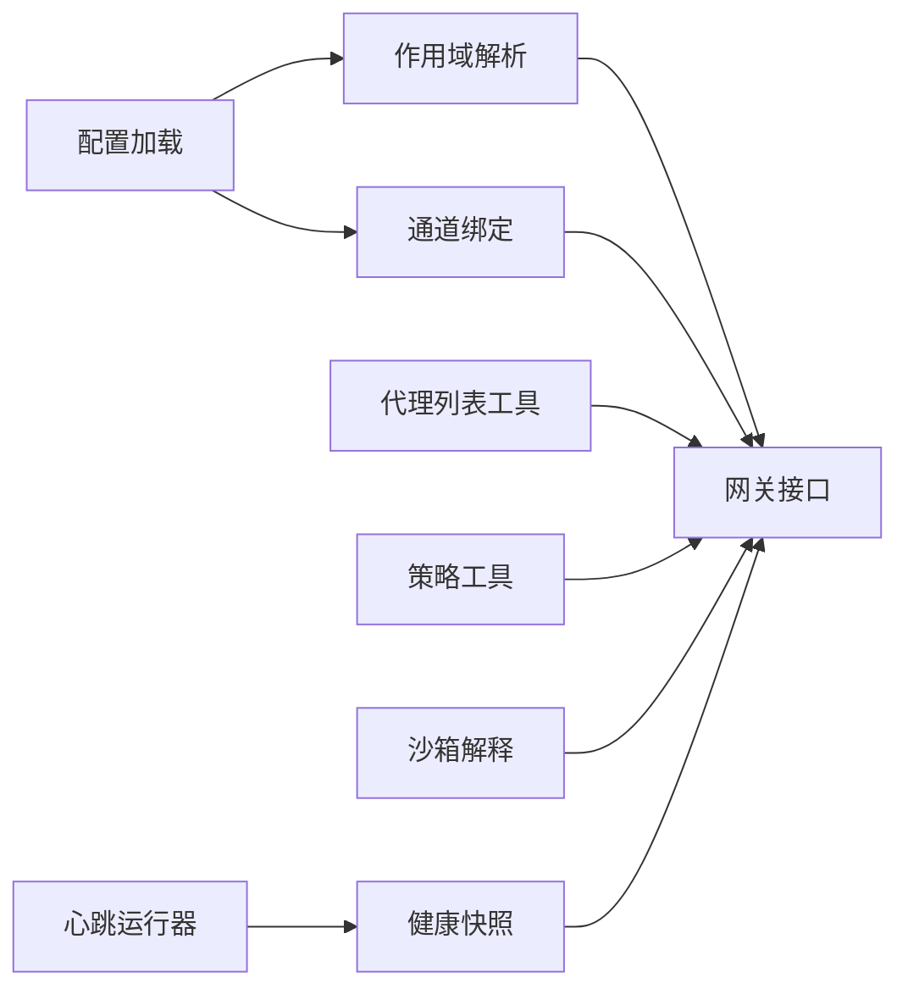

# 代理管理

## 目录
1. [简介](#简介)
2. [项目结构](#项目结构)
3. [核心组件](#核心组件)
4. [架构总览](#架构总览)
5. [详细组件分析](#详细组件分析)
6. [依赖关系分析](#依赖关系分析)
7. [性能考量](#性能考量)
8. [故障排查指南](#故障排查指南)
9. [结论](#结论)
10. [附录](#附录)

## 简介
本章节系统性阐述 OpenClaw 代理管理系统的生命周期与配置体系，覆盖代理创建、初始化、启动、停止与销毁；配置管理（默认值、环境变量覆盖、动态更新与校验）；代理标识符与路径解析、作用域隔离与权限控制；状态与健康检查、错误恢复与监控指标；以及面向开发者的扩展、自定义配置与调试技巧。

## 项目结构
OpenClaw 的代理管理由“配置层—路由层—工具层—网关层—运行时基础设施”协同完成：
- 配置层：负责加载、校验、应用默认值、路径归一化、环境变量注入与覆盖。
- 路由层：负责会话键解析、默认代理选择、通道绑定与账号解析。
- 工具层：提供代理列表、子代理策略、沙箱与权限策略等能力。
- 网关层：对外暴露代理相关接口，聚合健康状态与会话摘要。
- 基础设施：心跳调度器、健康快照构建器等。

## 核心组件
- 代理作用域与会话键解析：确定默认代理、按会话键解析目标代理、解析工作区与代理目录。
- 代理配置应用与修剪：在运行时对单个代理条目进行增删改查与合并。
- 通道绑定与默认账号：将代理与渠道/账号匹配，支持冲突检测与规范化。
- 健康与心跳：聚合各代理的心跳与会话状态，提供健康快照。
- 沙箱与权限：基于全局与代理级策略决定执行范围与提升权限。
- 网关接口：对外提供代理列表查询等能力。

## 架构总览
下图展示从配置到运行时的关键交互：配置加载与默认值应用后，路由层解析会话键与默认代理，工具层提供策略与列表能力，网关层汇总健康状态，基础设施驱动心跳与会话扫描。

## 详细组件分析

### 代理生命周期管理
- 创建与初始化
  - 通过代理配置应用函数为指定 `agentId` 合并 name/workspace/agentDir/model 等字段，若不存在则追加条目，并确保默认代理存在。
  - 配置加载阶段会应用模型、压缩、上下文裁剪、会话、日志、消息等默认值，并进行路径规范化与重复目录检测。
- 启动与运行
  - 会话键解析决定当前会话归属的代理；默认代理用于未显式指定的场景。
  - 心跳运行器根据配置启用或禁用代理心跳，支持按代理粒度或默认代理统一启用。
- 停止与销毁
  - 通过会话删除工具清理会话状态；健康快照中包含会话统计，便于判断是否需要回收资源。
  - 代理修剪功能可移除配置中的代理条目，并同步清理相关绑定与允许列表。

### 代理配置管理
- 默认配置与路径解析
  - 工作区与代理目录支持从代理条目、默认项、用户路径解析，最终落盘于状态目录下的 `agents/<id>/agent`。
  - 重复代理目录检测在预校验与后校验阶段均执行，避免冲突。
- 环境变量覆盖
  - 配置加载阶段应用环境变量注入与回退策略，支持 Shell 环境回退与超时控制。
- 动态配置更新
  - 提供代理配置应用函数以增量更新单个代理条目；支持修剪代理配置并同步清理绑定与允许列表。
- 配置验证机制
  - 使用插件化校验器进行对象级校验，输出问题与警告；对来自未来的配置给出告警；对无效配置抛出带详情的错误。

### 代理标识符管理、路径解析与作用域隔离
- 代理标识符
  - 统一使用标准化函数处理大小写与空格，保证跨模块一致性。
- 路径解析
  - 代理工作区与代理目录优先取代理条目配置，其次取默认项，最后回退到状态目录下的固定结构。
- 作用域隔离
  - 会话键解析支持从 `agent::...` 形式提取目标代理，实现 per-sender/per-session 的隔离。
  - 网关侧会根据显式允许列表与默认代理，限制可见代理集合。

### 权限控制与沙箱策略
- 全局与代理级策略
  - 子代理允许列表支持通配与模式匹配；A2A（代理到代理）策略支持白名单模式与通配。
  - 沙箱模式与提升权限结合，依据会话键与主会话别名决定是否沙箱化。
- 渠道维度的权限
  - 不同渠道的账号绑定与默认账号解析，配合允许来源列表，形成细粒度的权限边界。

### 代理状态管理、健康检查与监控
- 健康快照
  - 聚合每个代理的心跳摘要与会话统计，计算默认代理心跳周期，汇总会话状态。
- 心跳运行器
  - 支持按代理显式启用或默认代理启用；合并代理级与全局心跳配置。
- 网关接口
  - 对外提供代理列表查询，内部使用健康快照作为数据源。

### 代理配置示例与最佳实践
- 基础配置
  - 设置 `agents.defaults.workspace` 与 `agents.list` 中的默认代理条目，确保工作区与代理目录正确解析。
- 高级配置
  - 为特定代理设置模型主备、人类延迟、心跳、身份、群聊、子代理与沙箱策略。
- 环境特定配置
  - 使用环境变量注入与 Shell 回退，结合超时参数，适配不同运行环境。

### 开发者扩展与调试指南
- 扩展点
  - 在工具层新增代理工具时，遵循统一的参数 Schema 与返回格式；利用会话别名与主会话键解析，确保跨代理调用一致。
- 自定义配置
  - 使用代理配置应用函数进行增量更新；通过通道绑定构建器与解析器，快速生成绑定规范。
- 调试技巧
  - 使用健康快照定位代理会话与心跳异常；通过沙箱解释工具核对权限与会话隔离策略；借助默认代理与账号解析函数排查路由问题。

## 依赖关系分析
- 组件耦合
  - 配置层与路由层强关联：作用域解析依赖配置中的 agents 列表与默认项。
  - 工具层与网关层弱耦合：工具通过通用接口被网关调用，便于替换与扩展。
- 外部依赖
  - 会话键解析依赖统一的会话键解析器；通道绑定依赖渠道插件元数据。
- 循环依赖
  - 当前模块间无明显循环依赖迹象；职责清晰，导入方向单向。

## 性能考量
- 配置加载与校验
  - 预校验与后校验双重重复目录检测，避免运行期冲突带来的重试成本。
  - 默认值应用与路径规范化集中处理，减少后续解析开销。
- 健康快照
  - 会话缓存复用降低重复 IO；心跳摘要按代理粒度计算，避免全量扫描。
- 心跳调度
  - 显式代理心跳可减少不必要的全量任务执行；合并代理级与全局配置降低配置解析次数。

## 故障排查指南
- 配置无效
  - 关注 `INVALID_CONFIG` 错误与详细问题列表；优先修复根路径与必填字段。
- 重复代理目录
  - 查看重复目录列表，调整代理条目或 `agentDir` 配置，避免冲突。
- 心跳异常
  - 检查默认代理心跳配置与按代理启用情况；确认心跳间隔与模型选择是否合理。
- 权限与沙箱
  - 核对子代理允许列表与 A2A 策略；确认沙箱模式与会话键是否导致隔离。

## 结论
OpenClaw 的代理管理体系以“配置—路由—工具—网关—基础设施”为主线，实现了从生命周期到配置治理、从作用域隔离到权限控制的完整闭环。通过严格的默认值应用、路径规范化与重复目录检测，配合健康快照与心跳调度，系统在可用性与可观测性上具备良好表现。开发者可在工具层与网关层灵活扩展，同时遵循统一的会话键与权限策略，确保多代理协作的安全与稳定。

## 附录
- 参考文档
  - 默认代理与技能模板参考：[AGENTS.default.md](file://docs/reference/AGENTS.default.md#L1-L125)
  - 仓库指南与多代理安全建议：[AGENTS.md](file://AGENTS.md#L122-L179)