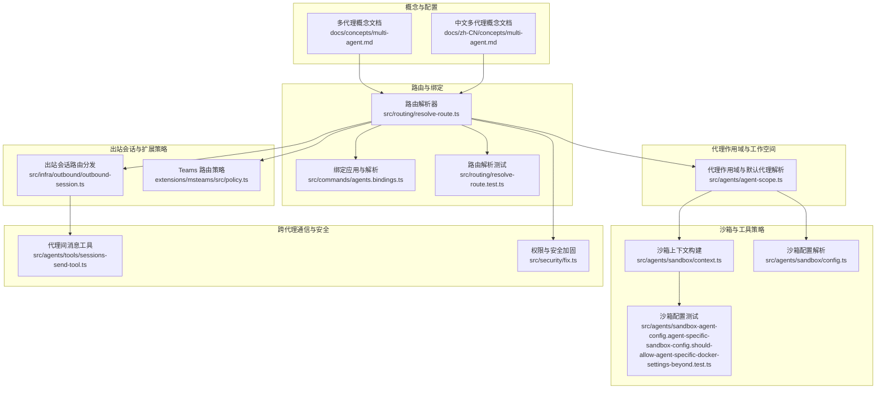
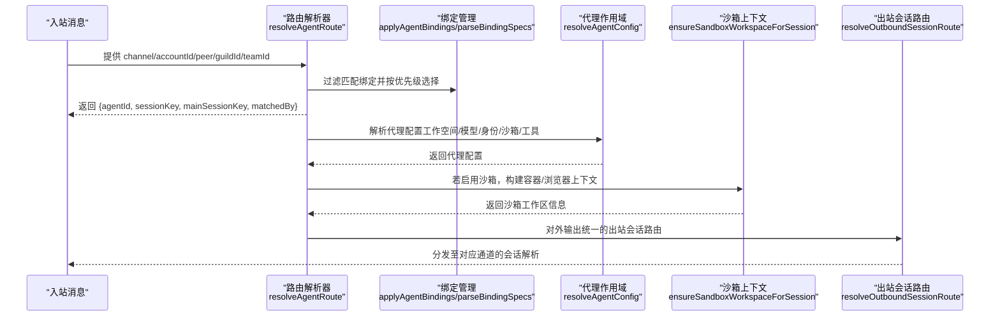
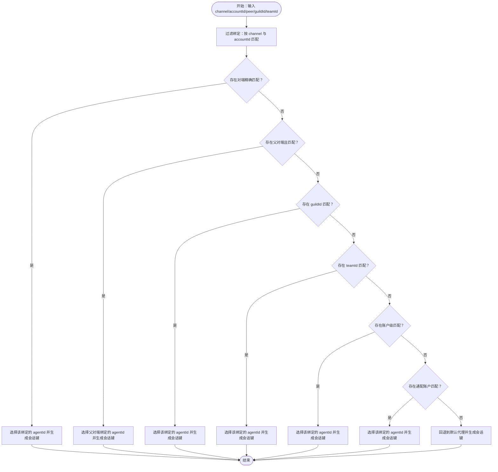
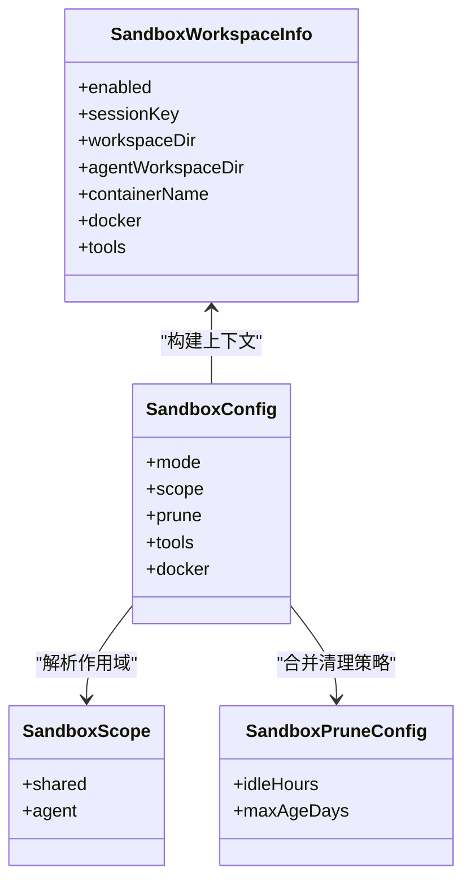
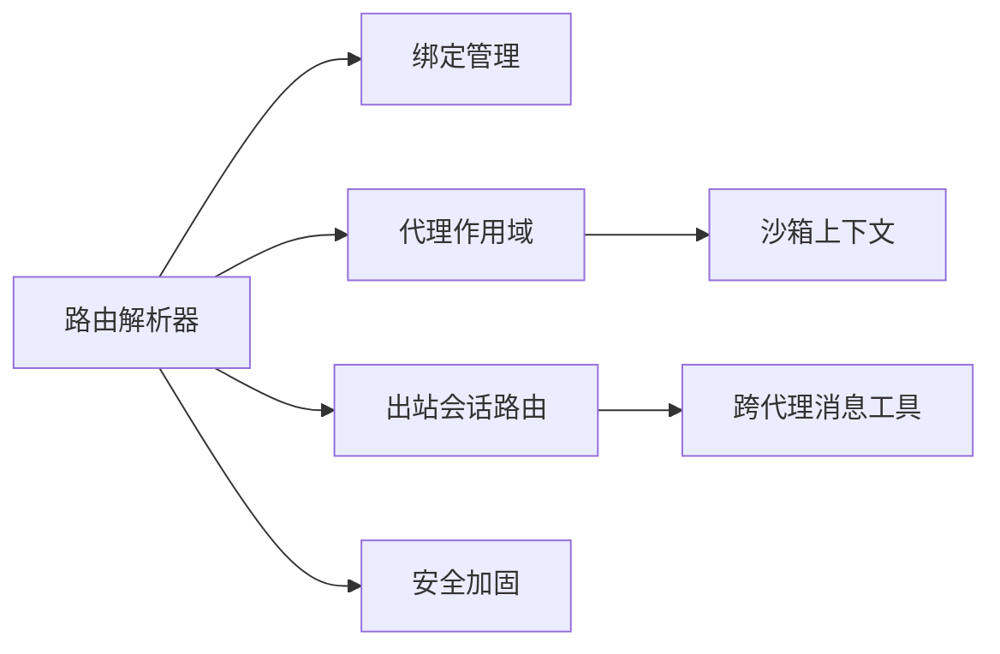

# 多代理路由系统

## 目录
1. [简介](#简介)
2. [项目结构](#项目结构)
3. [核心组件](#核心组件)
4. [架构总览](#架构总览)
5. [组件详解](#组件详解)
6. [依赖关系分析](#依赖关系分析)
7. [性能考量](#性能考量)
8. [故障排查指南](#故障排查指南)
9. [结论](#结论)
10. [附录](#附录)

## 简介
本文件系统化阐述 OpenClaw 的多代理路由体系，围绕“代理隔离、会话路由策略、工作空间管理、上下文传递与状态同步、代理选择与负载均衡、资源分配与安全边界”展开，结合源码路径与测试用例，给出可操作的配置范式与扩展建议。目标读者为需要在单一网关进程中托管多个独立智能体并实现精细化路由与安全隔离的开发者。

## 项目结构
多代理路由涉及的关键模块分布于概念文档、路由解析、绑定管理、代理作用域、沙箱与工具策略、出站会话路由以及扩展插件策略等目录。下图概览了与多代理路由直接相关的代码模块及其交互关系。

## 核心组件
- 路由解析器：根据通道、账户、群组/频道/私聊对端、父级对端线程等维度确定目标代理与会话键，并生成主会话键别名。
- 绑定管理：支持 CLI/配置导入时的绑定去重、冲突检测与规范化；支持通配账户与通道级绑定。
- 代理作用域：解析默认代理、代理配置合并（名称、工作空间、模型、身份、子代理、沙箱、工具策略等），并解析代理工作空间与状态目录。
- 沙箱与工具策略：按全局与代理粒度解析沙箱模式、作用域、清理策略、工具白黑名单与提升权限；支持容器级隔离与 per-agent 容器。
- 出站会话路由：按通道类型分派到具体通道的会话解析逻辑，统一对外暴露路由接口。
- 扩展策略：如 Microsoft Teams 的团队/频道白名单与通配策略解析。
- 跨代理通信：代理间消息工具内置白名单与策略校验，确保仅在允许范围内进行跨代理投递。
- 安全边界：对认证凭据与代理目录进行权限加固，避免越权访问。

## 架构总览
下图展示从入站消息到代理路由、会话键生成、工作空间与沙箱上下文构建、出站会话路由与跨代理通信的整体流程。

## 组件详解

### 路由解析与会话键生成
- 匹配优先级（最具体优先）：对端精确匹配（含线程父对端继承）、群组/团队标识、账户匹配、通道级匹配（含通配）、回退到默认代理。
- 会话键生成：支持多种 DM 作用域策略（主会话、按对端、按频道对端、按账户+频道对端），并生成主会话键别名用于直聊折叠。
- 结果包含：目标 `agentId`、通道、账户、内部会话键、主会话键别名及命中原因，便于调试与日志追踪。

### 绑定管理与配置应用
- 去重与冲突检测：基于匹配键去重，若同一匹配键指向不同 `agentId` 则标记冲突；相同 `agentId` 则跳过。
- 规范化：通道与账户 ID 规范化，必要时填充默认账户。
- 支持通配账户与通道级绑定，便于快速覆盖默认路由。

### 代理作用域与工作空间
- 默认代理解析：支持多条默认标记时的警告与首条优先策略。
- 代理配置合并：名称、工作空间、`agentDir`、模型、记忆检索、心跳、身份、群聊策略、子代理、沙箱、工具策略等。
- 工作空间与状态目录解析：支持按代理定制或回退到默认路径。

### 沙箱与工具策略
- 沙箱配置解析：支持全局与代理粒度的模式、作用域、清理策略；工具策略按代理粒度合并。
- 上下文构建：在启用沙箱时，确保容器与浏览器上下文就绪，提供工作区访问与工具策略。
- 测试验证：覆盖代理特定沙箱模式与作用域的解析行为，以及 per-agent 容器设置在共享作用域下的忽略规则。

### 出站会话路由与扩展策略
- 统一入口：按通道类型分派到具体通道的会话解析函数，保证对外接口一致。
- 扩展策略：以 Teams 为例，支持团队/频道白名单与通配键解析，形成“团队候选→频道候选”的两层匹配链路。

### 跨代理通信与权限控制
- 代理间消息工具：内置开关与白名单校验，拒绝未授权的跨代理发送；构建请求者与目标会话上下文，走内部通道投递。
- 权限与安全加固：对认证凭据与代理目录进行权限修正，降低越权风险。

## 依赖关系分析
- 路由解析依赖绑定列表与代理作用域配置，生成会话键后驱动后续工作流。
- 沙箱上下文构建依赖代理作用域解析结果，确保工作空间与工具策略正确注入。
- 出站会话路由依赖通道类型与路由解析结果，统一调度到各通道实现。
- 跨代理通信依赖工具策略与白名单，受安全加固影响。

## 性能考量
- 路由匹配复杂度：绑定过滤与逐项匹配为线性扫描，建议在高并发场景下减少不必要绑定数量，优先使用更具体的匹配键。
- 会话键生成：通过 DM 作用域策略减少不必要的会话拆分，避免过多会话导致存储与并发压力。
- 沙箱开销：容器/浏览器初始化成本较高，建议按代理粒度启用沙箱，避免全局强制沙箱带来的额外开销。
- 清理策略：合理设置空闲与最大存活时间，防止资源泄漏与容器堆积。
- 跨代理通信：严格白名单与最小权限原则可减少无效投递与失败重试，降低网络与计算开销。

## 故障排查指南
- 路由未命中默认代理：检查绑定是否覆盖了通配账户或通道级规则；确认 `accountId` 是否与默认账户一致。
- 线程继承未生效：确认父对端是否存在且 ID 规范化后匹配成功。
- 会话键异常：核对 DM 作用域配置与 `identityLinks` 设置，确保主会话键别名生成符合预期。
- 沙箱未启用：检查全局与代理粒度的沙箱模式与作用域，确认 per-agent 容器设置在共享作用域下被忽略。
- 跨代理消息被拒：检查 `tools.agentToAgent` 开关与 `allow` 白名单，确认请求者与目标代理组合合法。
- 权限问题：运行安全加固脚本，确保凭据与代理目录权限正确。

## 结论
OpenClaw 的多代理路由系统通过“明确的匹配优先级、可配置的会话键策略、代理粒度的沙箱与工具策略、统一的出站路由接口与严格的跨代理权限控制”，实现了在单网关进程内对多智能体的高效隔离与灵活调度。开发者可依据本文档的配置示例与扩展建议，快速落地按渠道路由、按用户路由、按功能路由等场景，并在保障安全的前提下进行性能优化与运维治理。

## 附录

### 配置示例与最佳实践
- 按渠道路由：将不同通道（如 WhatsApp、Telegram）映射到不同代理，通道级绑定优先于账户级。
- 按用户路由：在 WhatsApp 场景中按 DM 对端 E.164 或群组 ID 精确路由，确保直聊折叠到主会话键。
- 按功能路由：将日常聊天与深度工作分别路由到不同代理，配合模型与工具策略差异实现差异化能力。
- 多账户/多号码：通过 `accountId` 将同一通道的不同登录实例路由到不同代理，避免会话混叠。
- 家庭代理与群组路由：为家庭群组绑定专用代理，开启 `mentionPatterns` 与严格工具策略，必要时启用全量沙箱。