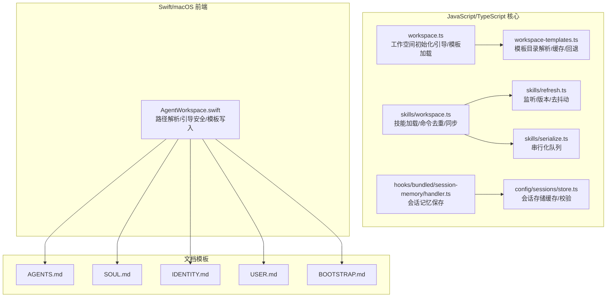
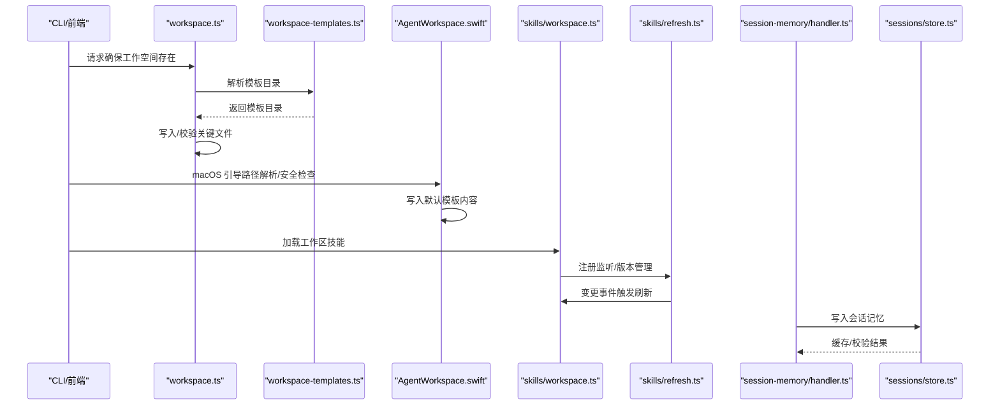
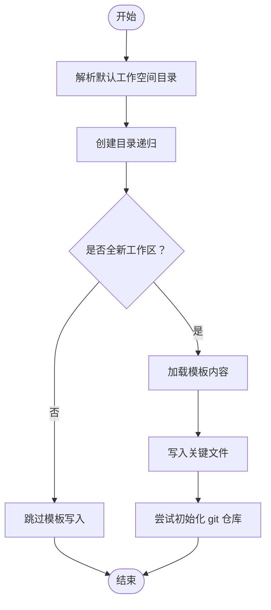
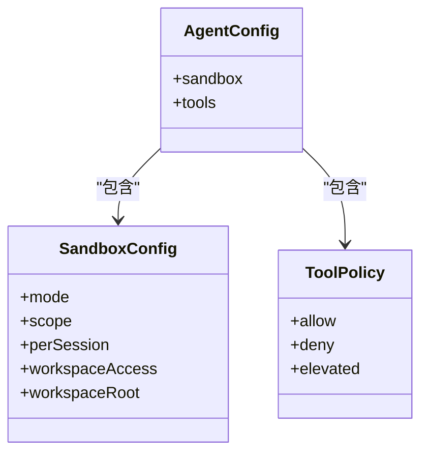
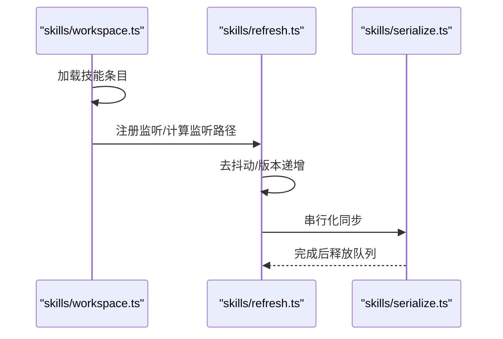
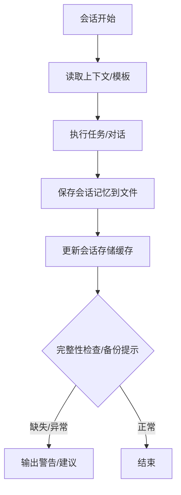
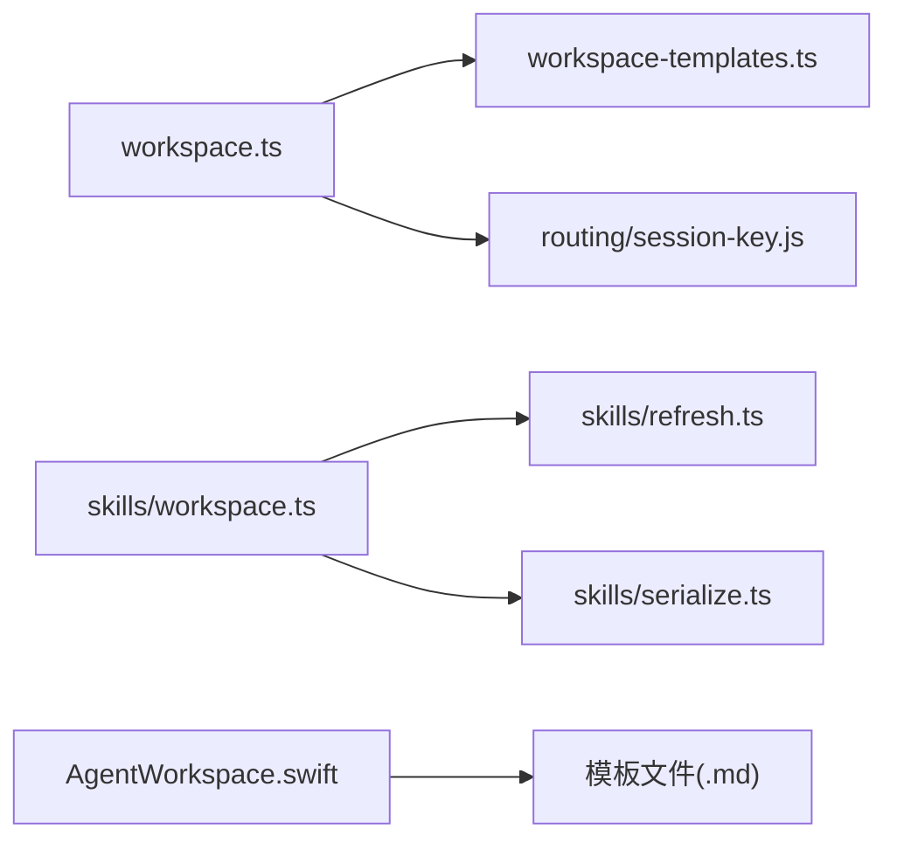

# 工作空间管理

## 目录
1. [简介](#简介)
2. [项目结构](#项目结构)
3. [核心组件](#核心组件)
4. [架构总览](#架构总览)
5. [详细组件分析](#详细组件分析)
6. [依赖关系分析](#依赖关系分析)
7. [性能考量](#性能考量)
8. [故障排查指南](#故障排查指南)
9. [结论](#结论)
10. [附录：配置示例与最佳实践](#附录配置示例与最佳实践)

## 简介
本章节系统性阐述 OpenClaw 的工作空间（Workspace）管理理念与实现，覆盖以下主题：
- 工作空间概念与隔离策略：以“文件型工作区”为核心，结合沙箱与工具策略实现运行时隔离与权限控制。
- 资源管理与模板系统：通过内置模板与可选的外部模板目录，统一初始化与引导流程；支持模板缓存与回退路径。
- 技能集成与动态加载：工作空间内 skills 目录与全局配置联动，支持监听变更、去重与并发串行化同步。
- 状态管理与持久化：会话记忆写入与读取、缓存与校验、备份建议与完整性检查。
- 配置与扩展：按代理维度的沙箱与工具策略、工作空间根路径与访问模式、以及 Swift/macOS 前端的引导与安全检查。

## 项目结构
围绕工作空间的关键代码分布在三处：
- JavaScript/TypeScript 核心：工作空间初始化、模板解析、技能加载与刷新、会话状态持久化。
- Swift/macOS 前端：工作空间路径解析、引导安全检查、模板写入与默认内容生成。
- 文档模板：AGENTS.md、SOUL.md、IDENTITY.md、USER.md、BOOTSTRAP.md 等引导与规则模板。

## 核心组件
- 工作空间初始化与引导
  - 解析默认工作空间目录、加载模板并按需写入关键文件（如 AGENTS.md、SOUL.md、IDENTITY.md、USER.md、BOOTSTRAP.md），并在全新工作区尝试初始化 git 仓库。
- 模板系统
  - 支持从包内、当前工作目录或回退目录解析模板目录，带缓存与回退策略，确保在不同部署环境下稳定可用。
- 技能加载与动态刷新
  - 统一从工作区 skills 目录与全局配置加载技能，支持监听变更、版本号递增、去抖动与串行化同步，避免竞态与重复 IO。
- 沙箱与权限控制
  - 支持按代理维度的沙箱模式、作用域、会话粒度、工作区访问模式与根路径等配置；工具策略允许白名单/黑名单组合，并支持“提升权限”的来源控制。
- 状态持久化与恢复
  - 会话记忆写入与读取、会话存储缓存与校验、完整性检查与备份提示，保障历史连续性与可恢复性。

## 架构总览
下图展示工作空间从初始化到运行期的交互流程，包括模板加载、技能刷新、沙箱策略与状态持久化。

## 详细组件分析

### 工作空间初始化与模板系统
- 默认工作空间目录解析：根据环境变量与用户主目录确定默认路径，支持多配置文件（profile）区分。
- 关键文件写入：在首次创建时写入 AGENTS、SOUL、TOOLS、IDENTITY、USER、HEARTBEAT、BOOTSTRAP 等文件；对 MEMORY 文件进行去重处理。
- 模板解析：优先使用包内模板目录，其次当前工作目录下的模板，最后回退到内置回退目录；支持缓存与并发解析保护。
- macOS 引导：提供路径解析、空工作区判断、模板仅工作区检测、引导安全评估与默认模板写入。

### 沙箱与权限控制
- 代理级覆盖：支持按代理维度覆盖全局沙箱配置（模式、作用域、会话粒度、工作区访问模式与根路径）。
- 工具策略：允许白名单与黑名单组合，支持“提升权限”的来源控制（如特定渠道号码）。
- 策略解析：优先级为“代理覆盖 > 全局 > 默认”，并考虑共享/代理作用域差异。

### 技能集成与动态加载
- 技能加载：从工作区 skills 目录与全局配置加载，支持命令名去重与唯一化，避免冲突。
- 动态刷新：监听工作区 skills、全局 skills 配置与插件技能目录，支持去抖动与版本号递增，保证一致性。
- 并发控制：通过串行化队列避免并发同步导致的竞态与重复 IO。

### 状态管理、持久化与恢复
- 会话记忆：在会话钩子中保存上下文到指定文件，记录相对路径便于调试。
- 会话存储：提供缓存与校验逻辑，避免重复读取与缓存失效导致的数据不一致。
- 备份与完整性：提供工作区备份提示与状态完整性检查，建议使用私有 git 仓库备份工作区。

## 依赖关系分析
- 模块耦合
  - `workspace.ts` 依赖 `workspace-templates.ts` 提供模板目录解析；同时与路由模块协作过滤子代理会话所需的引导文件。
  - `skills/*` 模块之间通过公共接口解耦，`refresh` 与 `serialize` 协同保证一致性与稳定性。
  - macOS 前端 `AgentWorkspace.swift` 与文档模板强关联，负责写入与默认内容生成。
- 外部依赖
  - git 命令用于初始化仓库（在新工作区且可用时）。
  - 文件系统操作与路径解析贯穿各模块。

## 性能考量
- 模板解析缓存：模板目录解析采用缓存与并发保护，避免重复扫描与竞态。
- 技能刷新去抖动：默认去抖动时间可配置，降低频繁变更带来的 IO 压力。
- 串行化同步：通过串行化队列避免并发同步导致的重复 IO 与竞态。
- 会话存储缓存：基于文件修改时间与缓存有效期减少重复读取。

## 故障排查指南
- 工作区为空或非空：macOS 引导前进行安全检查，确保工作区为空或仅包含模板文件。
- 模板缺失：当模板文件不存在时抛出错误，提示打包模板路径。
- 会话历史异常：医生命令检查主会话转录文件是否存在与行数，给出修复建议。
- 备份建议：未使用 git 的工作区给出备份提示，推荐使用私有仓库。

## 结论
OpenClaw 的工作空间管理以“文件型工作区 + 模板 + 沙箱 + 技能动态加载 + 状态持久化”为核心，既保证了运行时隔离与权限控制，又提供了灵活的定制与扩展能力。通过缓存、去抖动与串行化等机制，系统在易用性与性能之间取得平衡。建议在生产环境中启用 git 备份、合理设置沙箱与工具策略，并利用技能监听与版本管理保持工作区技能的一致性。

## 附录：配置示例与最佳实践
- 基础工作空间
  - 使用默认工作空间目录，首次启动时写入 AGENTS、SOUL、IDENTITY、USER、BOOTSTRAP 等文件；必要时初始化 git 仓库。
  - 参考：`workspace.ts`、`AgentWorkspace.swift`
- 技能工作空间
  - 在工作区 skills 目录放置技能；通过 refresh 模块监听变更并串行化同步；必要时配置额外加载目录与插件技能目录。
  - 参考：`skills/workspace.ts`、`skills/refresh.ts`
- 自定义工作空间
  - 通过代理配置覆盖沙箱模式、作用域、工作区访问模式与根路径；工具策略支持白名单/黑名单与提升权限来源控制。
  - 参考：`sandbox/config.ts`、`agent-scope.test.ts`
- 模板开发与版本管理
  - 将模板置于 docs/reference/templates 或包内模板目录；通过缓存与回退策略保证可用性；变更时注意路径与命名规范。
  - 参考：`workspace-templates.ts`、`AGENTS.md`