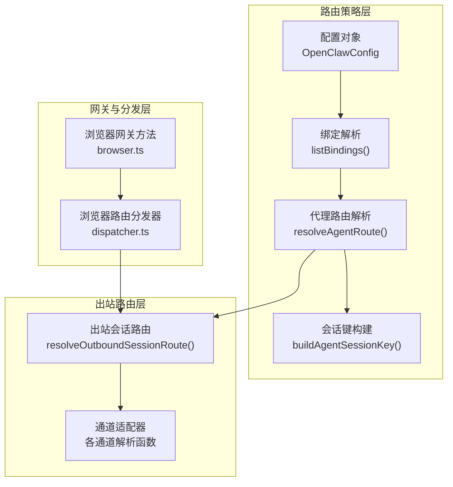
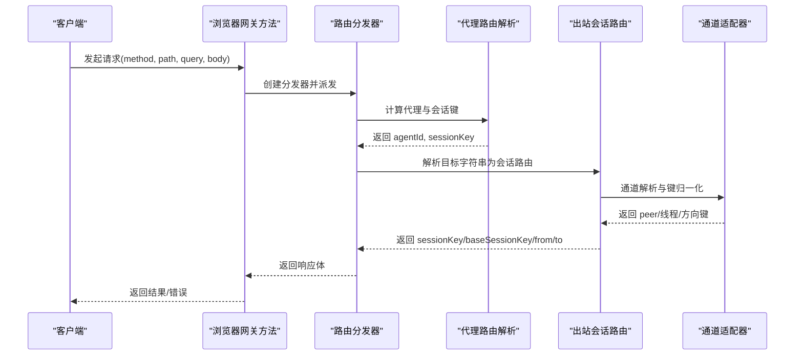
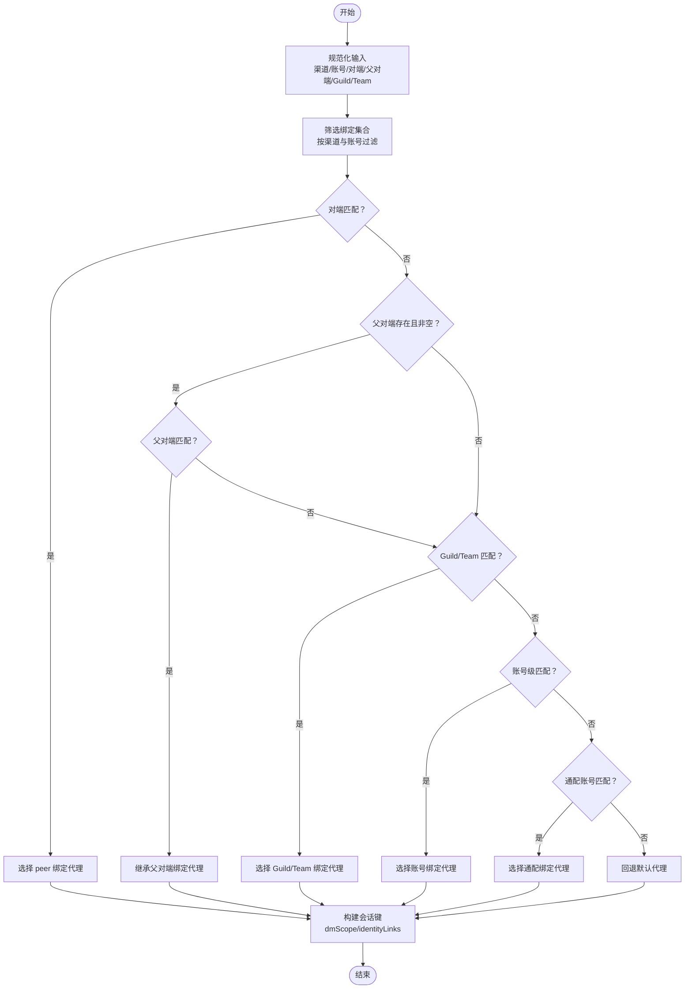
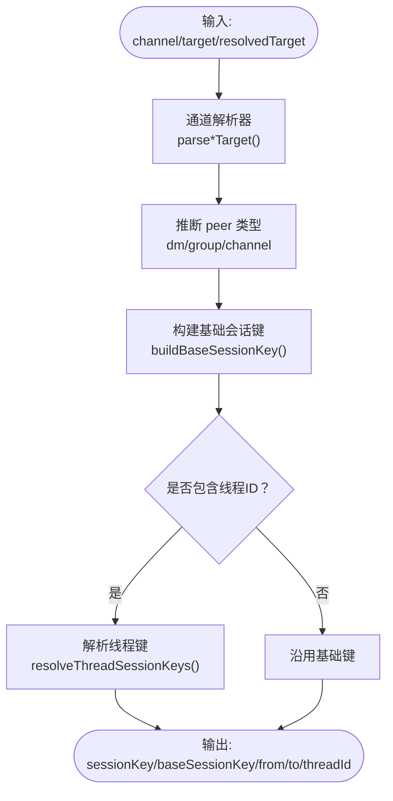
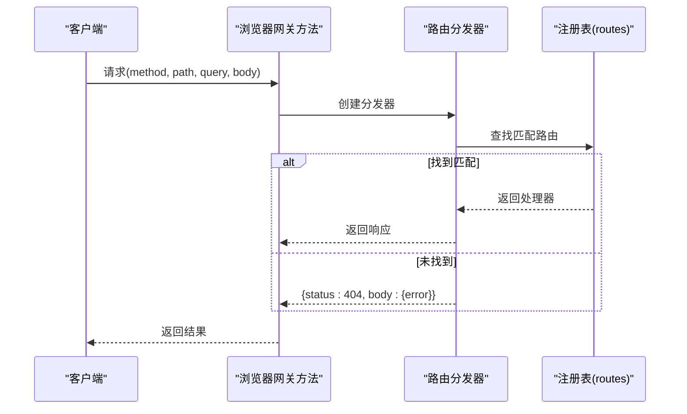
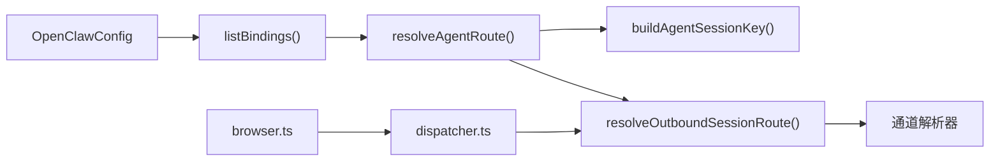

# 路由策略

## 目录
1. [简介](#简介)
2. [项目结构](#项目结构)
3. [核心组件](#核心组件)
4. [架构总览](#架构总览)
5. [详细组件分析](#详细组件分析)
6. [依赖关系分析](#依赖关系分析)
7. [性能考量](#性能考量)
8. [故障排除指南](#故障排除指南)
9. [结论](#结论)
10. [附录](#附录)

## 简介
本文件系统化阐述 OpenClaw 的路由策略体系，围绕“会话键解析、目标绑定、路径选择与负载均衡”展开，解释按渠道路由、按用户路由、按功能路由与动态路由的决策机制，并覆盖路由缓存、性能优化、错误处理与配置管理（含优先级与故障转移）。文末提供可直接落地的配置示例与扩展建议，帮助开发者进行路由扩展、性能调优与故障排除。

## 项目结构
OpenClaw 的路由能力横跨“配置解析—会话键生成—出站会话路由—浏览器网关分发”等模块，形成从“策略配置”到“运行时执行”的闭环。

## 核心组件
- 代理路由解析器：根据配置、渠道、账号、对端、父对端、公会/团队 ID 等维度，按“最精确优先”原则匹配绑定，生成代理 ID 与会话键。
- 会话键生成器：依据 dmScope、identityLinks、通道与对端信息，生成统一的会话键，支持多维隔离与折叠。
- 出站会话路由：针对不同通道的目标字符串进行解析与归一化，推导 `peer` 类型、会话键、from/to 形态与线程键。
- 浏览器路由分发：基于方法与路径正则匹配，注册与分发前端路由请求。
- 网关入口：浏览器网关方法负责创建分发器、捕获异常并返回标准化响应。

## 架构总览
下图展示从“请求进入—路由决策—会话建立—通道适配—响应返回”的完整链路。

## 详细组件分析

### 代理路由解析（按渠道路由/按用户路由/按功能路由/动态路由）
- 决策维度
  - 渠道与账号：过滤匹配的绑定集合。
  - 对端匹配：优先精确匹配 `peer`（DM/群组/频道）。
  - 父对端继承：当直连 `peer` 不匹配时，回退到线程父 `peer` 绑定。
  - 公会/团队匹配：Discord `guildId`、Slack `teamId` 等。
  - 账号级匹配：按 `accountId` 精确或通配匹配。
  - 默认回退：未命中时使用默认代理与主会话键。
- 会话键生成
  - 支持多种 dmScope：main、per-peer、per-channel-peer、per-account-channel-peer。
  - 支持 identityLinks：将不同通道的对端 ID 折叠到统一标识，实现跨通道 DM 隔离/合并。
- 动态路由
  - 通过 `parentPeer` 与 `guild`/`team` 绑定实现动态线程继承与跨群组路由。

### 会话键解析与折叠
- 关键点
  - dmScope 控制 DM 会话隔离粒度，支持 per-peer/per-channel-peer/per-account-channel-peer/main。
  - identityLinks 将不同通道的对端 ID 映射到统一 canonical ID，实现跨通道折叠。
  - 主会话键与代理会话键分离，便于直接对话收拢与多维隔离。
- 性能影响
  - identityLinks 查询采用候选集与映射表，避免全量扫描。
  - 多维组合键长度受控，保证存储与索引效率。

### 出站会话路由（按通道解析与目标绑定）
- 设计要点
  - 针对每个通道实现独立解析器，统一输出 `peer` 类型、基础会话键、from/to 形态与线程键。
  - 通道特性适配：Slack 的 `mpim` 判定、Telegram 的 `topic` 编码、Signal 的 `group`/`uuid` 解析、Matrix/Teams/Mattermost 等的格式归一化。
  - 线程键支持：`resolveThreadSessionKeys` 提供 suffix 与无后缀两种模式，满足 Discord 等平台差异。
- 缓存与性能
  - Slack 通道类型查询结果缓存，减少重复 API 调用。
  - 前缀剥离与正则判定在解析阶段完成，降低后续处理成本。

### 浏览器路由分发（API/服务组件）
- 注册与匹配
  - 使用编译后的正则表达式进行路径匹配，支持 GET/POST/DELETE 方法注册。
  - 未匹配返回 404。
- 错误处理
  - 网关方法在创建分发器失败时直接返回 UNAVAILABLE。
  - 分发后若状态码 ≥ 400，按 INVALID_REQUEST 或 UNAVAILABLE 返回标准化错误。

## 依赖关系分析
- 路由策略依赖配置与绑定解析，最终生成会话键。
- 出站会话路由依赖通道解析器与会话键工具，输出统一的路由元数据。
- 网关层依赖分发器与路由解析器，形成“请求—路由—执行—响应”的闭环。

## 性能考量
- 缓存策略
  - Slack 通道类型查询缓存，避免重复 API 调用。
  - 通道解析器对常见前缀与格式进行预处理，减少正则与字符串操作开销。
- 键生成与折叠
  - identityLinks 查询使用候选集与映射，避免全量遍历。
  - dmScope 粒度越细，键越长，需权衡隔离需求与存储/索引成本。
- 线程键处理
  - `resolveThreadSessionKeys` 支持无后缀模式，减少键长度与存储压力。
- 分发器匹配
  - 正则预编译与路径归一化，提升匹配效率。

## 故障排除指南
- 常见错误分类
  - 致命错误：内存溢出、脚本执行超时等，应立即停止并报警。
  - 配置错误：缺少 API Key/凭据等，需提示修复配置。
  - 临时网络错误：连接重置、DNS 失败、超时等，建议重试或降级。
  - 中止错误：主动取消（如关闭/重启），不应视为失败。
- 排查步骤
  - 检查路由匹配顺序与绑定优先级，确认 `peer` 绑定是否被忽略。
  - 核对 dmScope 与 identityLinks 是否导致会话键不一致。
  - 验证通道解析器是否正确识别目标类型（DM/群组/频道）。
  - 观察 Slack 等外部 API 的缓存与限流情况。
- 响应处理
  - 网关方法对 4xx/5xx 统一转换为 INVALID_REQUEST/UNAVAILABLE 并携带详情。

## 结论
OpenClaw 的路由策略以“确定性、可扩展、可诊断”为核心设计目标：通过严格的绑定优先级与多维会话键控制，实现按渠道路由、按用户路由、按功能路由与动态路由的无缝衔接；借助缓存与键折叠优化性能；通过统一的错误分类与响应策略保障稳定性。开发者可在现有框架上灵活扩展通道解析器与绑定规则，满足复杂场景下的路由需求。

## 附录

### 路由决策机制与优先级
- 最精确优先：`peer` → 父 `peer` → `guild`/`team` → 账号 → 通配 → 默认。
- dmScope 与 identityLinks：决定 DM 会话的隔离与折叠行为。
- 线程继承：父 `peer` 绑定在 `peer` 不匹配时提供回退。

### 路由配置管理与优先级设置
- 绑定结构：`agentId` + `match`（`channel`/`accountId`/`peer`/`guildId`/`teamId`）。
- 优先级：`peer` > `guild`/`team` > `accountId`（精确）> `accountId`（通配）> 默认。
- dmScope 与 identityLinks：在 session 配置中声明，影响会话键生成与折叠。

### 故障转移机制
- 未命中 `peer` 时回退父 `peer` 绑定。
- 未命中 `guild`/`team` 时回退账号绑定。
- 未命中任何绑定时回退默认代理。

### 路由缓存机制
- Slack 通道类型查询缓存：Map 存储 `account:channel` → 类型。
- 通道解析器前缀剥离与格式归一化，减少重复计算。

### 性能优化建议
- 合理设置 dmScope：高隔离需求使用 per-channel-peer/per-account-channel-peer，低隔离需求使用 main。
- 使用 identityLinks 实现跨通道折叠，减少会话数量。
- 对频繁调用的通道解析器增加本地缓存（如 Slack 类型）。
- 线程键尽量使用无后缀模式以缩短键长。

### 错误处理策略
- 致命错误：立即停止并报警。
- 配置错误：提示修复配置。
- 临时网络错误：重试或降级。
- 中止错误：忽略并记录。

### 配置示例（路径引用）
- 简单路由（按渠道分流）
  - 示例路径：`docs/concepts/multi-agent.md#L206-L233`
  - 示例路径：`docs/zh-CN/concepts/multi-agent.md#L205-L232`
- 复杂路由（同一渠道内按对端分流）
  - 示例路径：`docs/concepts/multi-agent.md#L240-L267`
  - 示例路径：`docs/zh-CN/concepts/multi-agent.md#L239-L267`
- 自定义路由规则（dmScope 与 identityLinks）
  - 示例路径：`src/routing/resolve-route.test.ts#L46-L80`
  - 示例路径：`src/routing/resolve-route.test.ts#L230-L254`

### 开发者扩展与调优
- 扩展新通道
  - 在 `resolveOutboundSessionRoute` 中新增分支，实现 `parseXxxTarget` 与 `peer` 归一化。
  - 使用 `buildBaseSessionKey` 与 `resolveThreadSessionKeys` 生成会话键。
- 调优建议
  - 评估 dmScope 与 identityLinks 的组合对性能的影响。
  - 对外部 API 调用增加缓存与降级策略。
  - 在网关层对 4xx/5xx 响应进行统一包装，便于监控与排障。