# 企业通讯渠道

## 目录
1. [简介](#简介)
2. [项目结构](#项目结构)
3. [核心组件](#核心组件)
4. [架构概览](#架构概览)
5. [详细组件分析](#详细组件分析)
6. [依赖关系分析](#依赖关系分析)
7. [性能考虑](#性能考虑)
8. [故障排除指南](#故障排除指南)
9. [结论](#结论)

## 简介

OpenClaw 是一个企业级个人AI助手平台，支持多种企业通讯渠道的集成。该项目提供了完整的解决方案，包括Slack、Microsoft Teams、Google Chat等主流企业通讯平台的深度集成。

### 主要特性

- **多平台支持**：支持WhatsApp、Telegram、Slack、Discord、Google Chat、Signal、iMessage、BlueBubbles、Microsoft Teams、Matrix、Zalo、Zalo Personal、WebChat等多种通讯渠道
- **企业级安全**：内置安全审计、权限控制、加密存储等功能
- **灵活配置**：支持多租户、多账户、多代理路由
- **可扩展架构**：基于插件系统的模块化设计

## 项目结构

OpenClaw采用模块化的项目结构，主要包含以下几个核心部分：

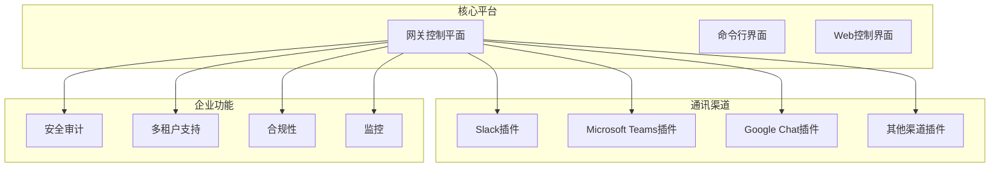

## 核心组件

### 通讯渠道插件系统

OpenClaw使用插件系统来管理不同的通讯渠道，每个渠道都有独立的插件实现：

| 渠道 | 插件ID | 认证方式 | 部署模式 |
|------|--------|----------|----------|
| Slack | `slack` | Socket Mode + Bot Token | Socket连接 |
| Microsoft Teams | `msteams` | Bot Framework + Azure AD | HTTP Webhook |
| Google Chat | `googlechat` | Service Account | HTTP Webhook |

### 安全架构

系统内置了多层次的安全保护机制：

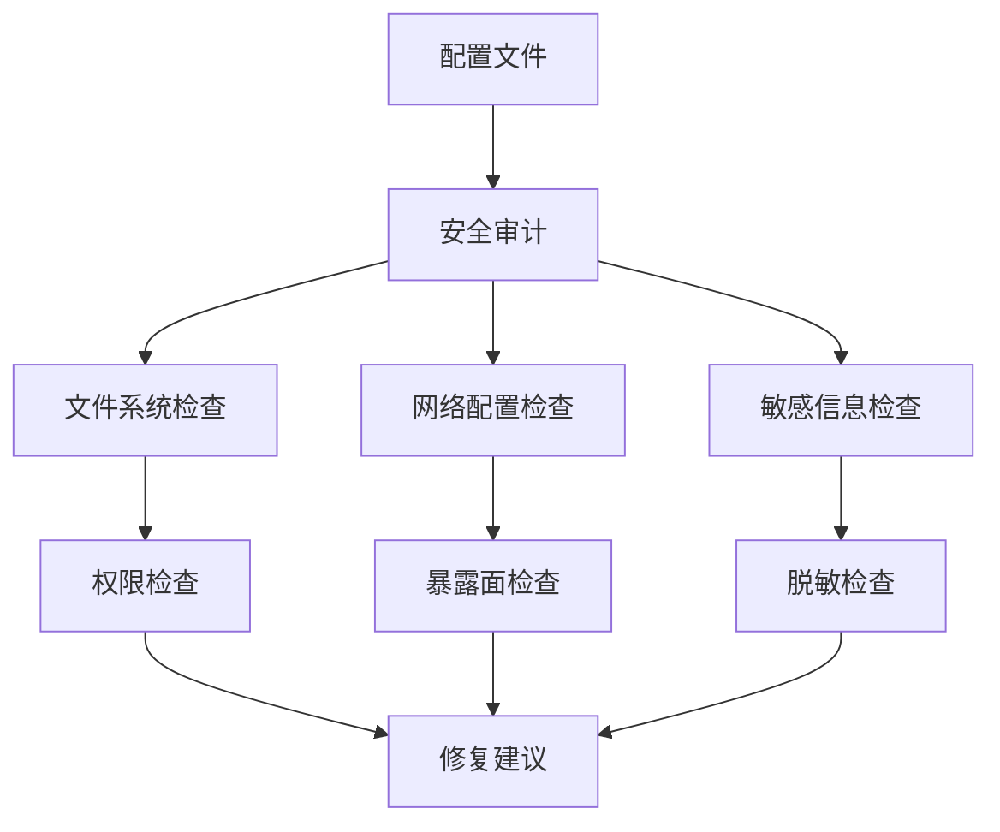

## 架构概览

OpenClaw的企业通讯架构采用了分布式微服务设计理念：

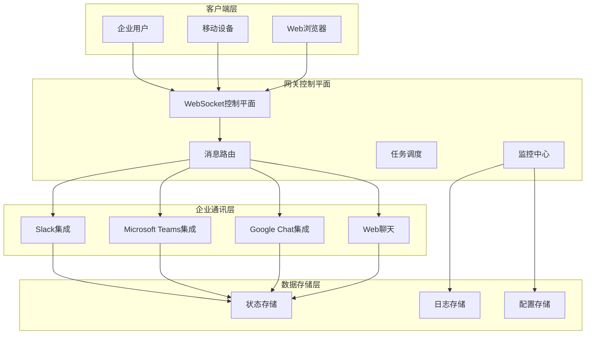

## 详细组件分析

### Slack企业集成

Slack集成为OpenClaw提供了最完善的企业通讯功能：

#### 认证机制

Slack支持两种认证模式：

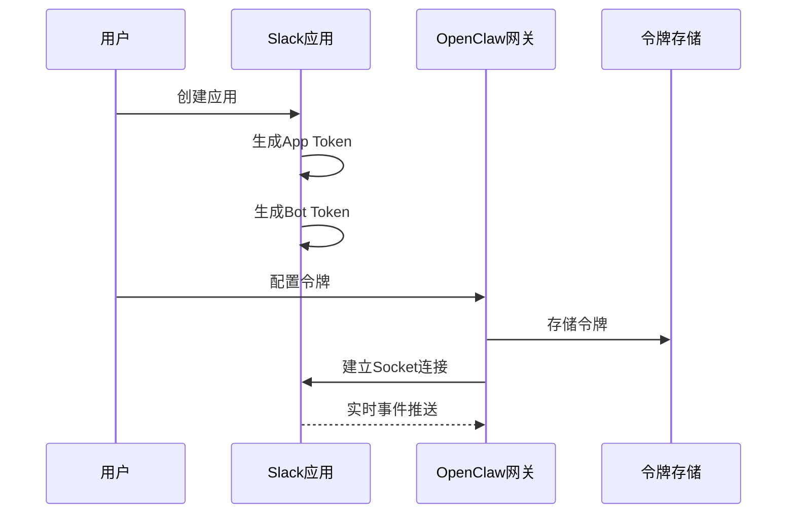

#### 组织架构管理

Slack集成支持企业级的组织架构管理：

| 功能特性 | 配置选项 | 默认行为 |
|----------|----------|----------|
| 群组策略 | `groupPolicy: "allowlist"` | 允许白名单模式 |
| DM访问控制 | `dmPolicy: "pairing"` | 配对验证模式 |
| 成员管理 | `allowFrom` | 发送者白名单 |
| 工具权限 | `tools` | 工具访问控制 |
| 系统提示 | `systemPrompt` | 自定义系统提示 |

#### 权限控制

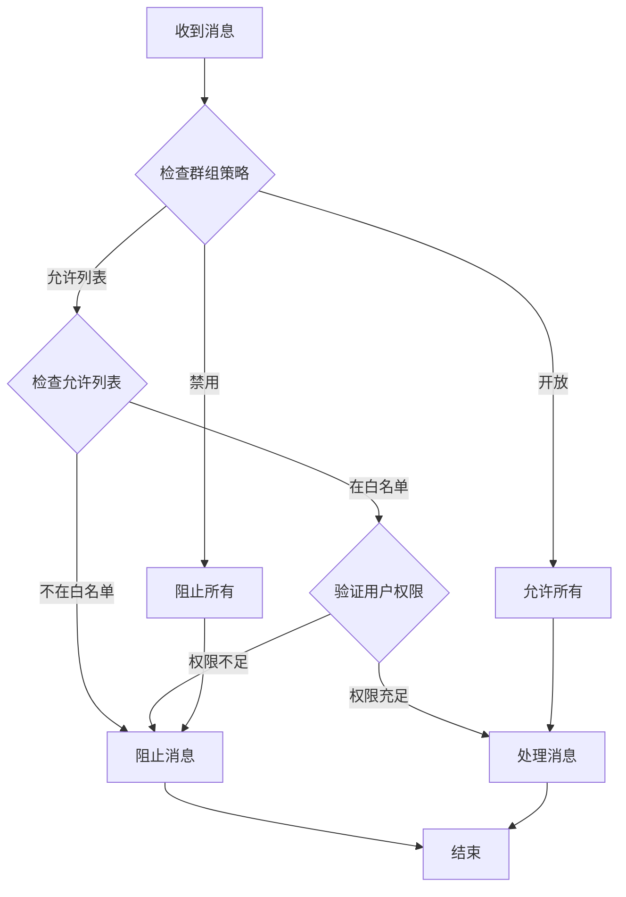

### Microsoft Teams企业集成

Microsoft Teams集成为企业提供了完整的Microsoft生态系统集成：

#### Bot Framework架构

Teams集成基于Microsoft Bot Framework构建：

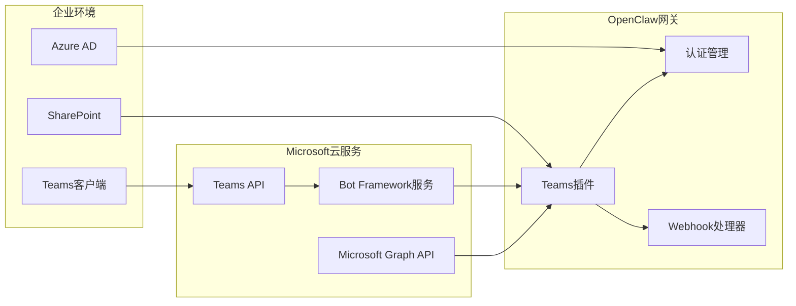

#### 文件共享与协作

Teams集成了完整的文件共享和协作功能：

| 功能类型 | 技术实现 | 权限要求 |
|----------|----------|----------|
| DM文件传输 | FileConsentCard | 个人范围权限 |
| 群组文件上传 | SharePoint上传 | Sites.ReadWrite.All |
| 图片内联显示 | Base64编码 | 无额外权限 |
| 历史消息访问 | Graph API | ChannelMessage.Read.All |

### Google Chat企业集成

Google Chat集成为Google Workspace提供了原生集成体验：

#### 服务账号架构

Google Chat使用Google Cloud服务账号进行认证：

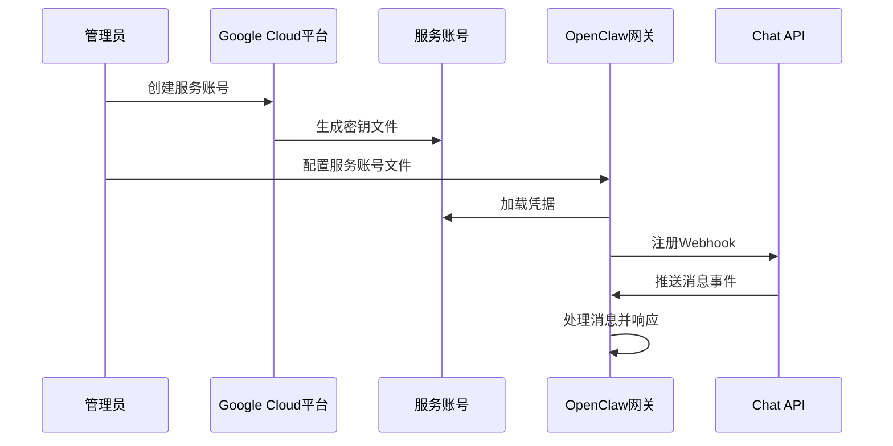

## 依赖关系分析

### 插件系统架构

OpenClaw的插件系统采用统一的注册机制：

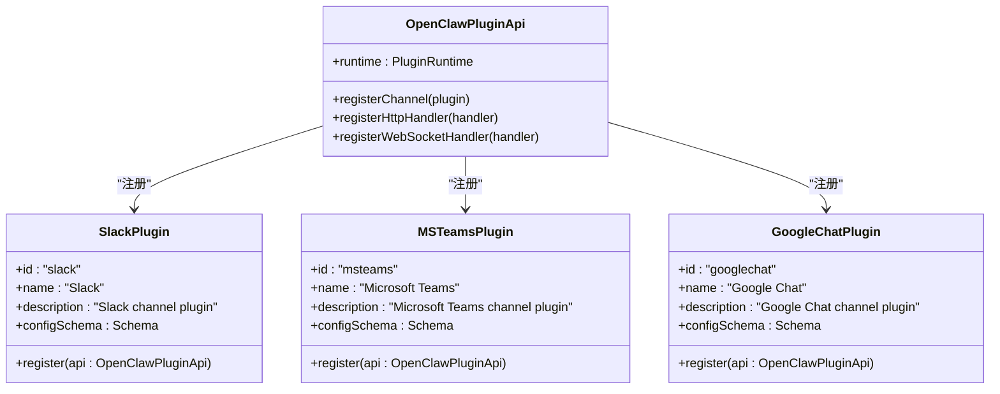

### 企业级依赖

系统依赖于多个企业级服务和框架：

| 依赖类型 | 服务名称 | 用途 | 版本要求 |
|----------|----------|------|----------|
| 认证服务 | Azure AD | Microsoft Teams认证 | 最新版本 |
| 云服务 | Google Cloud | Google Chat服务账号 | 最新版本 |
| 消息队列 | WebSocket | 实时通讯 | 支持版本 |
| 数据库 | 文件系统 | 配置存储 | 任意版本 |
| 容器 | Docker | 环境隔离 | 18.0+ |

## 性能考虑

### 并发处理能力

OpenClaw针对企业环境进行了专门的性能优化：

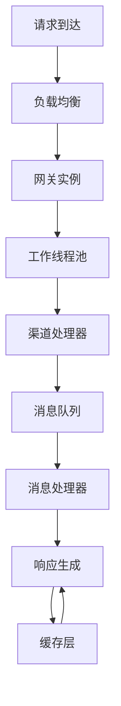

### 缓存策略

系统实现了多层次的缓存机制：

| 缓存层级 | 缓存内容 | 过期时间 | 缓存策略 |
|----------|----------|----------|----------|
| 应用层缓存 | 配置数据 | 5分钟 | LRU算法 |
| 会话缓存 | 用户会话 | 30分钟 | 按需清理 |
| 文件缓存 | 附件文件 | 24小时 | 磁盘空间管理 |
| 图表缓存 | 统计图表 | 1小时 | 定时刷新 |

### 扩展性设计

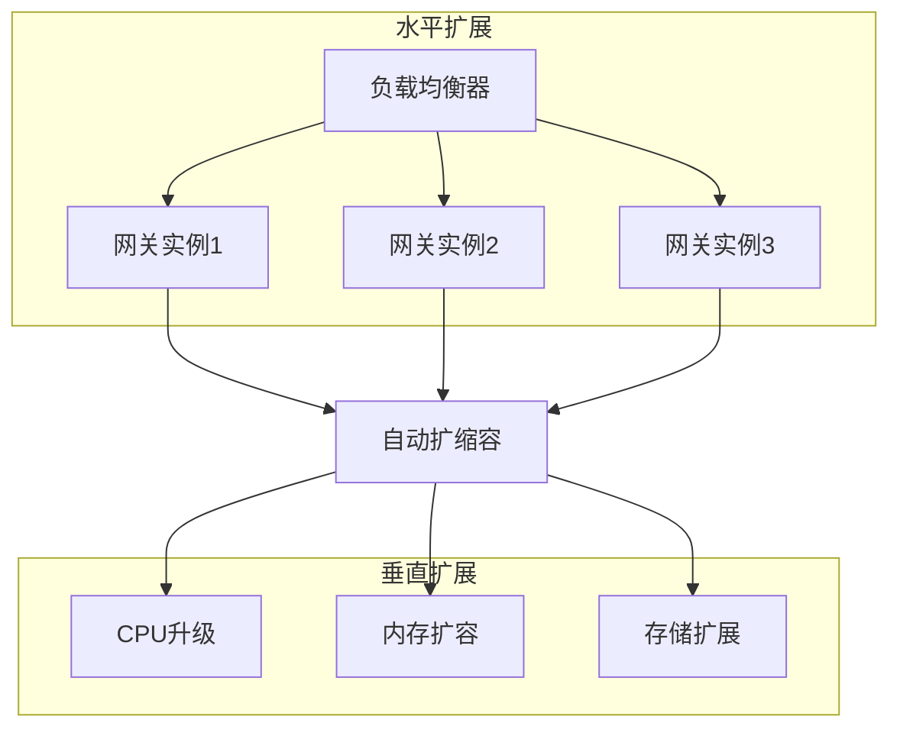

## 故障排除指南

### 常见问题诊断

系统提供了完整的故障排除工具和流程：

#### Slack集成问题

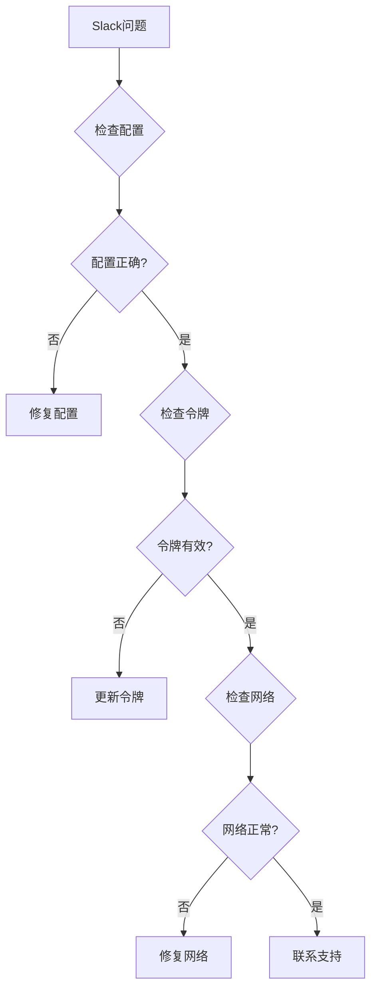

#### Microsoft Teams问题

Teams集成问题的诊断流程：

1. **Bot注册检查**
   - 验证Azure Bot资源状态
   - 检查App ID和密码配置
   - 确认消息端点URL

2. **权限检查**
   - 验证RSC权限配置
   - 检查Graph API权限
   - 确认管理员同意

3. **网络检查**
   - 验证防火墙设置
   - 检查反向代理配置
   - 确认SSL证书

#### Google Chat问题

Google Chat问题的诊断步骤：

1. **服务账号检查**
   - 验证服务账号文件完整性
   - 检查权限范围配置
   - 确认API启用状态

2. **Webhook配置**
   - 验证回调URL配置
   - 检查签名密钥
   - 确认事件订阅

3. **域名验证**
   - 验证域名所有权
   - 检查DNS记录
   - 确认HTTPS配置

### 安全审计

系统内置了全面的安全审计功能：

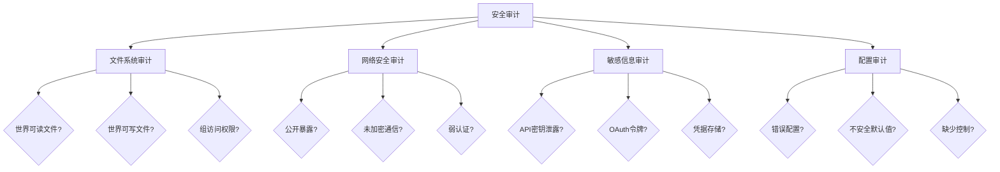

## 结论

OpenClaw为企业通讯渠道提供了一个完整、安全、可扩展的解决方案。通过其模块化的插件架构和企业级的安全功能，OpenClaw能够满足现代企业的各种通讯需求。

### 核心优势

1. **多平台集成**：支持主流企业通讯平台的深度集成
2. **企业安全**：内置安全审计和权限控制机制
3. **灵活配置**：支持多租户、多账户、多代理路由
4. **高性能**：针对企业环境优化的并发处理能力
5. **可扩展性**：基于插件系统的模块化设计

### 部署建议

对于企业部署，建议重点关注以下方面：

1. **安全配置**：确保所有敏感信息都经过适当的保护和脱敏
2. **网络架构**：合理规划内外网访问和防火墙规则
3. **监控告警**：建立完善的监控和告警机制
4. **备份恢复**：制定数据备份和灾难恢复计划
5. **性能优化**：根据业务量选择合适的资源配置和扩展策略

通过遵循这些最佳实践，企业可以充分利用OpenClaw的强大功能，构建高效、安全的企业通讯解决方案。