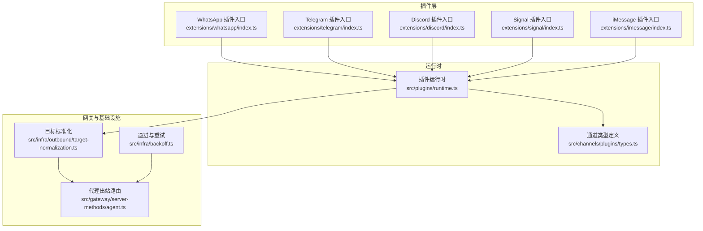
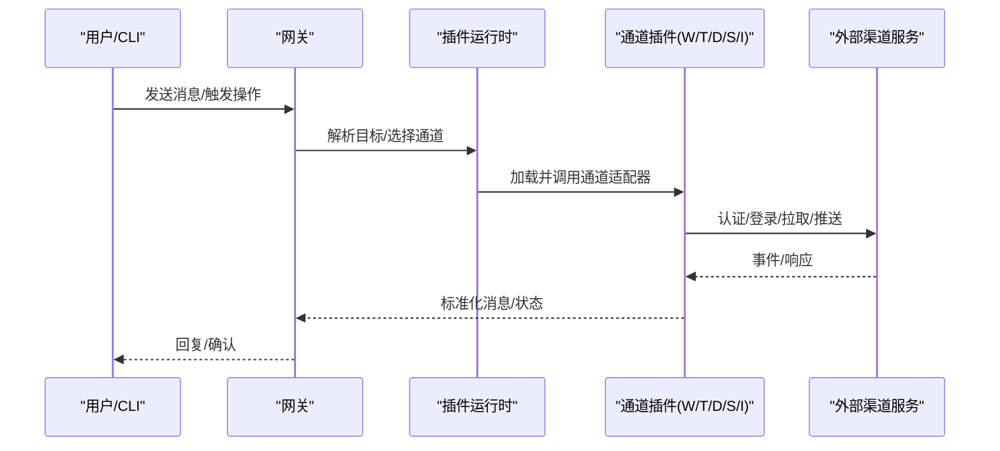
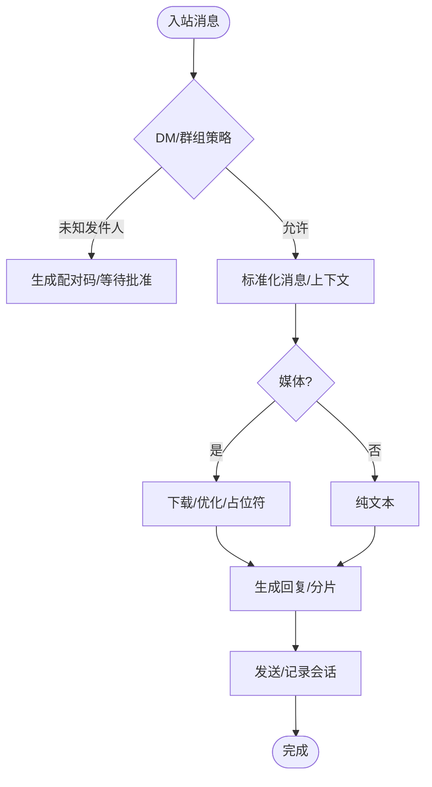
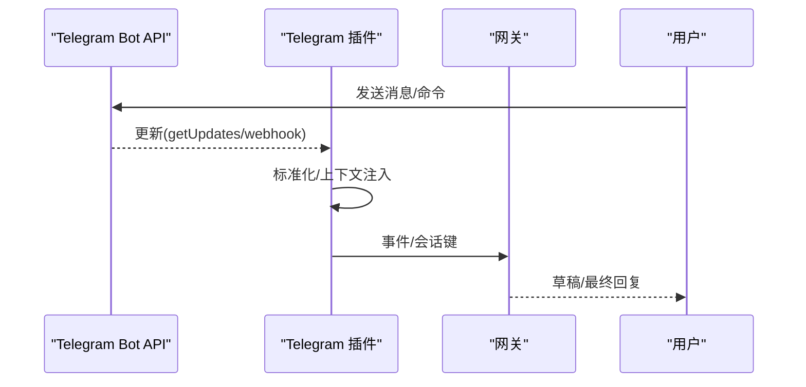
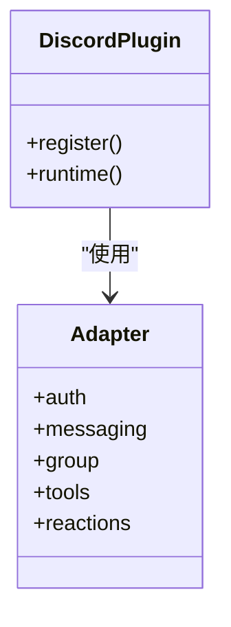
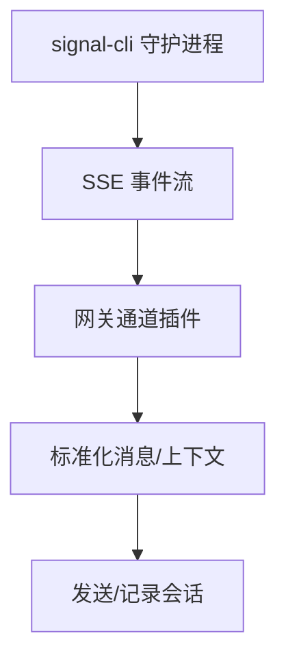
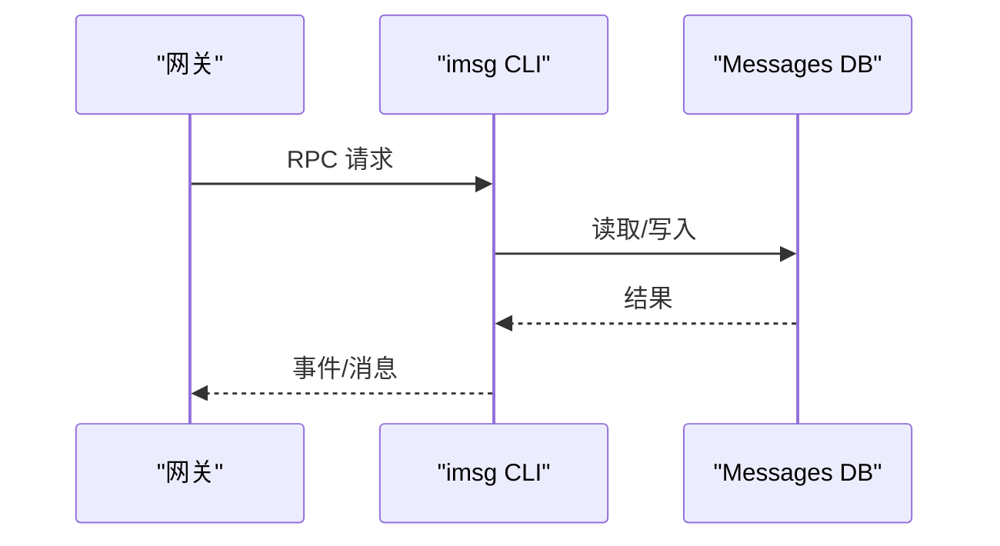
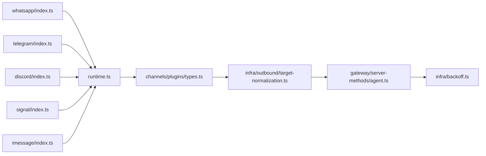

# 即时通讯渠道

## 目录
1. [简介](#简介)
2. [项目结构](#项目结构)
3. [核心组件](#核心组件)
4. [架构总览](#架构总览)
5. [详细组件分析](#详细组件分析)
6. [依赖关系分析](#依赖关系分析)
7. [性能考量](#性能考量)
8. [故障排查指南](#故障排查指南)
9. [结论](#结论)
10. [附录](#附录)

## 简介
本文件面向即时通讯渠道的集成与运维，系统性梳理 WhatsApp、Telegram、Discord、Signal、iMessage 等主流渠道在 OpenClaw 中的实现方式与最佳实践。内容覆盖消息协议差异、认证机制、API 限制与连接管理、消息格式转换、媒体文件处理、群组管理、用户身份验证与权限控制、配置示例、连接测试方法、常见问题与解决方案，以及速率限制处理、断线重连机制与消息队列管理策略。

## 项目结构
OpenClaw 将各渠道以插件形式组织，统一通过通道插件接口进行注册与运行时加载。每个渠道插件包含：
- 插件入口：负责注册通道插件与运行时设置
- 渠道实现：封装具体协议、认证、收发与会话管理
- 配置与能力：支持多账号、分组策略、媒体限制、流式与回执等

## 核心组件
- 通道插件接口与能力
  - 通道插件统一暴露认证、命令、配置、目录、解析器、安全、网关、群组、心跳、登录/登出、消息发送、消息动作（如反应）、提及适配、消息动作上下文、消息传递、代理工具、线程化、流式等适配器与上下文类型，确保不同渠道以一致契约接入。
- 运行时注册与加载
  - 通过运行时维护全局插件注册表，插件在启动时注册自身，后续按需加载与缓存，避免重复初始化。
- 目标标准化与出站路由
  - 对外发目标进行标准化与通道特定解析，结合代理侧的出站路由决策，确定最终发送通道与账户。
- 退避与重试
  - 提供指数退避与抖动策略，结合可配置的重试参数，用于应对瞬时网络错误与限流。

## 架构总览
下图展示各渠道插件如何通过统一运行时接入，并与网关出站流程协同工作：

## 详细组件分析

### WhatsApp 集成
- 登录与凭证
  - 支持 QR 登录（Linked Devices），默认存储于用户目录下的凭证文件；支持多账号与备份恢复。
- 入站与会话
  - 基于事件驱动的收件箱循环；支持个人号自聊模式与配对策略；忽略广播/状态类聊天。
- 消息与媒体
  - 文本分片与换行分段；媒体保存上限与自动优化；语音消息（PTT）处理；贴图占位符。
- 群组与历史
  - 群组会话隔离；提及或正则匹配触发；历史注入与缓存；支持 per-account 配置。
- 反馈与回执
  - 支持即时反馈反应；可禁用或按账号覆盖；默认收到即读。
- 限制与重连
  - 文本与媒体上限；心跳与重连策略；最大尝试次数后降级。
- 配置要点
  - DM 策略、允许列表、群组策略、历史限制、ACK 反应、媒体上限、文本分片、心跳与重连等。

### Telegram 集成
- 令牌与隐私
  - BotFather 创建令牌；隐私模式与管理员权限影响消息可见性；环境变量优先级低于配置。
- 行为与会话
  - 长轮询为主，Webhook 可选；DM 共享主会话，群组隔离；不支持读回执。
- 草稿流式与格式化
  - 支持草稿气泡流式；HTML 格式化与回退为纯文本；内联按钮能力与白名单。
- 命令与权限
  - 注册原生命令菜单；自定义命令；命令权限与覆盖规则。
- 限制与重试
  - 文本分片、媒体上限、超时与重试策略；IPv6/网络问题排查。
- 配置要点
  - 令牌、DM/群组策略、话题/论坛主题、草稿流式、内联按钮、媒体上限、重试与网络选项等。

### Discord 集成
- 应用与意图
  - 开发者门户创建应用与机器人；启用消息内容与成员意图；邀请机器人到服务器。
- 行为与会话
  - DM 与公会文本频道；提及默认开启；群组 DM 默认忽略；群组上下文历史注入。
- 工具与权限
  - 反应、贴纸、投票、消息读写编辑删除、线程、置顶、搜索、成员/角色/频道信息、事件、权限快照等。
- 安全与运维
  - 令牌保护；最小权限原则；受阻或限流时重启网关。
- 配置要点
  - 令牌、DM 策略、群组策略、通道规则、提及要求、历史限制、媒体上限、重试策略、PluralKit 支持等。

### Signal 集成
- 外部守护进程
  - 通过 signal-cli 的 JSON-RPC + SSE 与网关通信；支持本地或外部 HTTP 守护进程。
- 数号模型
  - 网关连接的是 Signal 设备；建议使用独立号码避免自对话环路。
- 行为与会话
  - DM 共享主会话，群组隔离；typing 指示与可选读回执转发。
- 媒体与限制
  - 文本分片、附件支持与下载开关、媒体上限、历史上下文。
- 配置要点
  - 账号、CLI 路径/HTTP 地址、DM/群组策略、历史限制、媒体上限、读回执、忽略附件等。

### iMessage 集成
- 外部 CLI
  - 通过 imsg 的 JSON-RPC over stdio；需要 macOS Messages 登录与权限。
- 行为与会话
  - DM 共享主会话，群组隔离；支持“类群组”线程；提及通过正则模式实现。
- 远程与附件
  - SSH 到远程 Mac 运行 imsg；SCP 获取附件；可自动检测远程主机。
- 媒体与限制
  - 附件摄入、媒体上限、文本分片。
- 配置要点
  - CLI 路径、数据库路径、远端主机、服务类型、DM/群组策略、历史限制、媒体上限、文本分片等。

## 依赖关系分析
- 插件注册与加载
  - 各渠道插件在入口中注册自身并设置运行时，随后由运行时统一管理与缓存。
- 目标解析与出站
  - 目标标准化根据通道插件提供的解析器决定最终标识；代理侧据此构建出站计划与账户选择。
- 重试与退避
  - 对外发 API 调用采用统一退避策略，结合可配置重试参数，提升稳定性。

## 性能考量
- 文本分片与换行分段
  - 各渠道均支持长度与换行两种分片模式，减少单次发送失败与截断风险。
- 媒体优化与上限
  - 图像自动优化与媒体上限控制，避免大文件导致的延迟与失败。
- 并发与队列
  - 长轮询/网关并发由各渠道自身控制；统一的出站目标解析与会话隔离降低冲突。
- 重试与退避
  - 统一的指数退避与抖动策略，结合可配置重试参数，提高对外部 API 的鲁棒性。

## 故障排查指南
- 通用诊断
  - 使用诊断命令检查认证健康与过期状态，必要时刷新 OAuth 令牌。
- 渠道特定
  - Telegram：检查 DNS/IPv6 与 BotFather 隐私设置；长轮询在新版本 Node 上的信号处理问题。
  - Discord：启用所需意图、检查权限与提及要求；注意默认组策略与通道白名单。
  - WhatsApp：确保已链接且未断开；避免使用不稳定运行时；关注重连策略与日志。
  - Signal：独立号码避免自对话；守护进程启动与网络可达性；附件下载与忽略策略。
  - iMessage：权限与自动化设置；远程 SSH/SCP；数据库路径与服务类型。

## 结论
OpenClaw 通过统一的通道插件接口与运行时，将多个即时通讯渠道以一致的方式接入，同时保留各渠道特有的能力与限制。借助标准化的目标解析、会话隔离与统一的重试/退避策略，系统在复杂网络环境下仍能保持稳定与可维护性。建议在生产环境中：
- 明确各渠道的令牌/凭证与权限范围
- 合理配置分片、媒体上限与历史上下文
- 使用多账号与 per-account 覆盖满足差异化需求
- 建立完善的日志与诊断流程，快速定位问题

## 附录
- 配置参考与示例
  - 各渠道文档提供了最小化配置示例与常用场景配置片段，便于快速上手与排错。
- 连接测试方法
  - 通过 CLI 命令与渠道状态检查，结合日志与诊断工具，验证连通性与权限。
- 速率限制与断线重连
  - 依据各渠道文档中的限制与重连策略，结合统一的退避与重试机制，保障消息可靠投递。