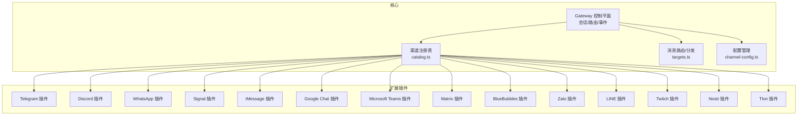
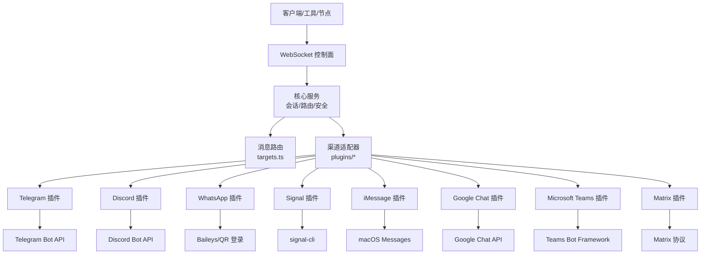
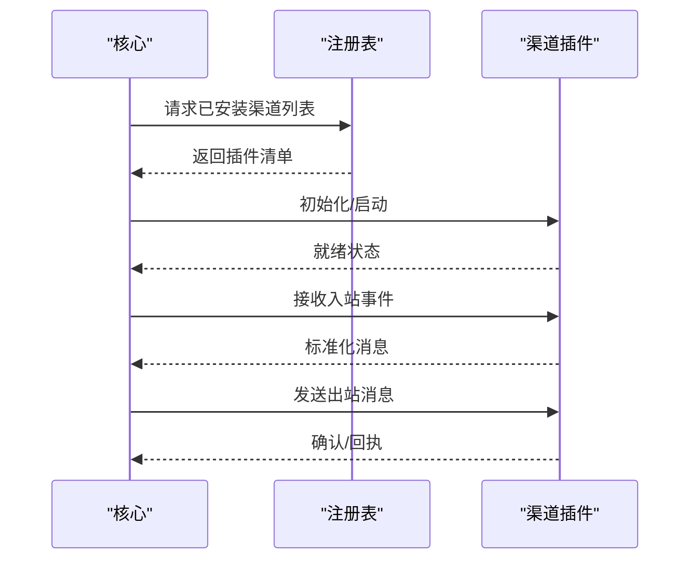
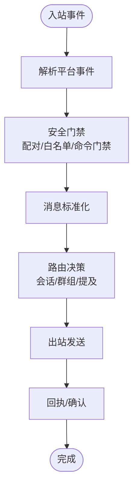
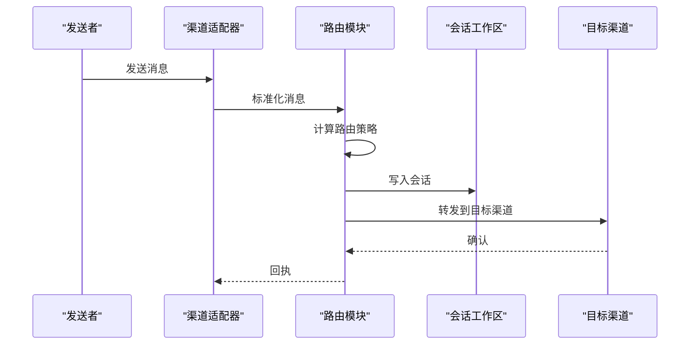
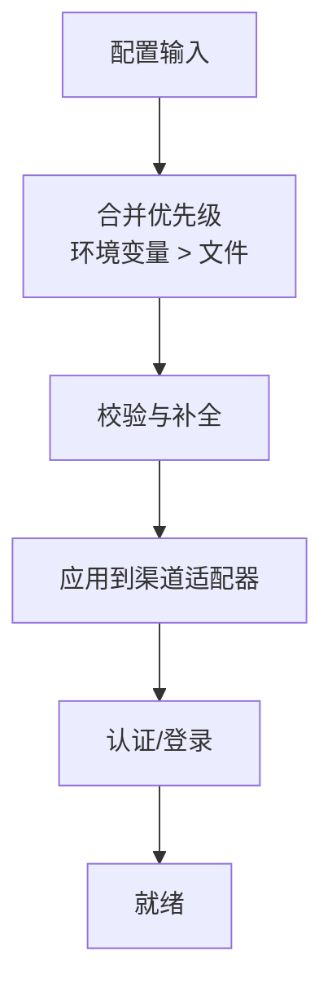
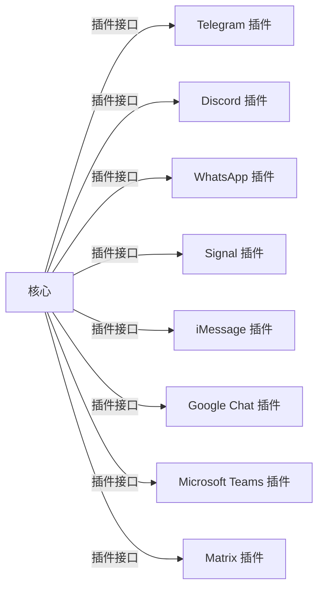

# 多渠道消息集成

## 目录
1. [简介](#简介)
2. [项目结构](#项目结构)
3. [核心组件](#核心组件)
4. [架构总览](#架构总览)
5. [详细组件分析](#详细组件分析)
6. [依赖关系分析](#依赖关系分析)
7. [性能考虑](#性能考虑)
8. [故障排除指南](#故障排除指南)
9. [结论](#结论)
10. [附录](#附录)

## 简介
本文件系统性阐述 OpenClaw 的多渠道消息集成功能，覆盖 20+ 消息渠道（如 WhatsApp、Telegram、Slack、Discord、Google Chat、Signal、iMessage、Microsoft Teams、Matrix、BlueBubbles、Zalo、LINE、Twitch、Nostr、Tlon 等）的集成架构与实现原理。重点说明渠道插件系统的扩展机制、渠道适配器的设计模式、消息路由与分发策略、配置管理、认证授权、消息格式转换、媒体文件处理、群组管理与提及规则，并提供各渠道的配置示例与最佳实践，涵盖安全设置、速率限制、错误处理与故障恢复，以及面向开发者的插件开发指南与集成测试方法。

## 项目结构
OpenClaw 将“核心网关”与“渠道插件”解耦：核心通过统一的 Gateway 控制平面接收与分发事件；具体消息平台由独立的扩展插件实现连接与协议适配。该设计使新增渠道只需实现插件接口，无需改动核心逻辑。

## 核心组件
- 渠道注册表与加载
  - 注册表负责扫描与加载已安装的渠道插件，建立渠道到插件的映射，确保运行时可按需启用与禁用。
- 消息路由与分发
  - 基于会话、目标群组、提及规则与路由策略，将入站消息分派至对应渠道或代理到其他渠道。
- 配置管理
  - 统一的渠道配置读写与校验，支持环境变量覆盖与动态更新。
- 安全与配对
  - 默认 DM 配对策略、允许白名单、命令门禁与提及门禁，保障入站消息安全。
- 媒体与格式转换
  - 跨渠道的消息格式标准化、媒体大小限制与生命周期管理。
- 群组与提及
  - 群组激活模式、提及门禁、回复前缀与分块策略，确保在多渠道场景下保持一致的交互体验。

## 架构总览
OpenClaw 的消息通路以 Gateway 为中心，所有渠道通过插件接入，形成“控制平面 + 插件生态”的双层架构。核心负责会话、路由、安全与配置；插件负责具体平台的协议适配与事件桥接。

## 详细组件分析

### 渠道插件系统与扩展机制
- 插件清单与发现
  - 每个渠道插件通过 `openclaw.plugin.json` 声明自身标识、支持的渠道类型与配置模式，注册表据此加载与验证。
- 插件接口与生命周期
  - 插件暴露初始化、启动、停止、事件监听与发送等接口，核心通过统一协议与之交互。
- 动态加载与热更新
  - 支持插件目录变更后的重新扫描与按需加载，避免重启核心服务。

### 渠道适配器设计模式
- 适配器职责
  - 将平台特定的事件与 API 调用转换为核心内部统一的数据模型，保证路由与处理的一致性。
- 典型流程
  - 解析入站消息 → 校验与门禁 → 标准化 → 路由决策 → 出站发送 → 回执与日志。
- 扩展点
  - 平台差异通过适配器注入，如认证方式、媒体处理、群组规则、提及解析等。

### 消息路由与分发策略
- 会话路由
  - 基于发送者身份与会话上下文，将消息路由到正确的会话工作区，支持主会话与非主会话隔离。
- 群组路由
  - 群组激活模式（提及/总是）、提及门禁、回复前缀与分块策略，确保在多渠道群组中维持清晰的交互边界。
- 跨渠道转发
  - 支持从一个渠道向另一个渠道转发消息，结合目标解析与格式转换，实现跨平台协作。

### 配置管理与认证授权
- 配置来源
  - JSON 配置文件、环境变量覆盖、运行时动态更新。
- 认证授权
  - 各渠道的令牌/密钥配置（如 Telegram Bot Token、Discord Bot Token、WhatsApp QR 登录），默认 DM 配对策略与允许白名单。
- 安全策略
  - DM 策略（配对/开放）、命令门禁、提及门禁、群组访问策略与媒体大小限制。

### 消息格式转换与媒体处理
- 格式转换
  - 将不同渠道的富文本、表情、链接等统一为核心内部表示，再按目标渠道渲染。
- 媒体处理
  - 媒体大小上限、临时文件生命周期、上传/下载与预览链接生成。
- 媒体限制策略
  - 各渠道媒体大小限制与平台特性差异，统一在适配器中处理。

### 群组管理与提及规则
- 群组激活
  - 提及激活与总是激活两种模式，避免无关通知与噪音。
- 提及门禁
  - 仅当被提及或满足激活条件时才触发响应，减少误触发。
- 分块与前缀
  - 长消息分块与回复前缀，提升跨渠道一致性与可读性。

### 各渠道配置示例与最佳实践
- Telegram
  - 使用 Bot Token 或 `channels.telegram.botToken`；可选群组策略与 Webhook。
- Discord
  - 使用 Bot Token 或 `channels.discord.token`；可选命令与权限组、DM/群组白名单。
- WhatsApp
  - 通过 QR 登录与 credentials 存储；支持 `allowFrom` 与 `groups` 白名单。
- Signal
  - 依赖 signal-cli 与 `channels.signal` 配置段。
- iMessage
  - macOS 专属；支持 `groups` 白名单。
- Google Chat
  - Google Chat API 应用；支持 Webhook。
- Microsoft Teams
  - Teams Bot Framework；支持 `allowFrom` 与 `groupAllowFrom`。
- Matrix/BlueBubbles/Zalo/LINE/Twitch/Nostr/Tlon
  - 作为扩展插件安装；各自具备独立配置与能力。

## 依赖关系分析
- 核心与插件
  - 核心不直接依赖具体平台 SDK，而是通过插件接口与之交互，降低耦合度。
- 插件间关系
  - 各插件相互独立，注册表统一调度；部分插件（如 BlueBubbles）可增强 iMessage 能力。
- 外部依赖
  - 各渠道的官方 API/SDK 与本地工具（如 signal-cli、baileys）。

## 性能考虑
- 连接池与并发
  - 为高并发渠道（如 Telegram、Discord）使用连接池与队列限流，避免 API 限流与抖动。
- 缓存与去重
  - 对重复事件进行去重与缓存，减少无效处理。
- 媒体压缩与 CDN
  - 媒体上传前压缩与使用 CDN，缩短传输时间。
- 路由优化
  - 基于会话与群组的快速路由决策，减少不必要的序列化与网络往返。

## 故障排除指南
- 常见问题
  - 渠道未就绪：检查令牌/密钥、网络连通性与 Webhook 配置。
  - DM 安全策略：确认 `dmPolicy` 与 `allowFrom` 设置，必要时执行配对批准。
  - 群组行为异常：检查群组激活模式、提及门禁与分块策略。
- 诊断工具
  - 使用 `doctor` 命令检查配置与运行状态，查看日志定位问题。
- 恢复步骤
  - 重载插件、刷新令牌、重试失败任务、清理临时文件与缓存。

## 结论
OpenClaw 通过“核心 + 插件”的架构实现了对 20+ 消息渠道的统一接入与管理。其插件系统具备良好的扩展性与安全性，配合完善的路由、格式转换与媒体处理机制，能够在多平台环境中提供一致、可靠且可扩展的消息体验。开发者可通过遵循插件接口与最佳实践，快速实现新渠道接入与定制化扩展。

## 附录

### 开发者指南：渠道插件开发
- 插件清单
  - 在 `openclaw.plugin.json` 中声明 `id`、`channels` 与 `configSchema`。
- 生命周期
  - 实现初始化、启动、停止、事件监听与发送接口。
- 安全与配置
  - 严格校验配置、最小权限原则、敏感信息加密存储。
- 测试建议
  - 单元测试覆盖适配器核心逻辑，集成测试覆盖端到端流程与错误分支。