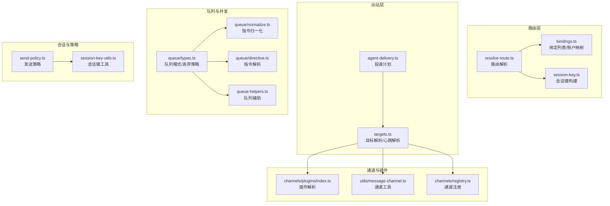
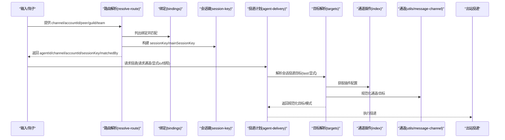
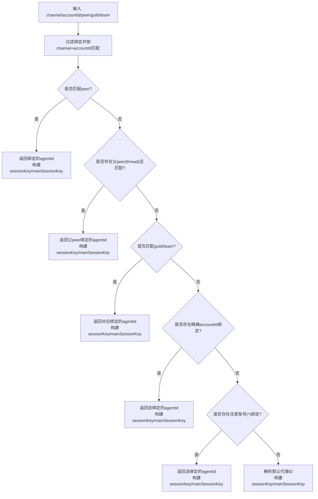
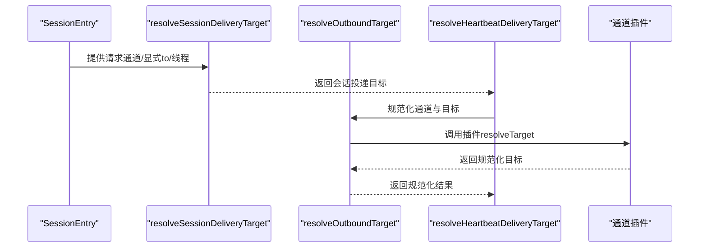
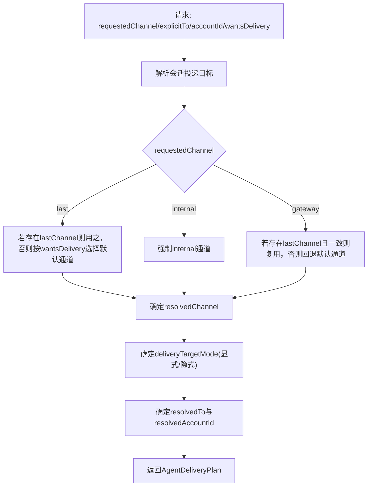
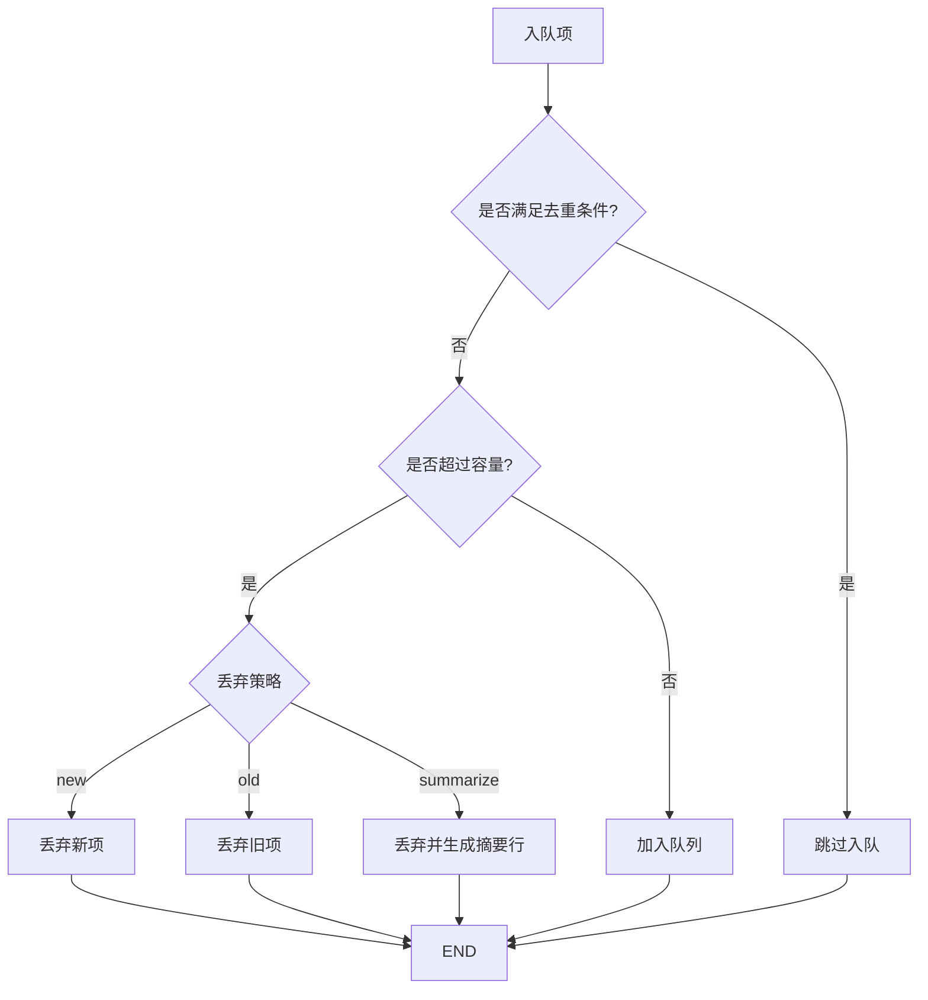
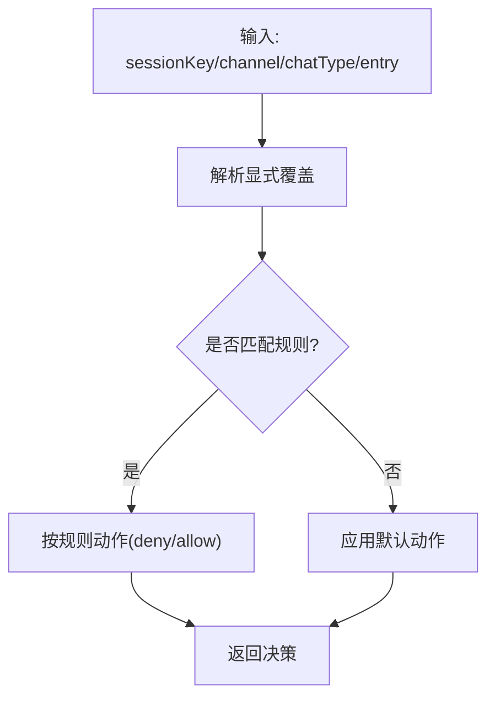
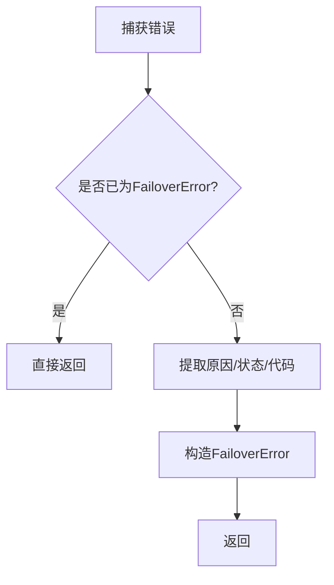
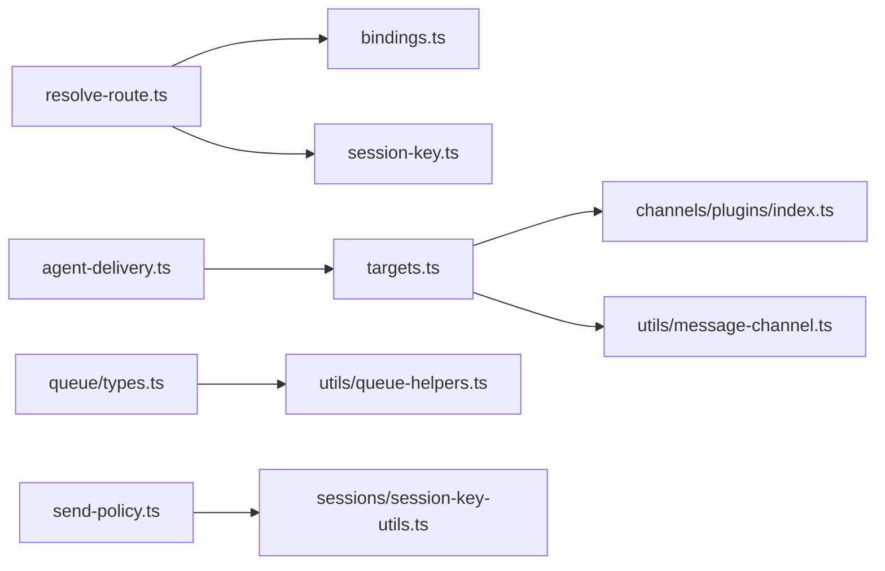

# 消息路由与分发

## 目录
1. [引言](#引言)
2. [项目结构](#项目结构)
3. [核心组件](#核心组件)
4. [架构总览](#架构总览)
5. [详细组件分析](#详细组件分析)
6. [依赖关系分析](#依赖关系分析)
7. [性能考量](#性能考量)
8. [故障排查指南](#故障排查指南)
9. [结论](#结论)
10. [附录](#附录)

## 引言
本文件围绕消息路由与分发系统，系统化阐述消息路由算法、目标解析机制、消息分发策略、会话管理、目标标识符解析、路由优先级与负载均衡、消息队列管理、并发控制、消息去重与顺序保证、路由规则配置、动态路由调整与故障转移机制，并提供性能监控、路由优化与扩展性设计建议。面向开发者，同时给出路由插件开发与自定义路由算法的实现指南。

## 项目结构
消息路由与分发涉及以下关键模块：
- 路由核心：基于绑定规则与会话键生成路由决策
- 目标解析：通道规范化、目标规范化、心跳目标解析
- 分发计划：根据请求与会话状态生成投递计划
- 队列与并发：队列模式、丢弃策略、防抖、去重与顺序
- 会话与策略：会话键构建、发送策略、线程会话键
- 插件与通道：通道插件解析、允许来源、错误处理
- 监控与诊断：指标采集与可观测性

## 核心组件
- 路由解析器：依据通道、账号、群组/团队/个人等匹配条件选择代理与会话键
- 绑定管理：列出绑定、账户映射、默认绑定账户解析
- 会话键构建：支持主会话、按通道/账号/群组/DM范围的多粒度会话键
- 出站目标解析：通道规范化、目标规范化、心跳目标与发送者上下文
- 投递计划：综合请求与会话状态，决定通道、目标、账号、线程与模式
- 队列与并发：队列模式、丢弃策略、防抖、去重、汇总摘要
- 发送策略：基于会话键前缀、聊天类型、通道的允许/拒绝策略
- 插件与通道：通道插件解析、允许来源、错误提示
- 监控与诊断：计数器、直方图、指标采集

## 架构总览
消息从输入到投递的关键流程如下：

## 详细组件分析

### 路由解析与会话键
- 路由匹配优先级：`peer` → 父`peer`(`thread`) → `guild` → `team` → 账号精确匹配 → 任意账号(`*`) → 默认代理
- 会话键构建：支持主会话(`main`)、按`peer`、按通道`peer`、按账号+通道`peer`的多种DM作用域；支持身份链接映射；线程会话键后缀拼接
- 默认代理解析：若未找到匹配绑定，则解析默认代理ID并构建会话键

### 目标解析与心跳机制
- 会话投递目标：支持“last”回退、显式`to`、线程ID、账号与通道一致性
- 出站目标解析：优先调用插件的`resolveTarget`，其次使用显式`to`；若无则返回缺失目标错误
- 心跳目标：支持“`none`/`last`/具体通道”，当目标为“`none`”时直接返回“`none`”通道；否则解析会话投递目标并再次规范化
- 心跳发送者上下文：根据允许来源集合与最近目标推导`sender`，支持带`provider`前缀

### 投递计划与模式
- 投递计划：综合请求通道、显式`to`、会话`last`信息，决定`resolvedChannel`/`resolvedTo`/`resolvedAccountId`/`resolvedThreadId`与模式
- 模式：显式(`explicit`)/隐式(`implicit`)，用于区分是否需要再次解析目标
- 内部通道处理：内部通道不进行二次目标解析，直接沿用`resolvedTo`

### 消息队列管理与并发控制
- 队列模式：`steer`、`followup`、`collect`、`steer-backlog`、`interrupt`、`queue`
- 丢弃策略：`old`(丢弃最旧)、`new`(丢弃最新)、`summarize`(汇总摘要)
- 防抖：基于上次入队时间与设定`debounceMs`等待
- 去重：可按`message-id`/`prompt`/禁用去重
- 汇总：超过容量时按策略丢弃并生成摘要行，限制摘要数量

### 会话管理与发送策略
- 发送策略：支持显式覆盖、按通道/聊天类型/会话键前缀的规则匹配，最终`fallback`至默认动作
- 会话键工具：解析/规范化`agentId`、主键、存储键转换、线程会话键

### 故障转移与错误分类
- 失败原因分类：从错误消息中提取失败原因，映射到预定义`reason`
- 错误包装：将通用错误转为`FailoverError`，携带`provider`/`model`/`profile`/`status`/`code`等上下文
- 心跳发送者上下文：结合`allowFrom`与最近目标，推导可用`sender`

### 性能监控与可观测性
- 指标采集：令牌计数、成本计数、运行时长直方图、上下文大小直方图、`webhook`计数/错误/时延、消息队列入队/处理计数等
- 应用：用于评估吞吐、成本、延迟与异常情况，指导路由与队列优化

## 依赖关系分析
- 路由层依赖绑定与会话键工具，确保路由决策与会话隔离一致
- 出站层依赖通道插件与通道工具，确保通道与目标规范化
- 队列层依赖队列类型与辅助函数，确保并发与顺序可控
- 会话层依赖会话键工具与发送策略，确保会话隔离与权限控制
- 监控层独立于业务逻辑，提供统一指标采集

## 性能考量
- 路由复杂度：绑定匹配为线性扫描，建议合理组织绑定数量与匹配字段
- 会话键构建：多粒度作用域会增加键长度与解析成本，建议按需启用细粒度作用域
- 队列容量与丢弃策略：容量过小导致频繁丢弃，容量过大占用内存；摘要策略可降低日志开销
- 防抖与批处理：合理设置`debounce`减少抖动，合并相似任务提升吞吐
- 并发控制：队列与会话键隔离确保并发安全，避免全局锁
- 监控指标：结合令牌计数、成本、时延与队列指标，持续优化模型与路由策略

## 故障排查指南
- 缺失目标错误：检查通道插件是否实现`resolveTarget`，或显式`to`是否为空
- 不支持通道：确认通道是否在通道注册表中，或是否为内部通道
- 心跳目标无效：检查心跳配置`target`与`to`，以及通道允许来源
- 发送策略拒绝：核对会话键前缀、聊天类型与通道是否匹配规则
- 失败原因分类：查看`FailoverError`的`reason`/`status`/`code`，定位失败根因

## 结论
本系统通过“绑定+会话键”的路由模型与“通道插件+目标规范化”的出站机制，实现了高可配置、强隔离的消息路由与分发。配合队列与并发控制、发送策略与故障转移，既保证了可靠性，又提供了可观测性与扩展能力。建议在生产环境中结合监控指标持续优化路由与队列参数，以获得更优的成本与性能平衡。

## 附录

### 路由插件开发与自定义路由算法指南
- 插件接口要点
  - 实现通道插件的`config.resolveAllowFrom`以提供允许来源列表
  - 实现出站`resolveTarget`以规范化目标与校验
- 自定义路由算法建议
  - 在`resolve-route`中扩展匹配维度（如标签、角色、优先级）
  - 在`session-key`中扩展会话键作用域，以满足更强隔离需求
  - 在`bindings`中维护账户与代理的映射，支持默认账户解析
- 最佳实践
  - 保持通道与目标规范化的一致性
  - 明确显式/隐式模式，避免重复解析
  - 使用队列模式与丢弃策略平衡吞吐与成本
  - 通过监控指标持续评估与优化