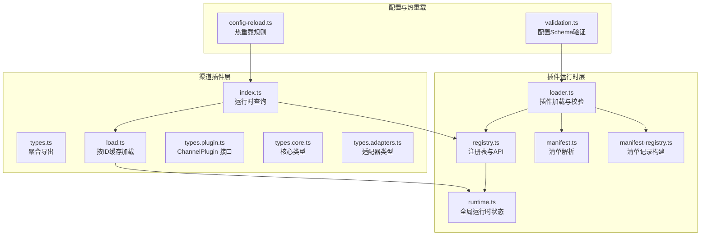
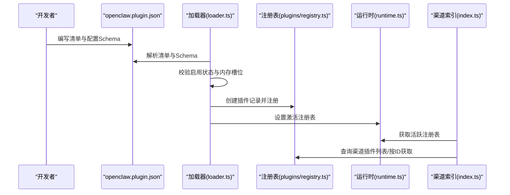
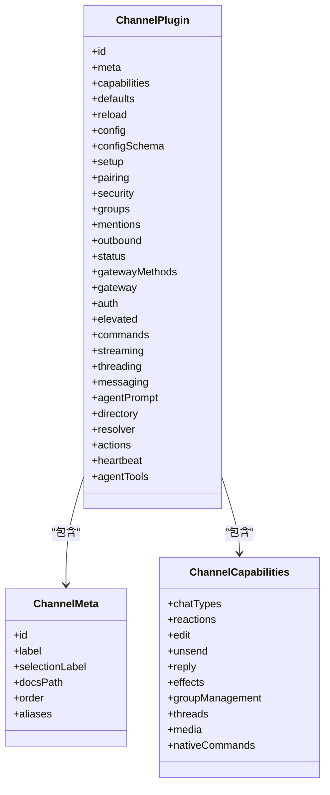
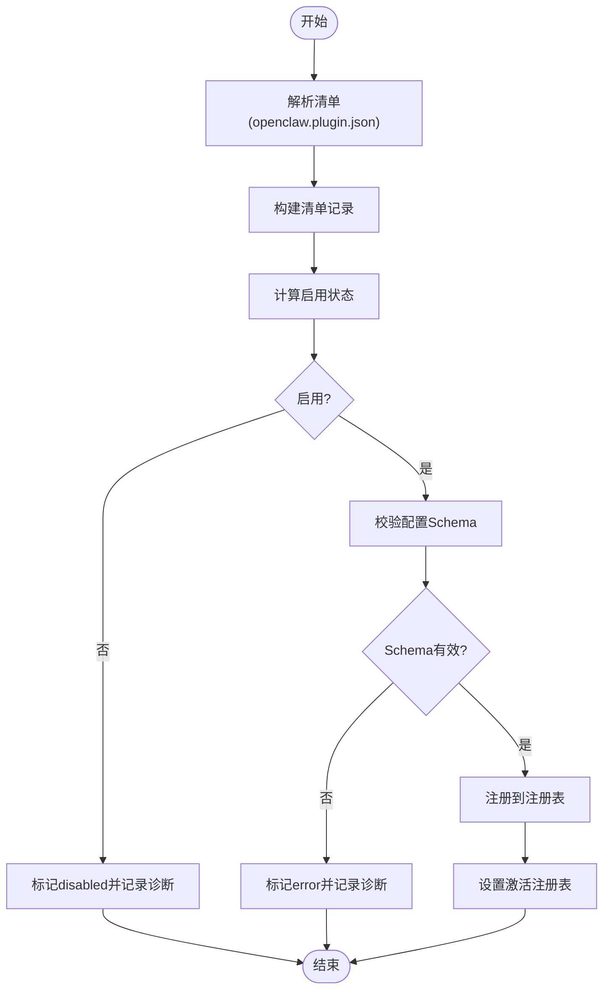
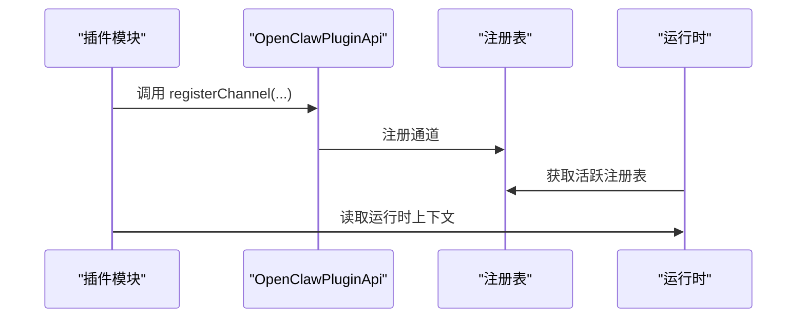
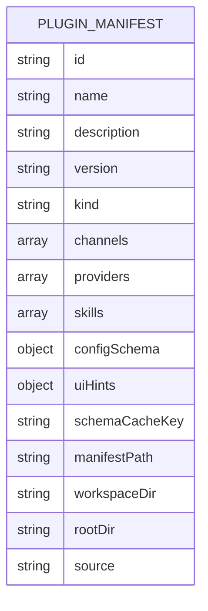
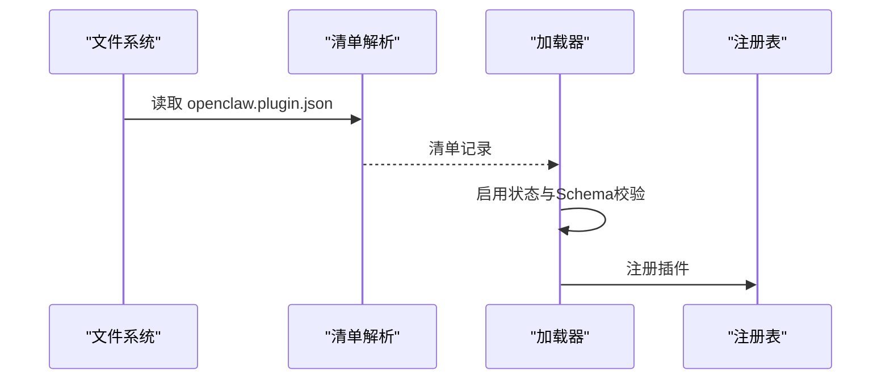
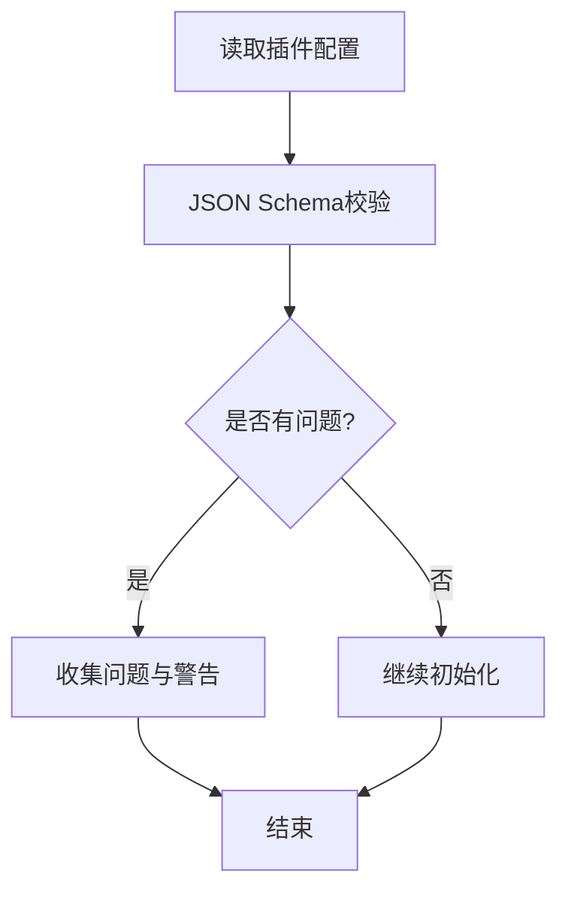
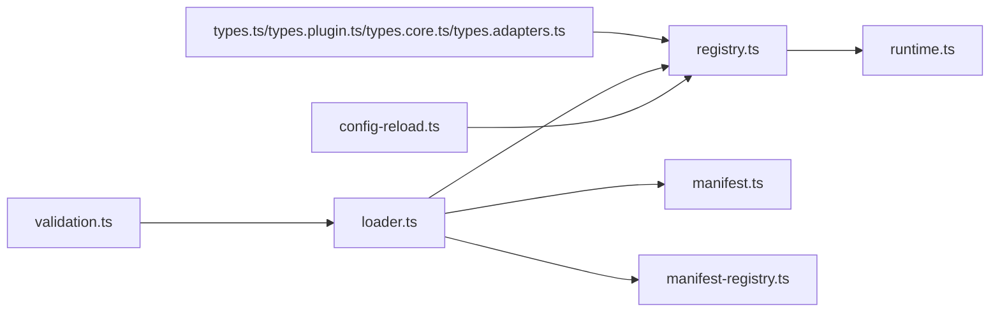

# 渠道插件架构

## 目录
1. [引言](#引言)
2. [项目结构](#项目结构)
3. [核心组件](#核心组件)
4. [架构总览](#架构总览)
5. [详细组件分析](#详细组件分析)
6. [依赖关系分析](#依赖关系分析)
7. [性能考量](#性能考量)
8. [故障排查指南](#故障排查指南)
9. [结论](#结论)
10. [附录](#附录)

## 引言
本文件系统性阐述 OpenClaw 的渠道插件架构，聚焦于插件注册机制、生命周期管理、依赖注入与动态加载，以及渠道插件接口规范、插件元数据结构、插件发现与初始化流程。同时覆盖插件配置验证、版本兼容性检查、热重载机制与错误处理策略，并提供插件开发最佳实践、性能优化建议与测试方法，帮助开发者快速上手并高质量交付渠道插件。

## 项目结构
OpenClaw 的渠道插件位于 `src/channels/plugins` 目录下，围绕 `ChannelPlugin` 接口与配套适配器类型展开；插件注册与运行时由 `src/plugins` 子系统统一管理，包含注册表、运行时状态、清单解析与加载器等关键模块。扩展插件示例位于 `extensions/*`，并通过 `openclaw.plugin.json` 提供清单与配置 Schema。

## 核心组件
- 渠道插件接口与类型
  - `ChannelPlugin`：定义渠道插件的核心契约，包含元数据、能力、配置适配器、消息收发适配器、安全与心跳等可选能力。
  - `ChannelMeta`：描述渠道的展示与选择信息，如标签、文档路径、排序优先级等。
  - `ChannelCapabilities`：声明渠道支持的聊天类型、编辑/撤回/回复/媒体/线程等能力。
  - 适配器族：包括配置、设置、配对、安全、群组、提及、出站消息、状态、网关、认证、心跳、目录、解析、提升权限、命令、流式传输、线程、消息、代理提示、目录、解析、消息动作、心跳等适配器类型，用于解耦渠道差异。
- 插件注册表与运行时
  - `PluginRegistry`：集中存储插件记录、工具、钩子、通道、提供者、HTTP/Gateway 注册项、CLI 命令、服务等。
  - 运行时状态：通过全局符号维护当前激活的插件注册表，支持设置与获取。
- 插件发现与加载
  - 清单解析：从 `openclaw.plugin.json` 读取插件 ID、种类、渠道/提供者/技能声明、配置 Schema 与 UI 提示。
  - 加载器：根据配置决定启用状态，校验清单与 Schema，构造插件记录，注册到注册表。
- 配置验证与热重载
  - 配置验证：基于 JSON Schema 对插件配置进行校验，生成问题与警告。
  - 热重载：渠道插件可通过 `reload` 字段声明配置前缀，驱动网关配置重载规则，实现按需重启或忽略。

## 架构总览
OpenClaw 的渠道插件采用“接口契约 + 适配器族 + 注册表 + 运行时”的分层架构。渠道插件通过清单声明自身能力与配置 Schema，加载器负责发现、校验与注册，运行时提供全局注册表与 API 注入，使插件在不直接导入核心源码的前提下完成对接。

## 详细组件分析

### ChannelPlugin 接口规范
`ChannelPlugin` 定义了渠道插件的完整契约，包括：
- 元数据与能力：`id`、`meta`、`capabilities`
- 可选功能：`onboarding`、`config`、`configSchema`、`setup`、`pairing`、`security`、`groups`、`mentions`、`outbound`、`status`、`gatewayMethods`、`gateway`、`auth`、`elevated`、`commands`、`streaming`、`threading`、`messaging`、`agentPrompt`、`directory`、`resolver`、`actions`、`heartbeat`、`agentTools`
- 热重载：`reload` 字段声明 `configPrefixes` 与 `noopPrefixes`，用于驱动网关重载规则

### 插件注册机制与生命周期
- 清单与记录
  - 清单解析：从 `openclaw.plugin.json` 读取 `id`、`kind`、`channels/providers/skills`、`configSchema`、`uiHints` 等。
  - 清单记录：构建 `PluginManifestRecord`，包含来源、工作区、Schema 缓存键等。
- 启用与校验
  - 启用状态：依据配置的 `allow`/`deny`、`slots`、`entries`、`bundled` 默认策略决定启用与否。
  - 配置 Schema 校验：若缺失或损坏，记录诊断并标记错误。
- 注册表填充
  - 注册工具、钩子、HTTP/Gateway 方法、CLI 命令、服务、通道等。
  - 通道注册：将 `ChannelPlugin` 注册到 `channels` 列表，记录 `channelIds`。
- 运行时状态
  - 通过 `setActivePluginRegistry` 设置全局激活注册表，`getActivePluginRegistry` 获取，`requireActivePluginRegistry` 确保存在。

### 依赖注入与动态加载
- 依赖注入
  - 运行时 API：通过 `createApi` 返回包含 `id`/`name`/`version`/`description`/`source`/`config`/`pluginConfig`/`runtime`/`logger` 以及各类 `register*` 方法的 API，供插件注入使用。
  - 通道注册：`registerChannel` 接受 `ChannelPlugin` 或 `OpenClawPluginChannelRegistration`，标准化后写入注册表。
- 动态加载
  - 渠道插件缓存：`loadChannelPlugin` 从活跃注册表查找并缓存，避免重复加载。
  - 渠道查询：`listChannelPlugins` 去重并按顺序排序；`getChannelPlugin` 按 ID 获取。

### 插件元数据结构与清单
- 元数据字段：`id`、`name`、`description`、`version`、`kind`、`channels/providers/skills`、`configSchema`、`uiHints`、`schemaCacheKey`、`manifestPath`、`workspaceDir`/`rootDir`/`source`。
- 清单要求：每个插件必须提供 JSON Schema，空 Schema 可接受；未知 `channels.*` 键被视为错误；插件 `entries`/`allow`/`deny`/`slots` 必须引用可发现的插件 id；清单缺失或损坏导致验证失败。

### 插件发现与初始化流程
- 发现：扫描候选目录，解析 `openclaw.plugin.json`，构建清单记录。
- 初始化：根据配置决定启用状态，校验 Schema，构造插件记录，注册到注册表。
- 查询：通过渠道索引模块按 ID 或列表查询插件，支持去重与排序。

### 配置验证、版本兼容性与热重载
- 配置验证：基于 JSON Schema 对插件配置进行验证，未知键、Schema 缺失或损坏均产生诊断；禁用但存在配置时给出警告。
- 版本兼容性：清单中的 `kind` 与导出定义的 `kind` 不一致时记录警告；Schema 缓存键基于清单文件时间戳生成，便于变更检测。
- 热重载：渠道插件通过 `reload.configPrefixes`/`noopPrefixes` 声明前缀，网关据此生成热重载规则，匹配路径前缀后执行重启或忽略操作。

### 错误处理策略
- 清单与 Schema 错误：记录 `error` 级诊断并标记状态为 `error`/`disabled`。
- 注册冲突：提供者重复注册、HTTP 路由重复注册、命令名称重复等均记录 `error` 级诊断。
- 启用策略：denylist、非 allowlist、显式 disabled、bundled 默认禁用等情况均记录原因。

## 依赖关系分析
- 组件耦合
  - 渠道插件与适配器：`ChannelPlugin` 通过适配器族实现具体能力，降低与核心的耦合。
  - 注册表与运行时：注册表作为中央枢纽，运行时提供全局状态，两者通过 API 注入形成弱耦合。
- 外部依赖
  - 清单解析依赖 JSON 文件；配置验证依赖 JSON Schema；热重载依赖网关重载规则。
- 循环依赖
  - 通过模块化拆分与 API 注入避免循环依赖风险。

## 性能考量
- 缓存与去重
  - 渠道插件按 ID 缓存，避免重复加载；列表查询时去重与稳定排序，减少重复遍历。
- 清单与 Schema 缓存
  - 基于清单文件 mtime 生成 `schemaCacheKey`，降低重复校验成本。
- 启用策略
  - 通过 `allow`/`deny`/`slots`/`entries`/`bundled` 默认策略快速短路，避免不必要的加载与校验。

## 故障排查指南
- 清单与 Schema
  - 症状：插件被标记为 `error`/`disabled`。
  - 排查：确认 `openclaw.plugin.json` 是否存在、格式正确、`configSchema` 是否提供且有效；查看诊断输出。
- 启用状态
  - 症状：插件未加载。
  - 排查：检查 `plugins.enabled`、`allow`/`deny`、`slots.entries` 是否包含该插件；确认 `bundled` 默认策略。
- 配置验证
  - 症状：配置无效或被忽略。
  - 排查：核对 JSON Schema，修正未知键或类型不匹配；关注 Doctor 输出的警告。
- 热重载
  - 症状：修改配置后未生效。
  - 排查：确认 `reload.configPrefixes` 是否覆盖到修改的配置键；检查网关重载规则匹配。

## 结论
OpenClaw 的渠道插件架构通过清晰的接口契约、完善的注册与运行时机制、严格的清单与配置校验，以及灵活的热重载策略，实现了高扩展性与可维护性。开发者可基于 `ChannelPlugin` 与适配器族快速实现新渠道，配合 SDK 与运行时 API 完成集成与测试，最终交付稳定可靠的渠道插件。

## 附录

### 开发最佳实践
- 实现指南
  - 明确 `ChannelPlugin` 的能力边界，仅实现必要的适配器；提供完备的 `ChannelMeta` 与 `ChannelCapabilities`。
  - 清单与 Schema：提供最小可用的 `configSchema`，必要时添加 `uiHints`；确保 `channels/providers/skills` 正确声明。
  - 依赖注入：通过 `OpenClawPluginApi` 访问运行时能力，避免直接导入核心模块。
- 性能优化
  - 合理使用缓存：利用 `ChannelPlugin` 缓存与注册表去重；避免在热路径频繁创建对象。
  - 启动阶段校验：在加载器阶段尽早发现错误，减少运行时开销。
- 调试技巧
  - 使用诊断输出定位清单与 Schema 问题；结合热重载规则验证配置变更。
  - 单元测试：参考 test-utils 与测试样例，编写适配器与插件加载的测试。

### 测试方法
- 适配器级单元测试：验证各适配器行为（如 `outbound/sendPayload`）。
- 插件加载测试：模拟临时插件目录与 `openclaw.plugin.json`，验证加载与注册流程。
- 集成测试：在 Vitest 环境下重置模块状态，确保测试隔离。

### 示例清单
- Discord 插件清单示例：包含 `id`、`channels`、空配置 Schema。
- Telegram 插件清单示例：包含 `id`、`channels`、空配置 Schema。