# 渠道配置管理

## 目录
1. [引言](#引言)
2. [项目结构](#项目结构)
3. [核心组件](#核心组件)
4. [架构总览](#架构总览)
5. [详细组件分析](#详细组件分析)
6. [依赖关系分析](#依赖关系分析)
7. [性能考量](#性能考量)
8. [故障排查指南](#故障排查指南)
9. [结论](#结论)
10. [附录](#附录)

## 引言
本文件面向“渠道配置管理”主题，系统性阐述 OpenClaw 的配置体系：从配置文件结构、环境变量替换、动态更新与回滚、到渠道匹配规则、白名单与访问策略、权限控制与安全审计等。文档同时覆盖配置模板系统、继承与默认值处理、迁移与备份恢复、以及变更通知机制，帮助开发者与运维人员高效、安全地管理多渠道配置。

## 项目结构
围绕渠道配置管理的关键目录与文件：
- 配置定义与校验：src/config/*
- 渠道注册与匹配：src/channels/registry.ts
- 网关与渠道生命周期：src/gateway/server-channels.ts
- 安全审计与权限检查：src/security/*
- UI 渲染与表单：ui/src/ui/views/channels.config.ts
- 访问控制与白名单：src/discord/monitor/native-command.ts、src/auto-reply/reply/commands-allowlist.ts
- Doctor 迁移与修复：src/commands/doctor-config-flow.ts

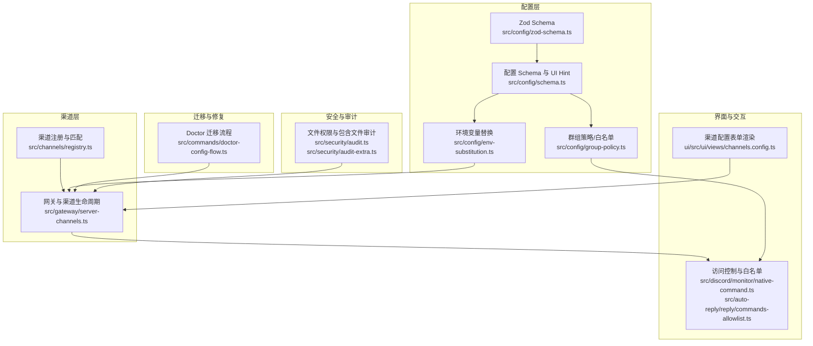

## 核心组件
- 配置模式与 UI 元数据：通过统一的 Schema 与 UI Hint，为渠道配置提供结构化描述与可视化渲染支持。
- 环境变量替换：在配置加载阶段解析 `${VAR}`，支持转义与错误定位。
- 群组策略与白名单：基于渠道、账户、群组维度的访问控制与工具策略解析。
- 渠道注册与匹配：标准化渠道 ID、别名与元数据，支撑跨插件的渠道识别。
- 网关与渠道生命周期：集中管理渠道运行时快照、启动/停止与登录状态标记。
- 安全审计：对配置文件与包含文件进行权限检查，识别潜在风险。
- Doctor 迁移与修复：在加载配置时自动执行迁移与修复，保证配置有效性。

## 架构总览
下图展示了从配置加载到渠道运行、再到访问控制与安全审计的整体流程。

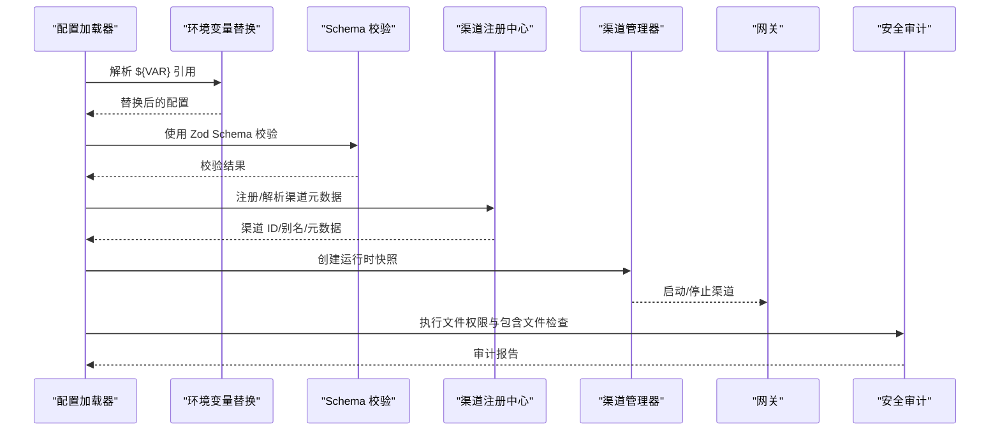

## 详细组件分析

### 配置文件结构与模式
- 统一 Schema：通过 Zod 定义顶层字段与嵌套结构，确保严格校验与可扩展性。
- UI 元数据：为每个配置项提供标签、帮助文本、分组顺序与敏感标记，驱动 UI 表单渲染。
- 渠道专用段落：`channels.*` 下按渠道 ID 维度组织配置，支持 `per-channel` 与 `per-account` 层级。

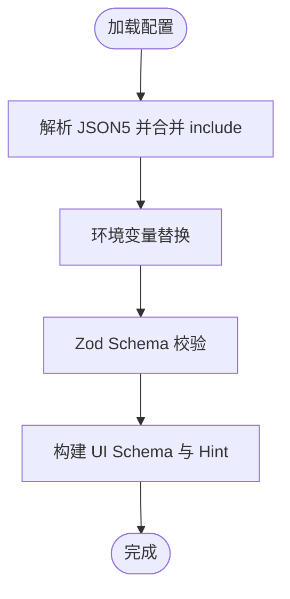

### 动态配置更新与回滚
- 热重载策略：通过配置中的 `reload` 模式与去抖参数，实现平滑的配置变更应用。
- 运行时快照：网关维护渠道运行时快照，变更时以原子方式更新或回滚。
- Doctor 修复：在加载阶段自动执行迁移与修复，避免无效配置导致的服务中断。

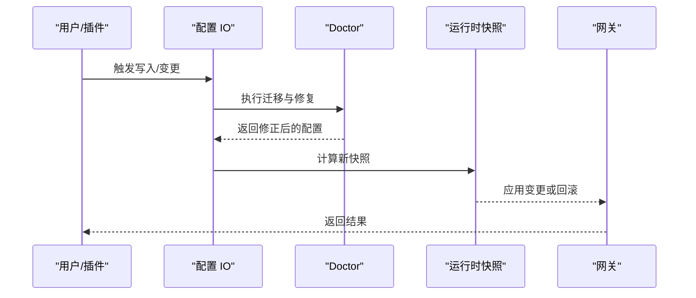

### 配置验证与回退
- 严格模式：根级与对象字段采用 `strict` 模式，拒绝未知键，确保配置一致性。
- Doctor 控制：配置无效时仅允许诊断类命令执行，其他命令直接失败并提示修复。
- 插件 Schema：插件需提供自身配置的 JSON Schema，缺失或无效将阻止加载。

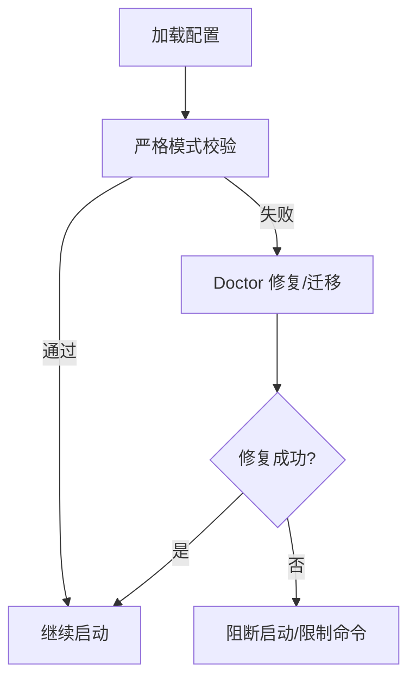

### 渠道匹配规则与白名单管理
- 渠道匹配：通过标准化函数将原始输入映射为受支持的渠道 ID，并支持别名。
- 白名单与访问策略：结合 `groupPolicy`、`dmPolicy`、`allowFrom` 等字段，实现按频道、群组、账户的精细化控制。
- UI 表单：根据 Schema 与 UI Hint 渲染渠道配置表单，支持 `per-channel` 与 `per-account` 的差异化编辑。

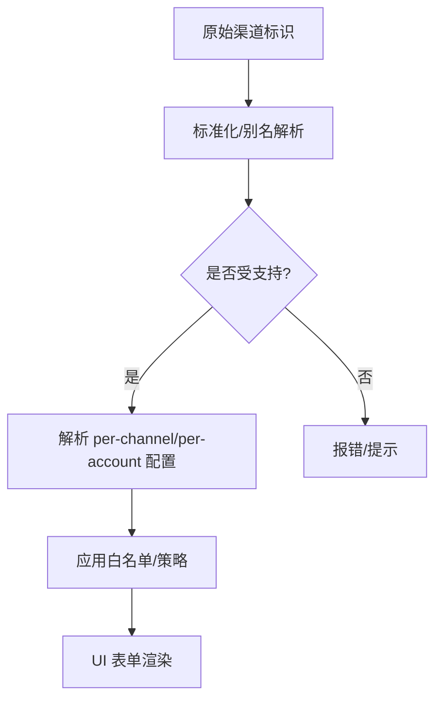

### 权限控制与访问策略
- 群组策略：支持 `per-group` 与 `default(*)` 策略，可按发送者身份（ID/用户名/E164）细化工具策略。
- DM 与频道策略：通过 `dmPolicy`、`groupPolicy`、`allowed` 字段组合，实现 DM 开放度与频道准入控制。
- 命令写入控制：部分渠道支持 `configWrites`，配合命令权限与 Doctor 修复，保障变更安全。

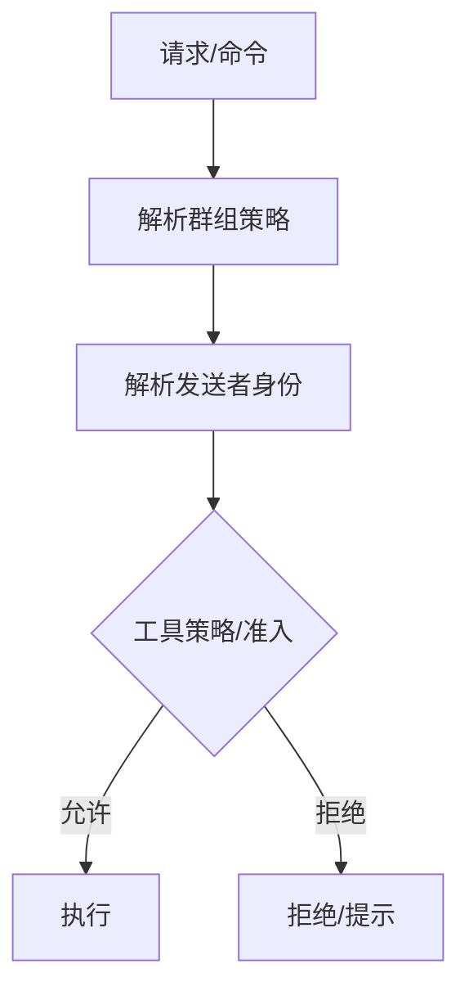

### 配置模板系统、环境变量替换、继承与默认值
- 模板与继承：`channels.*` 下按渠道与账户层级组织配置，支持默认值与 `per-*` 继承。
- 环境变量替换：在加载阶段解析 `${VAR}`，支持转义与错误定位，缺失变量抛出带路径的异常。
- 默认值：通过 Schema 与运行时快照默认值，确保未显式配置时的行为可预期。

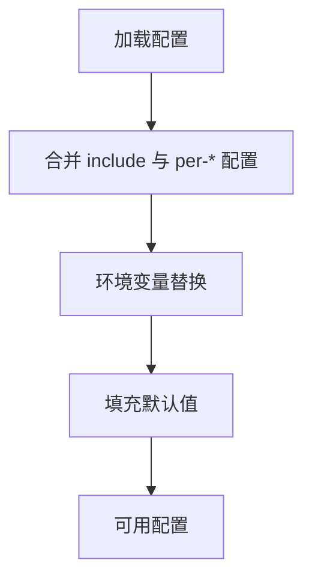

### 配置迁移工具、备份恢复与审计
- 迁移工具：Doctor 在加载时自动迁移旧版配置与状态目录，必要时提示用户确认。
- 备份恢复：建议在写入前备份配置文件，结合 Doctor 的 `dry-run` 与 `--fix` 逐步修复。
- 审计：对配置文件与包含文件进行权限检查，识别世界可读/可写等高危风险。

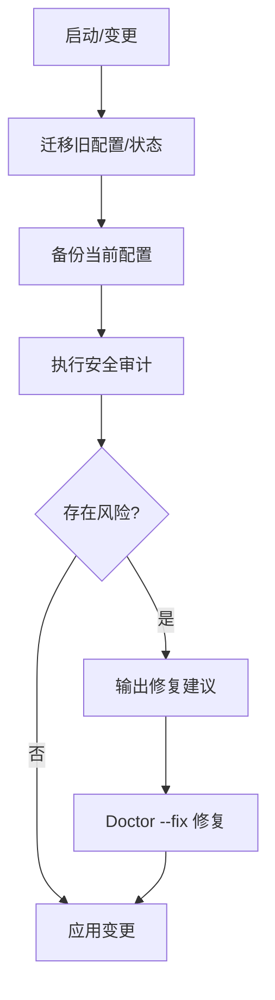

### 配置安全性考虑、敏感信息保护与变更通知
- 敏感信息保护：UI 对敏感路径进行标记，日志可按策略脱敏；Doctor 修复时避免暴露敏感信息。
- 变更通知：通过 UI 表单与命令反馈，向用户呈现变更结果与建议；审计发现以严重级别提示修复。

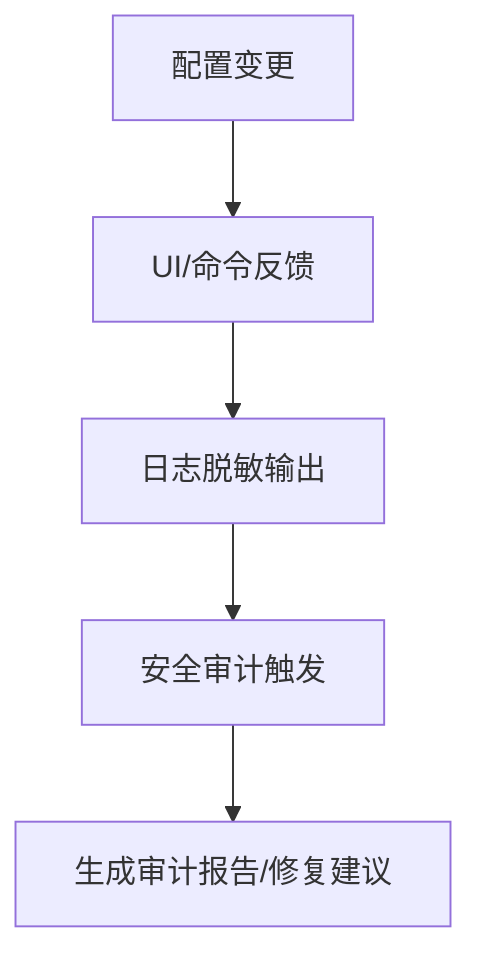

## 依赖关系分析
- 配置层依赖：Zod Schema 为配置提供强类型约束；Schema 与 UI Hint 驱动前端渲染；环境变量替换在加载阶段执行。
- 渠道层依赖：注册中心提供渠道标准化；网关管理器负责生命周期与运行时快照。
- 安全层依赖：审计模块依赖文件系统与平台工具，对配置与包含文件进行权限检查。
- Doctor 与迁移：在配置加载阶段介入，保证系统在有效配置下运行。

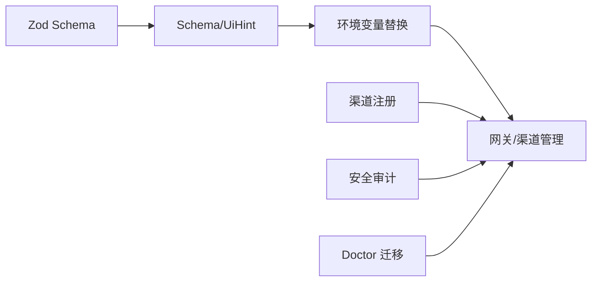

## 性能考量
- 环境变量替换：递归遍历配置树，复杂度与节点数线性相关；建议减少深层嵌套与超大数组。
- 群组策略解析：按发送者候选集匹配，注意避免过多群组与发送者映射。
- 审计扫描：包含文件递归扫描，深度受限于 `MAX_INCLUDE_DEPTH`；建议合理设置 `include` 层级。

## 故障排查指南
- 环境变量缺失：检查 `MissingEnvVarError` 报告的路径，确认对应变量已设置且非空。
- 未知键/模式不匹配：使用 Doctor `--fix` 自动清理未知键与迁移遗留键。
- 权限问题：审计发现世界可读/可写时，按 `remediation` 建议调整文件权限。
- 渠道不可用：检查渠道 ID 是否标准化成功、白名单是否正确配置、DM 策略是否允许。

## 结论
该配置管理体系以严格的 Schema 与 UI 元数据为基础，结合环境变量替换、群组策略与白名单控制，实现了对多渠道配置的结构化、可视化与安全化管理。通过 Doctor 迁移与审计机制，系统在加载阶段即保障配置的有效性与安全性，辅以热重载与运行时快照，满足生产环境对稳定性与可观测性的要求。

## 附录
- 关键实现参考路径（不含具体代码内容）：
  - 环境变量替换：[src/config/env-substitution.ts](file://src/config/env-substitution.ts#L124-L134)
  - 群组策略解析：[src/config/group-policy.ts](file://src/config/group-policy.ts#L123-L146)
  - 渠道注册与匹配：[src/channels/registry.ts](file://src/channels/registry.ts#L126-L162)
  - 网关与渠道生命周期：[src/gateway/server-channels.ts](file://src/gateway/server-channels.ts#L64-L77)
  - 安全审计（文件权限与包含文件）：[src/security/audit.ts](file://src/security/audit.ts#L194-L228)、[src/security/audit-extra.ts](file://src/security/audit-extra.ts#L769-L845)
  - Doctor 迁移流程：[src/commands/doctor-config-flow.ts](file://src/commands/doctor-config-flow.ts#L196-L212)
  - UI 渲染与表单：[ui/src/ui/views/channels.config.ts](file://ui/src/ui/views/channels.config.ts#L51-L96)
  - 访问控制与白名单（Discord）：[src/discord/monitor/native-command.ts](file://src/discord/monitor/native-command.ts#L590-L625)
  - 访问控制与白名单（命令）：[src/auto-reply/reply/commands-allowlist.ts](file://src/auto-reply/reply/commands-allowlist.ts#L341-L555)