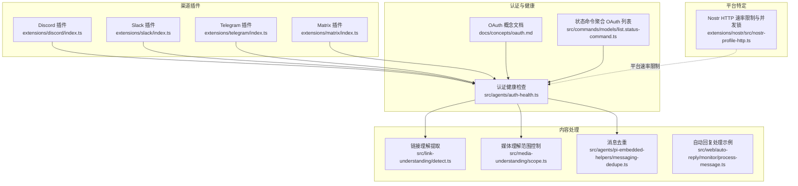
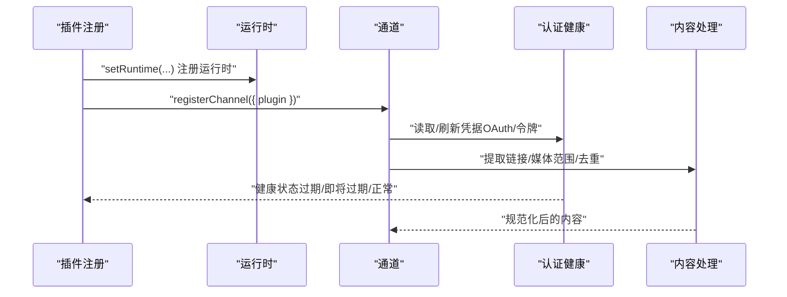
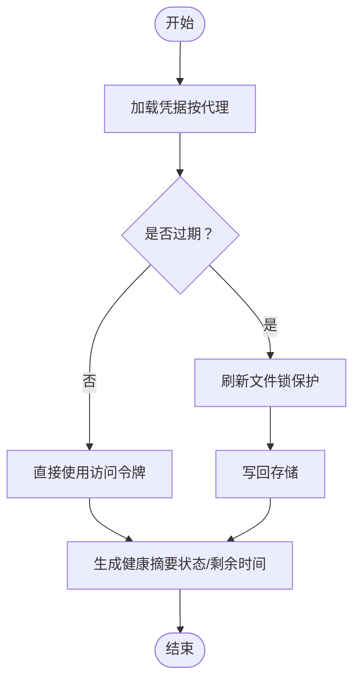
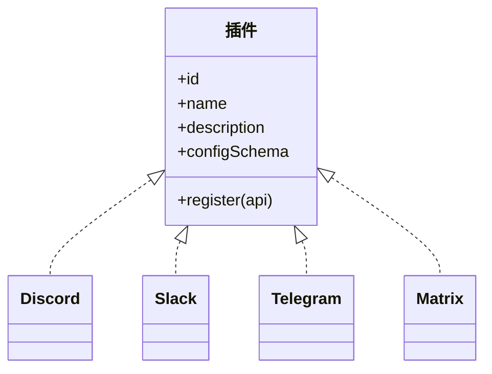
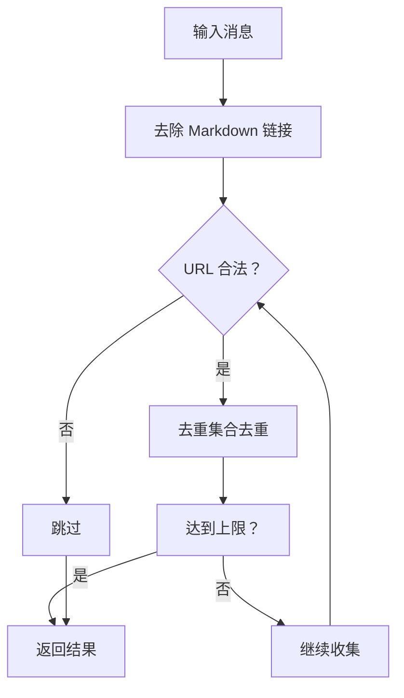
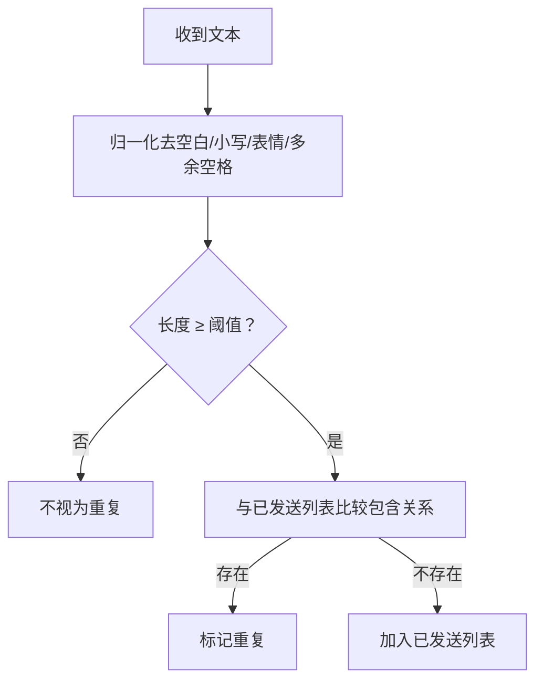
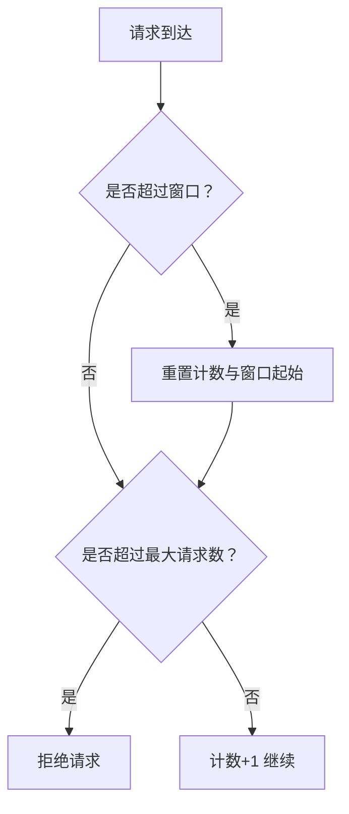
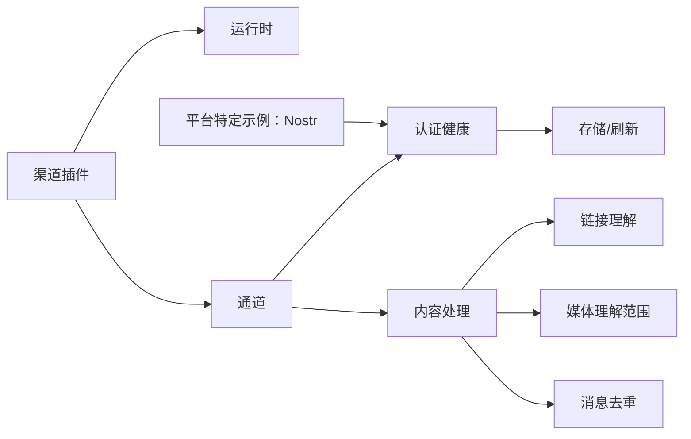

# 社交媒体渠道

## 目录
1. [简介](#简介)
2. [项目结构](#项目结构)
3. [核心组件](#核心组件)
4. [架构总览](#架构总览)
5. [详细组件分析](#详细组件分析)
6. [依赖关系分析](#依赖关系分析)
7. [性能考量](#性能考量)
8. [故障排查指南](#故障排查指南)
9. [结论](#结论)
10. [附录](#附录)

## 简介
本文件面向“社交媒体渠道”的集成与使用，聚焦于在 OpenClaw 体系中如何统一管理多平台认证（OAuth/令牌）、适配不同渠道的消息模型、实现内容解析与去重、以及在多账号/多会话场景下的路由与健康监控。文档同时覆盖速率限制、内容过滤策略、合规性与隐私设置等工程实践，帮助读者在不深入源码的前提下完成平台接入与运维。

## 项目结构
OpenClaw 将“渠道”以插件形式组织，每个渠道插件负责注册自身运行时与通道能力；认证与健康状态由通用模块提供支持；内容处理（链接提取、媒体理解范围、消息去重）贯穿消息生命周期。

## 核心组件
- 渠道插件：以标准接口注册运行时与通道，统一对外暴露能力。
- 认证与健康：集中管理 OAuth/令牌存储、刷新与过期判断，并对多账户进行路由与健康汇总。
- 内容处理：链接提取、媒体理解范围控制、消息去重，保障内容质量与一致性。
- 平台特定：针对个别平台的速率限制与并发控制策略。

## 架构总览
下图展示从“渠道插件注册”到“认证健康检查”再到“内容处理”的关键交互路径。

## 详细组件分析

### OAuth 认证与健康监控
- 统一存储与刷新：认证凭据按代理隔离存放，支持自动刷新与过期判断，避免跨工具互相挤占刷新令牌导致的随机登出。
- 多账户路由：通过配置或会话级覆盖选择具体凭据，便于个人/工作等多账号并行。
- 健康汇总：将 OAuth 与令牌型凭据统一纳入健康检查，识别“缺失/过期/即将过期”，并给出剩余时间提示。

### 渠道插件（Discord、Slack、Telegram、Matrix）
- 插件职责：注册运行时、注册通道，使能对应平台的消息收发与事件处理。
- 扩展模式：所有渠道遵循一致的注册接口，便于新增平台或替换实现。

### 链接理解与内容解析
- 链接提取：去除 Markdown 链接语法，仅保留裸 URL，限制最大数量，过滤非法协议与本地地址。
- 媒体理解范围：根据会话键、渠道与聊天类型匹配规则，决定是否允许媒体理解。
- 自动回复上下文：在处理消息时结合前缀、会话标识与配置，生成响应上下文。

### 消息去重与重复防护
- 文本归一化：去除空白、大小写、表情符号，合并多余空格，再进行包含关系判定。
- 长度阈值：低于阈值的文本不参与去重，避免误判。
- 与媒体理解配合：在发送前对文本进行去重校验，减少冗余消息。

### 平台特定：速率限制与并发控制（示例：Nostr）
- 速率限制：基于账户维度的滑动窗口计数，限定每分钟最大请求数。
- 并发发布：通过账户级 Promise 锁避免同一账户并发发布导致的冲突。

## 依赖关系分析
- 渠道插件依赖运行时与通道注册机制，统一接入认证健康模块。
- 认证健康模块依赖存储与刷新逻辑，输出健康摘要供上层决策。
- 内容处理模块独立于具体渠道，但被通道调用以提升消息质量。
- 平台特定模块（如 Nostr）提供局部策略，补充整体稳定性。

## 性能考量
- 凭据刷新加锁：避免并发刷新导致的竞态与覆盖，降低失败率。
- 速率限制：在平台侧实施滑动窗口限流，平滑突发流量，防止触发平台封禁。
- 内容处理短路：在链接提取阶段尽早过滤非法/重复项，减少后续处理成本。
- 去重阈值：避免对极短文本做去重，兼顾性能与准确性。

## 故障排查指南
- 认证过期/即将过期：通过健康摘要定位具体凭据与剩余时间，必要时手动刷新或更换凭据。
- 多账户冲突：确认凭据路由配置，避免不同工具互相挤占刷新令牌。
- 链接未被识别：检查消息是否包含 Markdown 链接语法，确认最大链接数量与协议合法性。
- 重复消息：启用去重逻辑，确保发送前进行归一化比较。
- 平台限流：观察平台特定的速率限制策略，降低请求频率或增加退避。

## 结论
通过统一的渠道插件架构、集中式认证健康与内容处理模块，OpenClaw 能够在多平台上稳定地完成消息收发、内容解析与合规控制。建议在接入新平台时复用现有插件模式，完善认证与健康检查，结合速率限制与内容过滤策略，确保服务的可靠性与可维护性。

## 附录
- 开发环境配置要点
  - 使用插件注册接口完成运行时与通道注册。
  - 在认证健康模块中配置凭据存储与刷新策略。
  - 在内容处理模块中启用链接提取、媒体理解范围与去重策略。
- API 密钥与 OAuth 管理
  - OAuth：遵循 PKCE 流程，妥善保存刷新令牌，定期刷新并监控健康状态。
  - API Key：按代理隔离存储，定期轮换与审计。
- 合规性与隐私
  - 遵循各平台的开发者条款与隐私政策，最小化数据采集与存储。
  - 对敏感字段（如令牌）进行加密存储与传输，严格控制访问权限。