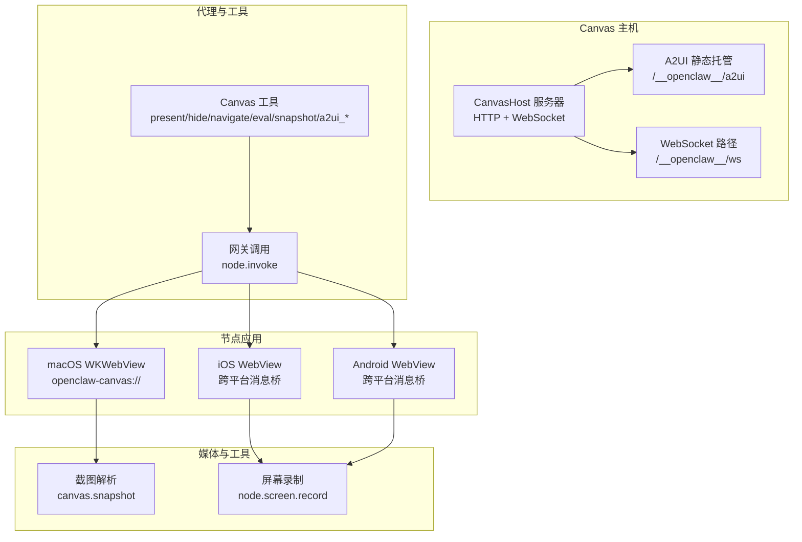
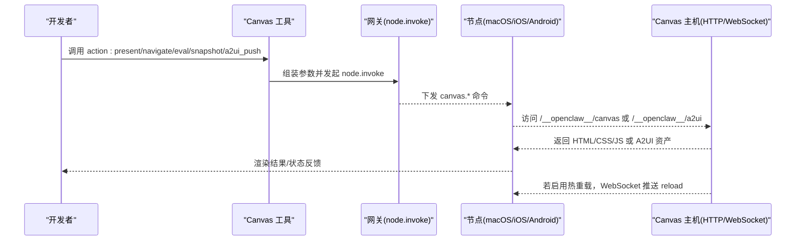
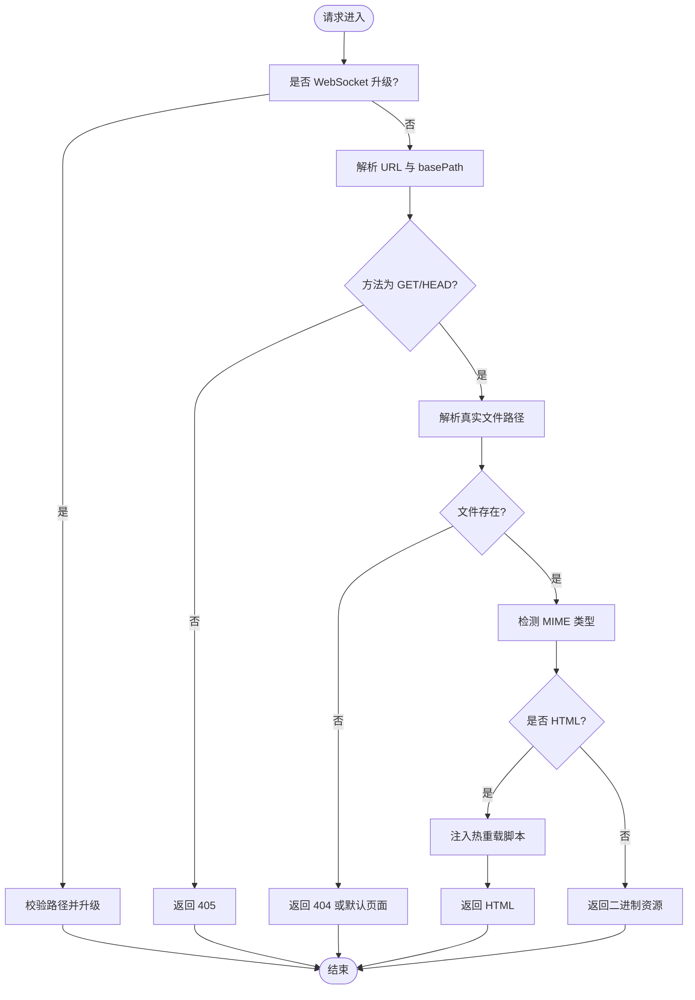
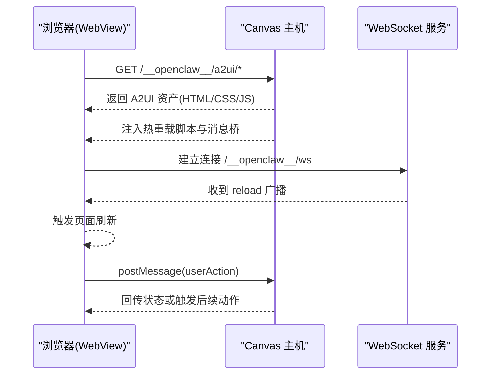
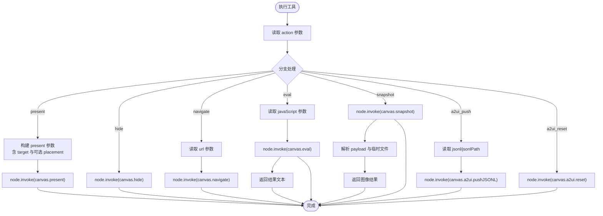
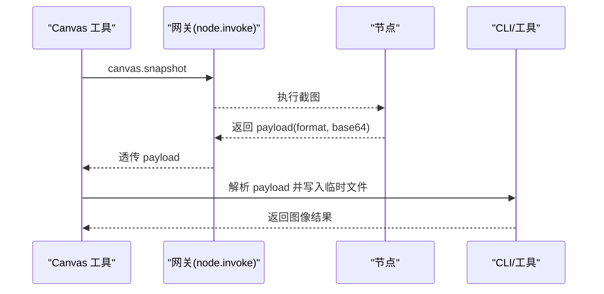
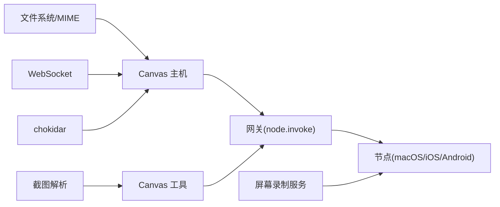

# 实时 Canvas 工作空间

## 目录
1. [简介](#简介)
2. [项目结构](#项目结构)
3. [核心组件](#核心组件)
4. [架构总览](#架构总览)
5. [详细组件分析](#详细组件分析)
6. [依赖关系分析](#依赖关系分析)
7. [性能考量](#性能考量)
8. [故障排查指南](#故障排查指南)
9. [结论](#结论)
10. [附录](#附录)

## 简介
本文件系统性阐述 OpenClaw 的实时 Canvas 工作空间能力，覆盖 Canvas 主机服务、A2UI 推送机制、浏览器控制与实时渲染、Canvas 创建与管理、元素操作、事件处理、样式控制与动画、与代理系统的集成、可视化工具开发、屏幕录制与截图等主题。面向开发者提供 API 使用指南、调试技巧与最佳实践。

## 项目结构
围绕 Canvas 的关键代码分布在以下模块：
- Canvas 主机服务：基于 Node HTTP 服务器与 WebSocket，提供静态资源服务、热重载注入与升级处理。
- A2UI 托管与注入：在 HTML 中注入 WebSocket 客户端与跨平台消息桥，支持实时推送与用户动作转发。
- 代理工具：封装节点调用，统一执行 present/hide/navigate/eval/snapshot/a2ui_push/a2ui_reset 等动作。
- 平台集成：macOS 通过自定义 URL Scheme 承载本地 Canvas；iOS/Android 通过 WebView 渲染并接收推送。
- 屏幕录制与截图：节点侧提供屏幕录制与 Canvas 截图能力，结合 CLI 与工具链完成输出与分发。

## 核心组件
- Canvas 主机服务器：负责静态资源服务、路径规范化、MIME 检测、热重载注入与 WebSocket 升级。
- A2UI 托管与注入：提供 A2UI 资产托管、安全路径解析、HTML 注入 WebSocket 客户端与跨平台消息桥。
- 代理 Canvas 工具：将动作参数映射到节点命令，统一错误处理与返回值格式。
- 节点渲染层：macOS 使用自定义 URL Scheme；iOS/Android 使用 WebView，并通过消息桥与主机通信。
- 媒体与工具：截图解析与临时文件生成、屏幕录制服务。

## 架构总览
Canvas 工作空间由“主机—网关—节点”三层构成：
- Canvas 主机：HTTP 服务托管 Canvas 与 A2UI 资产，WebSocket 提供热重载通道。
- 网关：作为代理，将代理工具的动作转换为节点命令，驱动各端渲染。
- 节点：macOS 以自定义 Scheme 渲染本地 Canvas；iOS/Android 以 WebView 渲染并通过消息桥与主机交互；均支持 A2UI 推送与用户动作回传。

## 详细组件分析

### Canvas 主机服务
- 功能要点
  - HTTP 请求处理：路径前缀校验、基础路径裁剪、方法限制、文件解析与 MIME 判定。
  - 热重载：使用 chokidar 监控根目录变更，节流后向所有 WebSocket 连接广播“reload”，HTML 注入 WebSocket 客户端自动刷新。
  - WebSocket 升级：仅允许特定路径，连接建立后加入集合，用于广播热重载。
  - 关闭流程：清理定时器、关闭文件监听、优雅关闭 WebSocket 服务器。
- 性能与健壮性
  - 监听器错误降级：捕获错误后禁用热重载并记录日志，避免崩溃。
  - 缓存控制：静态资源设置 no-store，确保开发期最新内容。
- 可扩展点
  - 自定义 basePath 与 rootDir，适配多会话或多工作区场景。
  - 结合 `resolveCanvasHostUrl` 生成对外可访问的 Canvas URL。

### A2UI 推送机制与浏览器控制
- A2UI 资产托管
  - 路径前缀：`/__openclaw__/a2ui`，支持 index.html 与静态资源。
  - 安全解析：禁止目录穿越、符号链接检查、真实路径限定在根目录内。
- HTML 注入
  - 在 HTML 中注入 WebSocket 客户端，监听“reload”消息触发页面刷新。
  - 注入跨平台消息桥：iOS 通过 WKWebView 的 messageHandlers，Android 通过全局对象，统一暴露 `OpenClaw.postMessage` 与 `OpenClaw.sendUserAction`。
- 版本与兼容
  - 当前支持 A2UI v0.8 的 beginRendering/surfaceUpdate/dataModelUpdate/deleteSurface 等消息；v0.9 的 createSurface 尚不支持。

### 代理工具：Canvas 动作编排
- 动作集合：`present`/`hide`/`navigate`/`eval`/`snapshot`/`a2ui_push`/`a2ui_reset`。
- 参数校验与映射：对 `placement`、`target`/`url`/`javaScript`、输出格式/尺寸/质量等进行读取与校验。
- 节点调用：通过网关工具调用 `node.invoke`，统一 `idempotencyKey` 与超时控制。
- 截图处理：解析 payload，写入临时文件，返回图像结果并标注 MIME 类型与格式信息。

### 节点渲染与实时协作
- macOS：通过自定义 URL Scheme `openclaw-canvas://` 从应用内 Canvas 根目录加载页面，支持本地自动重载与会话隔离。
- iOS/Android：通过 WebView 渲染，注入跨平台消息桥，支持用户动作回传与 A2UI 推送。
- 实时协作：A2UI JSONL 推送与热重载 WebSocket 共同实现“所见即所得”的协作体验。

### 屏幕录制与截图
- 截图：节点侧返回 base64 图像与格式，CLI 工具解析并写入临时文件，返回图像结果。
- 屏幕录制：iOS/macOS 分别提供录制服务，支持时长、帧率、音频开关与输出路径，最终以 MP4 形式返回。

### Canvas URL 生成与可达性
- 通过 `resolveCanvasHostUrl` 综合 `hostOverride`/`requestHost`/`localAddress` 与 `forwardedProto`/`scheme`，生成对外可用的 Canvas URL。
- 与网关绑定模式联动：`loopback`/`lan`/`tailnet`/`auto` 决定主机绑定与 URL 形态。

### A2UI 资产打包与复制
- 通过脚本复制 A2UI 资产至 dist 目录，支持环境变量定制源与目标路径，缺失时可选择跳过或报错。

## 依赖关系分析
- Canvas 主机依赖
  - 文件系统与 MIME 检测：用于安全路径解析与内容类型判定。
  - WebSocket：用于热重载广播。
  - chokidar：文件变更监听。
- 代理工具依赖
  - 网关调用：统一节点命令入口。
  - 节点能力：`present`/`hide`/`navigate`/`eval`/`snapshot`/`a2ui_*`。
- 节点渲染依赖
  - WebView/WKWebView：承载 HTML/CSS/JS 与 A2UI。
  - 消息桥：跨平台 `postMessage` 接口。
- 媒体与工具依赖
  - 截图解析与临时文件命名。
  - 屏幕录制服务（iOS/macOS）。

## 性能考量
- 热重载节流：对文件变更事件进行去抖，降低频繁刷新带来的渲染压力。
- 监听器健壮性：捕获监听错误并降级，避免影响主服务稳定性。
- 缓存策略：静态资源设置 no-store，确保开发期即时生效。
- 资源体积：建议将 HTML/CSS/JS 内联，减少网络往返与并发请求数。
- 渲染优化：Canvas 画布按设备像素比缩放，避免模糊；动画采用 will-change 与 GPU 加速属性。
- A2UI 推送：批量 JSONL 推送时注意消息大小与频率，避免阻塞主线程。

## 故障排查指南
- 白屏/内容未加载
  - 检查网关绑定模式与实际主机地址是否一致，避免使用 localhost 导致节点收到 Tailscale 主机名。
  - 直接 curl 测试路径与端口，确认资源可访问。
- “node required”或“node not connected”
  - 确保指定有效节点 ID，使用节点列表确认在线状态。
- 热重载不生效
  - 确认配置中 `liveReload=true`，文件位于 canvas root 目录，检查监听器错误日志。
- 截图失败
  - 检查 payload 是否包含 `format`/`base64` 字段，确认临时文件写入权限。
- A2UI 推送无效
  - 确认节点支持 A2UI v0.8 消息集；检查消息序列化与推送接口调用。

## 结论
OpenClaw 的 Canvas 工作空间通过“主机—网关—节点”的清晰分层，实现了跨平台的实时渲染与协作。Canvas 主机提供稳定的服务与热重载能力，A2UI 推送与消息桥打通了从代理到节点的双向通信，结合截图与屏幕录制能力，满足可视化展示、演示与记录需求。开发者可基于现有工具与 API 快速构建自定义组件、交互界面与数据可视化应用。

## 附录
- 开发示例（概念性）
  - 自定义组件：在 Canvas 根目录创建独立 HTML 页面，使用内联样式与脚本，结合 WebSocket 实现热更新。
  - 交互式界面：通过 A2UI JSONL 推送 surfaceUpdate 与 dataModelUpdate，实现动态布局与状态同步。
  - 数据可视化：在 Canvas 中嵌入图表库，定期拉取数据并通过 eval 注入新数据。
  - 实时协作：在多人场景下，统一使用 A2UI 推送与热重载，确保各端同步。
- API 使用要点
  - 使用 `canvas-tool` 的参数校验与映射，确保节点命令正确下发。
  - 对于截图与屏幕录制，注意 payload 格式与临时文件命名规范。
- 最佳实践
  - 保持 HTML 自包含，减少外部依赖。
  - 合理设置 `liveReload` 与监听范围，避免过度扫描。
  - 在节点侧对用户动作与推送进行限频与去抖处理，提升交互流畅度。