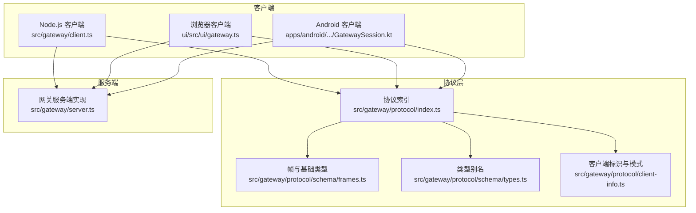
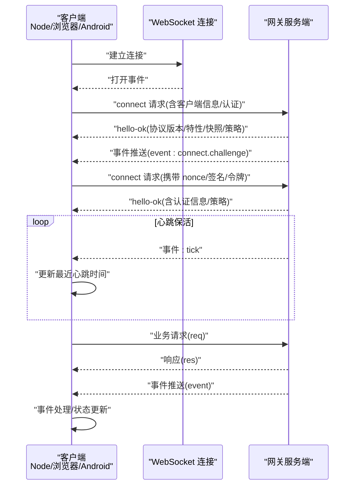
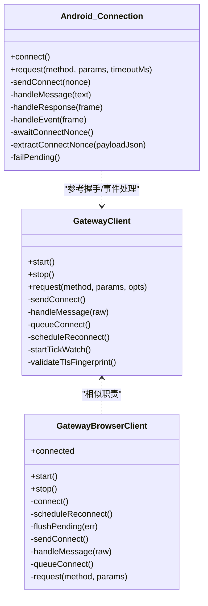
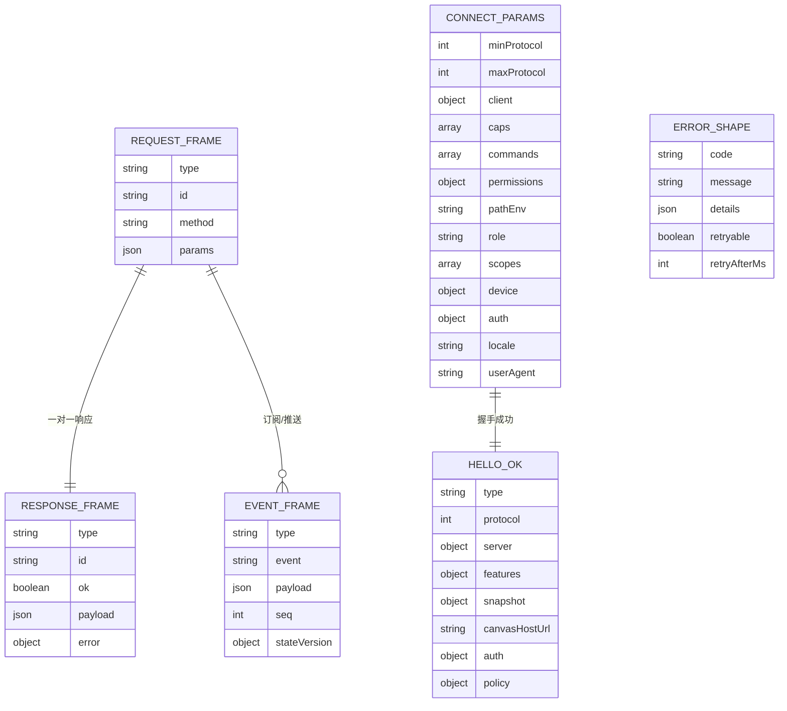
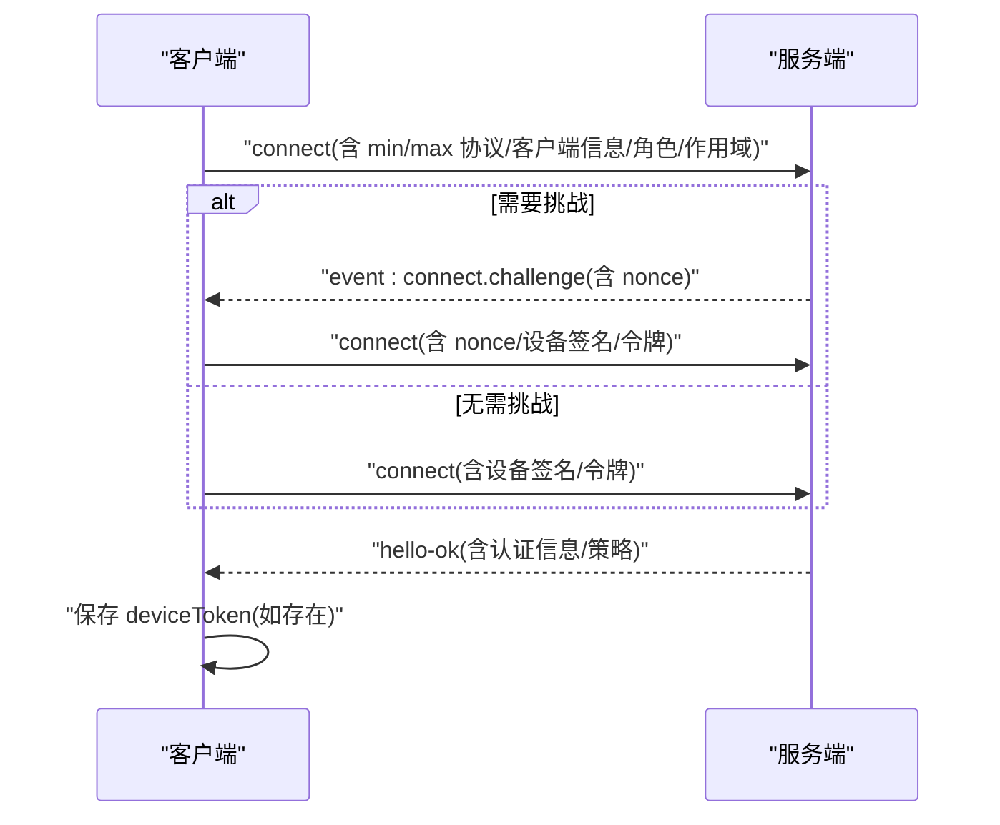
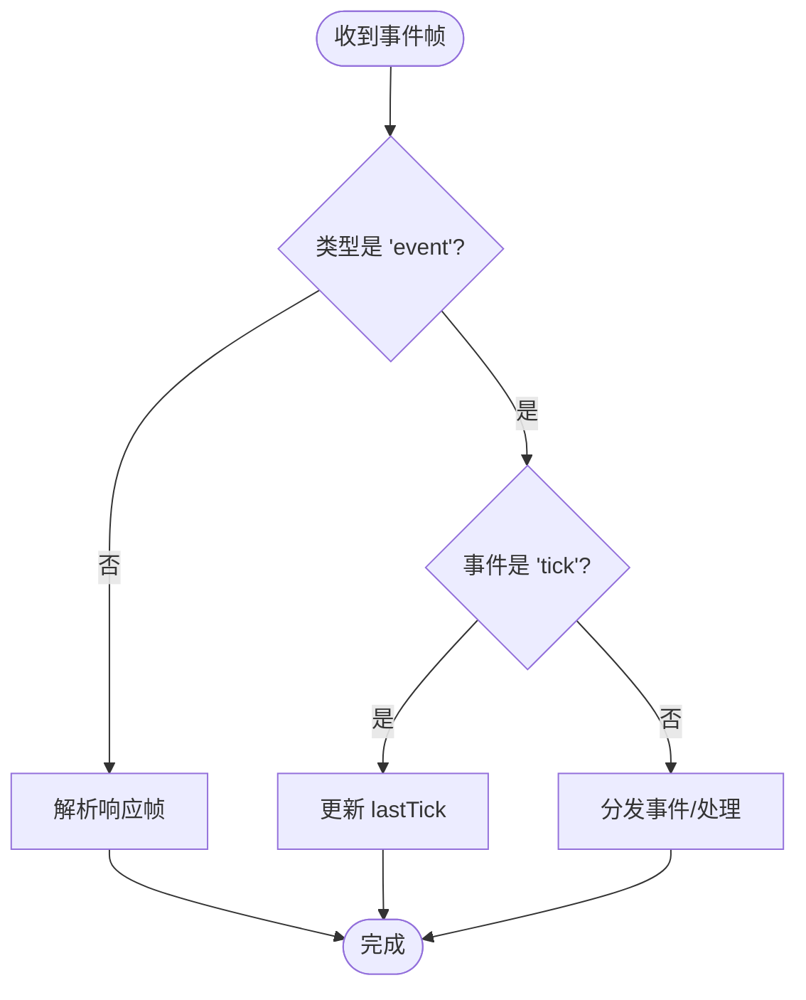
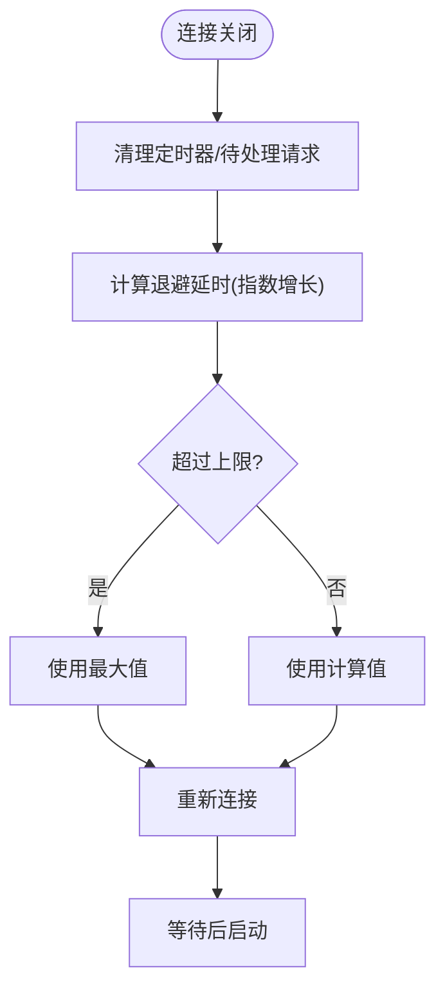
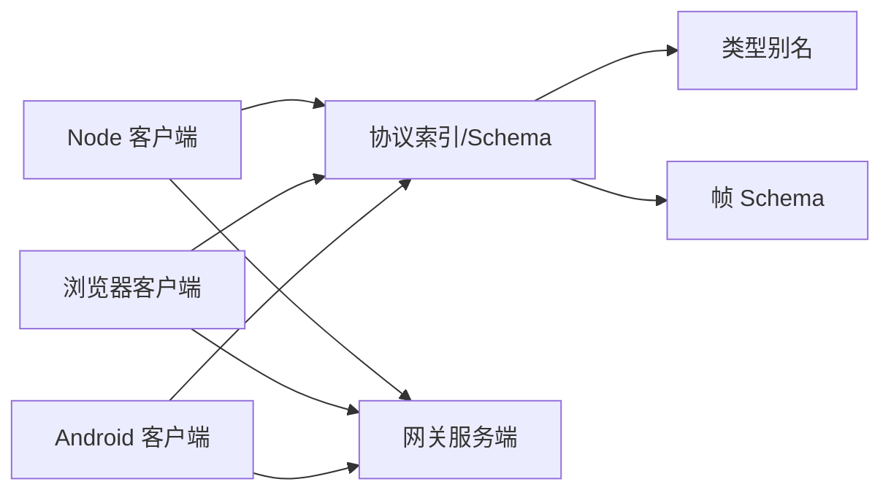

# WebSocket 协议规范

## 目录
1. [引言](#引言)
2. [项目结构](#项目结构)
3. [核心组件](#核心组件)
4. [架构总览](#架构总览)
5. [详细组件分析](#详细组件分析)
6. [依赖关系分析](#依赖关系分析)
7. [性能考量](#性能考量)
8. [故障排查指南](#故障排查指南)
9. [结论](#结论)
10. [附录](#附录)

## 引言
本规范面向 OpenClaw 网关的 WebSocket 控制平面，定义了连接建立、消息帧格式、事件类型、认证与保活、错误处理与重连策略，以及客户端与服务端的交互流程。文档同时提供协议扩展与兼容性维护的技术指导，帮助开发者在不同平台（Node.js、浏览器、Android）正确实现与对接。

## 项目结构
OpenClaw 在多处实现了统一的 WebSocket 客户端与协议定义：
- Node.js 客户端：封装连接、鉴权、请求/响应、事件分发、心跳保活与指数退避重连
- 浏览器客户端：基于原生 WebSocket，支持安全上下文下的设备签名认证
- Android 客户端：使用 OkHttp WebSocket，支持 TLS 指纹校验与设备签名
- 协议层：通过 TypeBox Schema + AJV 校验，统一定义帧结构与参数模型

## 核心组件
- 客户端抽象
  - Node.js 客户端：负责建立 WebSocket 连接、发送握手与认证、处理事件与响应、心跳保活、异常与重连
  - 浏览器客户端：基于原生 WebSocket，支持安全上下文下的设备签名与令牌混合认证
  - Android 客户端：基于 OkHttp WebSocket，支持 TLS 指纹校验、设备签名与命令式 RPC 调用
- 协议层
  - 帧结构：请求帧、响应帧、事件帧三类
  - 参数模型：`ConnectParams`、`HelloOk`、各方法参数与结果类型
  - 校验器：AJV 编译后的校验函数，保证消息结构与字段合法性
- 服务端
  - 提供统一的网关控制平面，承载会话、存在性、配置、定时任务、Webhook、节点调用等能力

## 架构总览
下图展示了客户端与服务端之间的典型交互：握手、认证、事件推送、请求/响应与心跳保活。

## 详细组件分析

### 客户端类与生命周期
- Node.js 客户端
  - 支持 TLS 指纹校验（仅 wss），构造时可传入指纹以拒绝不匹配证书
  - 首次连接后延迟发送 `connect`，等待服务端的 `connect.challenge` 事件并携带 `nonce` 再次握手
  - 维护 pending 请求映射，区分 `expectFinal` 的“接受中”状态，避免过早解析
  - 心跳保活：根据服务端策略设置 `tickIntervalMs`，超过两倍间隔则主动关闭
  - 重连策略：指数退避，上限 30 秒；关闭时清理定时器与 pending
- 浏览器客户端
  - 仅在安全上下文（HTTPS 或 localhost）启用设备签名认证，否则回退到令牌或密码
  - 采用窗口级指数退避重连，上限约 15 秒
  - 事件处理包含序列号 gap 检测与回调分发
- Android 客户端
  - 使用 OkHttp WebSocket，支持 TLS 指纹校验与自定义 `HostnameVerifier`
  - 通过 `Connection` 内部类管理连接、发送/接收、超时与事件处理
  - 支持服务端下发的 `node.invoke.request` 并返回 `node.invoke.result`

### 消息帧与数据模型
- 帧类型
  - `req`：请求帧，包含 `type`、`id`、`method`、`params`
  - `res`：响应帧，包含 `type`、`id`、`ok`、`payload` 或 `error`
  - `event`：事件帧，包含 `type`、`event`、`payload`、可选 `seq` 与 `stateVersion`
- 关键模型
  - `ConnectParams`：握手参数，包含协议版本范围、客户端信息、角色与作用域、权限、设备签名、认证信息、语言与 UA 等
  - `HelloOk`：握手成功返回，包含协议版本、服务器信息、特性列表、快照、Canvas 地址、认证信息与策略
  - `ErrorShape`：错误结构，包含 `code`、`message`、`details`、`retryable`、`retryAfterMs`
  - `GatewayFrame`：三者联合类型，按 `type` 字段区分
- 校验策略
  - 使用 AJV 编译 Schema，提供 `validateXxx` 函数进行运行时校验
  - `formatValidationErrors` 将 AJV 错误标准化输出

### 连接认证流程
- 设备签名认证（安全上下文）
  - Node/浏览器：生成设备签名载荷，使用私钥签名，随 `connect` 请求一并发送
  - Android：同理，但通过 OkHttp TLS 配置与 `HostnameVerifier` 校验服务端证书指纹
- 令牌/密码认证
  - 若无设备签名可用，回退到 `token`/`password`
  - 服务端返回 `hello-ok` 含 `deviceToken` 时，客户端持久化存储以便后续自动登录
- 握手挑战
  - 服务端可能先推送 `connect.challenge` 事件，携带 `nonce`，客户端需在下次 `connect` 中带上该 `nonce` 与签名

### 心跳保活与错误处理
- 心跳保活
  - 服务端周期性推送 `event: tick`，客户端收到后更新 `lastTick`
  - 客户端根据策略 `tickIntervalMs` 设置定时器，若超过两倍间隔未收到心跳，则主动关闭连接
- 错误处理
  - 响应帧 `error` 字段包含可选 `retryable`/`retryAfterMs`，便于客户端决定是否重试
  - 客户端对解析失败、校验失败、网络错误等进行分类处理
- 关闭码语义
  - 1000 正常关闭、1006 异常关闭（无关闭帧）、1008 策略违规、1012 服务重启
  - 浏览器端使用应用定义关闭码以规避某些浏览器对 1008 的限制

### 重连逻辑
- Node.js 客户端
  - 指数退避，最大 30 秒；关闭时清理定时器与 pending
- 浏览器客户端
  - 指数退避，最大约 15 秒；关闭时清理 pending
- Android 客户端
  - 基于幂指数退避，上限约 8 秒；断线后清理资源并触发 `onDisconnected` 回调

### 事件类型与数据传输机制
- 事件推送
  - 包含 `event` 名称、`payload`、可选 `seq` 与 `stateVersion`
  - 客户端可检测 `seq` 缺失并上报 gap
- 节点调用
  - Android 客户端支持 `node.invoke.request` 事件，服务端下发请求后由客户端执行并返回 `node.invoke.result`
- 典型事件
  - `connect.challenge`：握手挑战，携带 `nonce`
  - `tick`：心跳事件
  - `shutdown`：服务端通知关闭，可包含重启预期时间

## 依赖关系分析
- 客户端依赖协议层的校验器与类型定义，确保消息结构合法
- Node/浏览器/Android 客户端共享同一套协议 Schema，降低耦合
- 服务端通过统一的帧处理与事件分发，支撑多客户端接入

## 性能考量
- 大负载响应
  - Node 客户端允许最大 25MB 负载，适合屏幕快照等大响应场景
- 心跳频率
  - 依据服务端策略设置 `tickIntervalMs`，避免过密心跳造成带宽压力
- 重连退避
  - 指数退避上限合理设置，防止雪崩式重连
- 序列号检测
  - 利用 `seq` 与 `stateVersion` 及 gap 上报，辅助诊断丢包与乱序问题

## 故障排查指南
- 常见关闭码
  - 1000：正常关闭
  - 1006：异常关闭（无关闭帧）
  - 1008：策略违规（如认证失败）
  - 1012：服务重启
  - 浏览器端使用应用定义关闭码以规避对 1008 的限制
- TLS 指纹校验失败
  - Node 客户端要求 wss 才能启用指纹校验；指纹不匹配将导致连接被拒绝
- 解析与校验错误
  - 使用 `formatValidationErrors` 获取结构化错误信息，定位多余属性或字段类型不符
- 重连与 GAP
  - 观察指数退避是否达到上限；检查 `seq` gap 是否持续出现，结合服务端日志定位丢包

## 结论
OpenClaw 的 WebSocket 控制平面以统一的协议 Schema 为基础，配合多端客户端实现，提供了稳定可靠的连接、认证、事件与请求/响应机制。通过心跳保活、严格的帧校验与指数退避重连，系统在复杂网络环境下仍能保持高可用。建议在扩展新功能时遵循现有 Schema 与校验策略，并在客户端侧完善错误上报与 GAP 检测，以提升可观测性与稳定性。

## 附录

### 协议扩展与兼容性维护
- 版本协商
  - 客户端在 `connect` 中声明 `minProtocol`/`maxProtocol`，服务端据此选择兼容版本
- 新增事件/方法
  - 通过 Schema 扩展与 AJV 校验，确保向后兼容；新增字段建议可选
- 客户端标识与模式
  - 使用标准化的客户端 ID 与模式，避免命名漂移
- 服务端策略
  - 通过 `hello-ok` 的 `policy` 返回 `maxPayload`、`maxBufferedBytes`、`tickIntervalMs` 等参数，客户端据此调整行为

### 示例消息格式（路径引用）
- 握手请求（`ConnectParams`）
  - 路径参考：`ConnectParamsSchema`
- 认证响应（`HelloOk`）
  - 路径参考：`HelloOkSchema`
- 事件推送（`EventFrame`）
  - 路径参考：`EventFrameSchema`
- 错误报告（`ResponseFrame.error`）
  - 路径参考：`ResponseFrameSchema`，`ErrorShapeSchema`
- 节点调用（Android）
  - 请求事件：`node.invoke.request`
  - 结果事件：`node.invoke.result`
  - 路径参考：`GatewaySession.handleInvokeEvent`，`GatewaySession.sendInvokeResult`

### 端到端健康检查示例（测试）
- 通过 WebSocket 连接后发送 `health`/`status`/`presence`/`channels` 请求，等待对应 `res` 响应
- 路径参考：`server.health.e2e.test.ts`