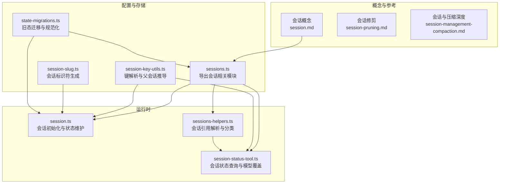
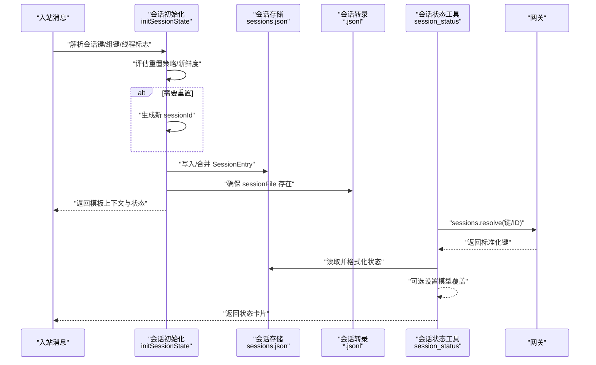
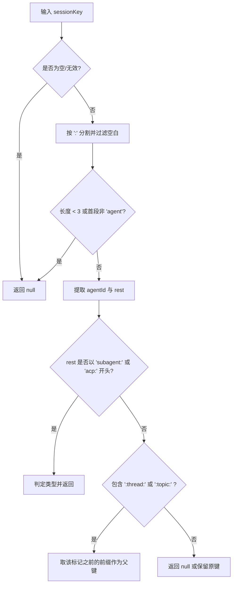
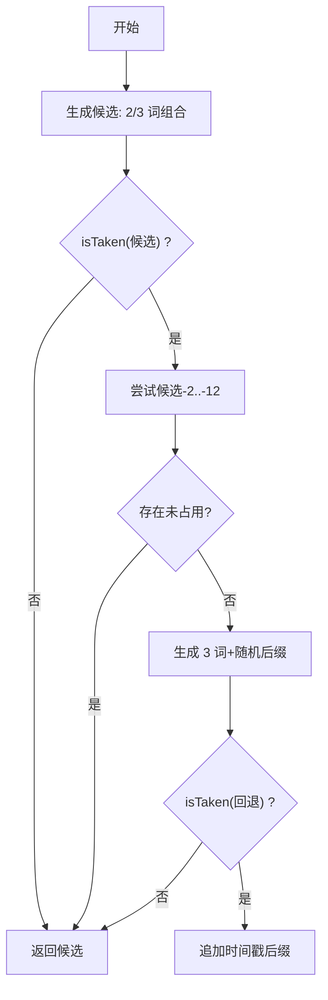
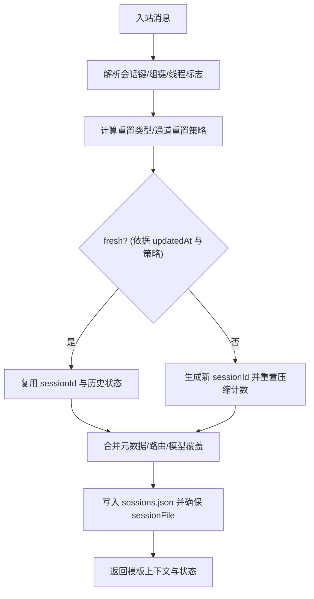
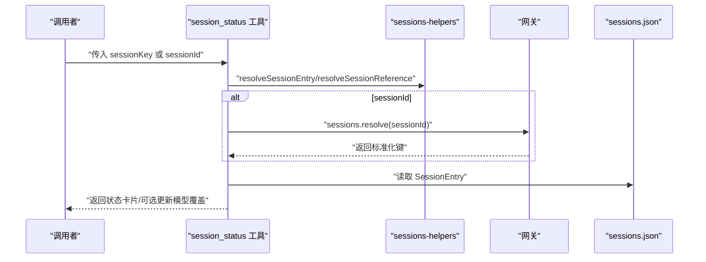
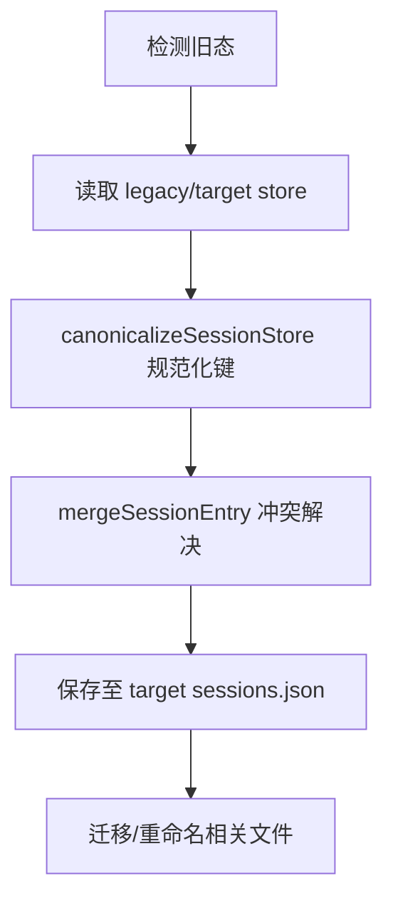
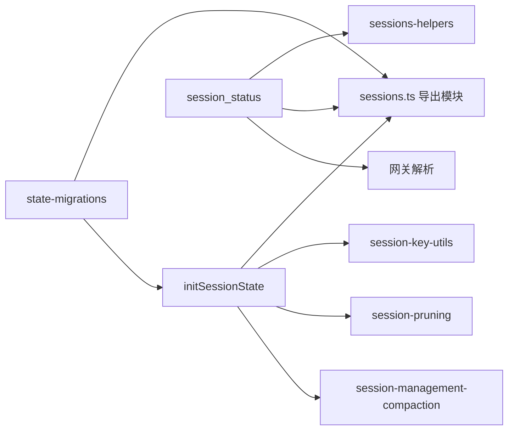

# 会话管理

## 目录
1. [简介](#简介)
2. [项目结构](#项目结构)
3. [核心组件](#核心组件)
4. [架构总览](#架构总览)
5. [详细组件分析](#详细组件分析)
6. [依赖关系分析](#依赖关系分析)
7. [性能考量](#性能考量)
8. [故障排查指南](#故障排查指南)
9. [结论](#结论)
10. [附录](#附录)

## 简介
本文件系统性阐述 OpenClaw 的会话管理系统，覆盖会话标识符生成、会话状态维护、会话生命周期管理、会话隔离机制、会话键解析、会话查询、会话清理与迁移策略，并扩展到多代理会话管理、会话持久化、冲突解决与会话恢复。同时提供面向开发者的性能优化、内存管理与并发访问控制的技术建议。

## 项目结构
OpenClaw 将会话管理拆分为“概念文档”“配置与存储层”“运行时初始化与状态维护”“工具与查询”“迁移与兼容”等多个层次，确保“网关为源”“状态可追踪、可恢复、可迁移”。

## 核心组件
- 会话键解析与父会话推导：用于识别会话类型、解析主会话别名、判断线程/话题会话并推导父会话键。
- 会话标识符生成：生成短语化 slug 作为会话 ID 基础，避免冲突并具备可读性。
- 会话状态维护：在每次入站消息时评估新鲜度、决定是否重置、合并元数据、更新存储与转录。
- 会话查询与跨代理访问：支持按键或 sessionId 解析，遵循 A2A 策略，提供状态卡片与用量信息。
- 会话生命周期与重置策略：基于每日/空闲/类型/通道级重置策略，支持触发式重置。
- 会话持久化与迁移：两层持久化（sessions.json 与 *.jsonl），旧态迁移与键规范化。
- 会话修剪与压缩：运行前修剪工具结果以降低上下文膨胀；压缩持久化摘要以减少历史体积。

## 架构总览
下图展示从入站消息到会话状态落盘的关键流程，以及跨代理访问与状态查询的交互。

## 详细组件分析

### 会话键解析与父会话推导
- 功能要点
  - 解析 `agent:*` 类型键，提取 agentId 与剩余部分。
  - 判断子代理键与 ACP 键。
  - 从线程/话题标记推导父会话键，支持多通道/多账户场景。
- 关键路径
  - `parseAgentSessionKey`
  - `isSubagentSessionKey`
  - `isAcpSessionKey`
  - `resolveThreadParentSessionKey`

### 会话标识符生成
- 功能要点
  - 使用形容词+名词组合生成 slug，优先尝试 2/3 词组合，失败后带随机后缀回退。
  - 支持 isTaken 回调避免冲突，适用于不同命名空间（如进程会话、会话键）。
- 关键路径
  - `createSessionSlug`

### 会话状态维护与生命周期
- 功能要点
  - 基于会话作用域与入站上下文解析会话键，支持主会话别名与组键。
  - 评估重置策略（每日/空闲/类型/通道），必要时生成新 sessionId 并重置压缩计数。
  - 合并/保留历史状态字段（思考级别、队列策略、令牌统计、模型覆盖等）。
  - 维护父会话分支与转录文件路径，确保线程/话题隔离。
- 关键路径
  - `initSessionState`

### 会话查询与跨代理访问控制
- 功能要点
  - 支持按键或 sessionId 查询，自动补全默认 agent 前缀与 main 别名。
  - 跨代理访问通过 tools.agentToAgent 策略控制，拒绝未授权访问。
  - 提供状态卡片，包含用量、时间、队列、模型认证标签等。
  - 可选设置 per-session 模型覆盖，变更后原子更新存储。
- 关键路径
  - `resolveSessionEntry`
  - `resolveSessionKeyFromSessionId`
  - `createAgentToAgentPolicy`
  - `resolveSessionReference`

### 会话隔离与多代理管理
- 功能要点
  - 会话键以 `agent:*` 形式隔离不同代理；支持 `subagent:*` 与 `acp:*` 特殊键。
  - 主会话别名与 scope 控制主键行为；identityLinks 支持跨通道同一人的会话共享。
  - 跨代理访问需满足 tools.agentToAgent.enabled 与 allow 规则。
- 关键路径
  - `createAgentToAgentPolicy`

### 会话持久化与清理
- 功能要点
  - 两层持久化：sessions.json（小而快，记录当前 sessionId 与元数据）、*.jsonl（树形转录，记录对话与压缩摘要）。
  - 清理策略：删除 sessions.json 条目或移除 *.jsonl 即可重建；建议按键粒度清理以保留其他上下文。
  - 运行前修剪工具结果，不改写 *.jsonl；压缩为持久摘要，减少历史体积。

### 会话迁移与冲突解决
- 功能要点
  - 自动检测旧态目录与 sessions.json，规范化键、合并条目、迁移文件。
  - 旧键与新键冲突时，按 updatedAt 与优先级合并，保留最新有效数据。
  - 支持主会话迁移与 WhatsApp 认证目录迁移。
- 关键路径
  - `detectLegacyStateMigrations`
  - `canonicalizeSessionStore`
  - `mergeSessionEntry`

### 会话恢复机制
- 功能要点
  - 通过 sessions.resolve 在网关侧解析 sessionId/键，保证跨沙箱可见性与一致性。
  - 会话初始化时根据重置策略决定是否复用 sessionId，否则生成新 ID 并重置压缩计数。
  - 父会话存在时可分叉生成新的转录文件，保持树形结构与上下文连续。
- 关键路径
  - `resolveSessionReference`
  - `initSessionState`

## 依赖关系分析
- 组件耦合
  - 会话初始化依赖配置与存储模块，受会话键解析与线程标志影响。
  - 会话状态工具依赖网关解析与存储读取，受 A2A 策略约束。
  - 迁移模块独立于运行时，仅在启动阶段扫描与规范化旧态。
- 外部依赖
  - 转录管理由 @mariozechner/pi-coding-agent 的 SessionManager 负责，OpenClaw 通过其接口读写 *.jsonl。
- 潜在循环
  - 无直接循环依赖；工具与运行时通过网关接口解耦。

## 性能考量
- 会话修剪（session-pruning）
  - 仅对工具结果进行软修剪/硬清除，保护用户与助手消息；针对超大工具输出提升首次请求缓存效率。
  - TTL-aware 模式与心跳配合，避免过期缓存导致重复缓存开销。
- 压缩与内存刷新
  - 预压缩内存刷新（Pre-compaction Memory Flush）在接近阈值时执行静默写盘，减少压缩后丢失关键上下文的风险。
  - reserveTokens 安全地板保障多轮“家务活”（如写内存）有足够头寸。
- 存储与 IO
  - sessions.json 小而快，适合频繁读写；转录 *.jsonl 采用树形结构，压缩后仅保留摘要，降低磁盘占用。
- 并发与锁
  - 会话写入采用原子更新（先内存合并再落盘），避免竞态；跨代理访问通过网关统一解析，减少本地文件竞争。

## 故障排查指南
- 会话键错误
  - 使用 /status 或 openclaw status 确认 sessionKey 与主会话别名；检查 identityLinks 与通道映射。
- 存储与转录不一致
  - 确认网关主机与 store 路径；远程模式下不要只查本地文件。
- 重置异常
  - 检查 resetTriggers、resetByType、resetByChannel 与 daily/idle 策略；确认命令授权与大小写匹配。
- 跨代理访问被拒
  - 检查 tools.agentToAgent.enabled 与 allow 规则；确保请求者与目标代理均满足白名单。
- 会话修剪无效
  - 确认使用的是 Anthropic API 且 cache-ttl 模式启用；调整 TTL 与工具白名单。
- 压缩过于频繁
  - 调整 reserveTokens 与 keepRecentTokens；减少工具结果体量或开启修剪。

## 结论
OpenClaw 的会话管理以“网关为源、键驱动隔离、双层持久化、运行前修剪、预压缩刷新”为核心设计，既保证了多代理与多通道下的会话一致性与可恢复性，又兼顾了性能与可观测性。通过规范化的键解析、严格的跨代理访问策略与完善的迁移机制，系统在复杂场景中仍能保持稳定与可维护性。

## 附录
- 会话创建（伪代码路径）
  - `initSessionState`
- 会话状态查询（伪代码路径）
  - `createSessionStatusTool`
- 会话销毁（伪代码路径）
  - 删除 sessions.json 中对应键或移除 *.jsonl 文件；下一次入站消息将重建。
- 会话迁移（伪代码路径）
  - `detectLegacyStateMigrations`
  - `migrateLegacySessions`