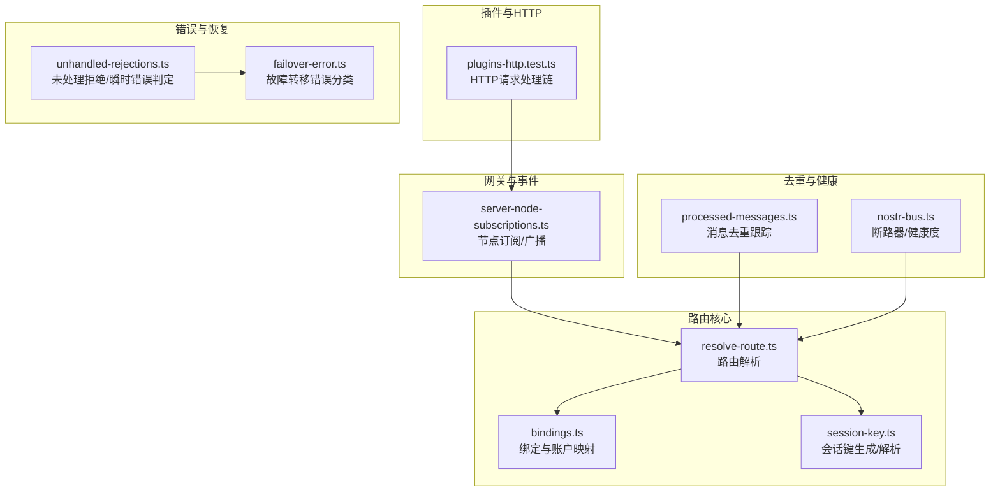
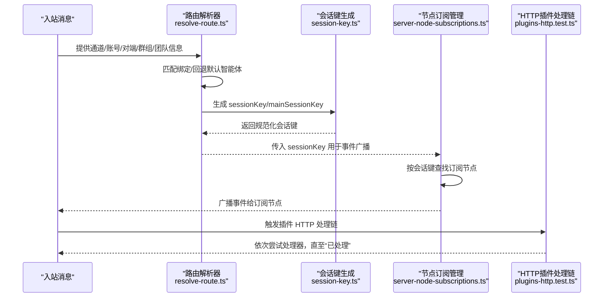
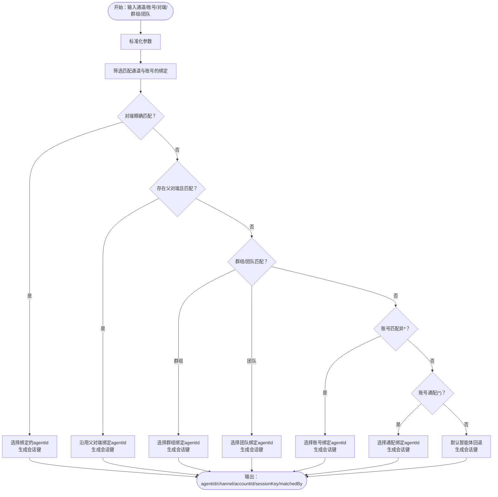
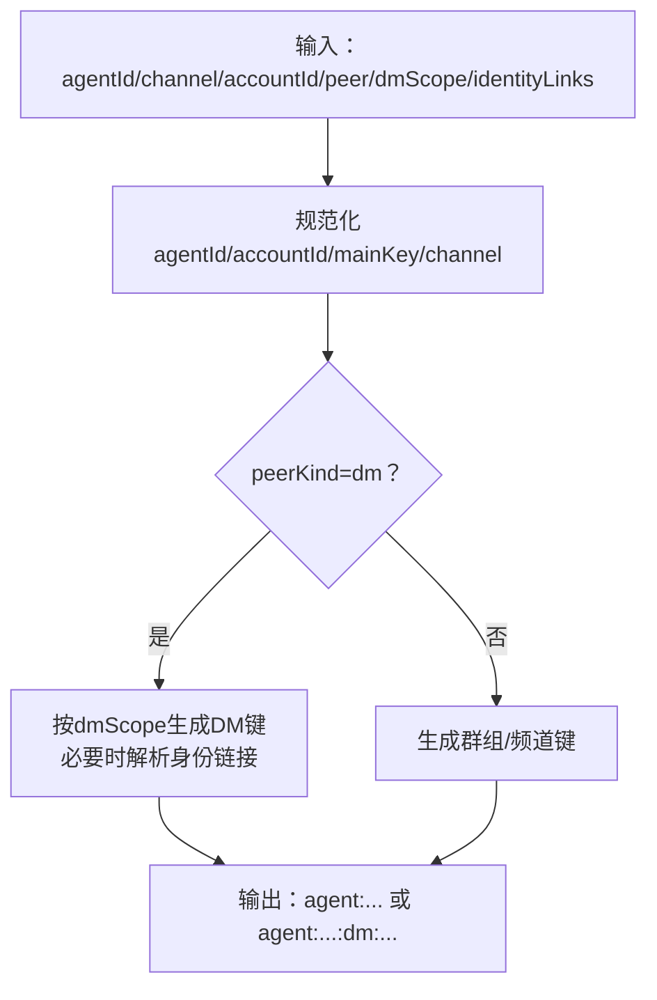
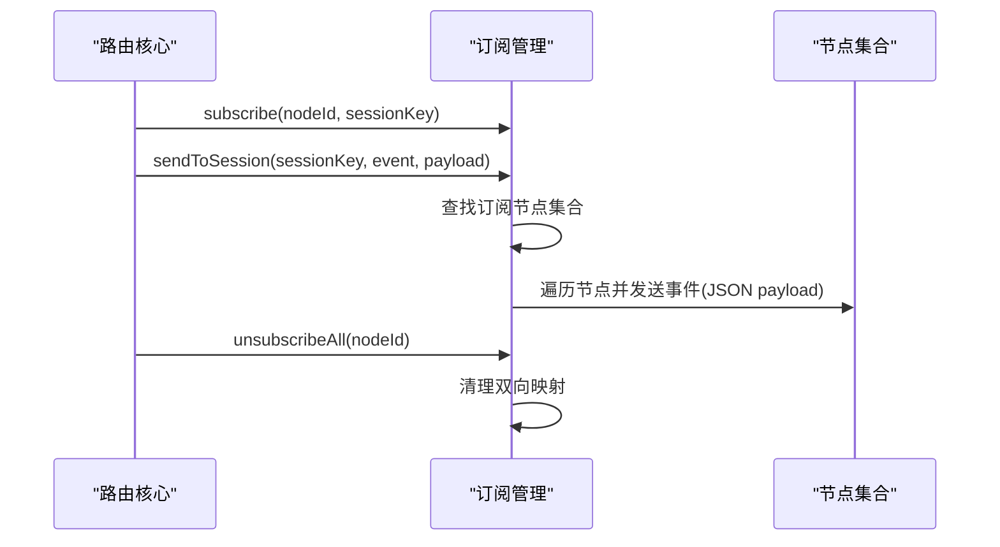
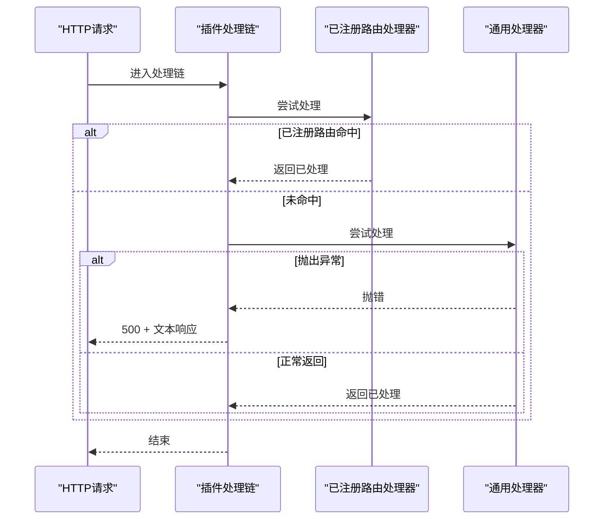
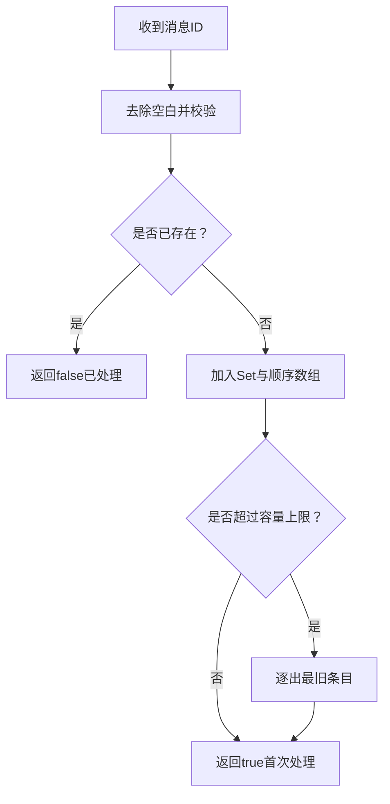
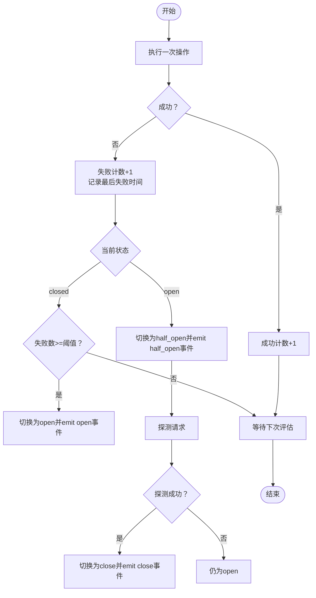
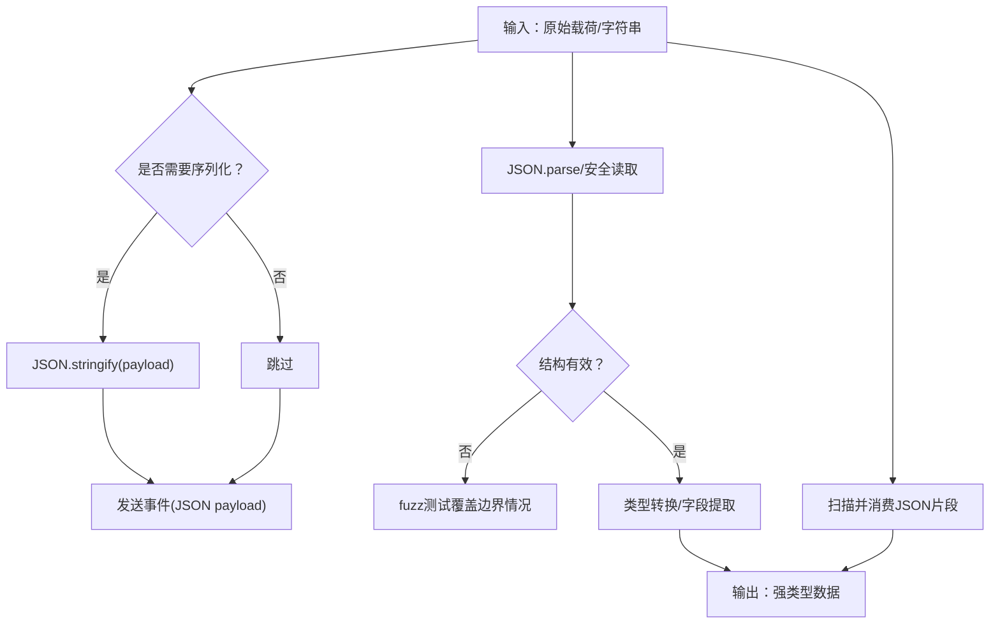
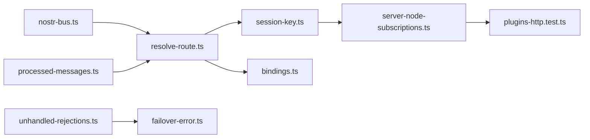

# 消息路由

## 目录
1. [简介](#简介)
2. [项目结构](#项目结构)
3. [核心组件](#核心组件)
4. [架构总览](#架构总览)
5. [详细组件分析](#详细组件分析)
6. [依赖关系分析](#依赖关系分析)
7. [性能考量](#性能考量)
8. [故障排查指南](#故障排查指南)
9. [结论](#结论)
10. [附录](#附录)

## 简介
本章节面向开发者，系统性阐述 OpenClaw 的消息路由体系，包括消息分发机制、方法调用路由、事件广播与订阅管理、路由规则与优先级策略、负载均衡与故障转移机制，以及消息序列化、反序列化、类型转换与验证流程。文档提供可操作的性能优化建议、可观测性指标采集与调试工具使用方法，并以图示与路径引用的方式帮助快速定位实现位置。

## 项目结构
OpenClaw 的消息路由能力主要分布在以下模块：
- 路由解析与会话键生成：`src/routing/*`
- 网关节点订阅与事件广播：`src/gateway/server-node-subscriptions.ts`
- 插件 HTTP 请求处理链：`src/gateway/*`（测试覆盖）
- 错误分类与故障转移：`src/agents/failover-error.ts`、`src/infra/unhandled-rejections.ts`
- 去重与消息处理链：`extensions/tlon/src/monitor/processed-messages.ts`
- 健康度与断路器：`extensions/nostr/src/nostr-bus.ts`
- 文档化的路由规则与示例：`docs/zh-CN/concepts/multi-agent.md`

## 核心组件
- 路由解析器：根据通道、账号、对端、群组/团队等上下文，确定目标智能体与会话键；支持线程父级继承匹配与默认回退。
- 绑定与账户映射：列出绑定、解析默认绑定账户、构建渠道-账户-智能体映射，辅助首选账户选择。
- 会话键生成器：规范化智能体/账户/通道/对端标识，支持多种 DM 作用域策略与身份链接折叠。
- 节点订阅管理：维护节点到会话键的订阅映射，支持按会话键广播、向所有已订阅节点广播、向所有连接节点广播。
- 插件 HTTP 处理链：注册路由处理器与通用处理器，按顺序尝试直到有处理器“报告已处理”，异常时记录并返回 500。
- 错误与故障转移：识别瞬时网络错误、配置错误与致命错误；将错误归类为可故障转移原因并携带状态码/错误码。
- 去重与处理链：跟踪已处理消息 ID，限制容量并逐出最旧条目，避免重复处理。
- 健康与断路器：统计成功/失败次数与延迟，计算健康评分，实现断路器开合与半开探测。

## 架构总览
下图展示了从消息进入系统到路由决策、会话键生成、事件广播与插件处理的整体流程。

## 详细组件分析

### 路由解析与优先级策略
- 匹配顺序（最精确优先）：
  1) 对端精确匹配（含线程父对端继承）
  2) 群组 ID
  3) 团队 ID
  4) 账号匹配（非通配）
  5) 任意账号的通配匹配
  6) 默认智能体回退
- 会话键生成：
  - 支持多种 DM 作用域：主会话、按对端、按频道-对端、按账号-频道-对端
  - 支持身份链接折叠，将不同对端 ID 映射到同一规范 ID
- 文档化示例与规则：多智能体路由、私聊分流、默认回退策略

### 会话键生成与类型转换
- 类型转换与规范化：
  - 智能体 ID、账户 ID、主键、通道名统一小写与清洗
  - 对端 ID 在 DM 场景下支持按作用域策略生成
  - 身份链接映射：将候选 ID 映射到规范 ID，实现跨 ID 的会话折叠
- 会话键格式：
  - 主会话键：`agent:{agentId}:{mainKey}`
  - DM 会话键：支持 `per-peer`/`per-channel-peer`/`per-account-channel-peer`/`main`
  - 群组/频道历史键：`{channel}:{accountId}:{peerKind}:{peerId}`
  - 线程会话键：在基础键后追加 `:thread:{threadId}`

### 事件广播与订阅管理
- 订阅模型：
  - 节点 ID → 会话键集合
  - 会话键 → 节点 ID 集合
- 广播策略：
  - `sendToSession`：仅向订阅该会话键的节点广播
  - `sendToAllSubscribed`：向所有已订阅节点广播
  - `sendToAllConnected`：基于连接节点列表广播
- 序列化：
  - 将 payload 转换为 JSON 字符串后下发，避免重复序列化

### 插件 HTTP 请求处理链与错误传播
- 处理链行为：
  - 注册“已注册路由”优先于“通用处理器”
  - 依次调用处理器，直到某处理器“报告已处理”
  - 发生异常时记录日志并返回 500，设置文本响应
- 中间件机制：
  - 通过注册表组织多个处理器，形成链式调用
  - 异常捕获与统一响应，避免崩溃传播

### 消息去重与处理链
- 去重策略：
  - 使用 Set 记录已处理 ID，数组维护插入顺序
  - 当容量超过阈值，逐出最旧条目，保证内存可控
- 适用场景：
  - 防止重复处理同一条消息，提升鲁棒性

### 健康度与断路器（故障转移支撑）
- 断路器逻辑：
  - 失败计数达到阈值则打开
  - 半开状态下允许一次探测请求，成功则关闭，失败则重新打开
- 健康度评分：
  - 统计成功率、失败率、延迟均值等，按评分排序可用资源
- 指标与事件：
  - emit `relay.circuit_breaker.*` 与健康事件，便于观测

### 序列化、反序列化与类型转换
- 序列化：
  - 广播前将 payload JSON 序列化为字符串，避免重复序列化
- 反序列化与类型转换：
  - JSON 解析与结构校验，处理边界情况（空串、单引号、NaN、Infinity、NUL 字节等）
  - 从字符串/数字/布尔安全读取字段，避免类型错误
  - 对于嵌入式 JSON 片段，提供“消费 JSON 片段”的扫描器，支持跳过非 JSON 前缀
- 错误载荷识别：
  - 识别包含错误字段的载荷对象，支持带前缀的错误载荷变体

## 依赖关系分析
- 路由解析依赖绑定与会话键生成，决定最终 `sessionKey` 与 `agentId`
- 节点订阅管理依赖路由解析结果进行事件广播
- 插件处理链独立于路由，但可与订阅管理协作完成请求-响应闭环
- 错误处理与断路器为上层提供稳定性保障

## 性能考量
- 路由解析
  - 绑定过滤与匹配采用早期短路（先通道再账号），减少无效遍历
  - 会话键生成尽量复用规范化结果，避免重复计算
- 广播
  - 使用 Set 存储订阅映射，O(1) 查找与去重
  - payload 序列化一次后复用，降低 CPU 开销
- 去重
  - 限定容量上限，逐出最旧条目，控制内存占用
- 健康与断路器
  - 基于滑动窗口统计成功率与延迟，动态调整资源选择
  - 断路器半开探测降低恢复成本

## 故障排查指南
- 未处理拒绝与瞬时错误
  - 使用 `isAbortError` 识别取消类错误，避免误判为致命错误
  - `isTransientNetworkError` 识别可重试的网络瞬时问题
- 故障转移
  - 将错误归类为可故障转移原因，携带状态码/错误码，便于上层策略处理
- JSON 边界情况
  - fuzz 测试覆盖空串、单引号、NaN、Infinity、NUL 字节等，确保解析健壮性
- 插件处理链异常
  - 发生异常时记录日志并返回 500，检查处理器实现与上游依赖

## 结论
OpenClaw 的消息路由系统以“确定性匹配 + 会话键生成 + 订阅广播”为核心，结合去重、断路器与错误分类机制，提供了高可靠、可扩展的消息处理链。通过清晰的优先级策略与可观测性指标，开发者可以高效定位问题并优化性能。

## 附录
- 路由规则与示例参考：多智能体路由、私聊分流、默认回退策略
- 关键实现路径参考：
  - 路由解析：`resolve-route.ts`
  - 绑定与账户映射：`bindings.ts`
  - 会话键生成：`session-key.ts`
  - 节点订阅与广播：`server-node-subscriptions.ts`
  - 插件处理链：`plugins-http.test.ts`
  - 去重：`processed-messages.ts`
  - 健康与断路器：`nostr-bus.ts`
  - 错误分类：`failover-error.ts`