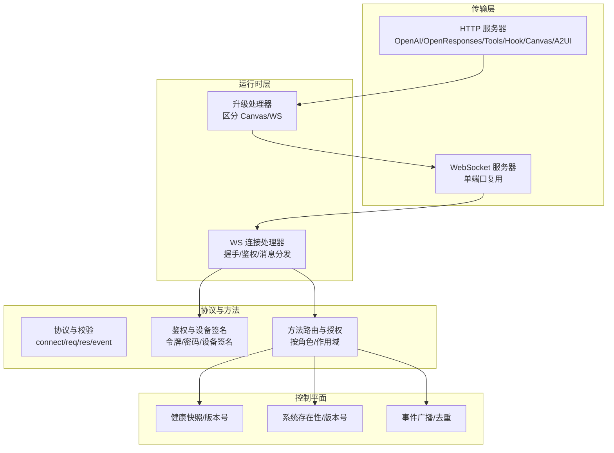
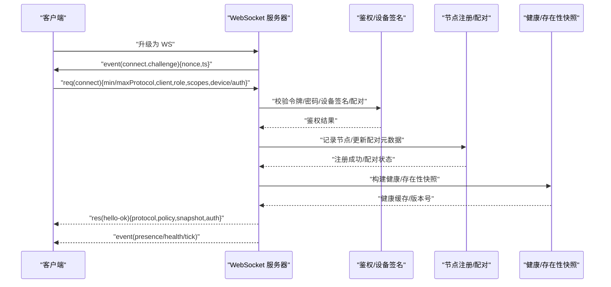
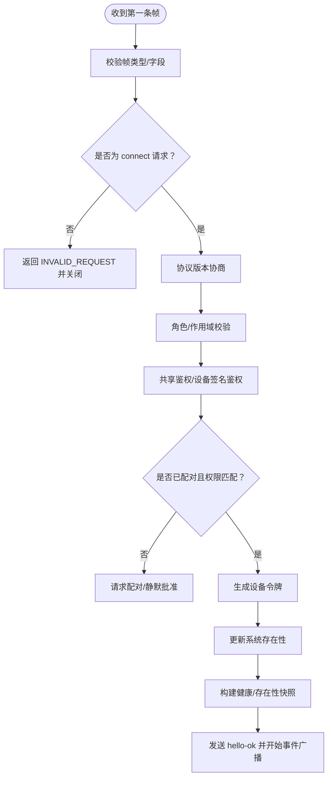
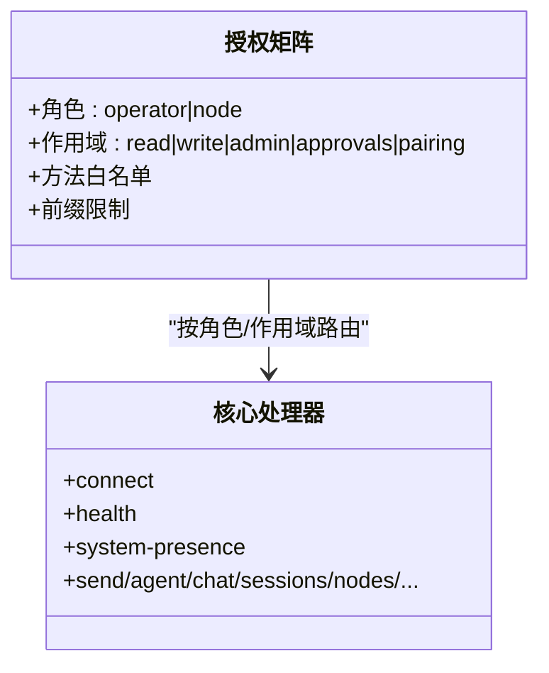
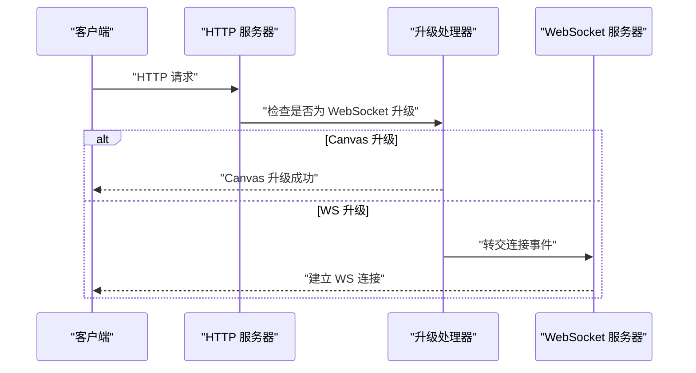
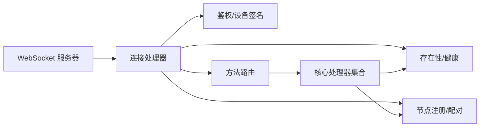

# 网关控制平面

## 目录
1. [简介](#简介)
2. [项目结构](#项目结构)
3. [核心组件](#核心组件)
4. [架构总览](#架构总览)
5. [详细组件分析](#详细组件分析)
6. [依赖关系分析](#依赖关系分析)
7. [性能考量](#性能考量)
8. [故障排查指南](#故障排查指南)
9. [结论](#结论)
10. [附录：WebSocket API 使用示例与最佳实践](#附录websocket-api-使用示例与最佳实践)

## 简介
本文件系统化阐述 OpenClaw 网关的“控制平面”设计与实现，聚焦 WebSocket 网关服务器的协议、握手、鉴权、消息路由、会话与节点管理、心跳与健康、错误与重连策略、配置与安全、可观测性与性能优化，并提供可直接落地的客户端交互示例路径与扩展指引。目标读者为需要对接或二次开发网关控制平面的工程师。

## 项目结构
网关控制平面由以下关键模块组成：
- 协议层：定义帧格式、角色/作用域、设备身份与配对、版本协商与校验。
- 传输层：单端口复用，WebSocket 负责控制与事件，HTTP 提供工具调用、OpenAI/OpenResponses 兼容接口、Canvas/A2UI、Hook 等。
- 运行时层：WebSocket 连接生命周期管理、握手与鉴权、消息分发与广播。
- 方法层：统一的请求处理与授权矩阵，按角色/作用域路由到具体方法处理器。
- 健康与存在性：健康快照、存在性列表、状态版本号用于事件去重与回放检测。
- 安全与认证：共享密钥（令牌/密码）与设备签名双重校验，支持 Tailscale Serve 身份透传。

## 核心组件
- WebSocket 控制平面
  - 握手挑战与响应：服务端先下发 `connect.challenge`，客户端必须在超时前完成 `connect` 请求并满足协议/角色/作用域/鉴权要求。
  - 帧格式：`req`（请求）、`res`（响应）、`event`（事件），支持 `seq`/`stateVersion` 用于去重与回放检测。
  - 设备身份与配对：设备公钥派生 ID、时间戳签名、nonce 校验；本地直连允许简化签名，远程需签名并通过配对流程。
  - 角色与作用域：`operator`（控制面）与 `node`（能力宿主），按作用域授权方法集合。
- HTTP 复用端口
  - 工具调用、OpenAI/OpenResponses 兼容接口、Hook、Canvas/A2UI、插件扩展等。
- 方法路由与授权
  - 按角色/作用域进行细粒度授权，未知方法返回 `INVALID_REQUEST`。
- 健康与存在性
  - 健康快照与状态版本号，事件携带 `stateVersion` 以便客户端检测缺口并自动刷新。

## 架构总览
下图展示从客户端发起连接到建立控制平面会话的完整序列，包括握手、鉴权、配对、设备令牌签发与 hello-ok 返回。

## 详细组件分析

### 组件一：WebSocket 连接与握手
- 连接建立
  - 记录远端地址、代理头、User-Agent、Host 等上下文信息。
  - 发送 `connect.challenge`，等待客户端在握手超时前完成 `connect`。
- 握手与协议版本
  - 校验最小/最大协议版本与服务端协议版本是否兼容。
  - 校验角色（`operator`/`node`）与作用域。
- 鉴权与设备签名
  - 支持令牌/密码共享鉴权，或设备签名鉴权（含 nonce、时间戳、公钥派生 ID 校验）。
  - 控制 UI 在特定模式下可绕过设备鉴权（不推荐）。
- 配对与设备令牌
  - 未配对设备触发配对请求；静默本地连接可自动批准。
  - 成功后颁发设备令牌，包含角色与作用域，后续可用于快速鉴权。
- 存在性与快照
  - 更新系统存在性条目，返回 `hello-ok` 包含健康快照、方法与事件清单、策略参数（最大负载、缓冲字节、心跳间隔）。

### 组件二：消息路由与授权
- 授权矩阵
  - 按角色（`node`/`operator`）与作用域（`read`/`write`/`admin`/`approvals`/`pairing`）判断方法是否允许。
  - 对 `exec.approval`、`device.pair.*`、`config.*`、`wizard.*`、`update.*` 等敏感方法施加更严格限制。
- 方法分发
  - 将请求路由至核心处理器集合或外部处理器，统一通过 `respond` 回复。
  - 未知方法返回 `INVALID_REQUEST`。

### 组件三：HTTP 与 WebSocket 复用
- 单端口多路复用
  - WebSocket 专用于控制与事件；HTTP 提供 OpenAI/OpenResponses/Tools/Hook/Canvas/A2UI 等。
- 升级处理
  - 优先尝试 Canvas 升级，否则交由 WebSocket 服务器处理连接事件。

### 组件四：心跳与健康
- 快照与版本
  - 健康快照与存在性版本号随 `hello-ok` 下发；事件携带 `stateVersion` 便于客户端检测缺口。
- 心跳行为
  - 定期触发 `agent-turn`，支持自定义间隔、目标通道、提示词、可见性控制与推理消息。
- 可观测性
  - `tick` 事件作为保活信号；`shutdown` 事件通知优雅退出，客户端应重连。

### 组件五：安全与认证
- 共享鉴权
  - 支持令牌（`gateway.auth.token`）与密码（`gateway.auth.password`）两种方式。
- 设备鉴权
  - 设备公钥派生 ID、时间戳签名、nonce 校验；本地直连允许简化签名。
- Tailscale 身份
  - 支持通过 Tailscale Serve 透传身份，无需共享密钥。
- 控制 UI 绕过
  - 在特定配置下允许控制 UI 绕过设备鉴权（不推荐）。

## 依赖关系分析
- 组件耦合
  - 连接处理器依赖鉴权模块、配对模块、健康/存在性模块与节点注册模块。
  - 方法路由依赖授权矩阵与各子系统处理器。
- 外部依赖
  - `ws`（WebSocket）、Node HTTP/HTTPS、AJV（Schema 校验）、日志子系统。
- 关键依赖链
  - WebSocket 升级 → 连接处理器 → 鉴权/配对 → 方法路由 → 广播/事件 → 健康/存在性。

## 性能考量
- 负载与背压
  - 服务端在 `hello-ok` 中下发 `maxPayload` 与 `maxBufferedBytes` 等策略参数，客户端据此控制消息大小与速率。
- 广播与丢弃
  - 广播支持 `dropIfSlow`，避免慢消费者拖垮整体。
- 心跳与保活
  - `tickIntervalMs` 用于保活；业务请求与心跳分离，避免将心跳误用为发送确认。
- 代理与 IP 解析
  - 通过 `trustedProxies` 正确解析真实客户端 IP，避免误判本地直连导致的安全与鉴权问题。

## 故障排查指南
- 握手失败
  - 常见原因：无效握手帧、协议不兼容、角色非法、鉴权失败、设备签名/nonce 不匹配、未配对。
  - 处理：检查 `connect` 参数、协议版本、设备签名与时间戳、共享鉴权配置。
- 连接被拒
  - 常见原因：未启用允许的鉴权方式、Tailscale 身份缺失或不匹配、代理头不可信。
  - 处理：启用正确的鉴权、确保 Tailscale 透传、配置 `trustedProxies`。
- 事件缺失或乱序
  - 常见原因：客户端未正确处理 `seq`/`stateVersion` 导致的缺口。
  - 处理：检测 gap 后刷新 `health`/`system-presence`。
- 优雅退出
  - 服务端发出 `shutdown` 事件，客户端应主动重连并重新握手。

## 结论
OpenClaw 网关以“协议—传输—运行时—方法—安全—健康/存在性”的清晰分层，提供了高内聚、低耦合的控制平面实现。其握手与鉴权机制兼顾易用与安全，消息路由与广播保证了可观测性与可扩展性，心跳与健康体系提升了长期运行的稳定性。建议在生产环境启用设备签名与配对、合理设置代理与鉴权策略，并结合心跳与可观测性指标进行持续优化。

## 附录：WebSocket API 使用示例与最佳实践
以下示例仅给出“代码片段路径”，请根据实际需求替换参数与鉴权方式。

- 客户端连接与握手
  - 发起 WS 升级并等待 `connect.challenge`，随后发送 `connect` 请求（包含 `minProtocol`、`maxProtocol`、`client`、`role`、`scopes`、`device`、`auth` 等）。
  - 参考路径：`<file://src/gateway/server/ws-connection/message-handler.ts#L306-L918>`
- 发送消息与调用方法
  - 使用 `req` 帧调用方法（如 `send`、`agent`、`system-presence`、`health` 等），并依据 `res` 响应处理结果。
  - 参考路径：`<file://src/gateway/server-methods.ts#L162-L217>`
- 事件监听与去重
  - 监听 `event`（如 `presence`、`tick`、`shutdown`），利用 `stateVersion` 与 `seq` 实现去重与回放检测。
  - 参考路径：`<file://src/gateway/server/ws-connection/message-handler.ts#L814-L845>`
- 重连策略
  - 监听 `shutdown` 事件后延迟重连；重连时携带持久化的设备令牌（若存在）以减少配对成本。
  - 参考路径：`<file://docs/gateway/index.md#L189-L200>`
- 安全与认证
  - 生产环境优先使用设备签名与配对；控制 UI 绕过设备鉴权仅限特殊场景。
  - 参考路径：`<file://docs/gateway/protocol.md#L187-L216>`