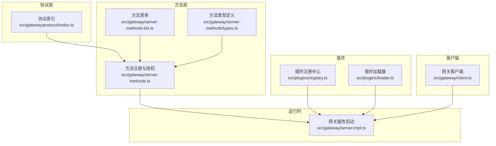
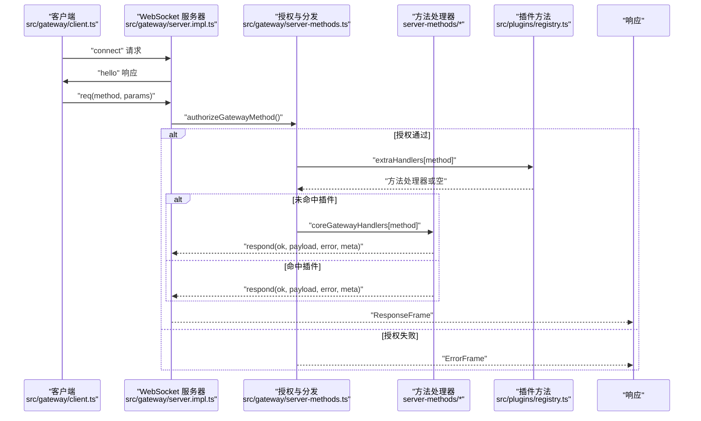
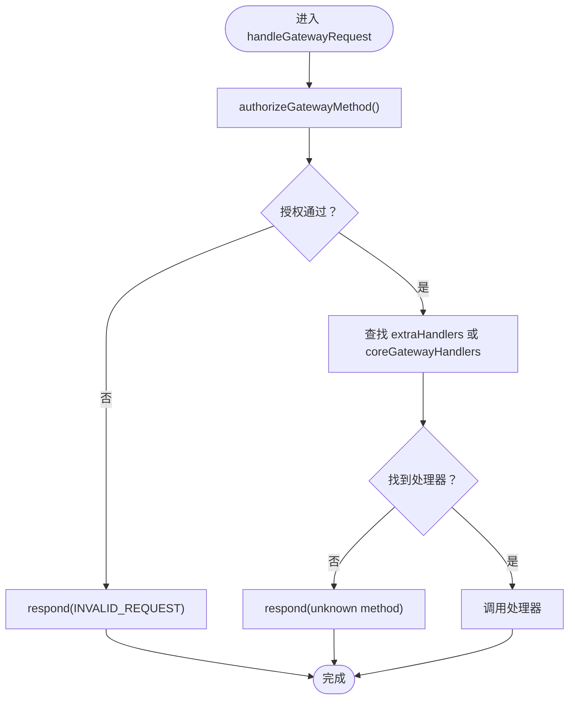
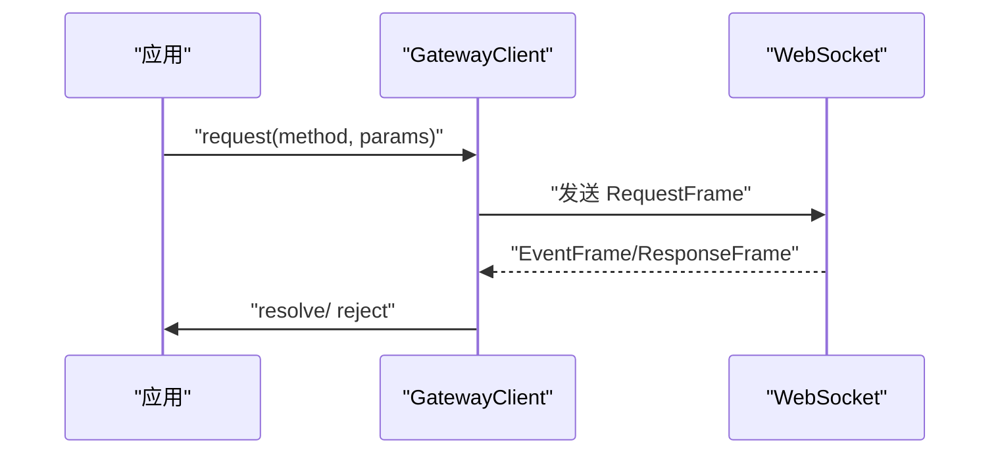
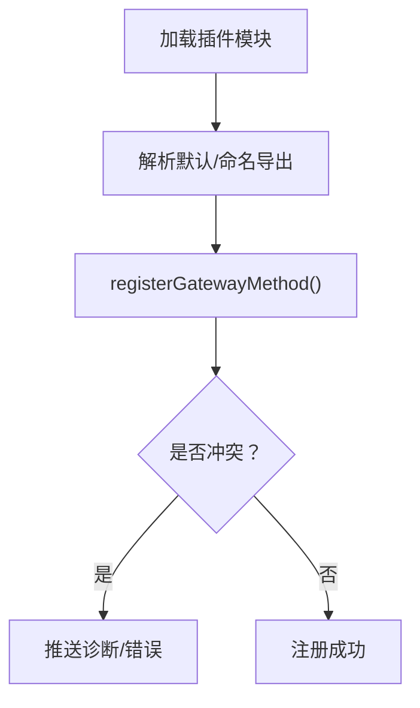
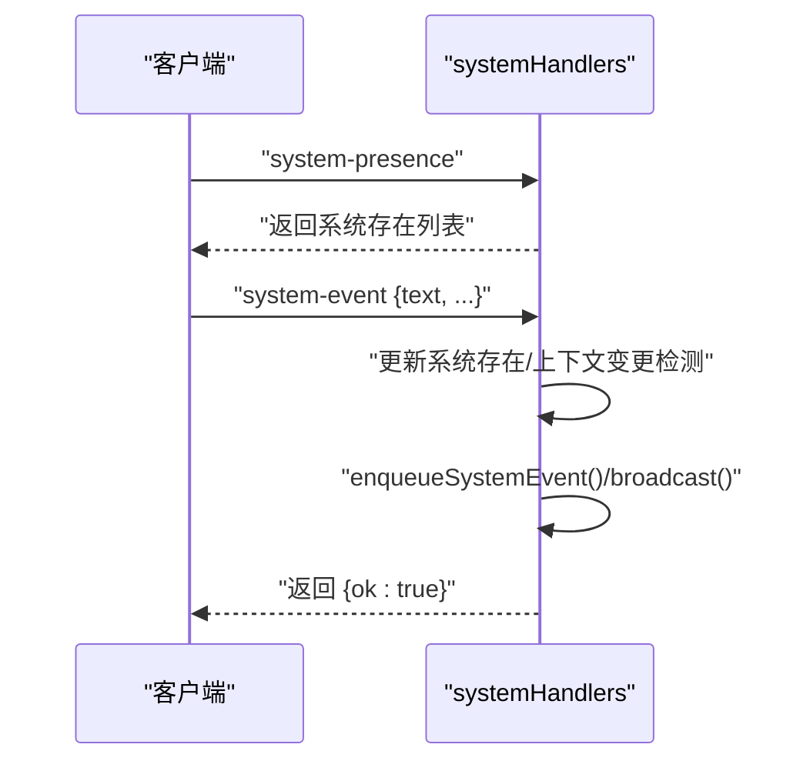
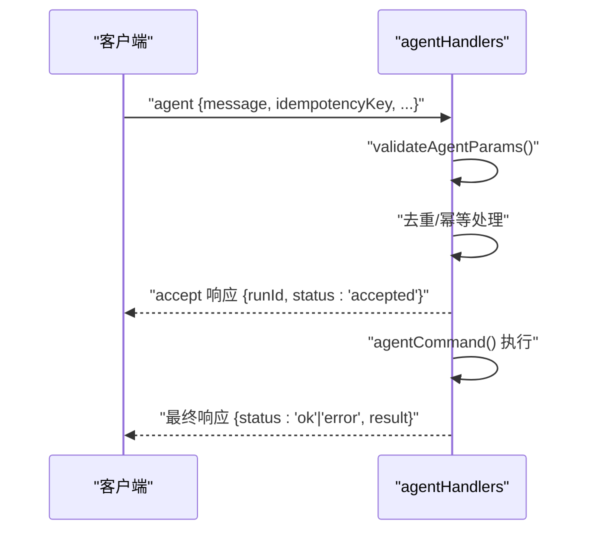
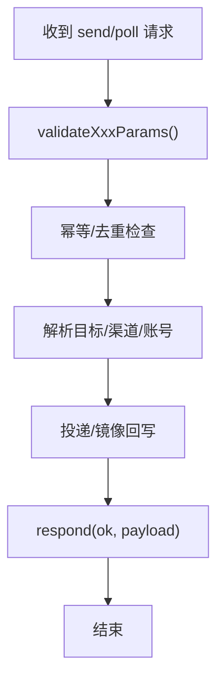
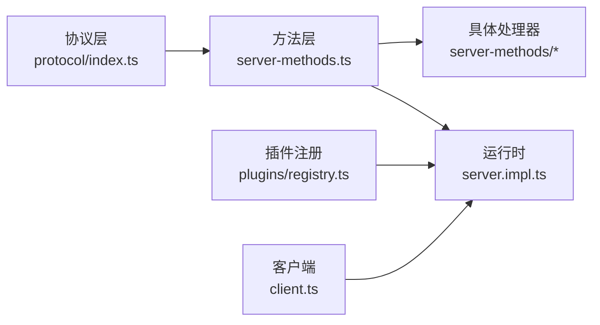

# 网关方法

## 目录
1. [简介](#简介)
2. [项目结构](#项目结构)
3. [核心组件](#核心组件)
4. [架构总览](#架构总览)
5. [详细组件分析](#详细组件分析)
6. [依赖关系分析](#依赖关系分析)
7. [性能考量](#性能考量)
8. [故障排查指南](#故障排查指南)
9. [结论](#结论)
10. [附录](#附录)

## 简介
本篇文档系统化阐述 OpenClaw 网关方法体系的设计与实现，覆盖方法定义、注册、调用与管理机制，以及参数校验、返回值处理、权限控制、执行上下文、错误处理与异常传播。同时给出方法扩展开发、性能监控与调试技巧，帮助开发者高效构建与维护网关能力。

## 项目结构
网关方法系统由协议层、方法注册与授权、运行时调度、客户端交互与插件扩展等模块组成。核心目录与职责如下：
- 协议与模式：定义请求/响应/事件帧与参数模式，提供 AJV 校验器与错误格式化工具
- 方法注册与授权：集中注册核心方法并按角色与作用域进行授权判定
- 运行时：启动网关服务，加载插件方法，挂载 WS/HTTP 处理器，维护广播与上下文
- 客户端：封装连接、鉴权、消息编解码、重连与心跳检测
- 插件：动态注册网关方法，扩展核心方法集

## 核心组件
- 协议与参数校验
  - 使用 AJV 编译各方法参数模式，统一错误格式化与校验失败处理
  - 提供 RequestFrame/ResponseFrame/EventFrame 及各业务参数 Schema 的编译器
- 方法注册与授权
  - 聚合核心方法处理器，按角色与作用域进行授权判定
  - 支持管理员、只读、写入、审批、配对等作用域与方法白名单
- 运行时调度
  - 启动网关服务，加载插件方法，合并核心与插件方法表
  - 维护广播、节点订阅、会话状态、健康快照等上下文
- 客户端
  - 封装连接、鉴权、消息编解码、重连与心跳检测
  - 支持 TLS 指纹校验、设备签名认证、命令行/设备能力声明
- 插件扩展
  - 动态注册网关方法，避免与核心或已有插件冲突
  - 加载插件模块导出，解析默认导出或命名导出的注册函数

## 架构总览
下图展示了从客户端发起请求到方法处理器执行、再到响应返回的完整链路，包括权限校验、方法分发与插件扩展点。

## 详细组件分析

### 协议与参数校验
- 设计要点
  - 通过 AJV 对 RequestFrame/ResponseFrame/EventFrame 与各方法参数进行编译与校验
  - 统一错误格式化，支持去重与可读化提示
  - 严格模式与额外属性移除策略，确保协议健壮性
- 关键路径
  - 参数校验器导出：`validateXxxParams`
  - 错误格式化：`formatValidationErrors`

### 方法注册与授权
- 设计要点
  - 核心方法聚合于 coreGatewayHandlers，按角色与作用域进行授权判定
  - 支持节点侧专用方法白名单、审批/配对方法、管理员前缀等细粒度控制
  - 未知方法直接返回 INVALID_REQUEST
- 关键路径
  - 授权判定：`authorizeGatewayMethod`
  - 核心处理器聚合：`coreGatewayHandlers`
  - 请求分发入口：`handleGatewayRequest`

### 运行时与上下文
- 设计要点
  - 启动阶段加载插件方法，合并基础方法与通道插件方法，形成最终方法集合
  - 维护广播、节点订阅、会话状态、健康快照、心跳、Cron 等运行时上下文
  - 通过上下文注入方法处理器，支持日志、模型目录、广播、节点事件等能力
- 关键路径
  - 方法清单与事件清单：`listGatewayMethods`/`GATEWAY_EVENTS`
  - 插件加载与合并：`loadGatewayPlugins`
  - WS/HTTP 注册与上下文注入：`attachGatewayWsHandlers`

### 客户端与连接管理
- 设计要点
  - 支持设备签名认证、令牌/密码认证、TLS 指纹校验
  - 自动重连与指数退避、心跳检测、序列号 Gap 检测
  - 请求帧校验失败直接抛错，响应帧区分“接受”与最终结果
- 关键路径
  - 连接与鉴权：`sendConnect`/`request`
  - 消息处理与 Gap/心跳：`handleMessage`/`startTickWatch`
  - 请求发送与校验：`request`

### 插件扩展与注册
- 设计要点
  - 插件可通过默认导出或命名导出的 register 函数暴露网关方法
  - 注册时去重与冲突检测，避免重复注册或与核心/其他插件冲突
  - 插件方法与核心方法共同参与分发
- 关键路径
  - 解析插件导出：`resolvePluginModuleExport`
  - 注册网关方法：`registerGatewayMethod`

### 核心方法示例与调用流程

#### system 方法族
- 方法：last-heartbeat、set-heartbeats、system-presence、system-event
- 能力：查询心跳、开关心跳、列出系统存在信息、上报系统事件并广播
- 关键路径
  - 处理器：`systemHandlers`

#### agent 方法族
- 方法：agent、agent.identity.get、agent.wait
- 能力：发起代理对话、获取助手身份、等待任务完成
- 关键路径
  - 处理器：`agentHandlers`
  - 参数校验：`validateAgentParams`/`validateAgentIdentityParams`/`validateAgentWaitParams`

#### send/poll 方法族
- 方法：send、poll
- 能力：发送消息与投票，支持幂等、渠道解析、镜像回写会话
- 关键路径
  - 处理器：`sendHandlers`
  - 参数校验：`validateSendParams`/`validatePollParams`

#### sessions 方法族
- 方法：sessions.list、sessions.preview、sessions.resolve、sessions.patch、sessions.reset、sessions.delete、sessions.compact
- 能力：会话列表、预览、解析、补丁、重置、删除、压缩
- 关键路径
  - 处理器：`sessionsHandlers`
  - 参数校验：多组 `validateSessionsXxxParams`

### 执行上下文与权限控制
- 执行上下文
  - 方法处理器通过上下文访问日志、模型目录、广播、节点订阅、会话状态等
  - 上下文接口定义：`GatewayRequestContext`
- 权限控制
  - 角色与作用域：operator/admin/read/write/approvals/pairing
  - 方法白名单与前缀限制：`authorizeGatewayMethod`
- Swift 客户端集成
  - Swift 端通过 GatewayConnection 发起方法调用，如 agent/system 等
  - 示例路径：`GatewayConnection.swift`

### 错误处理与异常传播
- 参数校验失败：统一返回 INVALID_REQUEST 与可读错误信息
- 未知方法：INVALID_REQUEST 并提示 unknown method
- 运行时异常：UNAVAILABLE 并携带格式化错误
- 客户端侧：响应帧区分“接受”与最终结果，支持 expectFinal
- Swift 客户端：Best-effort 事件发送，捕获错误并返回元数据

### 方法扩展开发指南
- 步骤
  - 在 server-methods 下新增处理器文件，导出 GatewayRequestHandlers
  - 在 server-methods-list 中声明新方法名（若为通道插件方法）
  - 在 server-methods 聚合处理器并注册到 coreGatewayHandlers
  - 如需插件扩展，使用插件注册接口注册方法
- 参数校验
  - 在 protocol/schema 下新增模式并在 index.ts 导出校验器
  - 在处理器中使用 `validateXxxParams` 与 `formatValidationErrors`
- 返回值与元数据
  - 使用 `respond(ok, payload, error, meta)` 返回结果与元信息
  - 对幂等场景设置去重缓存，避免重复执行

### 性能监控与调试技巧
- 性能监控
  - 使用上下文中的日志子系统与健康快照接口
  - 关注广播与节点订阅的丢弃策略，避免慢消费者阻塞
- 调试技巧
  - 客户端启用 raw stream 日志，观察帧序列与 Gap
  - 利用 expectFinal 与去重缓存定位重复请求
  - Swift 端捕获 decode 失败并记录错误来源

## 依赖关系分析
- 组件耦合
  - 协议层为所有方法提供统一的参数校验与错误格式化
  - 方法层依赖协议层的校验器与错误形状
  - 运行时依赖方法层与插件注册中心，提供上下文与广播
  - 客户端依赖协议层的帧与校验器
- 外部依赖
  - 插件系统通过模块加载与导出解析实现动态扩展
  - Swift 客户端通过 GatewayConnection 与网关交互

## 性能考量
- 幂等与去重
  - 对高风险方法（如 agent、send、poll）采用去重与幂等键，避免重复执行
- 广播与丢弃
  - 广播支持 dropIfSlow，降低慢消费者影响
- 心跳与超时
  - 客户端心跳检测与超时关闭，防止静默断开
- 批处理与延迟刷新
  - 技能变更触发的节点探测采用延迟刷新，避免频繁探针

## 故障排查指南
- 常见问题
  - 参数校验失败：检查 `validateXxxParams` 与 `formatValidationErrors` 输出
  - 未知方法：确认方法是否在 `listGatewayMethods` 中声明
  - 权限不足：核对角色与作用域配置
  - 客户端断开：检查心跳与 TLS 指纹校验
- Swift 端
  - Best-effort 事件发送，捕获 decode 失败并记录错误
- 执行审批与权限
  - Node 主机侧对允许清单、屏幕录制权限与用户审批进行检查与提示

## 结论
OpenClaw 的网关方法系统以协议驱动、以授权为核心、以插件扩展为边界，提供了高内聚、低耦合且易于扩展的能力框架。通过严格的参数校验、完善的权限控制与上下文注入，以及客户端与运行时的协同设计，能够稳定支撑复杂场景下的方法调用与扩展开发。

## 附录
- 方法清单与事件清单
  - 方法清单：`listGatewayMethods`
  - 事件清单：`GATEWAY_EVENTS`
- 类型与上下文
  - 请求上下文接口：`GatewayRequestContext`
  - 请求处理器接口：`GatewayRequestHandler`