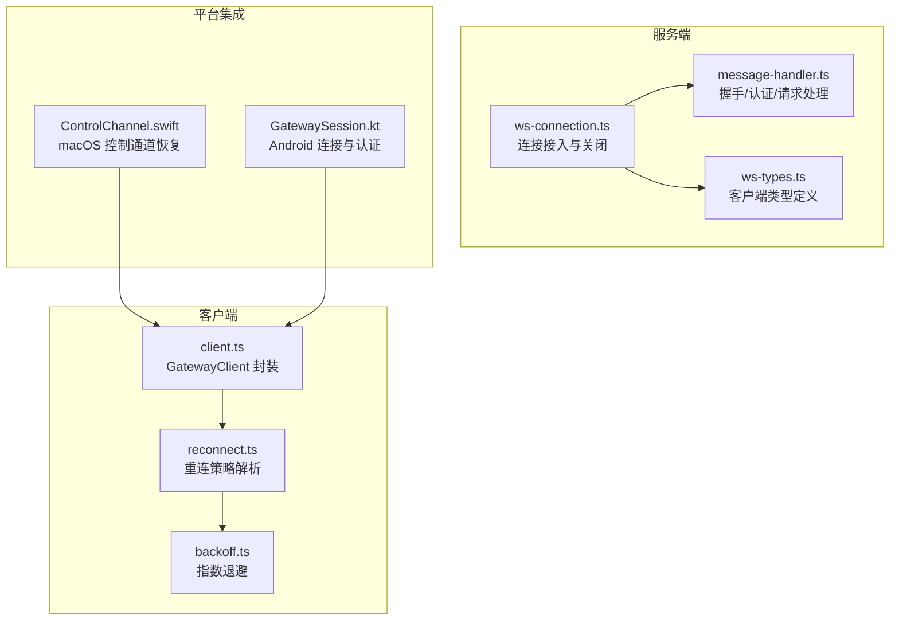
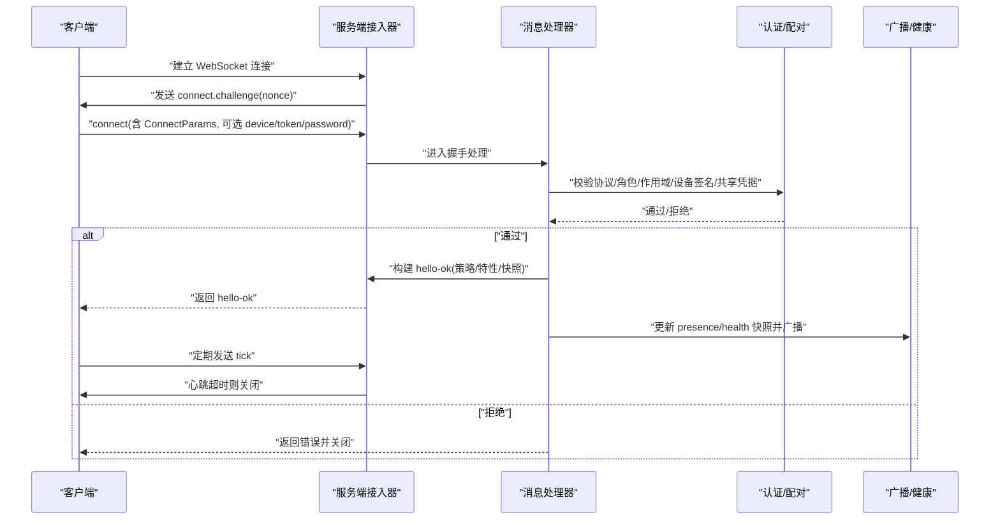
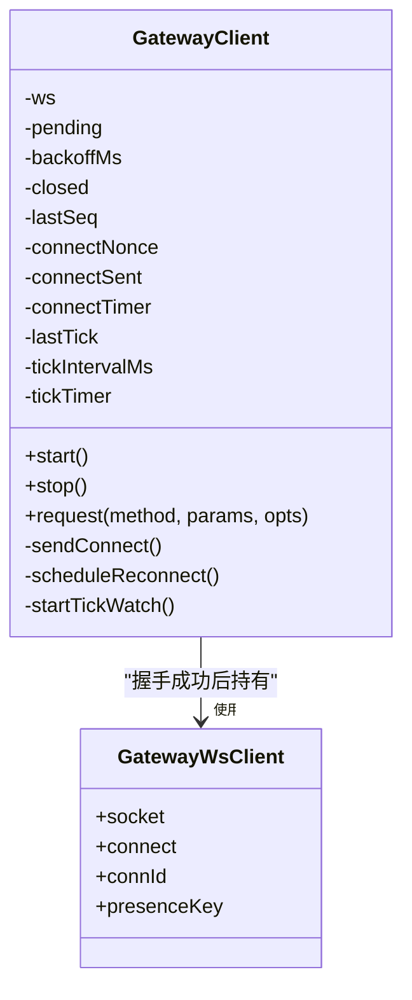
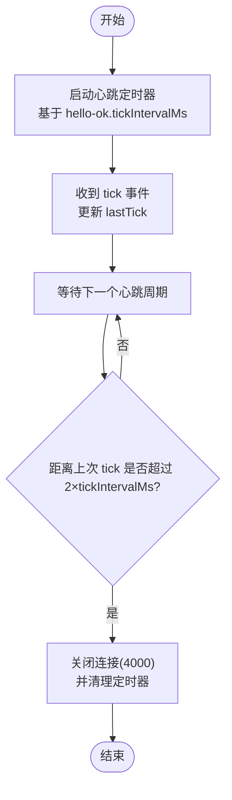
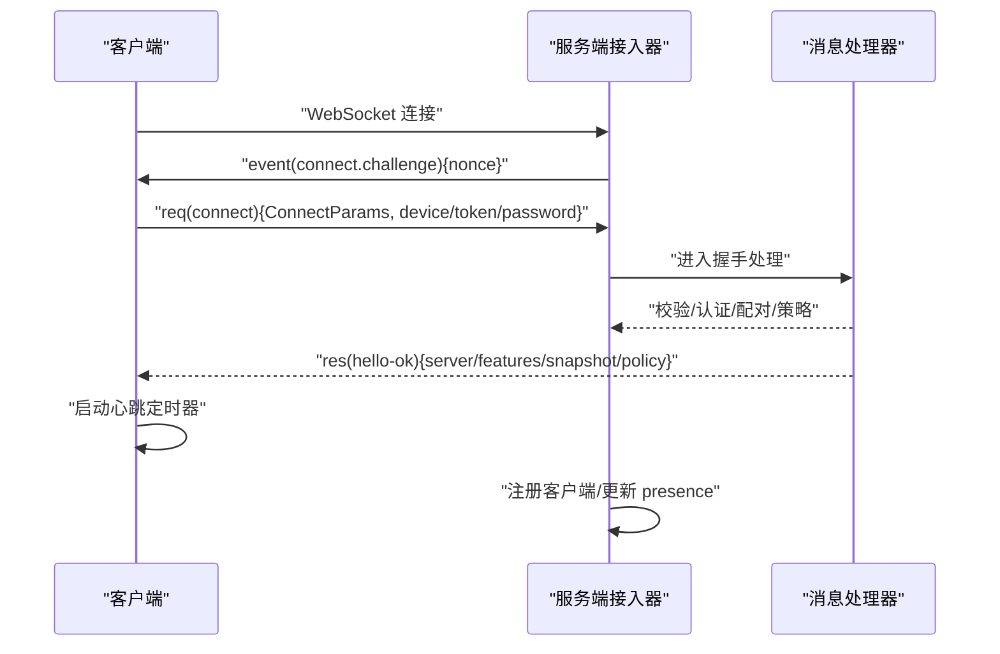
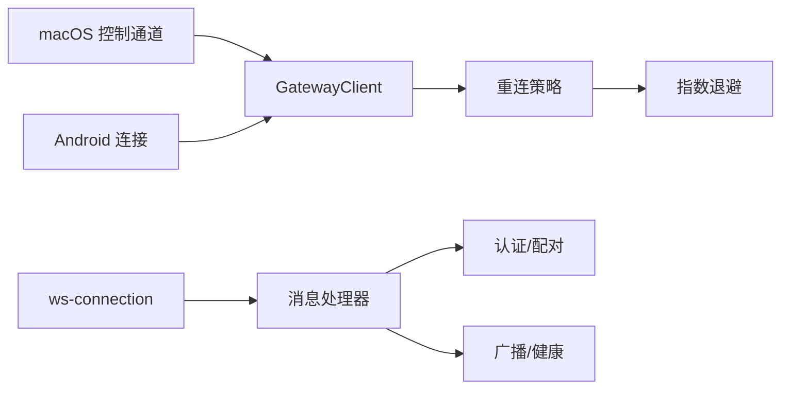

# 连接管理

## 目录
1. [简介](#简介)
2. [项目结构](#项目结构)
3. [核心组件](#核心组件)
4. [架构总览](#架构总览)
5. [详细组件分析](#详细组件分析)
6. [依赖关系分析](#依赖关系分析)
7. [性能考量](#性能考量)
8. [故障排查指南](#故障排查指南)
9. [结论](#结论)

## 简介
本章节聚焦 OpenClaw 的连接管理子系统，覆盖 WebSocket 连接生命周期、客户端注册与注销、连接池维护与资源清理、状态跟踪与超时检测、异常断开处理与自动重连策略、认证与权限校验、会话管理以及并发控制。文档同时提供关键流程的可视化图示与可定位到源码路径的示例，帮助开发者进行性能优化、内存管理与故障诊断。

## 项目结构
连接管理相关代码主要分布在以下模块：
- 服务端：WebSocket 连接接入、握手与消息处理、认证与配对、状态广播与健康快照
- 客户端：WebSocket 客户端封装、握手挑战、心跳与超时、自动重连与请求队列
- 通用工具：退避策略、重连策略解析、连接 ID 生成
- 平台集成：移动端（iOS/Android）与桌面端（macOS）的连接与恢复逻辑

## 核心组件
- 服务端连接接入器：负责接收 WebSocket 连接、发送握手挑战、设置超时、注册客户端、处理关闭事件与资源清理
- 服务端消息处理器：负责握手参数校验、协议版本协商、认证与设备签名验证、配对请求、角色与作用域授权、节点命令白名单过滤、状态快照与广播
- 客户端 GatewayClient：负责连接建立、握手挑战响应、心跳与超时检测、自动重连、请求队列与响应处理、TLS 指纹校验
- 重连与退避：提供可配置的指数退避策略与最大尝试次数，支持心跳周期解析
- 平台集成：移动端与桌面端在连接失败或异常断开后触发恢复流程

## 架构总览
下图展示了从客户端发起连接到服务端完成握手、认证与配对、节点注册、状态快照与广播的整体流程。

## 详细组件分析

### 服务端连接接入器（ws-connection）
职责与行为：
- 接收新连接，生成 `connId`，记录远端地址与请求头信息
- 发送握手挑战事件，等待客户端响应
- 设置握手超时定时器，超时则关闭连接并记录原因
- 注册消息处理器，处理握手与后续请求
- 关闭事件回调中清理客户端集合、更新 presence、注销节点、记录日志

关键点：
- 握手超时阈值来自常量配置
- 关闭前记录最后帧类型/方法/id，便于诊断
- 对 webchat 客户端有专门的日志提示
- `presenceKey` 存在时更新系统 presence 并广播

### 服务端消息处理器（ws-connection/message-handler）
职责与行为：
- 首次消息必须是 `connect` 请求且参数合法
- 协议版本协商：min/max 与本地版本比较
- 角色与作用域校验：`operator`/`node`，node 默认空作用域
- 认证与授权：
  - 支持共享凭据（`token`/`password`）与设备签名双重校验
  - 设备签名包含公钥、时间戳、nonce、版本等字段
  - 非本地连接要求 nonce，本地可回退到旧版签名
  - 设备 token 校验通过后可绕过配对
- 配对流程：未配对设备触发 `requestDevicePairing`，静默配对自动批准，否则等待用户决策
- 节点命令白名单：根据平台/设备族过滤声明的命令
- presence 更新：非 CLI 客户端按 `device`/`instanceId`/`connId` 生成 `presenceKey`
- 返回 `hello-ok`：包含协议版本、服务器信息、特性列表、快照、策略（最大负载、缓冲字节、心跳间隔）

异常与关闭：
- 无效握手、协议不匹配、角色非法、设备签名错误、配对缺失等均导致拒绝并关闭
- 关闭时记录 cause、握手状态、持续时间、最后帧元数据

### 客户端 GatewayClient
职责与行为：
- 连接建立：构造 ws 实例，可选 TLS 指纹校验
- 握手挑战：收到 `connect.challenge` 后发送 `connect`（含设备签名/令牌/密码/角色/作用域）
- 响应处理：区分事件帧与响应帧；事件帧更新 `lastSeq`、`lastTick`；响应帧解析并 resolve/reject pending Promise
- 心跳与超时：基于 `hello-ok` 中的 `tickIntervalMs` 启动定时器，超过两倍间隔即以 4000 关闭
- 自动重连：指数退避，上限 30 秒，关闭时 `flushPending` 并调度重连
- 请求 API：封装 `request` 方法，统一校验帧格式与唯一 id

重连策略：
- 默认心跳 60 秒，重连策略包含初始延迟、最大延迟、退避因子、抖动、最大尝试次数
- 支持从配置覆盖默认策略

### 类关系图（代码级）

### 流程图：心跳超时检测与关闭

### 序列图：连接建立与握手

### 平台集成：自动恢复与重连
- macOS 控制通道：在连接异常时触发恢复任务，确保本地/远程模式下的端点可用
- Android/iOS：连接失败时可回退到共享令牌或清除设备令牌后重试

## 依赖关系分析
- 服务端接入器依赖消息处理器进行握手与请求处理
- 消息处理器依赖认证模块、配对模块、系统 presence 与健康快照
- 客户端依赖重连策略与退避算法
- 平台层在连接异常时调用客户端重连逻辑

## 性能考量
- 心跳与超时
  - 客户端依据 `hello-ok` 中的 `tickIntervalMs` 启动心跳检查，超过两倍周期即关闭，避免僵尸连接占用资源
  - 服务端在握手阶段设置超时，防止恶意/异常客户端长时间占用
- 负载与缓冲
  - 服务端在 `hello-ok` 中下发 `maxPayload` 与 `maxBufferedBytes`，客户端据此限制单次消息大小与缓冲
- 重连退避
  - 默认指数退避上限 30 秒，避免雪崩式重连；可通过配置调整初始延迟、抖动与最大尝试次数
- 资源清理
  - 关闭事件中清理定时器、从客户端集合移除、更新 presence 并广播，确保内存与状态一致性

[本节为通用性能建议，无需特定文件引用]

## 故障排查指南
常见问题与定位要点：
- 握手失败
  - 检查首次请求是否为 `connect` 且参数合法
  - 核对协议版本范围与服务端期望版本
  - 查看服务端日志中的 handshake 状态与关闭原因
- 认证失败
  - 共享凭据（`token`/`password`）与设备签名任一满足即可；若设备签名存在，需核对公钥、时间戳、nonce 与签名
  - 非本地连接必须提供 nonce，本地可回退到旧版签名
- 配对缺失
  - 未配对设备会触发 `requestDevicePairing`；确认配对请求是否被用户批准或自动批准
- 异常断开
  - 客户端心跳超时（4000）通常表示网络异常或服务端无响应；检查网络质量与服务端健康状态
  - 服务端关闭前会记录 `lastFrameType`/`method`/`id` 与握手状态，有助于定位最后请求
- 自动重连
  - 若频繁断开，检查重连策略配置与网络波动；确认退避是否达到上限
- 平台恢复
  - macOS 控制通道在连接异常时会尝试恢复本地/远程隧道与端点；Android/iOS 在连接失败时可清除设备令牌后重试

## 结论
OpenClaw 的连接管理子系统通过严谨的握手与认证流程、完善的超时与异常处理、可配置的重连策略与平台恢复机制，实现了稳定可靠的长连接服务。开发者在扩展功能或排查问题时，可围绕握手参数、认证链路、心跳与超时、重连退避与资源清理等关键点进行优化与诊断。