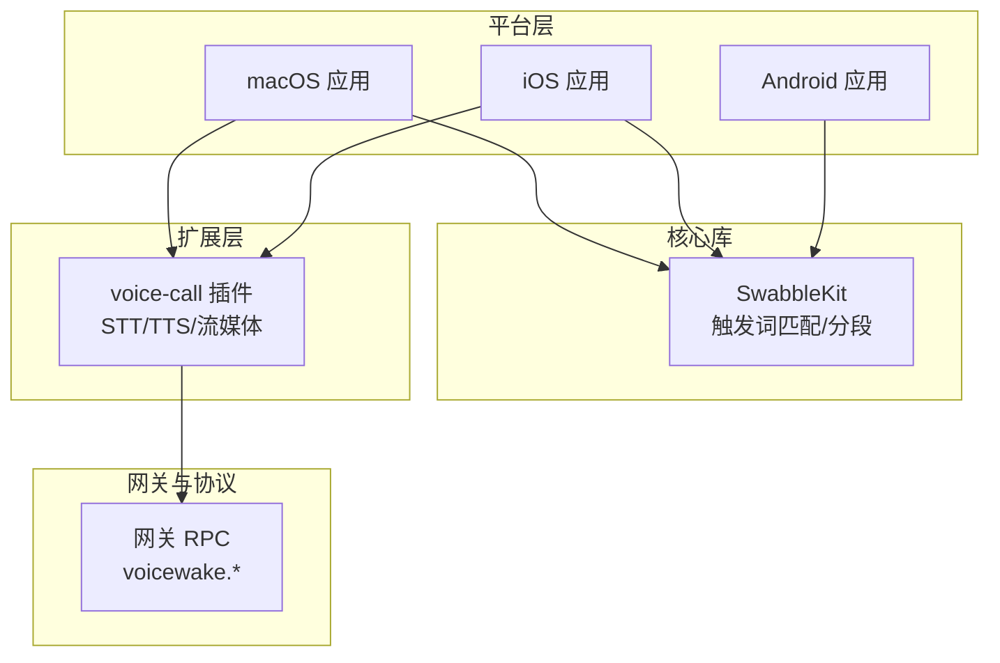
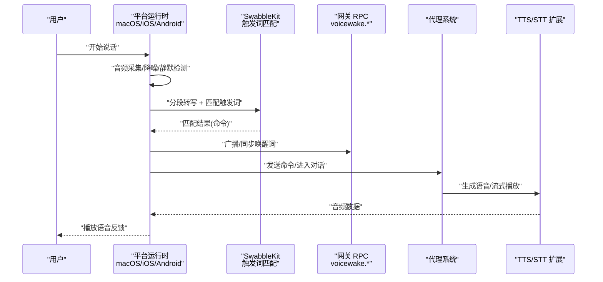
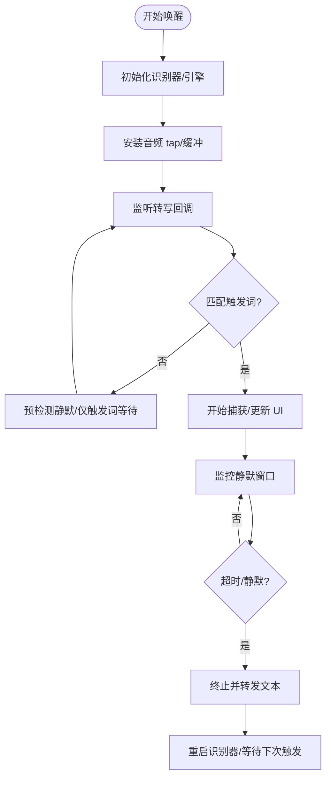
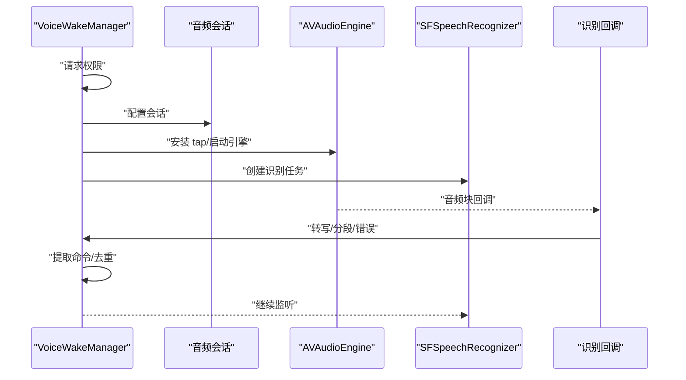
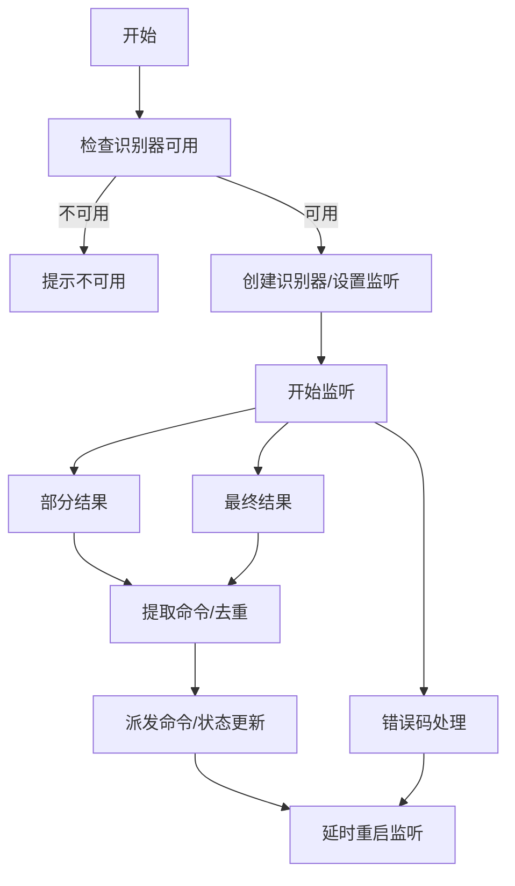
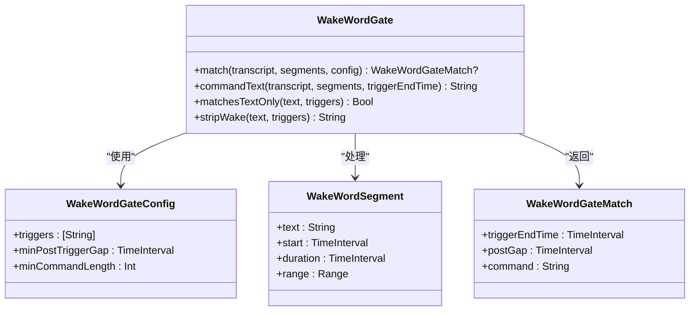
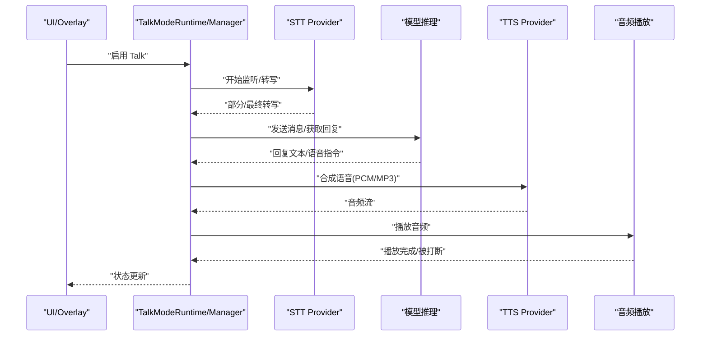
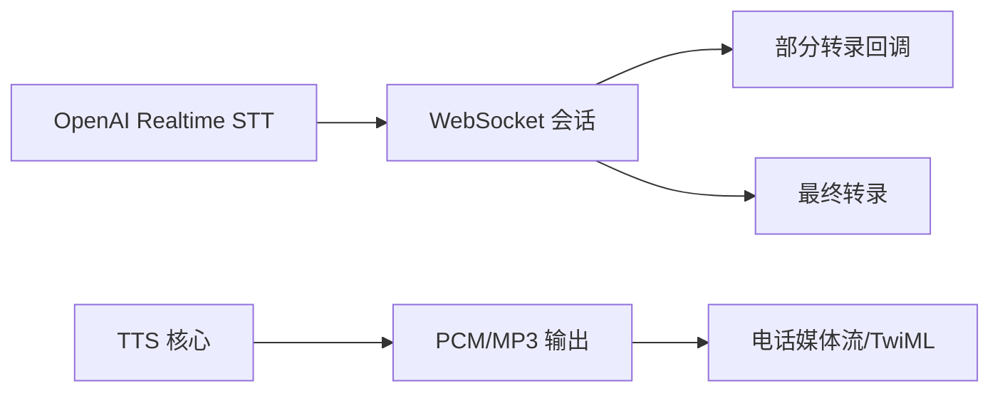
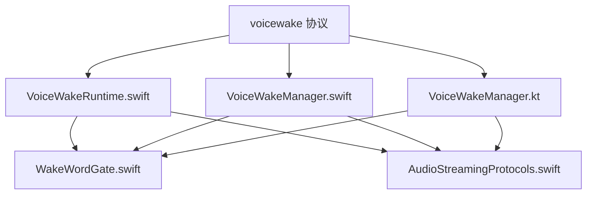

# 语音唤醒与对话模式

## 目录
1. [简介](#简介)
2. [项目结构](#项目结构)
3. [核心组件](#核心组件)
4. [架构总览](#架构总览)
5. [详细组件分析](#详细组件分析)
6. [依赖关系分析](#依赖关系分析)
7. [性能考量](#性能考量)
8. [故障排除指南](#故障排除指南)
9. [结论](#结论)
10. [附录](#附录)

## 简介
本文件系统性阐述 OpenClaw 的语音唤醒与对话模式能力，覆盖以下主题：
- 语音唤醒：音频采集、触发词检测、噪声抑制、环境自适应、跨平台一致性与权限管理。
- 对话模式：实时语音转文本（STT）、语音合成（TTS）、音频播放、音质优化与低延迟策略。
- 设备管理：麦克风选择、音频路由、多设备同步与可用性检测。
- 配置示例：唤醒词、音量、设备选择、TTS 语音参数等。
- 与代理系统的集成：实时交互、错误恢复与会话推进。
- 使用指南与故障排除。

## 项目结构
OpenClaw 在多端平台实现了统一的语音能力：
- 平台层：macOS、iOS、Android 分别封装本地音频引擎与系统权限。
- 核心库：SwabbleKit 提供触发词匹配算法与分段信息转换。
- 扩展层：voice-call 插件支持实时 STT/TTS 流式传输与电话场景。
- 文档与配置：节点级唤醒词协议、Talk 模式行为与 TTS 配置规范。

## 核心组件
- 语音唤醒运行时（macOS）：负责启动/停止音频引擎、安装音频 tap、实时 RMS 噪声估计、触发词匹配、静默窗口检测与会话收尾。
- 语音唤醒管理器（iOS/Android）：封装本地识别器、权限请求、音频会话配置、结果回调与命令提取。
- 触发词门控（SwabbleKit）：基于分段时间戳与最小停顿间隔，从连续转写中提取“触发词 + 命令”片段。
- 语音唤醒设置（macOS）：设备发现与选择、语言与唤醒词列表、状态提示与权限检查。
- 对话模式（Talk）：持续语音对话循环，包含 STT、模型推理、TTS 播放与打断逻辑。
- TTS/STT 扩展：支持 ElevenLabs、OpenAI、Edge TTS；voice-call 插件提供实时 STT/TTS 与电话流媒体。

## 架构总览
语音唤醒与对话模式在各平台通过统一的协议与核心算法协同工作：
- 唤醒词由网关集中管理并通过 WebSocket 广播到所有节点。
- 各平台本地运行时负责音频采集与识别，SwabbleKit 提供跨平台一致的触发词匹配。
- 对话模式在 macOS/iOS/Android 上以相似流程运行：监听 → 转写 → 推理 → 合成 → 播放。
- voice-call 插件提供实时 STT/TTS 与电话媒体流，适配 Telephony 场景。

## 详细组件分析

### 语音唤醒（macOS）
- 音频采集与引擎
  - 延迟创建 AVAudioEngine，避免应用启动即占用音频资源。
  - 安装音频 tap，缓冲音频块并注入识别请求。
  - 实时 RMS 计算与自适应噪声阈值，驱动 UI 状态与静默检测。
- 触发词检测
  - 使用 SwabbleKit 的 `WakeWordGate` 进行分段匹配，要求触发词后存在最小停顿间隔。
  - 支持“仅触发词”静默回退与预检测静默窗口，提升鲁棒性。
- 会话生命周期
  - 开始捕获 → 更新 UI → 监控静默窗口 → 终止并转发最终文本。
  - 强制硬停止保护，防止长时间占用识别资源。
- 权限与设备
  - 语音识别与麦克风权限检查；设备不可用时给出明确状态提示。
  - 支持选择系统默认或指定麦克风，动态刷新设备列表。

### 语音唤醒（iOS）
- 权限与会话
  - 请求麦克风与语音识别权限；模拟器不支持长时录音，给出明确提示。
  - 配置音频会话类别与模式，确保与其他音频源共存。
- 音频队列与识别
  - 使用线程安全的音频缓冲队列，将引擎 tap 的音频复制到识别请求。
  - 回调中提取最佳转写与分段，进行触发词命令提取。
- 错误处理与重试
  - 识别器错误时延时重启，避免瞬时失败导致长时间离线。

### 语音唤醒（Android）
- 识别器生命周期
  - 可用性检查、创建识别器、设置监听器、启动/取消/销毁流程。
  - 部分结果与最终结果均触发命令提取，带去重与状态更新。
- 错误与重试
  - 多类错误码映射为用户可读状态；异常时延时重启识别器。

### 触发词匹配（SwabbleKit）
- 分段与令牌化
  - 将转写分段按时间戳归一化，去除空白与标点，统一大小写。
- 匹配策略
  - 在候选令牌序列中查找触发词完整匹配，要求触发词结束与下一个词之间有最小停顿间隔。
  - 提取触发词之后的命令文本，满足最小长度约束。
- 工具函数
  - 判断是否仅包含触发词、去除触发词等辅助工具。

### 对话模式（Talk）
- 行为与流程
  - 监听 → 思考 → 说话，短暂停顿发送当前转写；支持“说话时打断”。
  - 支持在回复中嵌入语音指令（如 `voice`、`model`、`speed` 等），可一次性或持久生效。
- 配置要点
  - 语音 ID、模型 ID、输出格式、是否打断等；macOS/iOS 默认 PCM，Android 支持多种 PCM 输出格式。
- 播放与回退
  - 优先 PCM 流式播放，失败则回退 MP3；支持手动停止与用户点击中断。

### TTS/STT 扩展与电话场景
- 实时 STT（OpenAI Realtime）
  - 使用 WebSocket 直传 mu-law 音频，服务端 VAD 检测说话结束，支持部分转写回调与低延迟。
- 电话 TTS
  - 将 TTS 结果转换为 8kHz μ-law PCM，通过媒体流或 TwiML Say 回退播放。
- 通用 TTS 配置
  - ElevenLabs、OpenAI、Edge TTS 多提供商支持，可配置语音、模型、语速、音色等参数。

## 依赖关系分析
- 平台运行时依赖 SwabbleKit 的触发词匹配与分段转换。
- macOS/iOS/Android 的唤醒管理器分别封装本地识别器与权限。
- voice-call 插件通过统一的播放接口抽象（`StreamingAudioPlaying`/`PCMStreamingAudioPlaying`）实现跨平台音频播放。
- 网关提供全局唤醒词列表与广播协议，确保多端一致性。

## 性能考量
- 低延迟
  - 实时 STT 使用 WebSocket 与服务端 VAD，减少客户端处理开销。
  - Talk 模式优先 PCM 流式播放，失败回退 MP3，兼顾延迟与兼容性。
- 资源占用
  - macOS 延迟创建音频引擎，避免启动时抢占音频会话。
  - 静默窗口与硬停止保护，防止长时间占用识别资源。
- 音质与稳定性
  - RMS 自适应噪声阈值，提升嘈杂环境下的触发稳定性。
  - 多端统一的触发词匹配算法，降低误检与漏检。

## 故障排除指南
- 权限问题
  - macOS/iOS：确认麦克风与语音识别权限已授权；iOS 模拟器不支持长时录音。
  - Android：识别器不可用或权限不足时会提示相应状态。
- 设备问题
  - macOS：检查可用麦克风列表与连接状态；选择系统默认或指定设备。
- 识别失败
  - 检查网络与 API 密钥；查看日志中的识别器错误与重试状态。
- 电话场景
  - 确认媒体流与 TTS 提供商配置；必要时回退到 TwiML Say。

## 结论
OpenClaw 的语音唤醒与对话模式通过平台本地实现与 SwabbleKit 核心算法的结合，提供了跨平台一致且可扩展的语音体验。配合网关的全局唤醒词同步与 voice-call 插件的实时 STT/TTS 能力，可在桌面与电话等多种场景下实现低延迟、高可靠的人机语音交互。

## 附录

### 配置示例与说明
- 唤醒词设置（网关）
  - 全局唤醒词列表由网关持有并通过 RPC 广播；各节点 UI 可编辑并同步。
- macOS 唤醒设置
  - 选择麦克风、语言与唤醒词；状态栏显示当前输入设备摘要。
- Talk 模式配置
  - 语音 ID、模型 ID、输出格式、是否打断等；macOS/iOS 默认 PCM，Android 支持多种 PCM。
- TTS 配置
  - ElevenLabs、OpenAI、Edge TTS 的提供商切换与参数覆盖；支持 per-user preferences 与自动摘要。