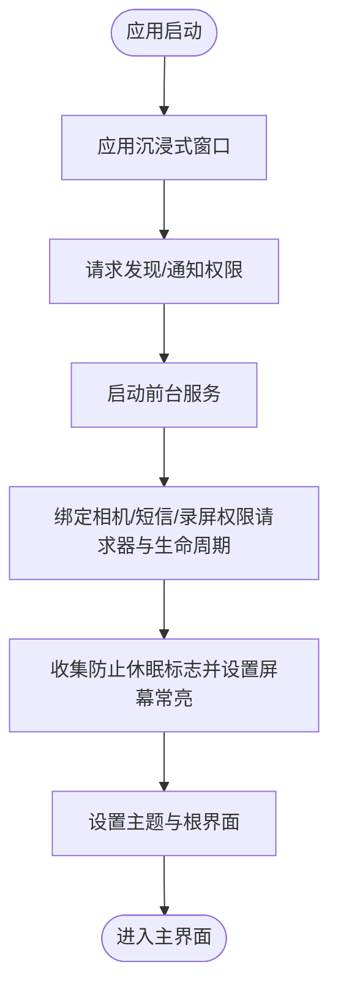

# Android 应用

<cite>
**本文引用的文件**
- [apps/android/app/src/main/java/ai/openclaw/android/MainActivity.kt](file://apps/android/app/src/main/java/ai/openclaw/android/MainActivity.kt)
- [apps/android/app/src/main/java/ai/openclaw/android/NodeApp.kt](file://apps/android/app/src/main/java/ai/openclaw/android/NodeApp.kt)
- [apps/android/app/src/main/java/ai/openclaw/android/MainViewModel.kt](file://apps/android/app/src/main/java/ai/openclaw/android/MainViewModel.kt)
- [apps/android/app/src/main/java/ai/openclaw/android/NodeRuntime.kt](file://apps/android/app/src/main/java/ai/openclaw/android/NodeRuntime.kt)
- [apps/android/app/src/main/java/ai/openclaw/android/NodeForegroundService.kt](file://apps/android/app/src/main/java/ai/openclaw/android/NodeForegroundService.kt)
- [apps/android/app/src/main/AndroidManifest.xml](file://apps/android/app/src/main/AndroidManifest.xml)
- [apps/android/app/src/main/java/ai/openclaw/android/ui/chat/ChatSheetContent.kt](file://apps/android/app/src/main/java/ai/openclaw/android/ui/chat/ChatSheetContent.kt)
- [apps/android/app/src/main/java/ai/openclaw/android/node/CameraCaptureManager.kt](file://apps/android/app/src/main/java/ai/openclaw/android/node/CameraCaptureManager.kt)
- [apps/android/app/src/main/java/ai/openclaw/android/voice/TalkModeManager.kt](file://apps/android/app/src/main/java/ai/openclaw/android/voice/TalkModeManager.kt)
- [apps/android/README.md](file://apps/android/README.md)
</cite>

## 目录
1. [简介](#简介)
2. [项目结构](#项目结构)
3. [核心组件](#核心组件)
4. [架构总览](#架构总览)
5. [详细组件分析](#详细组件分析)
6. [依赖关系分析](#依赖关系分析)
7. [性能考虑](#性能考虑)
8. [故障排查指南](#故障排查指南)
9. [结论](#结论)
10. [附录](#附录)

## 简介
本文件面向 OpenClaw Android 节点应用，系统化阐述其功能特性、架构设计与移动平台适配策略。重点覆盖启动流程、后台服务、权限管理、设备兼容性，以及 Android 特有的相机访问、语音处理、聊天界面与节点管理能力。同时提供安装配置指南（APK 安装、Google Play 分发建议、开发调试环境）、Material Design 规范与多屏幕适配实践，帮助开发者与用户高效上手并稳定运行。

## 项目结构
Android 应用位于 `apps/android/app`，采用 Kotlin + Jetpack Compose 构建，核心入口为 `MainActivity`，通过 `MainViewModel` 暴露状态与操作；`NodeRuntime` 负责与网关通信、节点命令分发与本地 UI（Canvas）控制；`NodeForegroundService` 提供前台服务以维持连接与通知；权限在 `AndroidManifest.xml` 中集中声明，并在运行时按需请求。

## 核心组件
- `MainActivity`：负责沉浸式窗口、权限请求、启动前台服务、绑定生命周期与权限请求器、设置主题与根界面。
- `MainViewModel`：将 `NodeRuntime` 的状态与操作暴露给 UI，统一管理聊天、节点状态、会话键等。
- `NodeRuntime`：核心运行时，维护网关会话（operator 与 node 双角色）、节点命令分发、能力与命令构建、A2UI 动作处理、Canvas 控制、语音唤醒与通话模式、位置/相机/短信等节点能力。
- `NodeForegroundService`：前台服务，持续显示连接状态通知，支持麦克风与录屏类型通知，动态更新通知与权限需求。
- `AndroidManifest.xml`：声明网络、定位、相机、录音、短信、通知、前台服务等权限与服务。

## 架构总览
应用采用“前台服务 + 运行时内核 + UI 层”的分层架构。`NodeRuntime` 作为中枢，负责：
- 自动发现与连接网关（Bonjour/NSD 扫描）
- 构建客户端信息与能力/命令清单
- 处理来自网关的事件与调用请求
- 将节点命令映射到本地能力（相机、位置、屏幕录制、短信、Canvas/A2UI）

## 详细组件分析

### 启动流程与生命周期
- 应用启动后启用 WebView 调试（仅 Debug），应用沉浸式窗口，请求发现与通知权限。
- 启动 `NodeForegroundService`，绑定 `MainViewModel` 的相机/短信/屏幕录制权限请求器与生命周期。
- 在 STARTED 生命周期收集“防止休眠”标志，动态设置屏幕常亮。
- 设置 Compose 主题与根界面，进入主界面。

### 前台服务与通知
- `NodeForegroundService` 在 onCreate 中初始化通知通道与初始通知，随后订阅 `NodeRuntime` 的状态流，动态更新标题、文本与是否需要麦克风类型的通知。
- 支持“断开连接”动作，点击可触发断开并停止服务。
- 使用 `FOREGROUND_SERVICE_TYPE_DATA_SYNC` | `MICROPHONE` | `MEDIA_PROJECTION` 动态切换类型，满足不同场景。

### 权限管理与设备兼容性
- 权限声明集中在 `AndroidManifest.xml`，包括网络、定位、相机、录音、短信、通知、前台服务等。
- 发现权限：
  - Android 13+ 使用 `NEARBY_WIFI_DEVICES`
  - Android 12 及以下使用 `ACCESS_FINE_LOCATION`
- 通知权限：Android 13+ 需要 `POST_NOTIFICATIONS`
- 运行时权限：`MainActivity` 在 onCreate 中按需请求，确保功能可用。

### 相机访问与节点命令
- `CameraCaptureManager` 负责拍照与录视频，支持前置/后置、质量、最大宽度、音频开关等参数解析。
- 在执行前校验相机与录音权限，必要时通过 `PermissionRequester` 请求。
- `NodeRuntime` 将相机命令映射为本地操作，并在前台不可用时返回错误码。

### 语音处理与通话模式
- `TalkModeManager` 实现语音识别与语音合成，支持静默检测、自动结束、中断打断、ElevenLabs 流式播放与系统 TTS 回退。
- 从网关获取配置（主会话键、默认声音、模型、输出格式、密钥、打断策略等），动态调整。
- 识别成功后发送 `chat.send`，等待最终状态，再拉取助手文本进行播放。

### 聊天界面与节点管理
- `MainViewModel` 将 `NodeRuntime` 的聊天状态（消息、会话、健康度、思考层级、待执行工具调用等）暴露给 UI。
- `ChatSheetContent` 实现聊天面板：加载消息、选择图片附件、发送消息、中止对话、刷新会话与历史。
- `NodeRuntime` 负责与网关交互，处理聊天事件、订阅会话、设置思考层级、切换会话、中止运行等。

### A2UI 动作与 Canvas 控制
- `NodeRuntime` 接收来自 WebView 的 Canvas A2UI 动作，解析并构造消息，通过网关发送到节点侧，再由 Canvas 执行。
- 若 Canvas 不可用或未就绪，返回相应错误码；成功后回传状态。

## 依赖关系分析
- `MainActivity` 依赖 `MainViewModel`、`NodeForegroundService`、权限请求器与生命周期。
- `MainViewModel` 依赖 `NodeRuntime`，暴露状态与操作。
- `NodeRuntime` 依赖 `GatewaySession`（operator/node）、`CameraCaptureManager`、`TalkModeManager`、`ChatController`、`SecurePrefs` 等。
- `NodeForegroundService` 依赖 `NodeRuntime` 的状态流，动态更新通知类型。
- `AndroidManifest.xml` 为所有权限与服务提供声明基础。

## 性能考虑
- 前台服务类型动态切换：当处于“总是”语音唤醒且具备录音权限时，使用包含麦克风类型的前台服务，避免被系统回收。
- 状态流合并与去抖：`NodeRuntime` 对多个状态流进行合并与 `distinctUntilChanged`，减少不必要的 UI 刷新与 Canvas 更新。
- Canvas 调试状态：仅在开启调试时注入状态文本，避免对正常体验造成额外开销。
- 相机压缩与尺寸限制：拍照时使用 `JpegSizeLimiter` 控制负载大小，避免超过 5MB 的传输上限。
- 录音/录屏：录屏开始时设置状态指示，结束后恢复，避免叠加 UI 层叠。

## 故障排查指南
- 无法连接网关
  - 检查已保存的 TLS 指纹与手动 TLS 设置，确认指纹匹配或允许 TOFU。
  - 查看状态文本与连接状态流，确认是否因权限不足导致。
- 语音唤醒不工作
  - 确认语音唤醒模式与前台状态组合，检查录音权限。
  - 关注状态文本提示（如“Off/Paused/权限不足”）。
- 相机/录屏失败
  - 检查相机与录音权限，确认镜头选择与参数范围。
  - 注意前台不可用时返回“前台不可用”错误。
- 通知与后台限制
  - 确认前台服务类型与通知权限，必要时引导用户关闭电池优化白名单。

## 结论
OpenClaw Android 节点应用以 `NodeRuntime` 为核心，结合前台服务与 Compose UI，实现了稳定的网关连接、丰富的节点能力（相机、位置、屏幕录制、短信、Canvas/A2UI、聊天与语音），并在权限与后台限制方面做了充分适配。通过清晰的状态流与命令分发机制，应用在现代 Android 平台上提供了可靠、可扩展的节点能力。

## 附录

### 安装与配置指南
- 开发环境
  - 使用 Android Studio 打开 `apps/android` 目录。
  - 构建与安装：执行 Gradle 任务生成 Debug 包并安装到设备。
- 连接与配对
  - 先在“主”机器启动网关，然后在应用设置中选择发现的网关或使用“手动网关”输入主机与端口。
  - 在网关侧批准节点请求。
- Google Play 分发建议
  - 由于使用前台服务与通知权限，建议在隐私政策中明确说明用途。
  - 遵循 Play 的后台执行与电池优化政策，提供“允许忽略电池优化”的引导路径。

### Material Design 与多屏幕适配
- 主题与布局
  - 使用 Compose 主题与 Surface 包裹根界面，确保一致的视觉风格。
  - 聊天界面采用 Column 布局与权重分配，保证消息列表与输入区域的自适应。
- 多屏幕适配
  - 使用权重与填充属性，使界面在不同尺寸设备上保持良好比例。
  - 图片附件选择与预览采用流式处理，避免内存峰值过高。